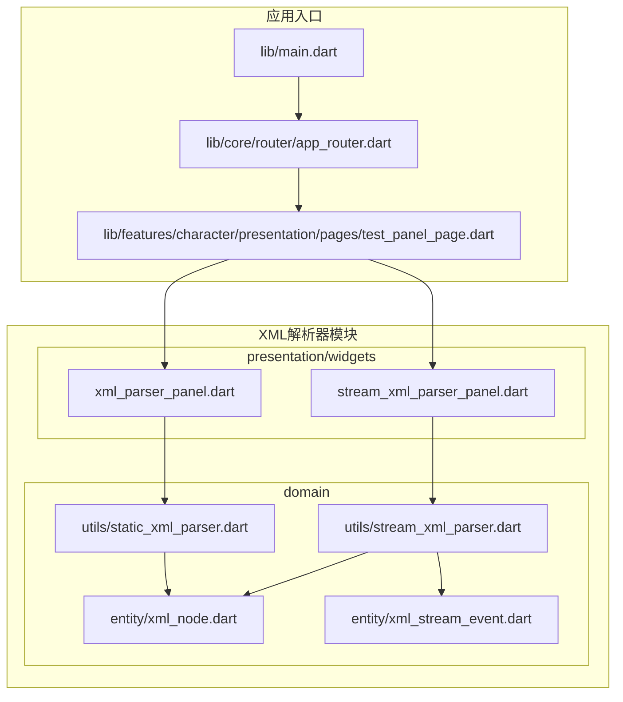
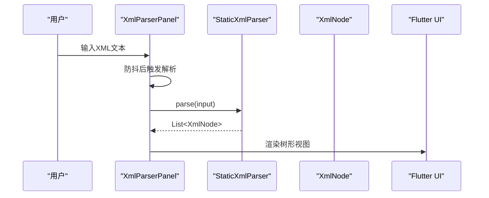
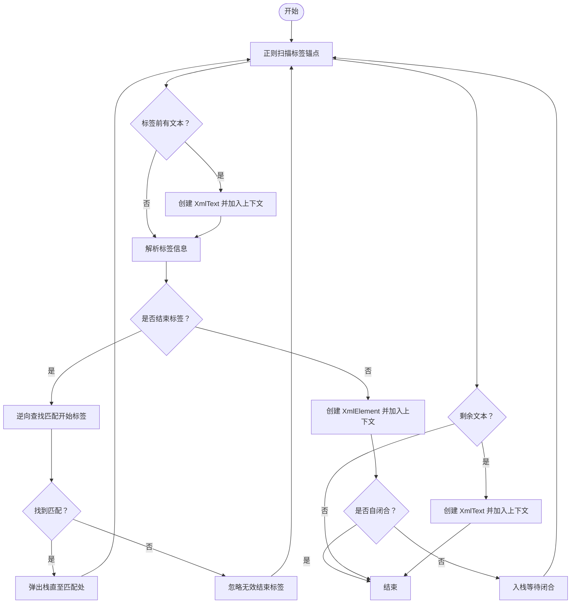
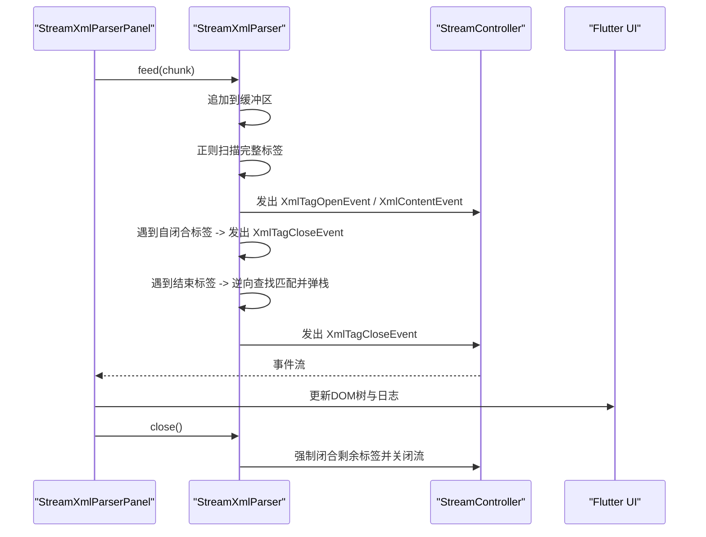
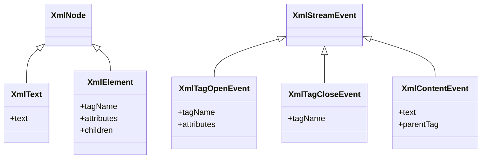
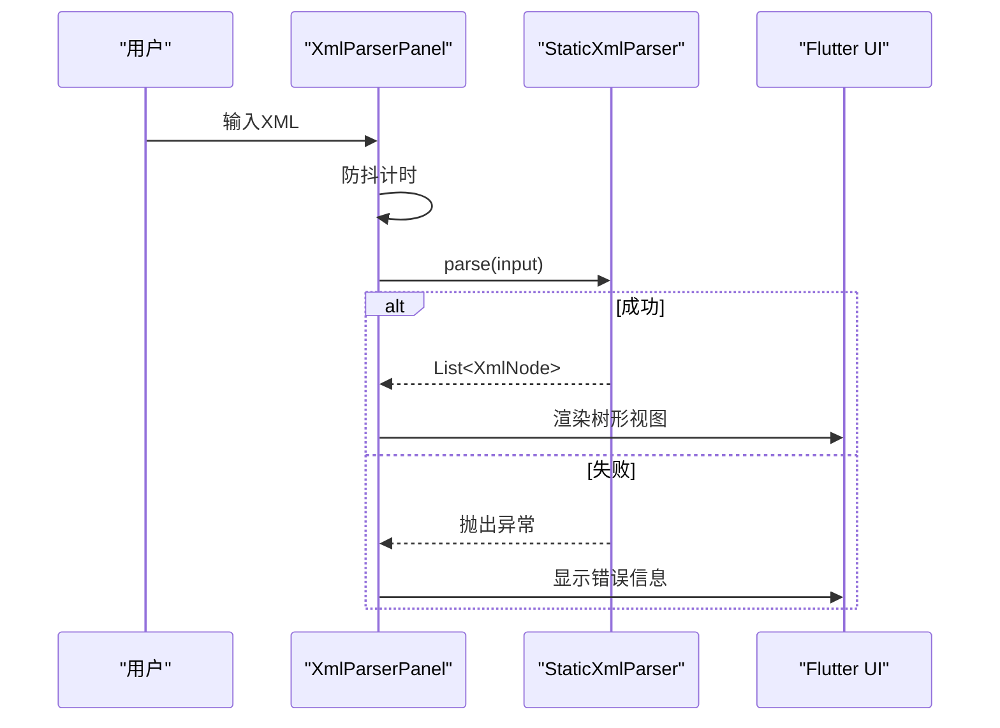
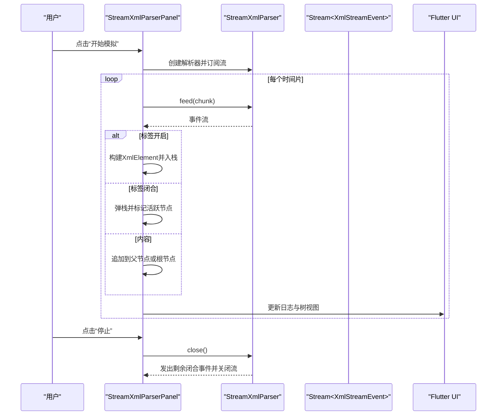
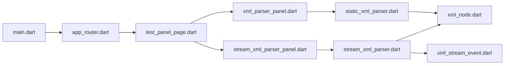

# XML解析器

<cite>
**本文引用的文件**
- [lib/features/xml_parser/domain/entity/xml_node.dart](file://lib/features/xml_parser/domain/entity/xml_node.dart)
- [lib/features/xml_parser/domain/entity/xml_stream_event.dart](file://lib/features/xml_parser/domain/entity/xml_stream_event.dart)
- [lib/features/xml_parser/domain/utils/static_xml_parser.dart](file://lib/features/xml_parser/domain/utils/static_xml_parser.dart)
- [lib/features/xml_parser/domain/utils/stream_xml_parser.dart](file://lib/features/xml_parser/domain/utils/stream_xml_parser.dart)
- [lib/features/xml_parser/presentation/widgets/xml_parser_panel.dart](file://lib/features/xml_parser/presentation/widgets/xml_parser_panel.dart)
- [lib/features/xml_parser/presentation/widgets/stream_xml_parser_panel.dart](file://lib/features/xml_parser/presentation/widgets/stream_xml_parser_panel.dart)
- [lib/features/character/presentation/pages/test_panel_page.dart](file://lib/features/character/presentation/pages/test_panel_page.dart)
- [lib/core/router/app_router.dart](file://lib/core/router/app_router.dart)
- [lib/main.dart](file://lib/main.dart)
- [doc/xml解析器](file://doc/xml解析器)
- [doc/SDD.md](file://doc/SDD.md)
</cite>

## 目录
1. [简介](#简介)
2. [项目结构](#项目结构)
3. [核心组件](#核心组件)
4. [架构总览](#架构总览)
5. [组件详解](#组件详解)
6. [依赖关系分析](#依赖关系分析)
7. [性能考量](#性能考量)
8. [故障排查指南](#故障排查指南)
9. [结论](#结论)
10. [附录](#附录)

## 简介
本项目提供一套“容错 XML 解析器”，既支持一次性解析（静态解析），也支持流式增量解析（边生成边解析）。其设计目标是在 LLM 流式输出、实时聊天、Copilot 等场景中，实现“边生成、边解析、边展示”的高性能体验；同时具备对“未闭合标签”“跨块标签”“幻觉标签”等边缘情况的容错能力。

## 项目结构
XML 解析器位于 features/xml_parser 目录，采用领域驱动分层：
- domain 实体与工具：定义 XML 节点与流式事件模型，以及静态/流式解析器。
- presentation/widgets：提供两个演示面板，分别展示静态解析与流式解析的可视化结果。

图表来源
- [lib/features/xml_parser/domain/entity/xml_node.dart](file://lib/features/xml_parser/domain/entity/xml_node.dart#L1-L34)
- [lib/features/xml_parser/domain/entity/xml_stream_event.dart](file://lib/features/xml_parser/domain/entity/xml_stream_event.dart#L1-L32)
- [lib/features/xml_parser/domain/utils/static_xml_parser.dart](file://lib/features/xml_parser/domain/utils/static_xml_parser.dart#L1-L116)
- [lib/features/xml_parser/domain/utils/stream_xml_parser.dart](file://lib/features/xml_parser/domain/utils/stream_xml_parser.dart#L1-L148)
- [lib/features/xml_parser/presentation/widgets/xml_parser_panel.dart](file://lib/features/xml_parser/presentation/widgets/xml_parser_panel.dart#L1-L167)
- [lib/features/xml_parser/presentation/widgets/stream_xml_parser_panel.dart](file://lib/features/xml_parser/presentation/widgets/stream_xml_parser_panel.dart#L1-L373)
- [lib/features/character/presentation/pages/test_panel_page.dart](file://lib/features/character/presentation/pages/test_panel_page.dart#L1-L156)
- [lib/core/router/app_router.dart](file://lib/core/router/app_router.dart#L1-L17)
- [lib/main.dart](file://lib/main.dart#L1-L33)

章节来源
- [lib/features/xml_parser/domain/entity/xml_node.dart](file://lib/features/xml_parser/domain/entity/xml_node.dart#L1-L34)
- [lib/features/xml_parser/domain/entity/xml_stream_event.dart](file://lib/features/xml_parser/domain/entity/xml_stream_event.dart#L1-L32)
- [lib/features/xml_parser/domain/utils/static_xml_parser.dart](file://lib/features/xml_parser/domain/utils/static_xml_parser.dart#L1-L116)
- [lib/features/xml_parser/domain/utils/stream_xml_parser.dart](file://lib/features/xml_parser/domain/utils/stream_xml_parser.dart#L1-L148)
- [lib/features/xml_parser/presentation/widgets/xml_parser_panel.dart](file://lib/features/xml_parser/presentation/widgets/xml_parser_panel.dart#L1-L167)
- [lib/features/xml_parser/presentation/widgets/stream_xml_parser_panel.dart](file://lib/features/xml_parser/presentation/widgets/stream_xml_parser_panel.dart#L1-L373)
- [lib/features/character/presentation/pages/test_panel_page.dart](file://lib/features/character/presentation/pages/test_panel_page.dart#L1-L156)
- [lib/core/router/app_router.dart](file://lib/core/router/app_router.dart#L1-L17)
- [lib/main.dart](file://lib/main.dart#L1-L33)

## 核心组件
- 实体模型
  - XmlNode 抽象基类，XmlText 与 XmlElement 两种子类，用于表示纯文本与标签节点。
- 流式事件模型
  - XmlStreamEvent 抽象基类，XmlTagOpenEvent、XmlTagCloseEvent、XmlContentEvent 三种事件，用于流式解析过程中的增量通知。
- 解析器
  - StaticXmlParser：一次性解析输入字符串，支持容错闭合与无效标签忽略。
  - StreamXmlParser：流式解析器，维护内部缓冲与标签栈，按块推送事件，支持流结束时强制闭合。

章节来源
- [lib/features/xml_parser/domain/entity/xml_node.dart](file://lib/features/xml_parser/domain/entity/xml_node.dart#L1-L34)
- [lib/features/xml_parser/domain/entity/xml_stream_event.dart](file://lib/features/xml_parser/domain/entity/xml_stream_event.dart#L1-L32)
- [lib/features/xml_parser/domain/utils/static_xml_parser.dart](file://lib/features/xml_parser/domain/utils/static_xml_parser.dart#L1-L116)
- [lib/features/xml_parser/domain/utils/stream_xml_parser.dart](file://lib/features/xml_parser/domain/utils/stream_xml_parser.dart#L1-L148)

## 架构总览
静态解析与流式解析共享同一套实体模型，UI 通过两个面板分别演示：
- 静态解析面板：输入 XML，延迟解析，展示树形结构。
- 流式解析面板：模拟流式输入，实时打印事件日志并构建 DOM 树。

图表来源
- [lib/features/xml_parser/presentation/widgets/xml_parser_panel.dart](file://lib/features/xml_parser/presentation/widgets/xml_parser_panel.dart#L1-L167)
- [lib/features/xml_parser/domain/utils/static_xml_parser.dart](file://lib/features/xml_parser/domain/utils/static_xml_parser.dart#L1-L116)
- [lib/features/xml_parser/domain/entity/xml_node.dart](file://lib/features/xml_parser/domain/entity/xml_node.dart#L1-L34)

章节来源
- [lib/features/xml_parser/presentation/widgets/xml_parser_panel.dart](file://lib/features/xml_parser/presentation/widgets/xml_parser_panel.dart#L1-L167)
- [lib/features/xml_parser/domain/utils/static_xml_parser.dart](file://lib/features/xml_parser/domain/utils/static_xml_parser.dart#L1-L116)
- [lib/features/xml_parser/domain/entity/xml_node.dart](file://lib/features/xml_parser/domain/entity/xml_node.dart#L1-L34)

## 组件详解

### 静态解析器 StaticXmlParser
- 设计要点
  - 使用正则匹配标签锚点，按顺序扫描输入，遇到标签前文本作为 XmlText 节点加入当前上下文。
  - 遇到开始标签创建 XmlElement 并入栈；遇到结束标签逆向查找匹配，自动闭合中间未闭合标签；无效结束标签被忽略。
  - 属性解析采用正则捕获 key="value" 形式。
- 容错策略
  - 通过“逆向查找 + 自动闭合”处理未闭合标签与嵌套混乱。
  - 无效结束标签直接忽略，不破坏整体结构。
- 复杂度
  - O(N) 扫描，正则匹配与属性解析均为线性时间。

图表来源
- [lib/features/xml_parser/domain/utils/static_xml_parser.dart](file://lib/features/xml_parser/domain/utils/static_xml_parser.dart#L1-L116)
- [lib/features/xml_parser/domain/entity/xml_node.dart](file://lib/features/xml_parser/domain/entity/xml_node.dart#L1-L34)

章节来源
- [lib/features/xml_parser/domain/utils/static_xml_parser.dart](file://lib/features/xml_parser/domain/utils/static_xml_parser.dart#L1-L116)
- [lib/features/xml_parser/domain/entity/xml_node.dart](file://lib/features/xml_parser/domain/entity/xml_node.dart#L1-L34)

### 流式解析器 StreamXmlParser
- 设计要点
  - 维护内部缓冲区，按块喂入文本；每次处理尽可能多的完整标签，其余内容保留至下一块。
  - 通过标签栈跟踪当前未闭合标签；遇到开始标签入栈，遇到结束标签逆向弹出并发出闭合事件。
  - 自闭合标签立即发出开/闭事件。
  - 流结束时，若栈非空则逐个发出闭合事件，确保 UI 与业务逻辑正确收尾。
- 容错策略
  - 保留最后一个“可能未完成”的标签片段，避免丢失数据。
  - 逆向查找匹配，自动闭合中间标签；无效结束标签忽略。
- 复杂度
  - 每块处理为 O(N) 扫描，整体近似 O(N)。

图表来源
- [lib/features/xml_parser/domain/utils/stream_xml_parser.dart](file://lib/features/xml_parser/domain/utils/stream_xml_parser.dart#L1-L148)
- [lib/features/xml_parser/domain/entity/xml_stream_event.dart](file://lib/features/xml_parser/domain/entity/xml_stream_event.dart#L1-L32)
- [lib/features/xml_parser/presentation/widgets/stream_xml_parser_panel.dart](file://lib/features/xml_parser/presentation/widgets/stream_xml_parser_panel.dart#L1-L373)

章节来源
- [lib/features/xml_parser/domain/utils/stream_xml_parser.dart](file://lib/features/xml_parser/domain/utils/stream_xml_parser.dart#L1-L148)
- [lib/features/xml_parser/domain/entity/xml_stream_event.dart](file://lib/features/xml_parser/domain/entity/xml_stream_event.dart#L1-L32)
- [lib/features/xml_parser/presentation/widgets/stream_xml_parser_panel.dart](file://lib/features/xml_parser/presentation/widgets/stream_xml_parser_panel.dart#L1-L373)

### 实体模型与事件模型
- XmlNode/XmlText/XmlElement：用于静态解析结果的树形表示。
- XmlStreamEvent/XmlTagOpenEvent/XmlTagCloseEvent/XmlContentEvent：用于流式解析的增量事件。

图表来源
- [lib/features/xml_parser/domain/entity/xml_node.dart](file://lib/features/xml_parser/domain/entity/xml_node.dart#L1-L34)
- [lib/features/xml_parser/domain/entity/xml_stream_event.dart](file://lib/features/xml_parser/domain/entity/xml_stream_event.dart#L1-L32)

章节来源
- [lib/features/xml_parser/domain/entity/xml_node.dart](file://lib/features/xml_parser/domain/entity/xml_node.dart#L1-L34)
- [lib/features/xml_parser/domain/entity/xml_stream_event.dart](file://lib/features/xml_parser/domain/entity/xml_stream_event.dart#L1-L32)

### 静态解析面板 XmlParserPanel
- 功能概述
  - 提供输入框，支持防抖解析；解析成功后以树形卡片展示；异常时显示错误信息。
- 交互流程
  - 文本变化触发定时器，到期后调用 StaticXmlParser.parse，setState 更新 UI。

图表来源
- [lib/features/xml_parser/presentation/widgets/xml_parser_panel.dart](file://lib/features/xml_parser/presentation/widgets/xml_parser_panel.dart#L1-L167)
- [lib/features/xml_parser/domain/utils/static_xml_parser.dart](file://lib/features/xml_parser/domain/utils/static_xml_parser.dart#L1-L116)

章节来源
- [lib/features/xml_parser/presentation/widgets/xml_parser_panel.dart](file://lib/features/xml_parser/presentation/widgets/xml_parser_panel.dart#L1-L167)
- [lib/features/xml_parser/domain/utils/static_xml_parser.dart](file://lib/features/xml_parser/domain/utils/static_xml_parser.dart#L1-L116)

### 流式解析面板 StreamXmlParserPanel
- 功能概述
  - 模拟流式输入，实时打印事件日志；根据事件构建 DOM 树；支持停止模拟并强制闭合。
- 交互流程
  - 开始模拟后，周期性切片输入文本并 feed 到解析器；订阅事件流，按事件更新 DOM 树与日志；结束时 close() 触发强制闭合。

图表来源
- [lib/features/xml_parser/presentation/widgets/stream_xml_parser_panel.dart](file://lib/features/xml_parser/presentation/widgets/stream_xml_parser_panel.dart#L1-L373)
- [lib/features/xml_parser/domain/utils/stream_xml_parser.dart](file://lib/features/xml_parser/domain/utils/stream_xml_parser.dart#L1-L148)

章节来源
- [lib/features/xml_parser/presentation/widgets/stream_xml_parser_panel.dart](file://lib/features/xml_parser/presentation/widgets/stream_xml_parser_panel.dart#L1-L373)
- [lib/features/xml_parser/domain/utils/stream_xml_parser.dart](file://lib/features/xml_parser/domain/utils/stream_xml_parser.dart#L1-L148)

## 依赖关系分析
- 模块间依赖
  - 面板依赖解析器与实体模型；解析器依赖实体模型；应用入口通过路由与页面集成。
- 外部依赖
  - Flutter Widgets、Riverpod、GoRouter 等用于 UI、状态与导航。

图表来源
- [lib/features/xml_parser/presentation/widgets/xml_parser_panel.dart](file://lib/features/xml_parser/presentation/widgets/xml_parser_panel.dart#L1-L167)
- [lib/features/xml_parser/presentation/widgets/stream_xml_parser_panel.dart](file://lib/features/xml_parser/presentation/widgets/stream_xml_parser_panel.dart#L1-L373)
- [lib/features/xml_parser/domain/utils/static_xml_parser.dart](file://lib/features/xml_parser/domain/utils/static_xml_parser.dart#L1-L116)
- [lib/features/xml_parser/domain/utils/stream_xml_parser.dart](file://lib/features/xml_parser/domain/utils/stream_xml_parser.dart#L1-L148)
- [lib/features/xml_parser/domain/entity/xml_node.dart](file://lib/features/xml_parser/domain/entity/xml_node.dart#L1-L34)
- [lib/features/xml_parser/domain/entity/xml_stream_event.dart](file://lib/features/xml_parser/domain/entity/xml_stream_event.dart#L1-L32)
- [lib/features/character/presentation/pages/test_panel_page.dart](file://lib/features/character/presentation/pages/test_panel_page.dart#L1-L156)
- [lib/core/router/app_router.dart](file://lib/core/router/app_router.dart#L1-L17)
- [lib/main.dart](file://lib/main.dart#L1-L33)

章节来源
- [lib/features/xml_parser/presentation/widgets/xml_parser_panel.dart](file://lib/features/xml_parser/presentation/widgets/xml_parser_panel.dart#L1-L167)
- [lib/features/xml_parser/presentation/widgets/stream_xml_parser_panel.dart](file://lib/features/xml_parser/presentation/widgets/stream_xml_parser_panel.dart#L1-L373)
- [lib/features/xml_parser/domain/utils/static_xml_parser.dart](file://lib/features/xml_parser/domain/utils/static_xml_parser.dart#L1-L116)
- [lib/features/xml_parser/domain/utils/stream_xml_parser.dart](file://lib/features/xml_parser/domain/utils/stream_xml_parser.dart#L1-L148)
- [lib/features/xml_parser/domain/entity/xml_node.dart](file://lib/features/xml_parser/domain/entity/xml_node.dart#L1-L34)
- [lib/features/xml_parser/domain/entity/xml_stream_event.dart](file://lib/features/xml_parser/domain/entity/xml_stream_event.dart#L1-L32)
- [lib/features/character/presentation/pages/test_panel_page.dart](file://lib/features/character/presentation/pages/test_panel_page.dart#L1-L156)
- [lib/core/router/app_router.dart](file://lib/core/router/app_router.dart#L1-L17)
- [lib/main.dart](file://lib/main.dart#L1-L33)

## 性能考量
- 时间复杂度
  - 静态解析与流式解析均为 O(N) 扫描，正则匹配与属性解析为线性时间。
- 空间复杂度
  - 静态解析：结果树的节点数量与输入中有效标签/文本数量相关。
  - 流式解析：内部缓冲区大小受输入块大小与标签长度影响；标签栈深度等于最大嵌套层级。
- 优化建议
  - 流式解析中尽量增大块大小以减少事件数量，提高 UI 渲染效率。
  - 对超大输入可考虑分段解析或限制最大嵌套深度，避免栈过深导致的性能问题。
  - 属性解析正则可进一步优化以减少回溯。

## 故障排查指南
- 静态解析报错
  - 现象：输入非法 XML 时面板显示错误信息。
  - 排查：确认输入是否包含未闭合标签或无效结束标签；检查属性格式是否符合 key="value"。
  - 参考实现：面板在解析失败时捕获异常并清空结果。
- 流式解析未闭合
  - 现象：流结束后仍有标签未闭合。
  - 排查：确认是否调用了 close()；检查输入是否被截断；查看事件日志中是否仍有 open 事件未对应 close。
  - 参考实现：解析器在 close() 中会逐个发出剩余标签的闭合事件。
- UI 不更新
  - 现象：事件已发出但 UI 未反映最新 DOM 树。
  - 排查：确认订阅是否仍在；检查面板中 DOM 树构建逻辑是否正确处理栈弹出与文本合并。
- 集成问题
  - 现象：点击“XML Parser”或“Stream XML Parser”按钮无反应。
  - 排查：确认路由与页面是否正确注册；检查按钮回调是否正确打开对话框并传入面板组件。

章节来源
- [lib/features/xml_parser/presentation/widgets/xml_parser_panel.dart](file://lib/features/xml_parser/presentation/widgets/xml_parser_panel.dart#L1-L167)
- [lib/features/xml_parser/presentation/widgets/stream_xml_parser_panel.dart](file://lib/features/xml_parser/presentation/widgets/stream_xml_parser_panel.dart#L1-L373)
- [lib/features/xml_parser/domain/utils/stream_xml_parser.dart](file://lib/features/xml_parser/domain/utils/stream_xml_parser.dart#L1-L148)
- [lib/features/character/presentation/pages/test_panel_page.dart](file://lib/features/character/presentation/pages/test_panel_page.dart#L1-L156)
- [lib/core/router/app_router.dart](file://lib/core/router/app_router.dart#L1-L17)
- [lib/main.dart](file://lib/main.dart#L1-L33)

## 结论
本 XML 解析器模块提供了静态与流式两种解析路径，均具备良好的容错能力与清晰的事件/实体模型。静态解析适合一次性解析场景，流式解析适合 LLM 生成、Copilot 等实时场景。通过演示面板可直观验证解析效果，并可在实际业务中扩展为事件驱动的后台处理流程。

## 附录
- 设计文档参考
  - “容错 XML 解析与流式输出”设计思路与生命周期图解。
  - 软件设计文档（SDD）中关于分层架构与工程目录结构的说明。

章节来源
- [doc/xml解析器](file://doc/xml解析器#L1-L179)
- [doc/SDD.md](file://doc/SDD.md#L1-L234)