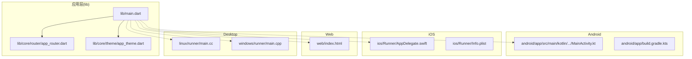
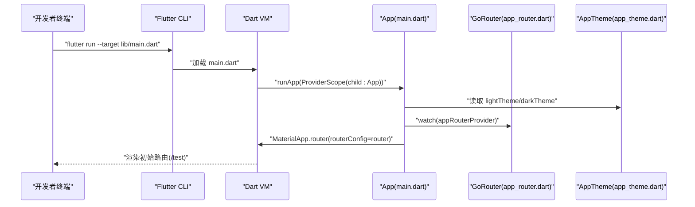
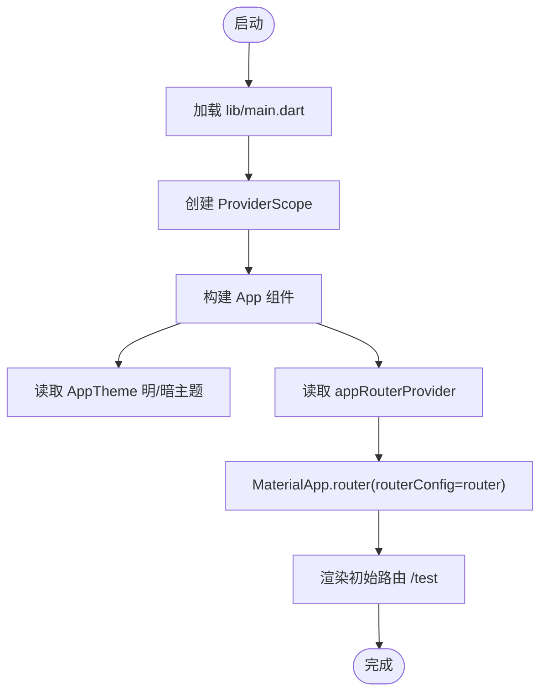

# 快速开始

<cite>
**本文引用的文件**
- [README.md](file://README.md)
- [pubspec.yaml](file://pubspec.yaml)
- [lib/main.dart](file://lib/main.dart)
- [lib/core/router/app_router.dart](file://lib/core/router/app_router.dart)
- [lib/core/theme/app_theme.dart](file://lib/core/theme/app_theme.dart)
- [android/app/src/main/kotlin/com/example/neuropean/MainActivity.kt](file://android/app/src/main/kotlin/com/example/neuropean/MainActivity.kt)
- [android/app/build.gradle.kts](file://android/app/build.gradle.kts)
- [ios/Runner/AppDelegate.swift](file://ios/Runner/AppDelegate.swift)
- [ios/Runner/Info.plist](file://ios/Runner/Info.plist)
- [web/index.html](file://web/index.html)
- [linux/runner/main.cc](file://linux/runner/main.cc)
- [windows/runner/main.cpp](file://windows/runner/main.cpp)
- [analysis_options.yaml](file://analysis_options.yaml)
- [test/widget_test.dart](file://test/widget_test.dart)
</cite>

## 目录
1. [简介](#简介)
2. [项目结构](#项目结构)
3. [核心组件](#核心组件)
4. [架构总览](#架构总览)
5. [详细组件分析](#详细组件分析)
6. [依赖关系分析](#依赖关系分析)
7. [性能考虑](#性能考虑)
8. [故障排查指南](#故障排查指南)
9. [结论](#结论)
10. [附录](#附录)

## 简介
本指南面向新加入的开发者，帮助你在本地搭建 neuropean 项目的开发与调试环境。你将学会：
- 安装与配置 Flutter SDK（版本要求：^3.10.4）
- 安装项目依赖（flutter pub get）
- 运行与调试应用（flutter run），支持 Android、iOS、Web、Desktop 平台
- 定位应用入口 main.dart，理解初始化流程
- 参考官方学习资源与项目内配置注意事项

## 项目结构
neuropean 是一个标准的 Flutter 多端项目，包含 Android、iOS、Web、Linux、macOS、Windows 六个平台的原生壳层，以及 Dart 应用层代码位于 lib 目录。根目录包含项目元数据、依赖声明与分析规则。

图表来源
- [lib/main.dart](file://lib/main.dart#L1-L33)
- [lib/core/router/app_router.dart](file://lib/core/router/app_router.dart#L1-L18)
- [lib/core/theme/app_theme.dart](file://lib/core/theme/app_theme.dart#L1-L19)
- [android/app/src/main/kotlin/com/example/neuropean/MainActivity.kt](file://android/app/src/main/kotlin/com/example/neuropean/MainActivity.kt#L1-L6)
- [android/app/build.gradle.kts](file://android/app/build.gradle.kts#L1-L45)
- [ios/Runner/AppDelegate.swift](file://ios/Runner/AppDelegate.swift#L1-L14)
- [ios/Runner/Info.plist](file://ios/Runner/Info.plist#L1-L50)
- [web/index.html](file://web/index.html#L1-L39)
- [linux/runner/main.cc](file://linux/runner/main.cc#L1-L7)
- [windows/runner/main.cpp](file://windows/runner/main.cpp#L1-L44)

章节来源
- [README.md](file://README.md#L1-L17)
- [pubspec.yaml](file://pubspec.yaml#L21-L23)

## 核心组件
- 应用入口与初始化
  - 应用入口位于 lib/main.dart，通过 ProviderScope 包裹后启动 App 组件；App 使用 go_router 的路由配置，MaterialApp.router 驱动页面渲染。
  - 初始化流程要点：ProviderScope 提供状态管理上下文；AppTheme 提供明暗主题；appRouterProvider 暴露路由实例。
- 路由系统
  - 路由定义在 lib/core/router/app_router.dart，包含初始页与聊天页两个路由，便于快速验证页面跳转。
- 主题系统
  - 主题定义在 lib/core/theme/app_theme.dart，使用 Material3 与种子色生成明暗主题，适配系统主题模式。

章节来源
- [lib/main.dart](file://lib/main.dart#L1-L33)
- [lib/core/router/app_router.dart](file://lib/core/router/app_router.dart#L1-L18)
- [lib/core/theme/app_theme.dart](file://lib/core/theme/app_theme.dart#L1-L19)

## 架构总览
下图展示了从应用入口到各平台壳层的调用链，以及路由与主题在启动时的作用。

图表来源
- [lib/main.dart](file://lib/main.dart#L1-L33)
- [lib/core/router/app_router.dart](file://lib/core/router/app_router.dart#L1-L18)
- [lib/core/theme/app_theme.dart](file://lib/core/theme/app_theme.dart#L1-L19)

## 详细组件分析

### 应用入口与初始化流程
- 入口文件：lib/main.dart
  - 使用 ProviderScope 包裹应用，提供 Riverpod 状态管理能力。
  - App 组件通过 ConsumerWidget 读取 appRouterProvider，注入到 MaterialApp.router 中。
  - 主题通过 AppTheme.lightTheme 与 AppTheme.darkTheme 提供明暗主题，配合 ThemeMode.system 实现系统跟随。
- 初始化顺序
  1) 加载 main.dart
  2) 创建 ProviderScope
  3) 构建 App
  4) 读取路由与主题
  5) 启动 MaterialApp.router

图表来源
- [lib/main.dart](file://lib/main.dart#L1-L33)
- [lib/core/theme/app_theme.dart](file://lib/core/theme/app_theme.dart#L1-L19)
- [lib/core/router/app_router.dart](file://lib/core/router/app_router.dart#L1-L18)

章节来源
- [lib/main.dart](file://lib/main.dart#L1-L33)

### 路由与页面
- 路由定义：lib/core/router/app_router.dart
  - 初始路由为 /test，对应 TestPanelPage
  - /chat 对应 ChatPage
- 页面导航
  - 通过 GoRouter.builder 渲染页面，便于后续扩展更多页面与参数传递。

章节来源
- [lib/core/router/app_router.dart](file://lib/core/router/app_router.dart#L1-L18)

### 主题系统
- 主题定义：lib/core/theme/app_theme.dart
  - lightTheme 与 darkTheme 基于种子色生成 ColorScheme
  - useMaterial3=true，启用 Material Design 3
  - App 组件中通过 theme 与 darkTheme 分别注入明/暗主题

章节来源
- [lib/core/theme/app_theme.dart](file://lib/core/theme/app_theme.dart#L1-L19)
- [lib/main.dart](file://lib/main.dart#L1-L33)

### 平台壳层与运行目标
- Android
  - MainActivity.kt 继承 FlutterActivity，作为 Android 入口
  - build.gradle.kts 中 compileSdk、minSdk、targetSdk 由 Flutter 插件统一管理
  - Java/Kotlin 版本：Java 17
- iOS
  - AppDelegate.swift 注册插件并继承 FlutterAppDelegate
  - Info.plist 设置应用名称、版本号、启动画面等
- Web
  - web/index.html 提供基础 HTML 结构与 PWA 清单链接
- Desktop（Linux/macOS/Windows）
  - Linux：linux/runner/main.cc 启动 MyApplication
  - Windows：windows/runner/main.cpp 初始化 Flutter 引擎并创建窗口
  - macOS：Runner 工程已生成，可直接运行

章节来源
- [android/app/src/main/kotlin/com/example/neuropean/MainActivity.kt](file://android/app/src/main/kotlin/com/example/neuropean/MainActivity.kt#L1-L6)
- [android/app/build.gradle.kts](file://android/app/build.gradle.kts#L1-L45)
- [ios/Runner/AppDelegate.swift](file://ios/Runner/AppDelegate.swift#L1-L14)
- [ios/Runner/Info.plist](file://ios/Runner/Info.plist#L1-L50)
- [web/index.html](file://web/index.html#L1-L39)
- [linux/runner/main.cc](file://linux/runner/main.cc#L1-L7)
- [windows/runner/main.cpp](file://windows/runner/main.cpp#L1-L44)

## 依赖关系分析
- SDK 版本要求
  - pubspec.yaml 指定 Flutter SDK 版本为 ^3.10.4
- 开发工具与代码生成
  - dev_dependencies 包含 flutter_lints、build_runner、riverpod_generator、drift_dev、freezed、json_serializable 等，用于代码生成与静态检查
- 分析规则
  - analysis_options.yaml 引入 flutter_lints 推荐规则，建议保持默认以提升代码质量

章节来源
- [pubspec.yaml](file://pubspec.yaml#L21-L23)
- [pubspec.yaml](file://pubspec.yaml#L60-L77)
- [analysis_options.yaml](file://analysis_options.yaml#L1-L29)

## 性能考虑
- 代码生成与增量构建
  - 使用 build_runner 与相关 generator 可减少手写样板代码，提高迭代效率
- 路由与主题
  - 将路由与主题集中管理，避免重复计算，有利于热重载与调试体验
- 平台差异
  - Android 使用 Java 17，iOS 使用 Swift/Objective-C，注意各平台的构建缓存与签名配置

[本节为通用建议，不涉及具体文件分析]

## 故障排查指南
- 无法运行或编译失败
  - 确认 Flutter SDK 版本满足 ^3.10.4 要求
  - 在项目根目录执行 flutter pub get 安装依赖
- Android 运行问题
  - 检查 Android Studio/Gradle 配置是否正确，compileSdk 与 Java 17 设置
  - 确保设备/模拟器已连接且可调试
- iOS 运行问题
  - 确认 Xcode 工程已打开，必要时执行 flutter clean 后重新构建
  - 检查 Info.plist 中的应用标识与版本号
- Web 运行问题
  - 确认浏览器支持与网络权限，必要时更换端口或关闭代理
- Desktop 运行问题
  - Linux/macOS 需要 GTK/GLib 等系统依赖；Windows 需要 Visual Studio 工具链
- 测试与分析
  - 可参考 test/widget_test.dart 的基本用例结构
  - 使用 flutter analyze 检查静态问题

章节来源
- [pubspec.yaml](file://pubspec.yaml#L21-L23)
- [android/app/build.gradle.kts](file://android/app/build.gradle.kts#L1-L45)
- [ios/Runner/Info.plist](file://ios/Runner/Info.plist#L1-L50)
- [test/widget_test.dart](file://test/widget_test.dart#L1-L31)
- [analysis_options.yaml](file://analysis_options.yaml#L1-L29)

## 结论
按照本指南完成 Flutter SDK 安装、依赖安装与平台准备后，你可以通过 flutter run 在多端运行项目，并在 lib/main.dart 的入口处完成首次调试。随后可基于路由与主题模块继续扩展功能。

[本节为总结性内容，不涉及具体文件分析]

## 附录

### 快速操作清单
- 安装 Flutter SDK（版本要求：^3.10.4）
- 在项目根目录执行 flutter pub get
- 执行 flutter run（默认目标为移动平台）
- 如需其他平台，请指定目标：flutter run -d android|ios|web|linux|macos|windows
- 首次调试定位：lib/main.dart

章节来源
- [pubspec.yaml](file://pubspec.yaml#L21-L23)
- [README.md](file://README.md#L1-L17)

### 官方学习资源
- 写你的第一个 Flutter 应用：https://docs.flutter.dev/get-started/codelab
- Flutter 示例与教程：https://docs.flutter.dev/cookbook
- 在线文档与 API 参考：https://docs.flutter.dev/

章节来源
- [README.md](file://README.md#L10-L17)