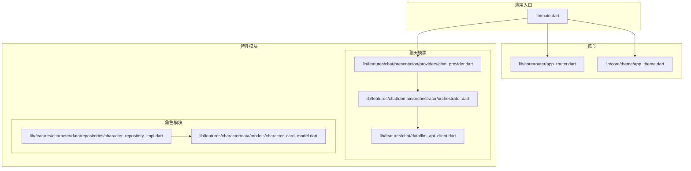
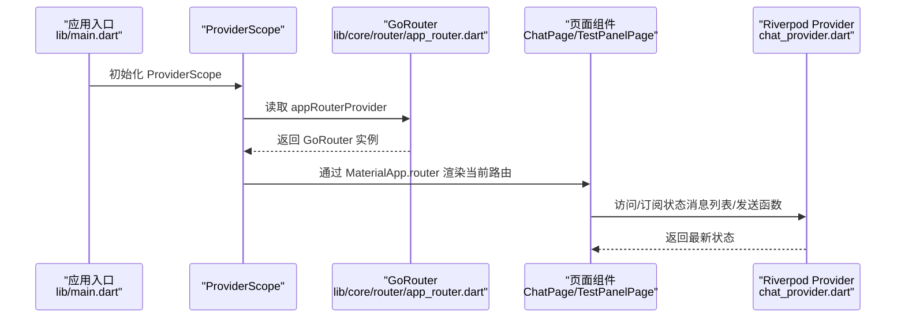
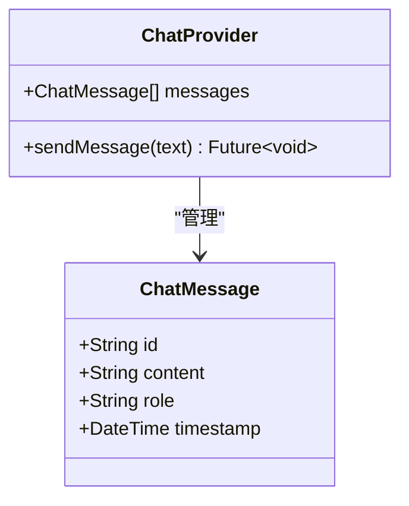
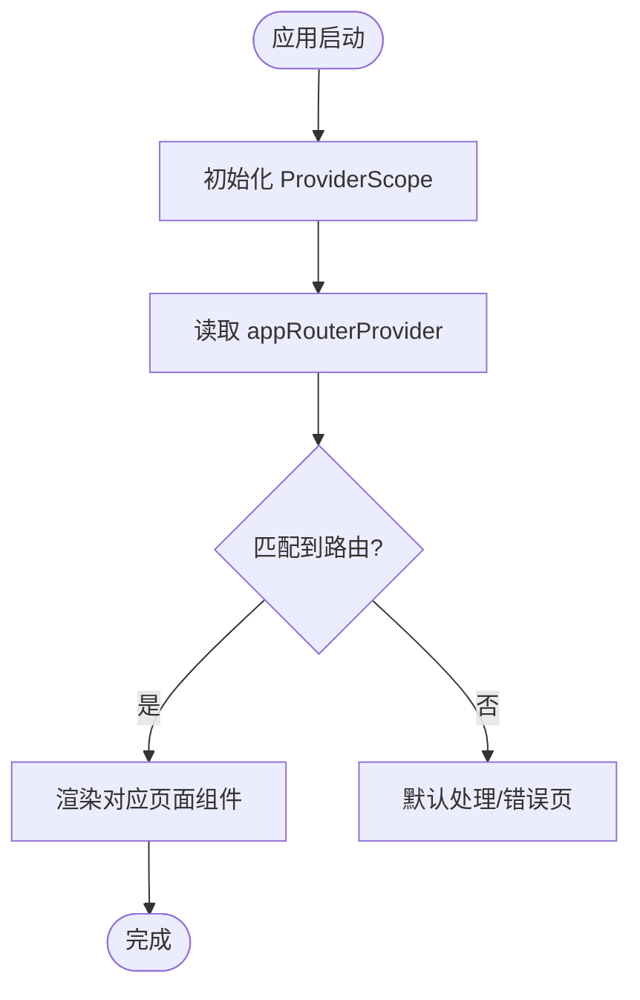
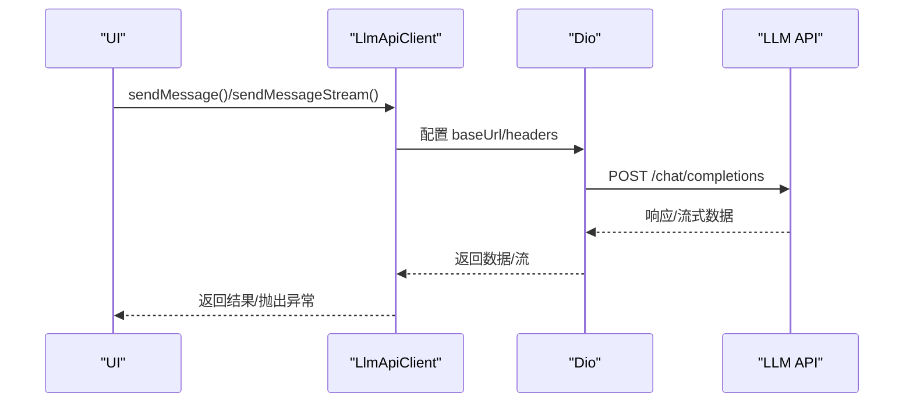
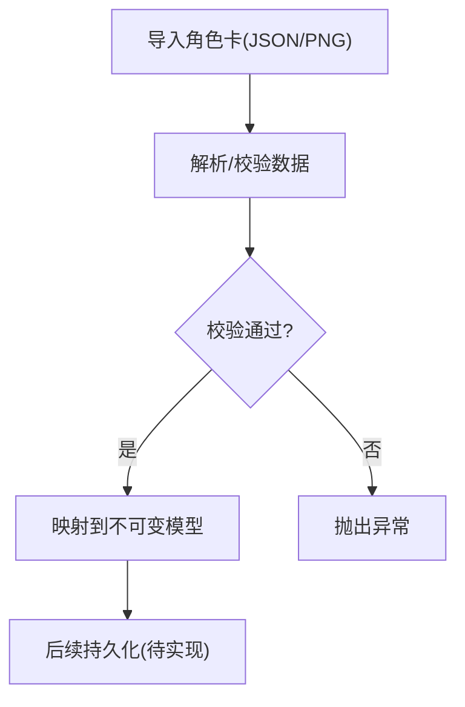
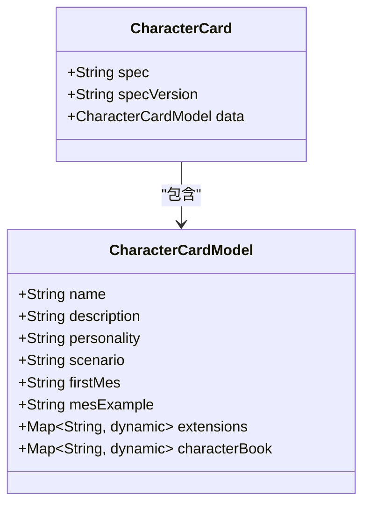
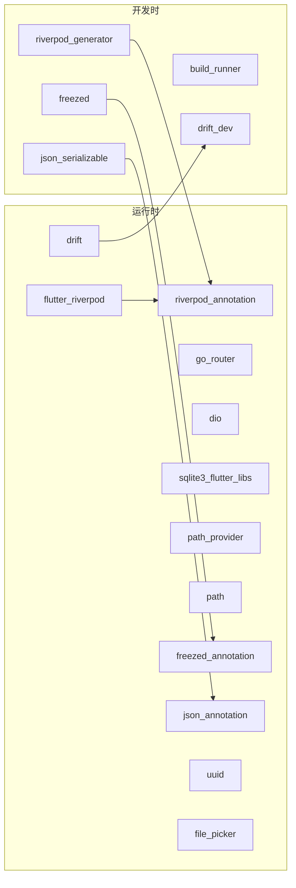

# 技术栈与依赖

<cite>
**本文引用的文件**
- [pubspec.yaml](file://pubspec.yaml)
- [SDD.md](file://SDD.md)
- [README.md](file://README.md)
- [analysis_options.yaml](file://analysis_options.yaml)
- [lib/main.dart](file://lib/main.dart)
- [lib/core/router/app_router.dart](file://lib/core/router/app_router.dart)
- [lib/features/chat/data/llm_api_client.dart](file://lib/features/chat/data/llm_api_client.dart)
- [lib/features/chat/domain/orchestrator/orchestrator.dart](file://lib/features/chat/domain/orchestrator/orchestrator.dart)
- [lib/features/chat/presentation/providers/chat_provider.dart](file://lib/features/chat/presentation/providers/chat_provider.dart)
- [lib/features/character/data/models/character_card_model.dart](file://lib/features/character/data/models/character_card_model.dart)
- [lib/features/character/data/repositories/character_repository_impl.dart](file://lib/features/character/data/repositories/character_repository_impl.dart)
</cite>

## 目录
1. [引言](#引言)
2. [项目结构](#项目结构)
3. [核心组件](#核心组件)
4. [架构总览](#架构总览)
5. [详细组件分析](#详细组件分析)
6. [依赖关系分析](#依赖关系分析)
7. [性能考量](#性能考量)
8. [故障排查指南](#故障排查指南)
9. [结论](#结论)
10. [附录](#附录)

## 引言
本文件系统性梳理 neuropean 项目的整体技术栈与依赖，围绕 pubspec.yaml 与 SDD.md 的技术选型与架构说明展开，重点阐释以下核心库的职责与价值：
- 状态管理：flutter_riverpod 与 riverpod_annotation
- 路由：go_router
- 网络：dio
- 本地数据库：drift + sqlite3_flutter_libs
- 不可变数据模型：freezed + json_serializable
同时，结合代码中的实际使用位置，说明为何选择这些库（例如 Riverpod 的编译时安全、drift 的类型安全 ORM 能力），并给出开发依赖（build_runner、freezed、riverpod_generator、drift_dev 等）的代码生成流程与作用。

## 项目结构
neuropean 采用 Flutter 工程标准目录组织，配合 Clean Architecture 分层思想：
- core：核心基础设施（路由、主题、网络封装等）
- features：业务功能模块（chat、character 等）
- lib/main.dart：应用入口，初始化 ProviderScope 并挂载路由
- SDD.md 描述了分阶段实施规划、Clean Architecture 分层、以及技术栈选型与理由

图表来源
- [lib/main.dart](file://lib/main.dart#L1-L33)
- [lib/core/router/app_router.dart](file://lib/core/router/app_router.dart#L1-L18)
- [lib/features/chat/presentation/providers/chat_provider.dart](file://lib/features/chat/presentation/providers/chat_provider.dart#L1-L63)
- [lib/features/chat/domain/orchestrator/orchestrator.dart](file://lib/features/chat/domain/orchestrator/orchestrator.dart#L1-L49)
- [lib/features/chat/data/llm_api_client.dart](file://lib/features/chat/data/llm_api_client.dart#L1-L115)
- [lib/features/character/data/repositories/character_repository_impl.dart](file://lib/features/character/data/repositories/character_repository_impl.dart#L1-L78)
- [lib/features/character/data/models/character_card_model.dart](file://lib/features/character/data/models/character_card_model.dart#L1-L63)

章节来源
- [pubspec.yaml](file://pubspec.yaml#L21-L77)
- [SDD.md](file://SDD.md#L42-L95)
- [lib/main.dart](file://lib/main.dart#L1-L33)

## 核心组件
本节从技术选型与实际使用两个维度，系统说明各核心库的职责与价值。

- 状态管理：flutter_riverpod 与 riverpod_annotation
  - 选型理由：SDD.md 明确指出 Riverpod 的编译时安全、依赖注入、生命周期管理（autoDispose/family）、以及无 Context 限制等优势，适合在 Domain 层或 Service 层读取状态。
  - 实际使用：lib/main.dart 中通过 ProviderScope 包裹应用；lib/features/chat/presentation/providers/chat_provider.dart 展示了 StateProvider 的典型用法，演示了如何将消息列表与发送函数作为 Provider 管理。
  - 代码生成：pubspec.yaml dev_dependencies 中包含 riverpod_generator，配合 riverpod_annotation 在编译期生成代码，提升类型安全与可维护性。

- 路由：go_router
  - 选型理由：SDD.md 指出 go_router 支持声明式路由、Deep Link 与路由守卫，适合现代 Flutter 应用的导航需求。
  - 实际使用：lib/core/router/app_router.dart 定义了初始路由与两条示例路由（/test、/chat），并在 lib/main.dart 中通过 ProviderScope 注入到 MaterialApp.router。

- 网络：dio
  - 选型理由：SDD.md 指出 dio 是强大的 HTTP 客户端，支持拦截器（用于 API Key 注入、日志），适合接入 LLM API。
  - 实际使用：lib/features/chat/data/llm_api_client.dart 展示了 Dio 的基本配置与两种调用方式：一次性返回与流式返回；同时封装了异常类型 LlmApiException，便于上层处理。

- 本地数据库：drift + sqlite3_flutter_libs
  - 选型理由：SDD.md 指出 drift 提供类型安全的 ORM，sqlite3_flutter_libs 提供 SQLite 的 Flutter 集成；二者组合适合存储 RPG 变量与聊天记录等关系型数据。
  - 实际使用：SDD.md 的“数据库 Schema”示例展示了表结构定义思路；pubspec.yaml 中已声明 drift 与 sqlite3_flutter_libs 依赖；lib/features/character/data/repositories/character_repository_impl.dart 展示了 JSON/二进制数据的导入与校验流程，为后续数据库持久化奠定基础。

- 不可变数据模型：freezed + json_serializable
  - 选型理由：SDD.md 指出 json_serializable 与 freezed 可自动化生成不可变数据模型，提升类型安全与可读性。
  - 实际使用：lib/features/character/data/models/character_card_model.dart 通过 @freezed 与 @JsonKey 注解，配合生成文件 character_card_model.freezed.dart 与 character_card_model.g.dart，完成角色卡模型的序列化/反序列化与不可变结构。

章节来源
- [SDD.md](file://SDD.md#L48-L67)
- [lib/main.dart](file://lib/main.dart#L1-L33)
- [lib/core/router/app_router.dart](file://lib/core/router/app_router.dart#L1-L18)
- [lib/features/chat/data/llm_api_client.dart](file://lib/features/chat/data/llm_api_client.dart#L1-L115)
- [lib/features/chat/presentation/providers/chat_provider.dart](file://lib/features/chat/presentation/providers/chat_provider.dart#L1-L63)
- [lib/features/character/data/models/character_card_model.dart](file://lib/features/character/data/models/character_card_model.dart#L1-L63)
- [pubspec.yaml](file://pubspec.yaml#L38-L58)
- [pubspec.yaml](file://pubspec.yaml#L71-L77)

## 架构总览
下图展示应用启动到路由与状态管理的关键交互，体现 Riverpod 的全局状态与 go_router 的声明式导航如何协同工作。

图表来源
- [lib/main.dart](file://lib/main.dart#L1-L33)
- [lib/core/router/app_router.dart](file://lib/core/router/app_router.dart#L1-L18)
- [lib/features/chat/presentation/providers/chat_provider.dart](file://lib/features/chat/presentation/providers/chat_provider.dart#L1-L63)

## 详细组件分析

### 状态管理：Riverpod
- 设计要点
  - 编译时安全：通过 riverpod_annotation 与 riverpod_generator，在编译期生成代码，减少运行时错误。
  - 生命周期管理：autoDispose/family 修饰符适合会话与临时状态管理。
  - 无 Context 限制：可在 Domain 层直接读取状态，便于测试与解耦。
- 实际使用
  - lib/main.dart 中通过 ProviderScope 包裹应用，确保全局 Provider 可用。
  - lib/features/chat/presentation/providers/chat_provider.dart 展示了 StateProvider 的典型用法：消息列表与发送函数作为 Provider 管理，UI 通过 ConsumerWidget 订阅状态变化。

图表来源
- [lib/features/chat/presentation/providers/chat_provider.dart](file://lib/features/chat/presentation/providers/chat_provider.dart#L1-L63)
- [lib/features/chat/domain/entities/chat_message.dart](file://lib/features/chat/domain/entities/chat_message.dart)

章节来源
- [SDD.md](file://SDD.md#L48-L56)
- [lib/main.dart](file://lib/main.dart#L1-L33)
- [lib/features/chat/presentation/providers/chat_provider.dart](file://lib/features/chat/presentation/providers/chat_provider.dart#L1-L63)

### 路由：go_router
- 设计要点
  - 声明式路由：GoRouter 支持路径匹配、builder 渲染，便于集中管理路由。
  - Deep Link 与守卫：适合复杂导航场景。
- 实际使用
  - lib/core/router/app_router.dart 定义了初始路由与两条示例路由，分别渲染 TestPanelPage 与 ChatPage。
  - lib/main.dart 通过 ProviderScope 注入 appRouterProvider，使 MaterialApp.router 能够使用该路由配置。

图表来源
- [lib/main.dart](file://lib/main.dart#L1-L33)
- [lib/core/router/app_router.dart](file://lib/core/router/app_router.dart#L1-L18)

章节来源
- [SDD.md](file://SDD.md#L60-L63)
- [lib/core/router/app_router.dart](file://lib/core/router/app_router.dart#L1-L18)
- [lib/main.dart](file://lib/main.dart#L1-L33)

### 网络：dio
- 设计要点
  - 强大的 HTTP 客户端，支持拦截器（用于注入 API Key、日志等）。
  - 支持同步/异步请求与流式响应。
- 实际使用
  - lib/features/chat/data/llm_api_client.dart 展示了 Dio 的基本配置与两种调用方式：一次性返回与流式返回；同时封装了 LlmApiException，便于上层统一处理网络异常。

图表来源
- [lib/features/chat/data/llm_api_client.dart](file://lib/features/chat/data/llm_api_client.dart#L1-L115)

章节来源
- [SDD.md](file://SDD.md#L60-L63)
- [lib/features/chat/data/llm_api_client.dart](file://lib/features/chat/data/llm_api_client.dart#L1-L115)

### 本地数据库：drift + sqlite3_flutter_libs
- 设计要点
  - drift 提供类型安全的 ORM，支持表定义、查询与迁移。
  - sqlite3_flutter_libs 提供 SQLite 的 Flutter 集成。
- 实际使用
  - SDD.md 的“数据库 Schema”示例展示了表结构定义思路；pubspec.yaml 中已声明 drift 与 sqlite3_flutter_libs 依赖；lib/features/character/data/repositories/character_repository_impl.dart 展示了角色卡导入与校验流程，为后续数据库持久化奠定基础。

图表来源
- [lib/features/character/data/repositories/character_repository_impl.dart](file://lib/features/character/data/repositories/character_repository_impl.dart#L1-L78)
- [lib/features/character/data/models/character_card_model.dart](file://lib/features/character/data/models/character_card_model.dart#L1-L63)
- [SDD.md](file://SDD.md#L180-L224)

章节来源
- [SDD.md](file://SDD.md#L62-L64)
- [pubspec.yaml](file://pubspec.yaml#L48-L53)
- [lib/features/character/data/repositories/character_repository_impl.dart](file://lib/features/character/data/repositories/character_repository_impl.dart#L1-L78)
- [lib/features/character/data/models/character_card_model.dart](file://lib/features/character/data/models/character_card_model.dart#L1-L63)

### 不可变数据模型：freezed + json_serializable
- 设计要点
  - 自动化生成不可变数据模型，提升类型安全与可读性。
  - 结合 @JsonKey 与 JsonSerializable，实现字段名映射与序列化。
- 实际使用
  - lib/features/character/data/models/character_card_model.dart 通过 @freezed 与 @JsonKey 注解，配合生成文件 character_card_model.freezed.dart 与 character_card_model.g.dart，完成角色卡模型的序列化/反序列化与不可变结构。

图表来源
- [lib/features/character/data/models/character_card_model.dart](file://lib/features/character/data/models/character_card_model.dart#L1-L63)

章节来源
- [SDD.md](file://SDD.md#L65-L67)
- [lib/features/character/data/models/character_card_model.dart](file://lib/features/character/data/models/character_card_model.dart#L1-L63)

## 依赖关系分析
- 运行时依赖
  - 状态管理：flutter_riverpod、riverpod_annotation
  - 路由：go_router
  - 网络：dio
  - 数据库：drift、sqlite3_flutter_libs、path_provider、path
  - 序列化与模型：freezed_annotation、json_annotation、uuid、file_picker
- 开发时依赖
  - 代码生成：build_runner、riverpod_generator、drift_dev、freezed、json_serializable

图表来源
- [pubspec.yaml](file://pubspec.yaml#L38-L77)

章节来源
- [pubspec.yaml](file://pubspec.yaml#L38-L77)

## 性能考量
- 状态管理
  - Riverpod 的编译时代码生成与 Provider 的细粒度订阅，有助于减少不必要的重建与状态传播开销。
- 路由
  - go_router 的声明式路由与 builder 渲染，避免过度的页面栈管理，降低导航成本。
- 网络
  - 使用 Dio 的流式响应可实现更平滑的 UI 更新；合理设置超时与重试策略可提升稳定性。
- 数据库
  - drift 的类型安全 ORM 与 SQL 生成，有助于编写高效查询；建议在高频查询处建立索引与缓存策略。
- 代码生成
  - build_runner、riverpod_generator、drift_dev、freezed、json_serializable 等工具在构建阶段完成代码生成，运行时无需额外开销。

[本节为通用指导，不直接分析具体文件]

## 故障排查指南
- 网络异常
  - LlmApiClient 封装了 LlmApiException，建议在 UI 层捕获并提示用户；检查 baseUrl 与 API Key 配置是否正确。
- 路由问题
  - 确认 appRouterProvider 是否正确注入到 MaterialApp.router；检查路由路径与 builder 是否匹配。
- 状态未更新
  - 确认 ProviderScope 是否包裹根组件；检查 Provider 的订阅与状态变更是否触发了 UI 重建。
- 代码生成未生效
  - 确认已安装并执行 build_runner；检查 @freezed、@JsonSerializable 等注解是否正确标注；清理并重新生成。

章节来源
- [lib/features/chat/data/llm_api_client.dart](file://lib/features/chat/data/llm_api_client.dart#L1-L115)
- [lib/main.dart](file://lib/main.dart#L1-L33)
- [lib/core/router/app_router.dart](file://lib/core/router/app_router.dart#L1-L18)
- [lib/features/chat/presentation/providers/chat_provider.dart](file://lib/features/chat/presentation/providers/chat_provider.dart#L1-L63)

## 结论
neuropean 的技术栈围绕 Flutter 生态与 Clean Architecture 展开，核心库的选择体现了对类型安全、可测试性与可维护性的重视。Riverpod 提供编译时安全的状态管理，go_router 实现声明式导航，dio 提供灵活的网络访问，drift + sqlite3_flutter_libs 提供类型安全的本地数据库能力，freezed + json_serializable 则保障了不可变数据模型的生成与使用。开发依赖的代码生成工具贯穿构建流程，确保运行时的高性能与低维护成本。

[本节为总结性内容，不直接分析具体文件]

## 附录
- 开发环境配置建议
  - SDK 版本：SDD.md 与 pubspec.yaml 均明确 Dart SDK 版本要求，确保本地与 CI 环境一致。
  - 代码规范：analysis_options.yaml 引入 flutter_lints，建议遵循推荐规则，保持代码一致性。
  - 依赖安装：执行 flutter pub get 安装依赖；如需生成代码，执行 flutter pub run build_runner build 或 watch。
- 参考文档
  - SDD.md 的“分阶段实施规划”与“Clean Architecture 分层”为后续迭代提供了清晰路线图。

章节来源
- [SDD.md](file://SDD.md#L1-L20)
- [pubspec.yaml](file://pubspec.yaml#L21-L24)
- [analysis_options.yaml](file://analysis_options.yaml#L1-L29)
- [README.md](file://README.md#L1-L17)