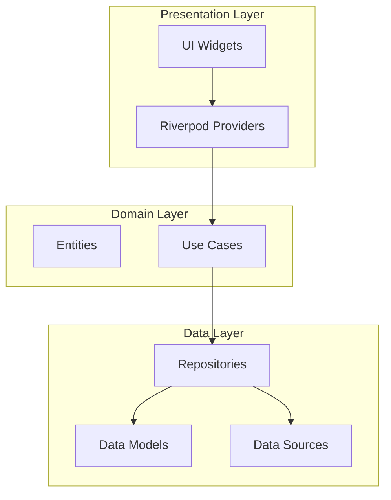
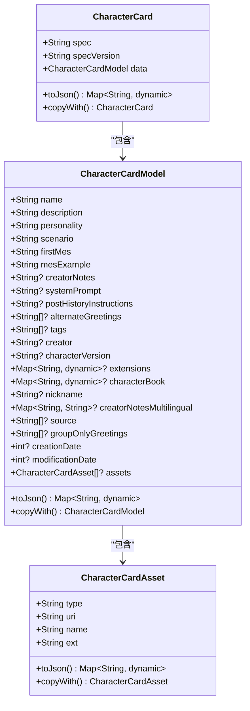
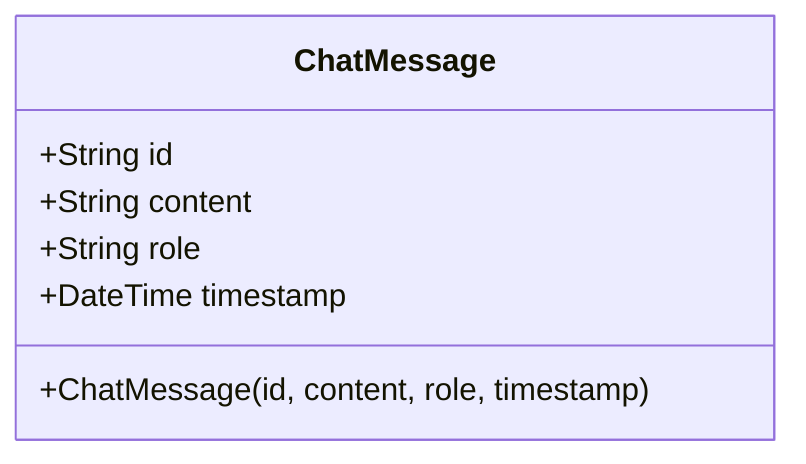
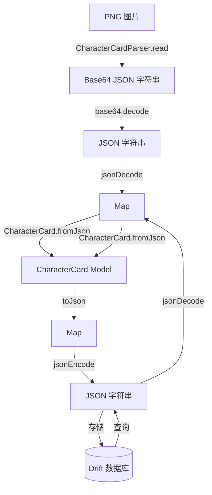

# 数据模型设计

<cite>
**本文档引用的文件**
- [character_card_model.dart](file://lib/features/character/data/models/character_card_model.dart)
- [character_card_model.freezed.dart](file://lib/features/character/data/models/character_card_model.freezed.dart)
- [character_card_model.g.dart](file://lib/features/character/data/models/character_card_model.g.dart)
- [chat_message.dart](file://lib/features/chat/domain/entities/chat_message.dart)
- [character_repository_impl.dart](file://lib/features/character/data/repositories/character_repository_impl.dart)
- [character_card_parser.dart](file://lib/features/character/data/utils/character_card_parser.dart)
- [SDD.md](file://SDD.md)
</cite>

## 目录
1. [项目结构](#项目结构)
2. [核心数据模型](#核心数据模型)
3. [Freezed 代码生成机制](#freezed-代码生成机制)
4. [聊天消息实体](#聊天消息实体)
5. [数据持久化与序列化](#数据持久化与序列化)
6. [模型扩展与调试指南](#模型扩展与调试指南)

## 项目结构

项目采用分层架构设计，数据模型主要位于 `lib/features/` 目录下，按功能模块划分。角色卡模型位于 `character` 模块的 `data/models` 目录，聊天消息实体位于 `chat` 模块的 `domain/entities` 目录。项目使用 `drift` 进行本地数据库操作，并通过 `freezed` 和 `json_serializable` 实现不可变数据模型的 JSON 序列化。

**Diagram sources**
- [SDD.md](file://SDD.md#L70-L94)

**Section sources**
- [SDD.md](file://SDD.md#L70-L94)

## 核心数据模型

### CharacterCardModel 结构解析

`CharacterCardModel` 是一个使用 Freezed 定义的不可变数据模型，用于表示角色卡的核心数据。该模型兼容 SillyTavern 的 V2 和 V3 规范，包含角色的名称、描述、个性、场景等基本信息，以及用于高级功能的扩展字段。

**Diagram sources**
- [character_card_model.dart](file://lib/features/character/data/models/character_card_model.dart#L6-L63)

**Section sources**
- [character_card_model.dart](file://lib/features/character/data/models/character_card_model.dart#L6-L63)
- [SDD.md](file://SDD.md#L183-L190)

### 字段含义与嵌套关系

`CharacterCardModel` 通过 `@JsonKey` 注解将 Dart 字段映射到 JSON 键名，确保了与外部数据格式的兼容性。其主要字段分为 V2 和 V3 两代：

- **V2 字段**：`name`, `description`, `personality`, `scenario`, `firstMes`, `mesExample` 等，构成了角色卡的基础信息。
- **V3 新增字段**：`nickname`, `creatorNotesMultilingual`, `source`, `groupOnlyGreetings`, `creationDate`, `modificationDate` 等，提供了更丰富的元数据支持。
- **嵌套对象**：`assets` 字段是一个 `List<CharacterCardAsset>`，允许为角色卡关联多个资源文件，如图片、音频等，实现了数据的模块化和可扩展性。

`CharacterCard` 类作为最外层的容器，包含了 `spec` 和 `specVersion` 字段来标识卡的规范版本，并通过 `data` 字段嵌套了完整的 `CharacterCardModel`。

## Freezed 代码生成机制

### *.freezed.dart 文件的作用

`character_card_model.freezed.dart` 文件由 Freezed 代码生成器自动生成，包含了模型类的完整实现。其主要作用包括：

1.  **实现不可变性**：生成的类是 `final` 的，所有字段都是不可变的，确保了数据的一致性和线程安全。
2.  **提供 copyWith 方法**：生成了强大的 `copyWith` 方法，允许开发者创建一个新实例，并仅修改指定的字段，而其他字段保持不变。这是处理不可变状态更新的关键。
3.  **实现相等性比较**：重写了 `==` 操作符和 `hashCode`，使得两个 `CharacterCardModel` 实例可以根据其所有字段的值进行深度比较，这对于状态管理（如 Riverpod）至关重要。
4.  **定义私有实现类**：生成了 `_$CharacterCardModelImpl` 这样的私有类来实现所有逻辑，而开发者定义的 `CharacterCardModel` 类则作为一个抽象接口。

### *.g.dart 文件的作用

`character_card_model.g.dart` 文件由 `json_serializable` 代码生成器生成，专注于 JSON 的序列化和反序列化。其核心作用是：

1.  **fromJson 工厂方法**：生成了 `_$$CharacterCardModelImplFromJson` 函数，它能将一个 `Map<String, dynamic>` 类型的 JSON 对象，安全地转换为 `CharacterCardModel` 实例。该函数处理了类型转换、空值检查和 `@JsonKey` 注解的映射。
2.  **toJson 实例方法**：生成了 `_$$CharacterCardModelImplToJson` 函数，它能将 `CharacterCardModel` 实例转换回一个标准的 JSON `Map`，以便于网络传输或本地存储。
3.  **性能优化**：生成的代码是纯 Dart 代码，避免了反射（reflection），从而保证了高性能和可预测的编译时行为。

## 聊天消息实体

`ChatMessage` 是定义在 `chat` 模块中的一个简单但核心的实体，用于表示聊天会话中的单条消息。

**Diagram sources**
- [chat_message.dart](file://lib/features/chat/domain/entities/chat_message.dart#L1-L13)

**Section sources**
- [chat_message.dart](file://lib/features/chat/domain/entities/chat_message.dart#L1-L13)
- [SDD.md](file://SDD.md#L191-L198)

### 设计要点

- **字段定义**：`id` 用于唯一标识消息，`content` 存储消息文本，`role` 标识消息发送者（用户、助手、系统），`timestamp` 记录消息时间。
- **构造函数**：使用命名参数和 `required` 关键字，确保了所有字段在创建实例时都必须被初始化，提高了代码的健壮性。
- **领域层位置**：该实体位于 `domain/entities` 目录，表明它是一个纯粹的业务逻辑模型，不依赖于任何具体的数据源或 UI 框架，符合 Clean Architecture 原则。

## 数据持久化与序列化

### 从 JSON 到模型的映射流程

当从外部（如 PNG 图片或 JSON 文件）导入角色卡时，数据流遵循以下流程：
1.  **数据提取**：`CharacterCardParser` 从 PNG 图片的 `tEXt` 块中提取出 Base64 编码的 JSON 字符串。
2.  **JSON 解码**：使用 `jsonDecode` 将字符串转换为 `Map<String, dynamic>`。
3.  **模型构建**：调用 `CharacterCard.fromJson(map)`。此方法内部会调用 `json_serializable` 生成的 `_$CharacterCardImplFromJson` 函数，递归地构建 `CharacterCard`、`CharacterCardModel` 和 `CharacterCardAsset` 的完整实例树。

### 与 Drift 数据库的集成

根据 `SDD.md` 的设计，`CharacterCardModel` 将被持久化到本地 SQLite 数据库中，使用 `drift` 作为 ORM 框架。

- **数据库 Schema**：`SDD.md` 中定义了 `Characters` 表，其字段（如 `name`, `description`, `metadata`）与 `CharacterCardModel` 的核心字段相对应。
- **存储策略**：复杂的 `CharacterCardModel` 对象可以被序列化为一个 JSON 字符串，然后存储在数据库的 `metadata` 字段中。这简化了数据库表结构的设计，同时保留了模型的全部信息。
- **读取流程**：从数据库读取时，先获取 `metadata` 字段的 JSON 字符串，然后通过 `CharacterCard.fromJson()` 将其反序列化回完整的对象模型。

**Diagram sources**
- [character_card_parser.dart](file://lib/features/character/data/utils/character_card_parser.dart#L7-L40)
- [character_repository_impl.dart](file://lib/features/character/data/repositories/character_repository_impl.dart#L29-L46)
- [SDD.md](file://SDD.md#L204-L223)

**Section sources**
- [character_card_parser.dart](file://lib/features/character/data/utils/character_card_parser.dart#L7-L40)
- [character_repository_impl.dart](file://lib/features/character/data/repositories/character_repository_impl.dart#L29-L46)
- [SDD.md](file://SDD.md#L204-L223)

## 模型扩展与调试指南

### 如何扩展 CharacterCardModel

1.  **添加新字段**：在 `character_card_model.dart` 的 `CharacterCardModel` 工厂构造函数中直接添加新字段。例如，添加一个 `String? avatarUrl` 字段。
2.  **运行代码生成**：在项目根目录执行 `flutter pub run build_runner build`。这将重新生成 `*.freezed.dart` 和 `*.g.dart` 文件，包含新字段的序列化逻辑。
3.  **更新数据库**：如果新字段需要独立查询，需在 Drift 的数据库定义中为 `Characters` 表添加新列，并编写迁移脚本。如果只是作为元数据的一部分，则无需修改表结构。

### 调试常见问题

- **JSON 反序列化失败**：检查 `character_card_model.g.dart` 中生成的 `fromJson` 代码，确认 JSON 键名与 `@JsonKey` 注解是否匹配。使用 `print(jsonString)` 输出原始 JSON 进行验证。
-   **copyWith 不生效**：确保你接收了 `copyWith` 返回的新实例，而不是忽略它。例如，`final updatedCard = card.copyWith(name: "New Name");`。
-   **数据库存储后数据丢失**：检查 `toJson` 方法的输出，确认所有字段都被正确包含。如果使用了 `@JsonKey(includeToJson: false)`，则该字段不会被序列化。