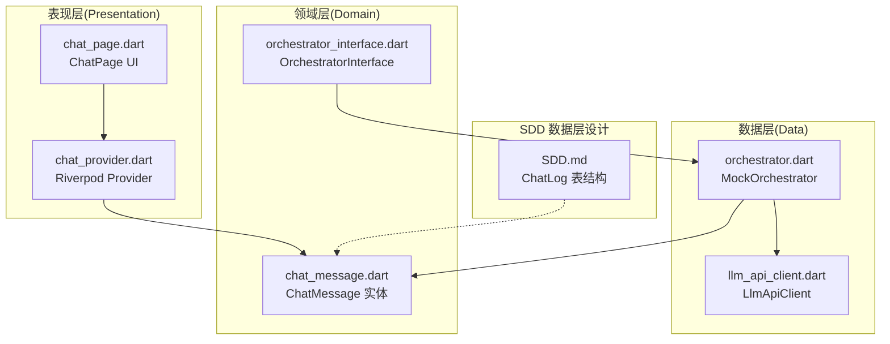
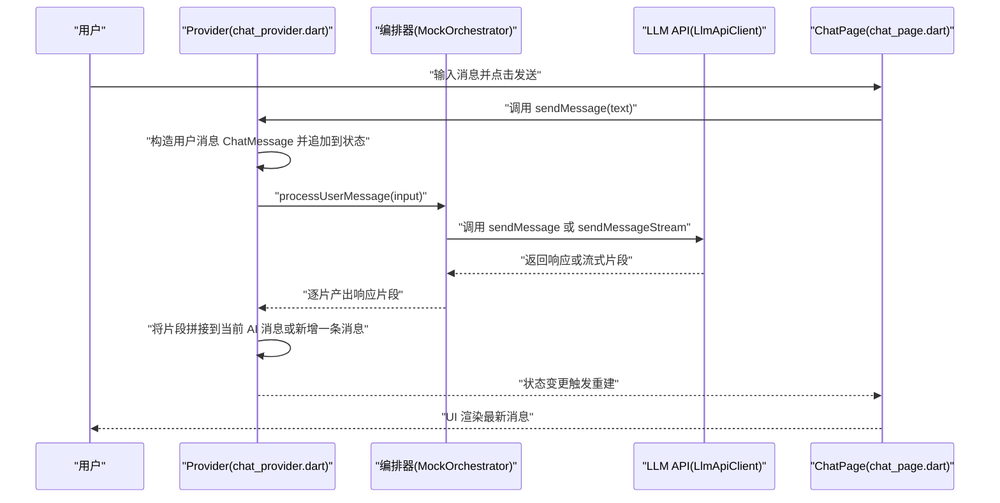
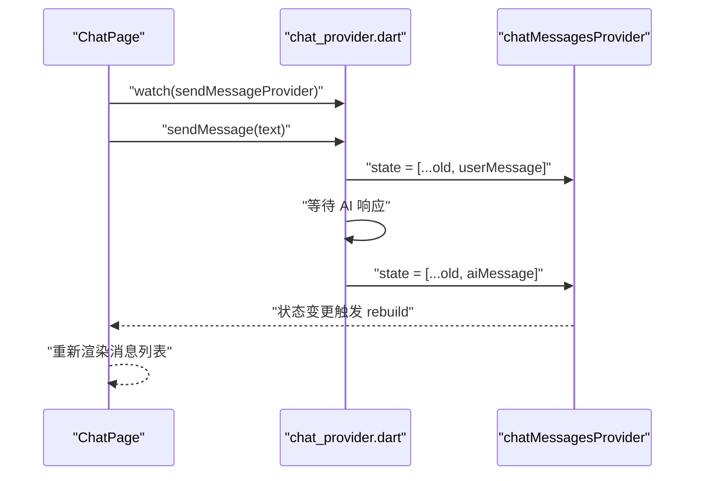
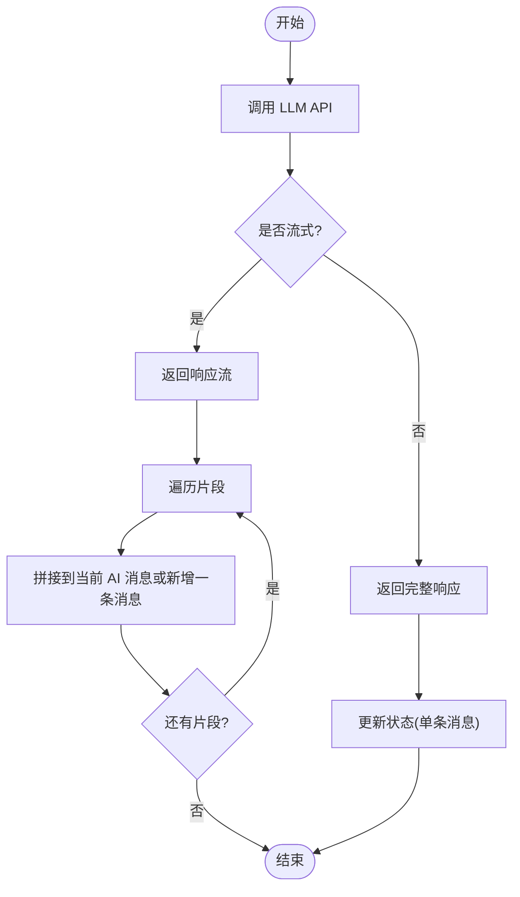
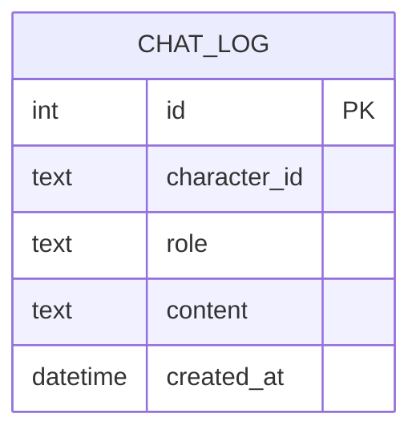
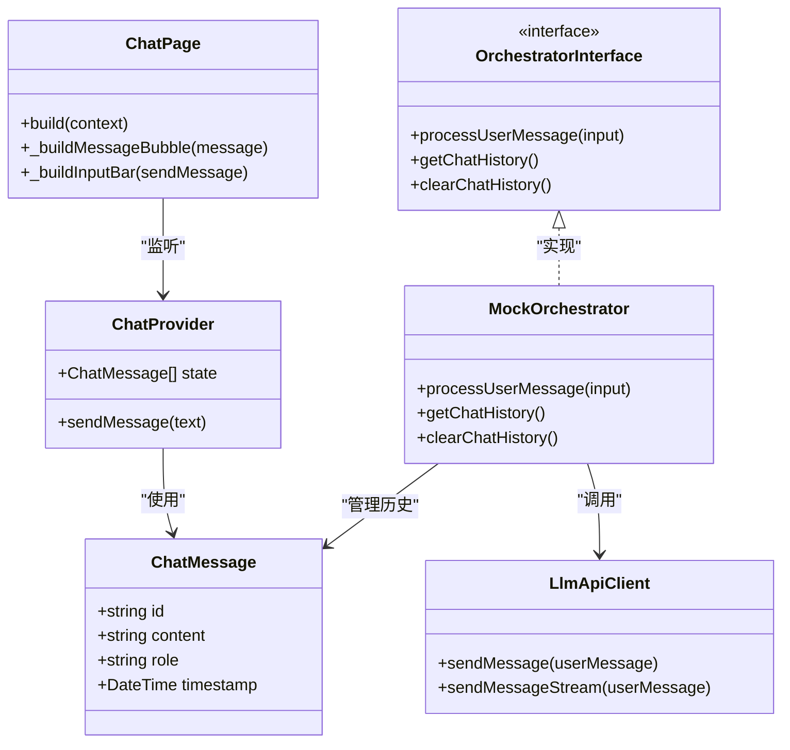

# 聊天消息实体设计

<cite>
**本文引用的文件**
- [chat_message.dart](file://lib/features/chat/domain/entities/chat_message.dart)
- [chat_provider.dart](file://lib/features/chat/presentation/providers/chat_provider.dart)
- [chat_page.dart](file://lib/features/chat/presentation/pages/chat_page.dart)
- [llm_api_client.dart](file://lib\features\chat\data\llm_api_client.dart)
- [orchestrator.dart](file://lib/features/chat/domain/orchestrator/orchestrator.dart)
- [orchestrator_interface.dart](file://lib/features/chat/domain/orchestrator/orchestrator_interface.dart)
- [SDD.md](file://SDD.md)
</cite>

## 目录
1. [简介](#简介)
2. [项目结构](#项目结构)
3. [核心组件](#核心组件)
4. [架构总览](#架构总览)
5. [详细组件分析](#详细组件分析)
6. [依赖关系分析](#依赖关系分析)
7. [性能考量](#性能考量)
8. [故障排查指南](#故障排查指南)
9. [结论](#结论)
10. [附录](#附录)

## 简介
本文件围绕聊天功能的核心数据单元 ChatMessage 实体进行全面文档化，解释其设计理念与使用场景；阐述该实体如何通过 Riverpod 状态管理驱动聊天界面 UI 更新；结合 SDD 中的数据流设计，说明消息从 LLM API 接收、流式拼接、状态更新到 UI 渲染的完整生命周期；并提供实际代码示例路径，展示如何创建、更新与序列化 ChatMessage 对象；最后给出常见问题的解决方案，包括时间戳精度、流式消息合并逻辑错误、UI 刷新性能优化等。

## 项目结构
本项目采用 Clean Architecture 分层组织，聊天模块位于 features/chat 下，包含领域层实体、数据层 API 客户端、以及表现层的 Provider 与页面。ChatMessage 作为领域层实体，被 Provider 与页面消费，同时在 SDD 的数据层设计中，ChatLog（Drift 表）与 ChatMessage 字段语义一致，便于后续持久化迁移。

图表来源
- [chat_provider.dart](file://lib/features/chat/presentation/providers/chat_provider.dart#L1-L63)
- [chat_page.dart](file://lib/features/chat/presentation/pages/chat_page.dart#L1-L120)
- [chat_message.dart](file://lib/features/chat/domain/entities/chat_message.dart#L1-L13)
- [llm_api_client.dart](file://lib/features/chat/data/llm_api_client.dart#L1-L115)
- [orchestrator_interface.dart](file://lib/features/chat/domain/orchestrator/orchestrator_interface.dart#L1-L13)
- [orchestrator.dart](file://lib/features/chat/domain/orchestrator/orchestrator.dart#L1-L49)
- [SDD.md](file://SDD.md#L180-L224)

章节来源
- [chat_provider.dart](file://lib/features/chat/presentation/providers/chat_provider.dart#L1-L63)
- [chat_page.dart](file://lib/features/chat/presentation/pages/chat_page.dart#L1-L120)
- [chat_message.dart](file://lib/features/chat/domain/entities/chat_message.dart#L1-L13)
- [SDD.md](file://SDD.md#L180-L224)

## 核心组件
- ChatMessage 实体：定义聊天消息的最小不可变数据结构，包含标识、内容、发送者角色、时间戳等关键字段。
- Riverpod Provider：维护消息列表状态，负责添加用户消息与 AI 回复，触发 UI 重建。
- 页面组件：监听 Provider，渲染消息气泡，处理输入与发送。
- LLM API 客户端：封装网络请求，支持非流式与流式两种返回方式。
- Orchestrator：抽象编排器接口与实现，负责将用户输入转换为流式响应，便于 UI 逐步渲染。

章节来源
- [chat_message.dart](file://lib/features/chat/domain/entities/chat_message.dart#L1-L13)
- [chat_provider.dart](file://lib/features/chat/presentation/providers/chat_provider.dart#L1-L63)
- [chat_page.dart](file://lib/features/chat/presentation/pages/chat_page.dart#L1-L120)
- [llm_api_client.dart](file://lib/features/chat/data/llm_api_client.dart#L1-L115)
- [orchestrator_interface.dart](file://lib/features/chat/domain/orchestrator/orchestrator_interface.dart#L1-L13)
- [orchestrator.dart](file://lib/features/chat/domain/orchestrator/orchestrator.dart#L1-L49)

## 架构总览
以下序列图展示了从用户输入到 UI 渲染的完整数据流，结合 SDD 的编排器与数据层设计，体现 ChatMessage 在各层之间的流转与作用。

图表来源
- [chat_page.dart](file://lib/features/chat/presentation/pages/chat_page.dart#L1-L120)
- [chat_provider.dart](file://lib/features/chat/presentation/providers/chat_provider.dart#L1-L63)
- [llm_api_client.dart](file://lib/features/chat/data/llm_api_client.dart#L1-L115)
- [orchestrator.dart](file://lib/features/chat/domain/orchestrator/orchestrator.dart#L1-L49)

章节来源
- [SDD.md](file://SDD.md#L138-L176)
- [chat_page.dart](file://lib/features/chat/presentation/pages/chat_page.dart#L1-L120)
- [chat_provider.dart](file://lib/features/chat/presentation/providers/chat_provider.dart#L1-L63)
- [llm_api_client.dart](file://lib/features/chat/data/llm_api_client.dart#L1-L115)
- [orchestrator.dart](file://lib/features/chat/domain/orchestrator/orchestrator.dart#L1-L49)

## 详细组件分析

### ChatMessage 实体设计
- 设计理念
  - 不可变性：ChatMessage 为不可变数据对象，便于状态管理与调试。
  - 最小职责：仅承载消息的基本元数据，避免与 UI 或网络耦合。
  - 可扩展性：字段设计与 SDD 的 ChatLog 表保持一致，便于后续 Drift 持久化映射。

- 字段语义与使用场景
  - id：消息唯一标识，用于 UI 列表 key、去重、持久化主键等。建议使用稳定且全局唯一的策略（例如 UUID 或基于时间戳+随机数）。
  - content：消息正文，支持纯文本与富文本（Markdown/LaTeX 可在 UI 层渲染）。
  - role：发送者角色，'user'、'assistant'、'system'。用于区分消息来源与 UI 样式。
  - timestamp：消息创建时间，用于排序、显示与持久化。注意时间精度与跨平台一致性。

- 创建、更新与序列化示例路径
  - 创建用户消息：参考 Provider 中构造 ChatMessage 并追加到状态的流程。
    - 示例路径：[chat_provider.dart](file://lib/features/chat/presentation/providers/chat_provider.dart#L33-L46)
  - 创建 AI 消息：参考 Provider 中构造 ChatMessage 并追加到状态的流程。
    - 示例路径：[chat_provider.dart](file://lib/features/chat/presentation/providers/chat_provider.dart#L51-L61)
  - 流式拼接：编排器返回响应片段，Provider 将片段拼接到当前 AI 消息或新增一条消息。
    - 示例路径：[orchestrator.dart](file://lib/features/chat/domain/orchestrator/orchestrator.dart#L9-L37)
  - 序列化/反序列化：ChatMessage 当前未显式声明 toJson/fromJson，若需持久化或网络传输，可在上层封装或使用生成式工具（如 freezed/json_serializable）。
    - 参考路径：[SDD.md](file://SDD.md#L191-L198)

- 字段复杂度与性能
  - ChatMessage 为轻量对象，字段数量少、访问开销低，适合频繁状态更新与 UI 列表渲染。
  - 时间戳字段在高频更新场景下应避免重复计算，建议在构造时一次性生成。

章节来源
- [chat_message.dart](file://lib/features/chat/domain/entities/chat_message.dart#L1-L13)
- [chat_provider.dart](file://lib/features/chat/presentation/providers/chat_provider.dart#L1-L63)
- [orchestrator.dart](file://lib/features/chat/domain/orchestrator/orchestrator.dart#L1-L49)
- [SDD.md](file://SDD.md#L191-L198)

### Riverpod 状态管理与 UI 驱动
- 状态提供者
  - chatMessagesProvider：维护消息列表，初始包含 mock 数据，支持添加用户消息与 AI 回复。
  - sendMessageProvider：提供发送函数，负责构建用户消息并触发状态更新。
- UI 渲染
  - ChatPage 监听 chatMessagesProvider，使用 ListView.builder 渲染消息气泡，根据 role 决定头像与颜色。
  - 输入条目处理发送逻辑，清空输入并调用 sendMessageProvider。

图表来源
- [chat_page.dart](file://lib/features/chat/presentation/pages/chat_page.dart#L1-L120)
- [chat_provider.dart](file://lib/features/chat/presentation/providers/chat_provider.dart#L1-L63)

章节来源
- [chat_provider.dart](file://lib/features/chat/presentation/providers/chat_provider.dart#L1-L63)
- [chat_page.dart](file://lib/features/chat/presentation/pages/chat_page.dart#L1-L120)

### LLM API 与流式拼接
- 非流式：sendMessage 返回完整响应字符串。
- 流式：sendMessageStream 返回 Stream<String>，逐片产出响应片段。
- 编排器：MockOrchestrator 模拟流式输出，演示如何将片段逐个产出，便于 UI 逐步渲染。

图表来源
- [llm_api_client.dart](file://lib/features/chat/data/llm_api_client.dart#L1-L115)
- [orchestrator.dart](file://lib/features/chat/domain/orchestrator/orchestrator.dart#L1-L49)

章节来源
- [llm_api_client.dart](file://lib/features/chat/data/llm_api_client.dart#L1-L115)
- [orchestrator.dart](file://lib/features/chat/domain/orchestrator/orchestrator.dart#L1-L49)

### Drift 持久化与消息历史恢复
- SDD 中定义了 ChatLog 表，包含 id、character_id、role、content、createdAt 等字段，与 ChatMessage 的字段语义一致。
- 建议在数据层实现 ChatMessage 与 ChatLog 的映射，以便：
  - 加载历史：从数据库读取 ChatLog，转换为 ChatMessage 列表，初始化 Provider。
  - 保存消息：将 ChatMessage 写入 ChatLog，保留时间戳与角色信息。
- 注意事项
  - 时间戳精度：确保数据库与 Dart DateTime 的精度一致，避免跨平台差异导致的时间偏移。
  - 主键策略：ChatMessage 的 id 与 ChatLog 的 id 可采用不同策略（UUID vs 自增），需在映射时明确转换规则。

图表来源
- [SDD.md](file://SDD.md#L216-L222)

章节来源
- [SDD.md](file://SDD.md#L191-L198)
- [SDD.md](file://SDD.md#L216-L222)

## 依赖关系分析
- ChatMessage 依赖关系
  - 被 Provider 与页面直接使用，作为状态与 UI 的数据源。
  - 被编排器在内部历史中使用，便于上下文组装与 Token 裁剪。
- Provider 依赖关系
  - 依赖 ChatMessage 实体与 UUID 库，负责状态更新与副作用（模拟发送）。
- 页面依赖关系
  - 依赖 Provider 与 ChatMessage，负责 UI 渲染与交互。
- 编排器与 API 客户端
  - 编排器依赖 ChatMessage 与 LLM API 客户端，负责消息流式产出与历史管理。

图表来源
- [chat_message.dart](file://lib/features/chat/domain/entities/chat_message.dart#L1-L13)
- [chat_provider.dart](file://lib/features/chat/presentation/providers/chat_provider.dart#L1-L63)
- [chat_page.dart](file://lib/features/chat/presentation/pages/chat_page.dart#L1-L120)
- [llm_api_client.dart](file://lib/features/chat/data/llm_api_client.dart#L1-L115)
- [orchestrator_interface.dart](file://lib/features/chat/domain/orchestrator/orchestrator_interface.dart#L1-L13)
- [orchestrator.dart](file://lib/features/chat/domain/orchestrator/orchestrator.dart#L1-L49)

章节来源
- [chat_message.dart](file://lib/features/chat/domain/entities/chat_message.dart#L1-L13)
- [chat_provider.dart](file://lib/features/chat/presentation/providers/chat_provider.dart#L1-L63)
- [chat_page.dart](file://lib/features/chat/presentation/pages/chat_page.dart#L1-L120)
- [llm_api_client.dart](file://lib/features/chat/data/llm_api_client.dart#L1-L115)
- [orchestrator_interface.dart](file://lib/features/chat/domain/orchestrator/orchestrator_interface.dart#L1-L13)
- [orchestrator.dart](file://lib/features/chat/domain/orchestrator/orchestrator.dart#L1-L49)

## 性能考量
- UI 刷新优化
  - 使用稳定的 key（如 ChatMessage.id）作为 ListView.builder 的 key，减少不必要的重建。
  - 控制消息列表长度，避免无限增长导致内存与渲染压力。
- 流式渲染
  - 将长文本按单词或句子切分，降低单次渲染负载。
  - 在 Provider 中采用不可变更新策略，避免深层拷贝成本过高。
- 时间戳与排序
  - 使用统一的时间源与精度，避免跨平台差异造成排序异常。
- 网络与编排
  - 流式响应时，尽量在编排层聚合片段，减少 Provider 层的频繁更新次数。

[本节为通用指导，不直接分析具体文件]

## 故障排查指南
- 时间戳精度问题
  - 现象：消息顺序错乱或 UI 排序异常。
  - 排查：确认 Dart DateTime 与数据库时间戳精度一致；避免使用毫秒级 id 与秒级时间戳混用。
  - 参考：SDD 中 ChatLog 的 created_at 字段类型与默认值。
  - 章节来源
    - [SDD.md](file://SDD.md#L216-L222)

- 流式消息合并逻辑错误
  - 现象：UI 出现重复字符、片段丢失或拼接顺序错误。
  - 排查：检查编排器的片段产出顺序与 Provider 的拼接策略；确保同一轮对话只合并到一条 AI 消息。
  - 章节来源
    - [orchestrator.dart](file://lib/features/chat/domain/orchestrator/orchestrator.dart#L9-L37)
    - [chat_provider.dart](file://lib/features/chat/presentation/providers/chat_provider.dart#L33-L61)

- UI 刷新性能优化
  - 现象：长对话滚动卡顿或内存占用高。
  - 排查：启用稳定的 key、限制列表长度、按需渲染；避免在 UI 中执行耗时操作。
  - 章节来源
    - [chat_page.dart](file://lib/features/chat/presentation/pages/chat_page.dart#L1-L120)

- API 异常处理
  - 现象：网络异常导致崩溃或无提示。
  - 排查：捕获 LlmApiException 并在 UI 层展示错误信息；提供重试机制。
  - 章节来源
    - [llm_api_client.dart](file://lib/features/chat/data/llm_api_client.dart#L1-L115)

## 结论
ChatMessage 作为聊天功能的核心数据单元，具备简洁、不可变与可扩展的特点。通过 Riverpod 状态管理，它能够高效驱动 UI 更新；结合编排器与 LLM API 的流式能力，实现了从输入到渲染的完整数据流。配合 SDD 的数据层设计，未来可平滑迁移到 Drift 持久化，实现消息历史的可靠恢复与跨设备同步。建议在生产环境中进一步完善序列化、时间戳一致性与流式合并策略，以提升稳定性与用户体验。

[本节为总结性内容，不直接分析具体文件]

## 附录
- 实际代码示例路径（不展示具体代码）
  - 创建用户消息并添加到状态：[chat_provider.dart](file://lib/features/chat/presentation/providers/chat_provider.dart#L33-L46)
  - 创建 AI 消息并添加到状态：[chat_provider.dart](file://lib/features/chat/presentation/providers/chat_provider.dart#L51-L61)
  - 流式片段产出与 UI 渲染：[orchestrator.dart](file://lib/features/chat/domain/orchestrator/orchestrator.dart#L9-L37)
  - 非流式与流式 API 调用：[llm_api_client.dart](file://lib/features/chat/data/llm_api_client.dart#L1-L115)
  - 页面监听 Provider 并渲染消息：[chat_page.dart](file://lib/features/chat/presentation/pages/chat_page.dart#L1-L120)
  - ChatMessage 字段定义：[chat_message.dart](file://lib/features/chat/domain/entities/chat_message.dart#L1-L13)
  - Drift ChatLog 表结构参考：[SDD.md](file://SDD.md#L216-L222)