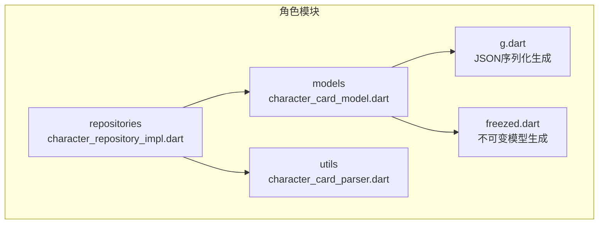
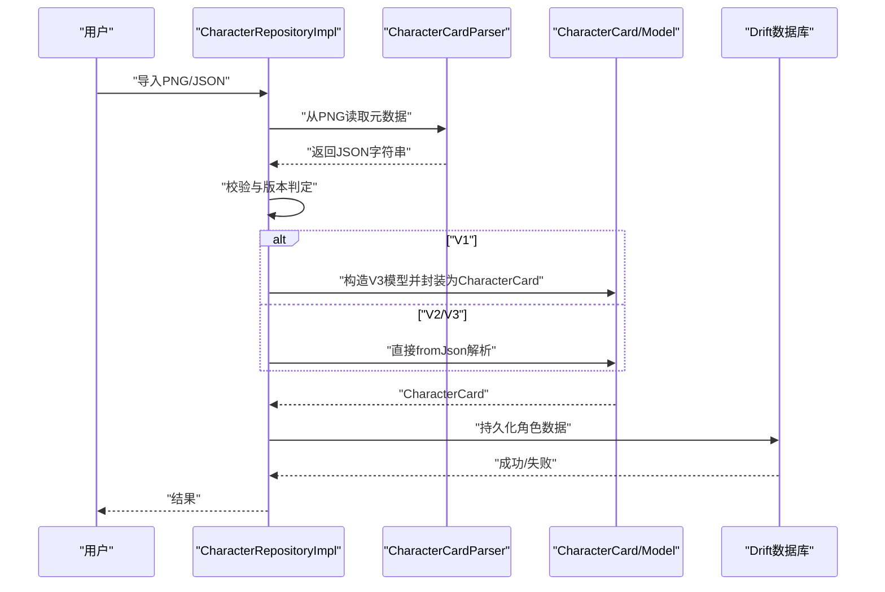
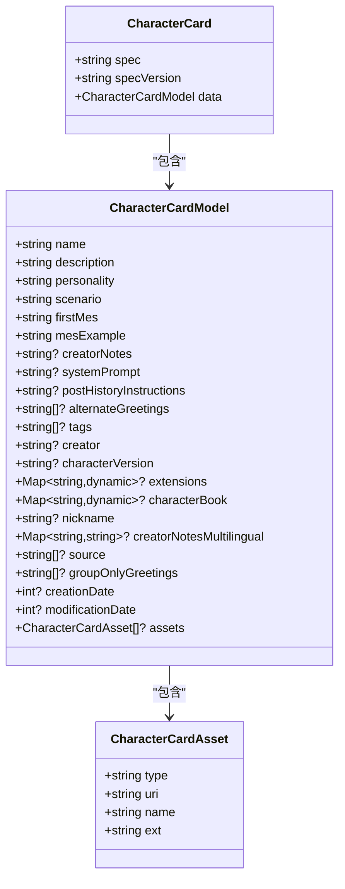
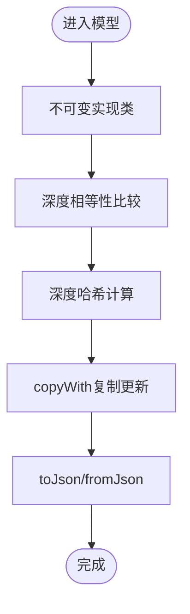
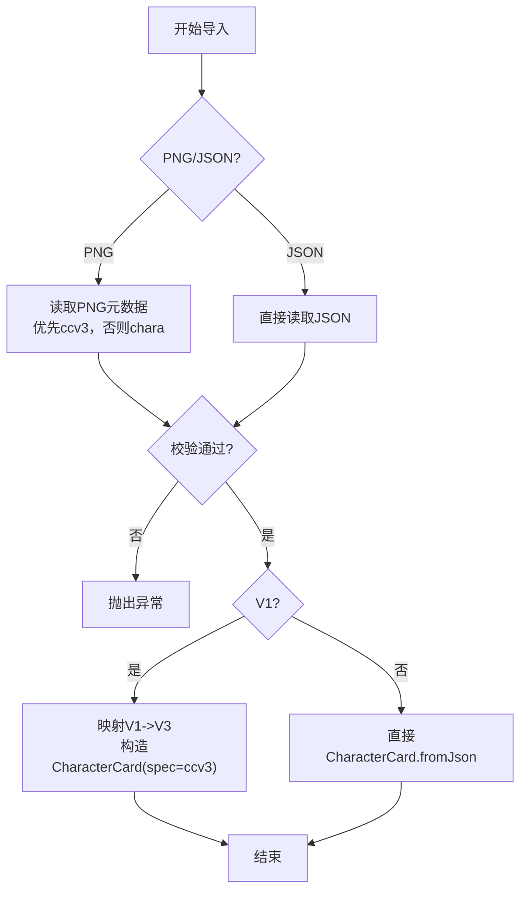
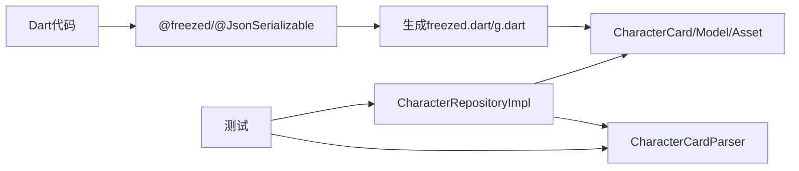

# 角色卡模型详解

<cite>
**本文引用的文件**
- [character_card_model.dart](file://lib/features/character/data/models/character_card_model.dart)
- [character_card_model.freezed.dart](file://lib/features/character/data/models/character_card_model.freezed.dart)
- [character_card_model.g.dart](file://lib/features/character/data/models/character_card_model.g.dart)
- [character_repository_impl.dart](file://lib/features/character/data/repositories/character_repository_impl.dart)
- [SDD.md](file://SDD.md)
</cite>

## 更新摘要
**已做更改**
- 更新了 `mesExample` 字段的文档，说明其从 `required` 改为 `@Default('')` 以增强容错性。
- 解释了 `systemPrompt` 字段保留可空类型的设计原因。

## 目录
1. [引言](#引言)
2. [项目结构](#项目结构)
3. [核心组件](#核心组件)
4. [架构总览](#架构总览)
5. [详细组件分析](#详细组件分析)
6. [依赖分析](#依赖分析)
7. [性能考量](#性能考量)
8. [故障排查指南](#故障排查指南)
9. [结论](#结论)
10. [附录](#附录)

## 引言
本文件围绕角色卡不可变数据模型展开，系统解析由 Freezed 生成的模型：CharacterCard、CharacterCardModel、CharacterCardAsset 的字段结构、嵌套关系与生命周期作用；阐明 Freezed 如何通过生成代码实现模式匹配、复制与相等性判断；说明 character_card_model.g.dart 如何支持 JSON 序列化与反序列化；结合 SDD.md 的设计说明，解释该模型如何兼容 V1/V2/V3 版本并映射到本地 Drift 数据库存储；最后给出扩展建议与调试技巧。

## 项目结构
角色卡模型位于特征模块的 data 层 models 目录，配合仓库实现与 PNG 元数据解析工具共同完成从外部资源到应用内模型的转换与持久化。

**图表来源**
- [character_card_model.dart](file://lib/features/character/data/models/character_card_model.dart#L1-L63)
- [character_card_model.g.dart](file://lib/features/character/data/models/character_card_model.g.dart#L1-L103)
- [character_card_model.freezed.dart](file://lib/features/character/data/models/character_card_model.freezed.dart#L1-L1218)
- [character_repository_impl.dart](file://lib/features/character/data/repositories/character_repository_impl.dart#L1-L78)
- [character_card_parser.dart](file://lib/features/character/data/utils/character_card_parser.dart#L1-L206)

**章节来源**
- [character_card_model.dart](file://lib/features/character/data/models/character_card_model.dart#L1-L63)
- [character_repository_impl.dart](file://lib/features/character/data/repositories/character_repository_impl.dart#L1-L78)
- [character_card_parser.dart](file://lib/features/character/data/utils/character_card_parser.dart#L1-L206)

## 核心组件
- CharacterCard：顶层容器，包含规范标识与版本号，以及一个 CharacterCardModel 字段。
- CharacterCardModel：角色卡主体数据，涵盖 V2 与 V3 新增字段，包含扩展字段与资产列表。
- CharacterCardAsset：角色卡资产条目，描述类型、URI、名称与扩展名。

这些类均由 @freezed 生成，具备不可变性、深度相等性与深度哈希、可选字段、默认值、序列化/反序列化支持，以及 copyWith 复制能力。

**章节来源**
- [character_card_model.dart](file://lib/features/character/data/models/character_card_model.dart#L6-L63)
- [character_card_model.freezed.dart](file://lib/features/character/data/models/character_card_model.freezed.dart#L1-L1218)
- [character_card_model.g.dart](file://lib/features/character/data/models/character_card_model.g.dart#L1-L103)

## 架构总览
角色卡从 PNG 或 JSON 导入，经校验与必要转换后，被解析为 CharacterCard 对象，随后可持久化至 Drift 数据库。

**图表来源**
- [character_repository_impl.dart](file://lib/features/character/data/repositories/character_repository_impl.dart#L1-L78)
- [character_card_parser.dart](file://lib/features/character/data/utils/character_card_parser.dart#L1-L206)
- [character_card_model.dart](file://lib/features/character/data/models/character_card_model.dart#L6-L63)

## 详细组件分析

### 类关系与字段结构
- CharacterCard
  - 字段：spec（规范标识）、specVersion（规范版本）、data（角色卡主体模型）
  - 作用：作为顶层包装，承载版本信息，便于跨版本解析与迁移
- CharacterCardModel
  - V2 字段：name、description、personality、scenario、firstMes、mesExample、creatorNotes、systemPrompt、postHistoryInstructions、alternateGreetings、tags、creator、characterVersion、extensions、characterBook
  - V3 新增字段：nickname、creatorNotesMultilingual、source、groupOnlyGreetings、creationDate、modificationDate、assets
  - 作用：承载角色卡全部业务数据，支持多语言注释、时间戳、资产列表等
- CharacterCardAsset
  - 字段：type、uri、name、ext
  - 作用：描述角色卡的附件资源（如头像、背景等）

**图表来源**
- [character_card_model.dart](file://lib/features/character/data/models/character_card_model.dart#L6-L63)

**章节来源**
- [character_card_model.dart](file://lib/features/character/data/models/character_card_model.dart#L6-L63)

### 字段业务含义与类型
- V2 核心字段
  - name/description/personality/scenario：角色基础信息
  - firstMes/mesExample：首次消息与消息示例
  - creatorNotes/systemPrompt/postHistoryInstructions：创作者注释、系统提示、历史指令
  - alternateGreetings/tags/creator/characterVersion：备用问候语、标签、作者、版本
  - extensions/characterBook：扩展字段与角色书（字典）
- V3 新增字段
  - nickname：昵称
  - creatorNotesMultilingual：多语言注释（字典）
  - source：来源
  - groupOnlyGreetings：群聊专用问候
  - creationDate/modificationDate：创建与修改时间戳
  - assets：资产列表（CharacterCardAsset）
- 资产字段
  - type/uri/name/ext：资产类型、URI、名称、扩展名

**章节来源**
- [character_card_model.dart](file://lib/features/character/data/models/character_card_model.dart#L6-L63)

### Freezed 生成的特性与行为
- 不可变性与深度相等性
  - 生成的实现类为不可变，相等性比较使用 DeepCollectionEquality 对集合进行深度比较，保证复杂对象的正确判等
- 深度哈希
  - hashCode 使用 DeepCollectionEquality 对集合进行哈希，确保相等对象具有相同哈希
- 复制与链式更新
  - 提供 copyWith，支持选择性替换字段，内部通过 CopyWithImpl 实现，对集合字段采用不可变视图包装，避免外部修改
- 序列化/反序列化
  - 通过 @JsonSerializable 与生成的 g.dart 文件，实现 toJson/fromJson；对集合字段进行安全映射，对时间戳进行整型转换

**图表来源**
- [character_card_model.freezed.dart](file://lib/features/character/data/models/character_card_model.freezed.dart#L407-L780)
- [character_card_model.g.dart](file://lib/features/character/data/models/character_card_model.g.dart#L1-L103)

**章节来源**
- [character_card_model.freezed.dart](file://lib/features/character/data/models/character_card_model.freezed.dart#L407-L780)
- [character_card_model.g.dart](file://lib/features/character/data/models/character_card_model.g.dart#L1-L103)

### JSON 序列化与反序列化
- 顶层容器 CharacterCard
  - fromJson：解析 spec/spec_version/data，并将 data 交由 CharacterCardModel.fromJson
  - toJson：输出包含 spec、spec_version、data 的映射
- 角色卡主体 CharacterCardModel
  - fromJson：逐字段映射，集合字段进行类型转换，时间戳转为 int，嵌套资产列表递归解析
  - toJson：原样输出字段，集合与字典保持原结构
- 资产 CharacterCardAsset
  - fromJson/toJson：简单四字段映射

**章节来源**
- [character_card_model.g.dart](file://lib/features/character/data/models/character_card_model.g.dart#L1-L103)

### 版本兼容性与转换（V1/V2/V3）
- 导入流程
  - 从 PNG 读取元数据，优先查找 ccv3（V3），否则回退到 chara（V2）
  - 从 JSON 导入时，先进行校验，再根据校验结果决定是否转换
- V1 到 V3 的转换
  - 将 V1 字段映射到 V3 的 CharacterCardModel，未覆盖的 V3 字段置空
  - 包装为 CharacterCard，spec 设为 chara_card_v3，spec_version 设为 3.0
- V2/V3 直接解析
  - 由于模型为 V3 超集，V2 数据可直接解析为 V3 模型

**图表来源**
- [character_repository_impl.dart](file://lib/features/character/data/repositories/character_repository_impl.dart#L1-L78)
- [character_card_parser.dart](file://lib/features/character/data/utils/character_card_parser.dart#L1-L206)

**章节来源**
- [character_repository_impl.dart](file://lib/features/character/data/repositories/character_repository_impl.dart#L1-L78)
- [character_card_parser.dart](file://lib/features/character/data/utils/character_card_parser.dart#L1-L206)

### 与 Drift 数据库的映射
- SDD 中定义了角色、聊天记录、RPG 变量等表结构，角色表包含 id、name、description 等字段
- 角色卡模型中的关键字段可直接映射到角色表：
  - id：UUID
  - name：角色名
  - description：角色描述（Persona）
  - metadata：可存放 CharacterCardModel 的 JSON 字符串，便于后续解析与查询
- 聊天记录与 RPG 变量表分别对应历史与状态变量，与角色卡模型形成一对多关系

**章节来源**
- [SDD.md](file://SDD.md#L180-L234)

## 依赖分析
- 模型依赖
  - character_card_model.dart 依赖 freezed_annotation，生成 freezed 与 json_serializable 代码
  - freezed 生成不可变实现与相等性/哈希/复制逻辑
  - json_serializable 生成 JSON 序列化/反序列化代码
- 仓库依赖
  - CharacterRepositoryImpl 依赖 CharacterCardParser 与 CharacterCardModel
  - 导入流程中，先解析 PNG 元数据，再进行校验与转换
- 测试依赖
  - 测试验证 PNG 写入/读取、V3 规范字段注入、异常场景

**图表来源**
- [character_card_model.dart](file://lib/features/character/data/models/character_card_model.dart#L1-L63)
- [character_card_model.freezed.dart](file://lib/features/character/data/models/character_card_model.freezed.dart#L1-L1218)
- [character_card_model.g.dart](file://lib/features/character/data/models/character_card_model.g.dart#L1-L103)
- [character_repository_impl.dart](file://lib/features/character/data/repositories/character_repository_impl.dart#L1-L78)
- [character_card_parser.dart](file://lib/features/character/data/utils/character_card_parser.dart#L1-L206)
- [character_card_parser_test.dart](file://test/features/character/data/utils/character_card_parser_test.dart#L1-L56)

**章节来源**
- [character_card_model.dart](file://lib/features/character/data/models/character_card_model.dart#L1-L63)
- [character_repository_impl.dart](file://lib/features/character/data/repositories/character_repository_impl.dart#L1-L78)
- [character_card_parser.dart](file://lib/features/character/data/utils/character_card_parser.dart#L1-L206)
- [character_card_parser_test.dart](file://test/features/character/data/utils/character_card_parser_test.dart#L1-L56)

## 性能考量
- 不可变性与深度比较
  - 深度相等性与哈希对集合字段使用 DeepCollectionEquality，适合小到中等规模数据；大规模集合可能带来额外开销
- 集合不可变视图
  - 对 List/Map 字段返回 EqualUnmodifiableListView/EqualUnmodifiableMapView，避免外部修改，提升安全性
- 序列化成本
  - 大型 assets 列表与多语言注释字典会增加序列化/反序列化时间；建议在 UI 层延迟加载或懒加载
- 复制操作
  - copyWith 通过内部实现进行字段替换，对大型对象进行部分更新时更高效

[本节为一般性指导，不直接分析具体文件]

## 故障排查指南
- 查看生成代码
  - freezed 生成的实现类与复制器位于 character_card_model.freezed.dart，可定位到具体字段与方法
  - JSON 序列化/反序列化位于 character_card_model.g.dart，检查字段映射与集合转换
- 常见序列化错误
  - 字段类型不匹配：确认 JSON 中集合与字典类型与模型一致；时间戳需为整数
  - 缺失字段：V1/V2 数据缺少 V3 字段时，应允许为空；若业务要求必填，请在上层校验
- PNG 元数据读取
  - 若 PNG 无 tEXt 块或关键字不匹配，读取会抛出异常；请确认 PNG 是否包含 ccv3/chara 元数据
- 版本转换问题
  - V1 到 V3 转换时，确保映射字段齐全；未覆盖字段将置空，避免影响业务逻辑

**章节来源**
- [character_card_model.freezed.dart](file://lib/features/character/data/models/character_card_model.freezed.dart#L1-L1218)
- [character_card_model.g.dart](file://lib/features/character/data/models/character_card_model.g.dart#L1-L103)
- [character_card_parser_test.dart](file://test/features/character/data/utils/character_card_parser_test.dart#L1-L56)

## 结论
该角色卡模型通过 Freezed 与 json_serializable 实现了强类型、不可变、可序列化的数据结构，支持 V1/V2/V3 版本兼容与 PNG 元数据导入，能够平滑映射到 Drift 数据库的角色表。其深度相等性、哈希与 copyWith 为业务逻辑提供了可靠的基础；在实际使用中，注意集合字段的类型与空值处理，确保序列化/反序列化稳定运行。

[本节为总结性内容，不直接分析具体文件]

## 附录

### 扩展示例与向后兼容性影响
- 新增自定义字段
  - 在 CharacterCardModel 中添加新的可选字段，保持现有字段不变，不会破坏 V2/V3 解析
  - 若需要 JSON 映射别名，使用 @JsonKey(name: "...") 指定
- 修改序列化逻辑
  - 若需调整集合字段的映射方式，可在 g.dart 中修改映射逻辑；但需确保与上游解析器一致
  - 对于时间戳字段，保持整型转换一致性，避免解析差异
- 向后兼容性建议
  - 保持字段命名与语义稳定，新增字段尽量可空
  - 对于破坏性变更，考虑引入新版本规范（spec_version）并保留旧解析路径

[本节为一般性指导，不直接分析具体文件]

### 字段变更说明
#### mesExample 字段的容错性增强
`mesExample` 字段已从 `required String` 修改为使用 `@Default('')` 注解的可选字段。此变更旨在增强模型的容错性，防止因外部数据源中该字段缺失而导致 JSON 反序列化失败。通过提供默认空字符串，确保即使数据不完整，角色卡模型仍能成功解析，提升了系统的健壮性。

**章节来源**
- [character_card_model.dart](file://lib/features/character/data/models/character_card_model.dart#L20)

#### systemPrompt 字段的可空设计原因
`systemPrompt` 字段被设计为可空类型（`String?`），其主要目的是为了明确区分“无特殊系统指令”和“存在但为空的系统指令”两种语义状态。若该字段为非空必填，则无法表达“不使用系统提示”的意图；而可空设计允许使用 `null` 表示“无指令”，使用 `''` 表示“空指令”，为上层业务逻辑提供了更精确的控制能力。

**章节来源**
- [character_card_model.dart](file://lib/features/character/data/models/character_card_model.dart#L28)