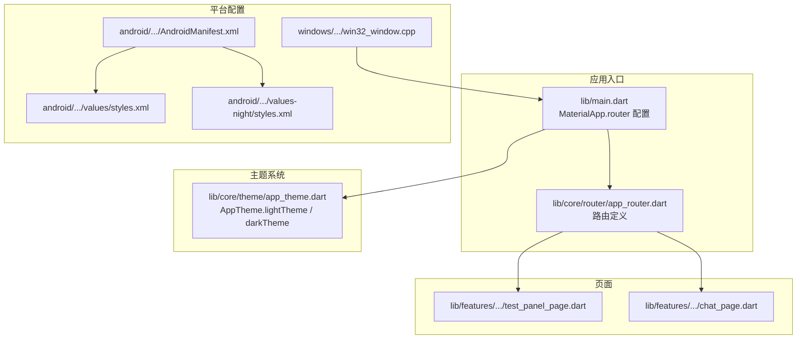
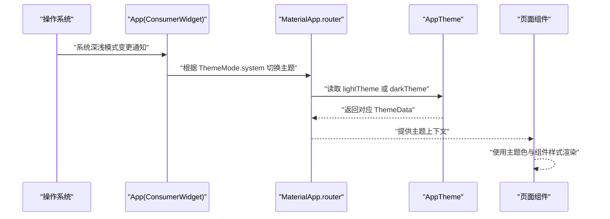
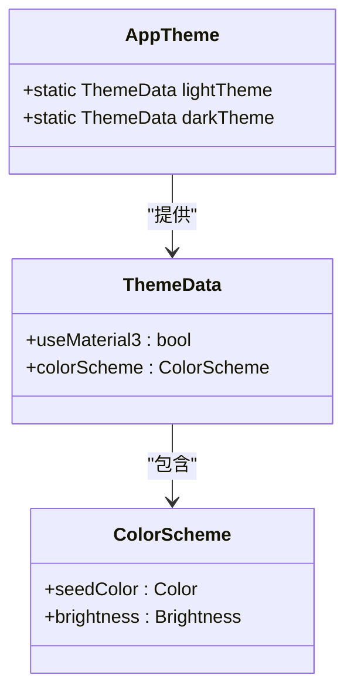
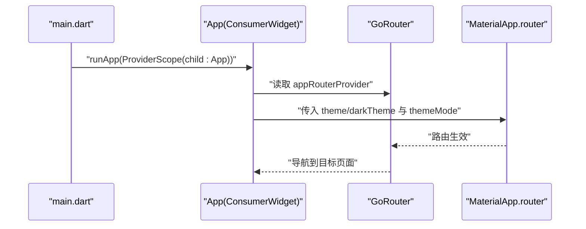
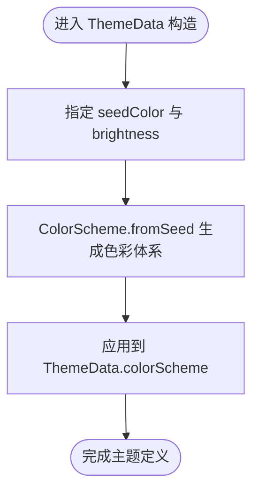
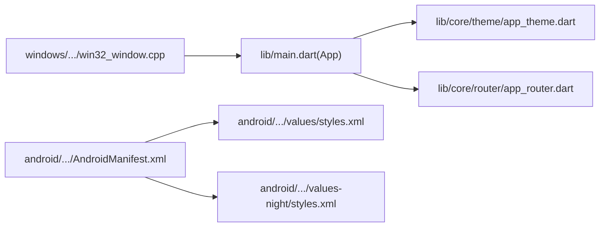

# 主题系统

<cite>
**本文引用的文件**
- [lib/core/theme/app_theme.dart](file://lib/core/theme/app_theme.dart)
- [lib/main.dart](file://lib/main.dart)
- [lib/core/router/app_router.dart](file://lib/core/router/app_router.dart)
- [lib/features/character/presentation/pages/test_panel_page.dart](file://lib/features/character/presentation/pages/test_panel_page.dart)
- [lib/features/chat/presentation/pages/chat_page.dart](file://lib/features/chat/presentation/pages/chat_page.dart)
- [android/app/src/main/AndroidManifest.xml](file://android/app/src/main/AndroidManifest.xml)
- [android/app/src/main/res/values/styles.xml](file://android/app/src/main/res/values/styles.xml)
- [android/app/src/main/res/values-night/styles.xml](file://android/app/src/main/res/values-night/styles.xml)
- [windows/runner/win32_window.cpp](file://windows/runner/win32_window.cpp)
</cite>

## 目录
1. [简介](#简介)
2. [项目结构](#项目结构)
3. [核心组件](#核心组件)
4. [架构总览](#架构总览)
5. [详细组件分析](#详细组件分析)
6. [依赖关系分析](#依赖关系分析)
7. [性能考量](#性能考量)
8. [故障排查指南](#故障排查指南)
9. [结论](#结论)
10. [附录：自定义主题扩展指南](#附录自定义主题扩展指南)

## 简介
本文件围绕应用的主题系统进行深入解析，重点说明 AppTheme 类的设计与实现，解释 lightTheme 与 darkTheme 两个静态实例如何基于 Material 3 规范构建；阐述 ColorScheme.fromSeed(seedColor: Colors.blue) 的色彩生成机制及其在亮/暗模式下的自适应表现；说明 themeMode: ThemeMode.system 如何实现跟随系统偏好自动切换主题；并结合 main.dart 中 theme/darkTheme 配置，说明主题在应用全局的注入流程。最后提供自定义主题扩展（如修改主色、字体、组件样式）的指导方案，确保 UI 一致性与可定制性。

## 项目结构
主题系统位于 lib/core/theme/app_theme.dart，应用入口在 lib/main.dart，路由在 lib/core/router/app_router.dart。Android 和 Windows 平台分别通过原生层配置与系统深色模式联动。

图表来源
- [lib/main.dart](file://lib/main.dart#L1-L33)
- [lib/core/theme/app_theme.dart](file://lib/core/theme/app_theme.dart#L1-L19)
- [lib/core/router/app_router.dart](file://lib/core/router/app_router.dart#L1-L18)
- [android/app/src/main/AndroidManifest.xml](file://android/app/src/main/AndroidManifest.xml#L1-L46)
- [android/app/src/main/res/values/styles.xml](file://android/app/src/main/res/values/styles.xml#L1-L18)
- [android/app/src/main/res/values-night/styles.xml](file://android/app/src/main/res/values-night/styles.xml#L1-L18)
- [windows/runner/win32_window.cpp](file://windows/runner/win32_window.cpp#L275-L288)

章节来源
- [lib/main.dart](file://lib/main.dart#L1-L33)
- [lib/core/theme/app_theme.dart](file://lib/core/theme/app_theme.dart#L1-L19)
- [lib/core/router/app_router.dart](file://lib/core/router/app_router.dart#L1-L18)
- [android/app/src/main/AndroidManifest.xml](file://android/app/src/main/AndroidManifest.xml#L1-L46)
- [android/app/src/main/res/values/styles.xml](file://android/app/src/main/res/values/styles.xml#L1-L18)
- [android/app/src/main/res/values-night/styles.xml](file://android/app/src/main/res/values-night/styles.xml#L1-L18)
- [windows/runner/win32_window.cpp](file://windows/runner/win32_window.cpp#L275-L288)

## 核心组件
- AppTheme：集中定义亮/暗两种主题，均启用 Material 3，并通过 ColorScheme.fromSeed(seedColor: Colors.blue) 基于种子色生成色彩体系。
- App：在应用入口中通过 MaterialApp.router 挂载主题，设置 theme 与 darkTheme，并开启 ThemeMode.system 实现系统跟随。

章节来源
- [lib/core/theme/app_theme.dart](file://lib/core/theme/app_theme.dart#L1-L19)
- [lib/main.dart](file://lib/main.dart#L1-L33)

## 架构总览
主题系统采用“集中定义 + 入口注入”的架构：
- 在 AppTheme 中统一产出 lightTheme 与 darkTheme；
- 在 App 组件中将这两个主题注入到 MaterialApp.router；
- 通过 ThemeMode.system 使应用随系统深浅模式自动切换；
- 页面组件直接使用系统提供的主题色与组件样式，无需重复定义。

图表来源
- [lib/main.dart](file://lib/main.dart#L1-L33)
- [lib/core/theme/app_theme.dart](file://lib/core/theme/app_theme.dart#L1-L19)

## 详细组件分析

### AppTheme 设计与实现
- 使用 Material 3：两套主题均启用 useMaterial3: true，遵循 Material 3 色彩与排版规范。
- 色彩生成：通过 ColorScheme.fromSeed(seedColor: Colors.blue, brightness: ...) 基于种子色生成主色、辅助色、背景色等，保证亮/暗模式下色彩一致且符合对比度要求。
- 亮度区分：lightTheme 设置 brightness: Brightness.light，darkTheme 设置 brightness: Brightness.dark，确保系统深色模式下自动切换至深色版本。

图表来源
- [lib/core/theme/app_theme.dart](file://lib/core/theme/app_theme.dart#L1-L19)

章节来源
- [lib/core/theme/app_theme.dart](file://lib/core/theme/app_theme.dart#L1-L19)

### 主题注入与系统跟随
- 注入位置：App 组件在 build 中创建 MaterialApp.router，并将 AppTheme.lightTheme 作为 theme，AppTheme.darkTheme 作为 darkTheme。
- 系统跟随：themeMode: ThemeMode.system 使应用根据系统深浅模式自动选择 lightTheme 或 darkTheme。
- 路由集成：通过 appRouterProvider 提供路由配置，页面在路由中按需加载。

图表来源
- [lib/main.dart](file://lib/main.dart#L1-L33)
- [lib/core/router/app_router.dart](file://lib/core/router/app_router.dart#L1-L18)

章节来源
- [lib/main.dart](file://lib/main.dart#L1-L33)
- [lib/core/router/app_router.dart](file://lib/core/router/app_router.dart#L1-L18)

### ColorScheme.fromSeed 的色彩生成机制
- 种子色驱动：seedColor: Colors.blue 作为主色来源，系统据此生成主色、变体色、表面色、错误色等。
- 亮度适配：在亮/暗模式下，ColorScheme 会根据 brightness 自动调整明暗层级，确保可读性与对比度。
- 一致性：同一种子色在不同模式下生成的色彩体系保持视觉连贯，避免风格割裂。

图表来源
- [lib/core/theme/app_theme.dart](file://lib/core/theme/app_theme.dart#L1-L19)

章节来源
- [lib/core/theme/app_theme.dart](file://lib/core/theme/app_theme.dart#L1-L19)

### 页面对主题的使用现状
- 测试面板页与聊天页未显式覆盖主题色，而是直接使用系统提供的主题色与组件样式，体现主题注入的有效性。
- 若需进一步统一风格，可在页面内通过 Theme.of(context) 获取当前主题色，或局部覆盖特定组件样式。

章节来源
- [lib/features/character/presentation/pages/test_panel_page.dart](file://lib/features/character/presentation/pages/test_panel_page.dart#L1-L114)
- [lib/features/chat/presentation/pages/chat_page.dart](file://lib/features/chat/presentation/pages/chat_page.dart#L1-L120)

## 依赖关系分析
- App 依赖 AppTheme 提供的两套主题；
- App 通过 ProviderScope 与 appRouterProvider 提供路由；
- Android 与 Windows 通过原生层配置与系统深浅模式联动，间接影响 App 的主题选择。

图表来源
- [lib/main.dart](file://lib/main.dart#L1-L33)
- [lib/core/theme/app_theme.dart](file://lib/core/theme/app_theme.dart#L1-L19)
- [lib/core/router/app_router.dart](file://lib/core/router/app_router.dart#L1-L18)
- [android/app/src/main/AndroidManifest.xml](file://android/app/src/main/AndroidManifest.xml#L1-L46)
- [android/app/src/main/res/values/styles.xml](file://android/app/src/main/res/values/styles.xml#L1-L18)
- [android/app/src/main/res/values-night/styles.xml](file://android/app/src/main/res/values-night/styles.xml#L1-L18)
- [windows/runner/win32_window.cpp](file://windows/runner/win32_window.cpp#L275-L288)

章节来源
- [lib/main.dart](file://lib/main.dart#L1-L33)
- [lib/core/theme/app_theme.dart](file://lib/core/theme/app_theme.dart#L1-L19)
- [lib/core/router/app_router.dart](file://lib/core/router/app_router.dart#L1-L18)
- [android/app/src/main/AndroidManifest.xml](file://android/app/src/main/AndroidManifest.xml#L1-L46)
- [android/app/src/main/res/values/styles.xml](file://android/app/src/main/res/values/styles.xml#L1-L18)
- [android/app/src/main/res/values-night/styles.xml](file://android/app/src/main/res/values-night/styles.xml#L1-L18)
- [windows/runner/win32_window.cpp](file://windows/runner/win32_window.cpp#L275-L288)

## 性能考量
- 主题对象为静态实例，避免每次重建 ThemeData 带来的开销。
- ColorScheme.fromSeed 仅在 AppTheme 初始化时计算一次，后续复用，减少运行时成本。
- ThemeMode.system 依赖系统回调，切换时由框架处理，应用侧无需额外逻辑。

## 故障排查指南
- 主题未随系统切换：检查 main.dart 中是否正确设置 themeMode: ThemeMode.system，并确认 Android/Windows 平台已配置深色模式支持。
- 深色模式下颜色异常：确认 AppTheme.darkTheme 的 brightness 已设为 Brightness.dark，且 seedColor 一致。
- 页面颜色不一致：若个别页面需要覆盖主题色，建议通过 Theme.of(context) 获取当前主题色，或在页面内局部覆盖组件样式。

章节来源
- [lib/main.dart](file://lib/main.dart#L1-L33)
- [lib/core/theme/app_theme.dart](file://lib/core/theme/app_theme.dart#L1-L19)
- [android/app/src/main/AndroidManifest.xml](file://android/app/src/main/AndroidManifest.xml#L1-L46)
- [windows/runner/win32_window.cpp](file://windows/runner/win32_window.cpp#L275-L288)

## 结论
本项目采用简洁高效的“集中主题 + 系统跟随”策略：AppTheme 以 Material 3 为基础，通过 ColorScheme.fromSeed 生成一致的色彩体系；App 将两套主题注入 MaterialApp.router，并启用 ThemeMode.system 实现系统深浅模式自动切换。该设计保证了 UI 的一致性与可维护性，同时为后续扩展提供了清晰的切入点。

## 附录：自定义主题扩展指南
以下为在现有基础上进行主题扩展的实践建议，确保 UI 一致性与可定制性：

- 修改主色（seedColor）
  - 当前使用 Colors.blue 作为种子色。若需更换主色，可在 AppTheme.lightTheme 与 AppTheme.darkTheme 中统一修改 seedColor，确保亮/暗模式主色一致。
  - 参考路径：[lib/core/theme/app_theme.dart](file://lib/core/theme/app_theme.dart#L1-L19)

- 修改字体与排版
  - 在 ThemeData 中设置 fontFamily/fontFamilyFallback 以统一字体族；通过 textTheme 或 primaryTextTheme 定义标题、正文等排版层级。
  - 参考路径：[lib/core/theme/app_theme.dart](file://lib/core/theme/app_theme.dart#L1-L19)

- 局部覆盖组件样式
  - 在页面中通过 Theme.of(context) 获取当前主题色，或使用 ThemeExtension 自定义组件样式（如按钮、输入框、卡片等），避免全局破坏一致性。
  - 参考路径：[lib/features/character/presentation/pages/test_panel_page.dart](file://lib/features/character/presentation/pages/test_panel_page.dart#L1-L114)

- 动态主题切换（进阶）
  - 若需在应用内手动切换主题，可引入状态管理（如 Riverpod）保存用户偏好，并在 App 中根据状态动态选择 theme 或 darkTheme。
  - 参考路径：[lib/main.dart](file://lib/main.dart#L1-L33)

- 平台深色模式联动
  - Android：通过 AndroidManifest 的 NormalTheme 与 values-night/styles.xml 保证启动与初始化阶段的颜色一致。
  - Windows：通过 win32_window.cpp 的 UpdateTheme 更新深色模式，确保窗口与系统一致。
  - 参考路径：
    - [android/app/src/main/AndroidManifest.xml](file://android/app/src/main/AndroidManifest.xml#L1-L46)
    - [android/app/src/main/res/values/styles.xml](file://android/app/src/main/res/values/styles.xml#L1-L18)
    - [android/app/src/main/res/values-night/styles.xml](file://android/app/src/main/res/values-night/styles.xml#L1-L18)
    - [windows/runner/win32_window.cpp](file://windows/runner/win32_window.cpp#L275-L288)