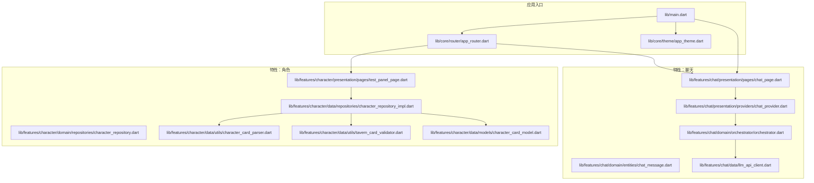
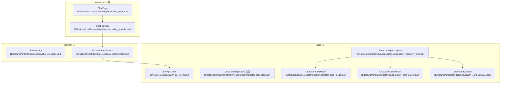
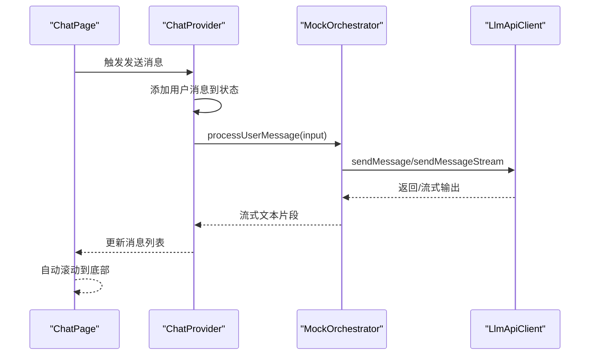
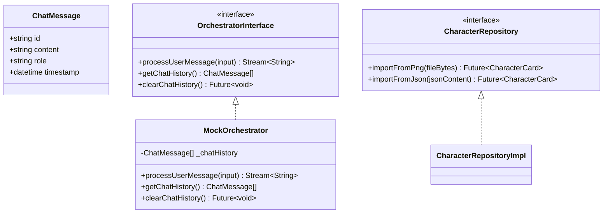
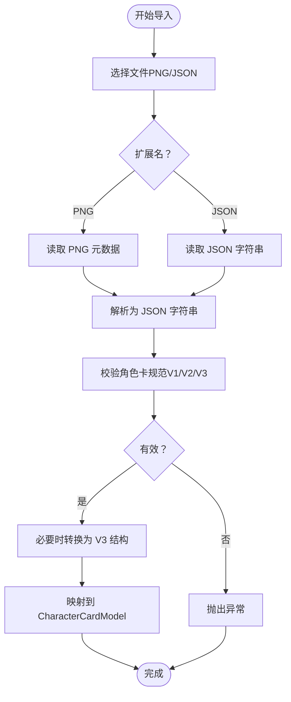
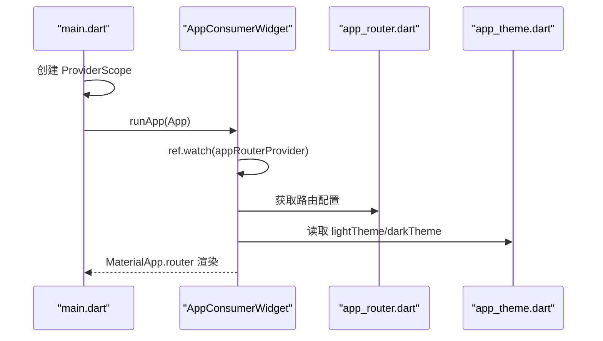
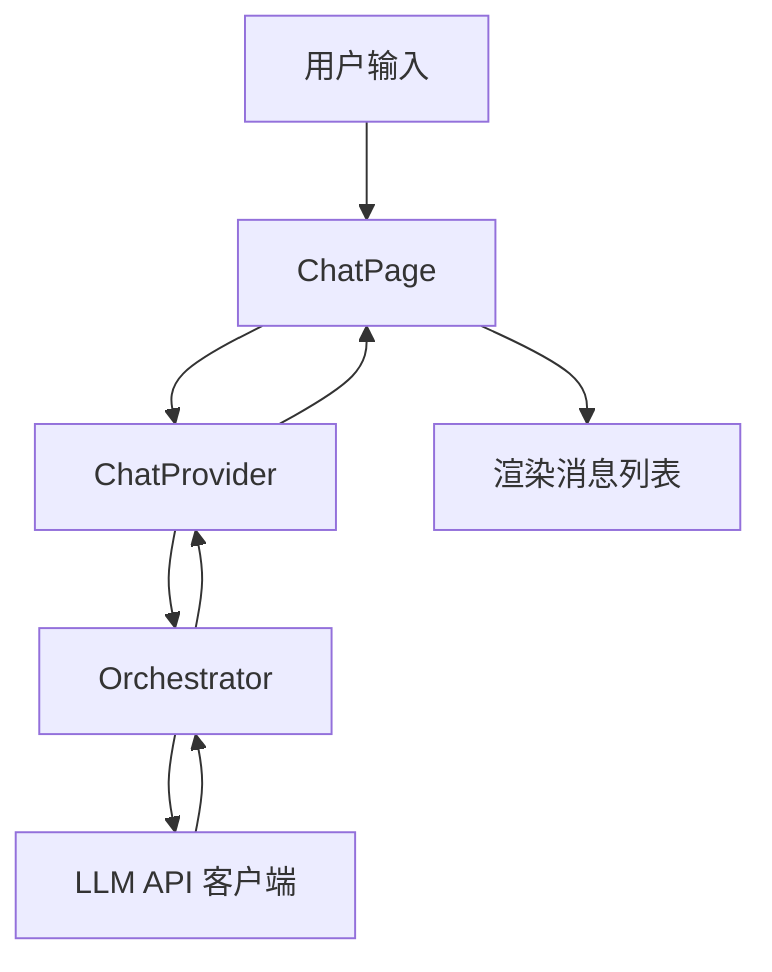
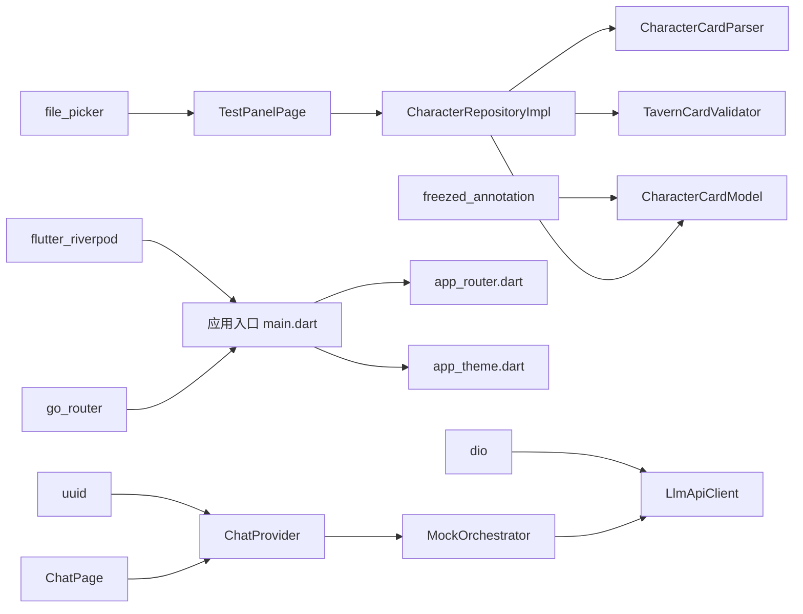

# 核心架构设计

<cite>
**本文引用的文件**
- [main.dart](file://lib/main.dart)
- [app_router.dart](file://lib/core/router/app_router.dart)
- [app_theme.dart](file://lib/core/theme/app_theme.dart)
- [SDD.md](file://SDD.md)
- [chat_provider.dart](file://lib/features/chat/presentation/providers/chat_provider.dart)
- [chat_page.dart](file://lib/features/chat/presentation/pages/chat_page.dart)
- [orchestrator.dart](file://lib/features/chat/domain/orchestrator/orchestrator.dart)
- [chat_message.dart](file://lib/features/chat/domain/entities/chat_message.dart)
- [llm_api_client.dart](file://lib/features/chat/data/llm_api_client.dart)
- [character_repository.dart](file://lib/features/character/domain/repositories/character_repository.dart)
- [character_repository_impl.dart](file://lib/features/character/data/repositories/character_repository_impl.dart)
- [character_card_model.dart](file://lib/features/character/data/models/character_card_model.dart)
- [character_card_parser.dart](file://lib/features/character/data/utils/character_card_parser.dart)
- [tavern_card_validator.dart](file://lib/features/character/data/utils/tavern_card_validator.dart)
- [test_panel_page.dart](file://lib/features/character/presentation/pages/test_panel_page.dart)
- [pubspec.yaml](file://pubspec.yaml)
</cite>

## 目录
1. [引言](#引言)
2. [项目结构](#项目结构)
3. [核心组件](#核心组件)
4. [架构总览](#架构总览)
5. [详细组件分析](#详细组件分析)
6. [依赖关系分析](#依赖关系分析)
7. [性能考量](#性能考量)
8. [故障排查指南](#故障排查指南)
9. [结论](#结论)
10. [附录](#附录)

## 引言
本文件面向开发者，系统性解析 neuropean 项目的 Clean Architecture 分层设计，依据 SDD.md 中定义的 Presentation、Domain、Data 三层结构，结合当前仓库中的实现，说明：
- 各层职责与边界：Presentation 层（UI 组件与 Riverpod Provider）、Domain 层（业务逻辑与实体）、Data 层（数据源实现）
- Riverpod 如何实现依赖注入与状态管理
- go_router 的路由定义与导航控制
- main.dart 如何集成核心服务
- app_router.dart 的路由定义方式
- app_theme.dart 的主题定制机制
- 模块间解耦与协作模式

## 项目结构
仓库采用 Feature-Based 的分层组织方式，核心入口与基础设施位于 lib/core，业务特性位于 lib/features，典型结构如下：
- lib/main.dart：应用入口，初始化 ProviderScope 并挂载路由与主题
- lib/core/router/app_router.dart：路由定义与导航控制
- lib/core/theme/app_theme.dart：主题定义
- lib/features/chat：聊天核心特性，包含 presentation、domain、data 三层
- lib/features/character：角色管理特性，包含 presentation、domain、data 三层
- lib/features/character/data/models/character_card_model.dart：角色卡片数据模型（Freezed 自动生成）
- lib/features/character/data/utils/*：角色卡解析与校验工具
- lib/features/chat/data/llm_api_client.dart：LLM API 客户端（Dio 封装）
- lib/features/chat/domain/orchestrator/orchestrator.dart：编排器（纯 Dart，无 UI 依赖）

图表来源
- [main.dart](file://lib/main.dart#L1-L33)
- [app_router.dart](file://lib/core/router/app_router.dart#L1-L18)
- [app_theme.dart](file://lib/core/theme/app_theme.dart#L1-L19)
- [chat_provider.dart](file://lib/features/chat/presentation/providers/chat_provider.dart#L1-L63)
- [chat_page.dart](file://lib/features/chat/presentation/pages/chat_page.dart#L1-L120)
- [orchestrator.dart](file://lib/features/chat/domain/orchestrator/orchestrator.dart#L1-L49)
- [llm_api_client.dart](file://lib/features/chat/data/llm_api_client.dart#L1-L115)
- [character_repository.dart](file://lib/features/character/domain/repositories/character_repository.dart#L1-L10)
- [character_repository_impl.dart](file://lib/features/character/data/repositories/character_repository_impl.dart#L1-L78)
- [character_card_parser.dart](file://lib/features/character/data/utils/character_card_parser.dart#L1-L206)
- [tavern_card_validator.dart](file://lib/features/character/data/utils/tavern_card_validator.dart#L1-L171)
- [character_card_model.dart](file://lib/features/character/data/models/character_card_model.dart#L1-L63)
- [test_panel_page.dart](file://lib/features/character/presentation/pages/test_panel_page.dart#L1-L114)

章节来源
- [main.dart](file://lib/main.dart#L1-L33)
- [app_router.dart](file://lib/core/router/app_router.dart#L1-L18)
- [app_theme.dart](file://lib/core/theme/app_theme.dart#L1-L19)
- [pubspec.yaml](file://pubspec.yaml#L34-L77)

## 核心组件
- Presentation 层（UI 与状态）
  - ChatPage：聊天界面，监听聊天状态 Provider，构建消息气泡与输入条
  - ChatProvider：聊天状态 Provider，包含消息列表与发送消息函数
- Domain 层（业务逻辑与实体）
  - ChatMessage：聊天消息实体
  - Orchestrator（MockOrchestrator）：编排器接口的模拟实现，负责消息处理与流式输出
- Data 层（数据源）
  - LlmApiClient：基于 Dio 的 LLM API 客户端，支持同步与流式响应
  - CharacterRepository 接口与实现：角色卡导入与解析
  - CharacterCardModel：角色卡片数据模型（Freezed）
  - CharacterCardParser、TavernCardValidator：角色卡 PNG 元数据读取与校验

章节来源
- [chat_page.dart](file://lib/features/chat/presentation/pages/chat_page.dart#L1-L120)
- [chat_provider.dart](file://lib/features/chat/presentation/providers/chat_provider.dart#L1-L63)
- [chat_message.dart](file://lib/features/chat/domain/entities/chat_message.dart#L1-L13)
- [orchestrator.dart](file://lib/features/chat/domain/orchestrator/orchestrator.dart#L1-L49)
- [llm_api_client.dart](file://lib/features/chat/data/llm_api_client.dart#L1-L115)
- [character_repository.dart](file://lib/features/character/domain/repositories/character_repository.dart#L1-L10)
- [character_repository_impl.dart](file://lib/features/character/data/repositories/character_repository_impl.dart#L1-L78)
- [character_card_model.dart](file://lib/features/character/data/models/character_card_model.dart#L1-L63)
- [character_card_parser.dart](file://lib/features/character/data/utils/character_card_parser.dart#L1-L206)
- [tavern_card_validator.dart](file://lib/features/character/data/utils/tavern_card_validator.dart#L1-L171)

## 架构总览
Clean Architecture 三层划分与交互关系如下：
- Presentation 层：Flutter Widgets + Riverpod Provider，负责渲染与用户交互
- Domain 层：纯 Dart 代码，包含实体、用例与仓库接口，不依赖 UI
- Data 层：仓库实现与数据源（API、数据库等），负责具体数据读写与网络请求

图表来源
- [chat_page.dart](file://lib/features/chat/presentation/pages/chat_page.dart#L1-L120)
- [chat_provider.dart](file://lib/features/chat/presentation/providers/chat_provider.dart#L1-L63)
- [chat_message.dart](file://lib/features/chat/domain/entities/chat_message.dart#L1-L13)
- [orchestrator.dart](file://lib/features/chat/domain/orchestrator/orchestrator.dart#L1-L49)
- [llm_api_client.dart](file://lib/features/chat/data/llm_api_client.dart#L1-L115)
- [character_repository.dart](file://lib/features/character/domain/repositories/character_repository.dart#L1-L10)
- [character_repository_impl.dart](file://lib/features/character/data/repositories/character_repository_impl.dart#L1-L78)
- [character_card_model.dart](file://lib/features/character/data/models/character_card_model.dart#L1-L63)
- [character_card_parser.dart](file://lib/features/character/data/utils/character_card_parser.dart#L1-L206)
- [tavern_card_validator.dart](file://lib/features/character/data/utils/tavern_card_validator.dart#L1-L171)

## 详细组件分析

### Presentation 层：UI 与 Riverpod 状态管理
- ChatPage：通过 ConsumerStatefulWidget 与 Consumer 使用 Provider，监听消息列表与发送函数，构建消息气泡与输入条
- ChatProvider：使用 StateProvider 管理消息列表；使用 Provider 包装发送函数，内部通过 ref.read 写入状态，实现 UI 与状态的解耦
- Riverpod 依赖注入：在 main.dart 中通过 ProviderScope 包裹 App，并在 App 中通过 ref.watch(appRouterProvider) 获取路由配置，体现 Provider 在非 UI 层也可被使用

图表来源
- [chat_page.dart](file://lib/features/chat/presentation/pages/chat_page.dart#L1-L120)
- [chat_provider.dart](file://lib/features/chat/presentation/providers/chat_provider.dart#L1-L63)
- [orchestrator.dart](file://lib/features/chat/domain/orchestrator/orchestrator.dart#L1-L49)
- [llm_api_client.dart](file://lib/features/chat/data/llm_api_client.dart#L1-L115)

章节来源
- [chat_page.dart](file://lib/features/chat/presentation/pages/chat_page.dart#L1-L120)
- [chat_provider.dart](file://lib/features/chat/presentation/providers/chat_provider.dart#L1-L63)
- [main.dart](file://lib/main.dart#L1-L33)

### Domain 层：业务逻辑与实体
- ChatMessage：不可变实体，包含 id、content、role、timestamp
- Orchestrator（MockOrchestrator）：模拟编排器，接收用户输入，添加到历史，延迟后返回模拟回复并以词为单位流式输出；提供获取历史与清空历史的方法
- CharacterRepository 接口：定义从 PNG/JSON 导入角色卡的能力，抽象出数据来源差异

图表来源
- [chat_message.dart](file://lib/features/chat/domain/entities/chat_message.dart#L1-L13)
- [orchestrator.dart](file://lib/features/chat/domain/orchestrator/orchestrator.dart#L1-L49)
- [character_repository.dart](file://lib/features/character/domain/repositories/character_repository.dart#L1-L10)

章节来源
- [chat_message.dart](file://lib/features/chat/domain/entities/chat_message.dart#L1-L13)
- [orchestrator.dart](file://lib/features/chat/domain/orchestrator/orchestrator.dart#L1-L49)
- [character_repository.dart](file://lib/features/character/domain/repositories/character_repository.dart#L1-L10)

### Data 层：数据源实现
- LlmApiClient：封装 Dio，支持同步与流式响应，统一异常处理
- CharacterRepositoryImpl：实现角色卡导入，支持从 PNG 读取元数据、从 JSON 导入；内部使用 CharacterCardParser 与 TavernCardValidator
- CharacterCardModel：使用 Freezed 生成不可变模型与序列化代码
- CharacterCardParser：解析 PNG tEXt 元数据，支持 ccv3 与 chara 两种格式
- TavernCardValidator：校验 V1/V2/V3 规范，返回版本号或错误信息

图表来源
- [character_repository_impl.dart](file://lib/features/character/data/repositories/character_repository_impl.dart#L1-L78)
- [character_card_parser.dart](file://lib/features/character/data/utils/character_card_parser.dart#L1-L206)
- [tavern_card_validator.dart](file://lib/features/character/data/utils/tavern_card_validator.dart#L1-L171)
- [character_card_model.dart](file://lib/features/character/data/models/character_card_model.dart#L1-L63)

章节来源
- [llm_api_client.dart](file://lib/features/chat/data/llm_api_client.dart#L1-L115)
- [character_repository_impl.dart](file://lib/features/character/data/repositories/character_repository_impl.dart#L1-L78)
- [character_card_parser.dart](file://lib/features/character/data/utils/character_card_parser.dart#L1-L206)
- [tavern_card_validator.dart](file://lib/features/character/data/utils/tavern_card_validator.dart#L1-L171)
- [character_card_model.dart](file://lib/features/character/data/models/character_card_model.dart#L1-L63)

### 路由与主题集成
- main.dart：通过 ProviderScope 包裹应用，创建 App 组件；使用 ref.watch(appRouterProvider) 获取路由配置；设置主题与暗黑模式
- app_router.dart：定义初始路由与页面映射，使用 go_router 的 GoRoute 构建页面
- app_theme.dart：定义浅色与深色主题，使用 Material3 与 seedColor

图表来源
- [main.dart](file://lib/main.dart#L1-L33)
- [app_router.dart](file://lib/core/router/app_router.dart#L1-L18)
- [app_theme.dart](file://lib/core/theme/app_theme.dart#L1-L19)

章节来源
- [main.dart](file://lib/main.dart#L1-L33)
- [app_router.dart](file://lib/core/router/app_router.dart#L1-L18)
- [app_theme.dart](file://lib/core/theme/app_theme.dart#L1-L19)

### 概念性总览
以下为概念性流程图，展示从用户输入到 UI 更新的整体过程，帮助理解模块间协作模式。

（该图为概念性流程，不直接对应具体源码文件）

## 依赖关系分析
- 技术栈与依赖
  - 状态管理：flutter_riverpod、riverpod_annotation
  - 路由：go_router
  - 网络：dio
  - 序列化：freezed_annotation、json_annotation
  - 文件选择：file_picker
  - UUID：uuid
- 依赖方向
  - Presentation 依赖 Domain（实体与接口）
  - Domain 不依赖 Presentation（无 Flutter 依赖）
  - Data 实现 Domain 接口，向上提供具体能力
  - 应用入口依赖路由与主题，通过 Provider 注入全局配置

图表来源
- [pubspec.yaml](file://pubspec.yaml#L34-L77)
- [main.dart](file://lib/main.dart#L1-L33)
- [app_router.dart](file://lib/core/router/app_router.dart#L1-L18)
- [app_theme.dart](file://lib/core/theme/app_theme.dart#L1-L19)
- [chat_page.dart](file://lib/features/chat/presentation/pages/chat_page.dart#L1-L120)
- [chat_provider.dart](file://lib/features/chat/presentation/providers/chat_provider.dart#L1-L63)
- [orchestrator.dart](file://lib/features/chat/domain/orchestrator/orchestrator.dart#L1-L49)
- [llm_api_client.dart](file://lib/features/chat/data/llm_api_client.dart#L1-L115)
- [test_panel_page.dart](file://lib/features/character/presentation/pages/test_panel_page.dart#L1-L114)
- [character_repository_impl.dart](file://lib/features/character/data/repositories/character_repository_impl.dart#L1-L78)
- [character_card_model.dart](file://lib/features/character/data/models/character_card_model.dart#L1-L63)
- [character_card_parser.dart](file://lib/features/character/data/utils/character_card_parser.dart#L1-L206)
- [tavern_card_validator.dart](file://lib/features/character/data/utils/tavern_card_validator.dart#L1-L171)

章节来源
- [pubspec.yaml](file://pubspec.yaml#L34-L77)

## 性能考量
- Riverpod 状态管理
  - 使用 StateProvider 管理消息列表，避免不必要的重建
  - 使用 Provider 包装发送函数，减少 UI 与业务逻辑耦合，利于测试与性能优化
- 编排器与流式输出
  - MockOrchestrator 以词为单位流式输出，模拟真实 LLM 的流式响应，提升交互体验
- 网络请求
  - LlmApiClient 支持流式响应，建议在真实实现中启用流式传输，减少首字节延迟
- 图像与文件处理
  - CharacterCardParser 对 PNG 元数据的解析为纯内存操作，注意大文件场景下的内存占用与耗时

（本节为一般性指导，不直接分析具体文件）

## 故障排查指南
- LLM API 异常
  - LlmApiClient 捕获 DioException 并抛出自定义异常，便于上层统一处理
  - 建议在 Presentation 层捕获异常并提示用户
- 角色卡导入失败
  - CharacterRepositoryImpl 在解析与校验阶段可能抛出异常，需在 UI 层展示错误信息
  - TavernCardValidator 提供 lastValidationError，可用于定位问题字段
- 路由跳转
  - go_router 的路由守卫与 Deep Link 可在 app_router.dart 中扩展，当前示例未实现守卫逻辑
- 主题切换
  - AppTheme 使用系统主题模式，若出现主题不生效，检查主题初始化与 MaterialApp.router 的参数传递

章节来源
- [llm_api_client.dart](file://lib/features/chat/data/llm_api_client.dart#L1-L115)
- [character_repository_impl.dart](file://lib/features/character/data/repositories/character_repository_impl.dart#L1-L78)
- [tavern_card_validator.dart](file://lib/features/character/data/utils/tavern_card_validator.dart#L1-L171)
- [app_router.dart](file://lib/core/router/app_router.dart#L1-L18)
- [app_theme.dart](file://lib/core/theme/app_theme.dart#L1-L19)

## 结论
neuropean 项目遵循 Clean Architecture 分层设计，通过 Riverpod 实现依赖注入与状态管理，通过 go_router 管理路由与导航，通过主题模块统一外观风格。Domain 层保持纯 Dart、无 UI 依赖，Data 层实现具体数据源，Presentation 层专注 UI 与交互，三者边界清晰、协作明确。当前实现以 MockOrchestrator 与 LLM API 客户端为主，后续可在 Data 层接入 Drift 数据库与 SQLite，完善角色卡导入与聊天记录持久化，进一步提升系统稳定性与可维护性。

## 附录
- SDD.md 中对 Clean Architecture 的分层定义与技术栈推荐，为本项目提供了清晰的架构蓝图
- 代码生成工具链（build_runner、riverpod_generator、drift_dev、freezed、json_serializable）已在 pubspec.yaml 中声明，确保模型与 Provider 的自动生成与类型安全

章节来源
- [SDD.md](file://SDD.md#L42-L67)
- [pubspec.yaml](file://pubspec.yaml#L60-L77)