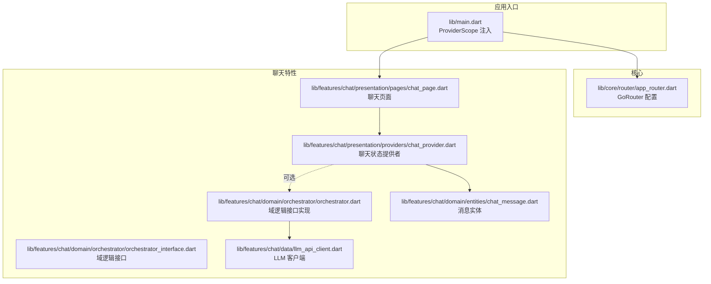
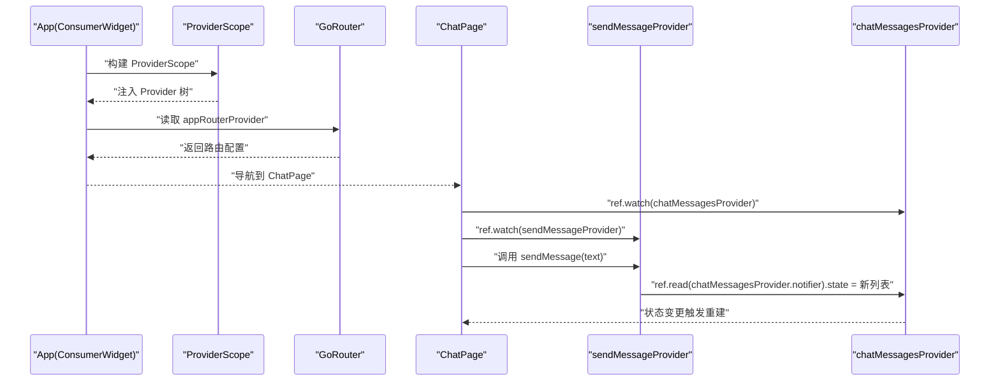
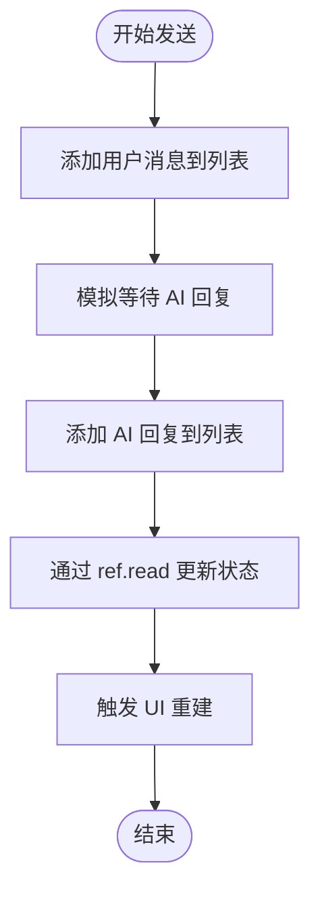
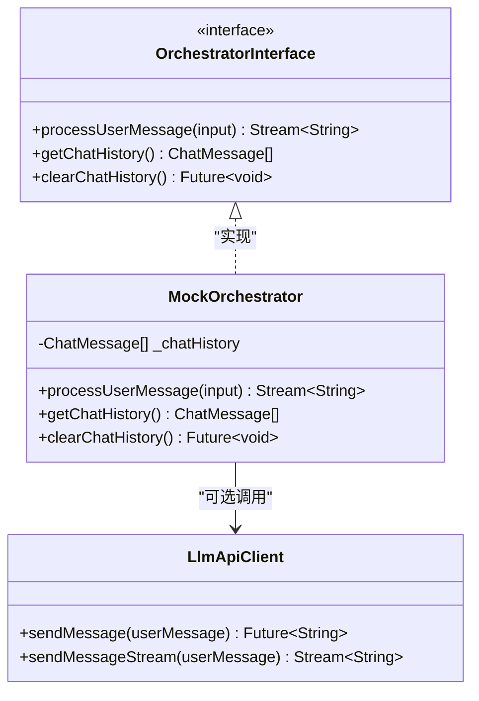
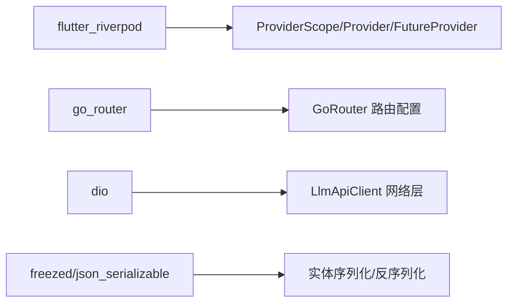

# 状态管理

<cite>
**本文引用的文件**
- [main.dart](file://lib/main.dart)
- [app_router.dart](file://lib/core/router/app_router.dart)
- [chat_page.dart](file://lib/features/chat/presentation/pages/chat_page.dart)
- [chat_provider.dart](file://lib/features/chat/presentation/providers/chat_provider.dart)
- [orchestrator.dart](file://lib/features/chat/domain/orchestrator/orchestrator.dart)
- [orchestrator_interface.dart](file://lib/features/chat/domain/orchestrator/orchestrator_interface.dart)
- [llm_api_client.dart](file://lib/features/chat/data/llm_api_client.dart)
- [chat_message.dart](file://lib/features/chat/domain/entities/chat_message.dart)
- [widget_test.dart](file://test/widget_test.dart)
- [pubspec.yaml](file://pubspec.yaml)
</cite>

## 目录
1. [简介](#简介)
2. [项目结构](#项目结构)
3. [核心组件](#核心组件)
4. [架构总览](#架构总览)
5. [详细组件分析](#详细组件分析)
6. [依赖分析](#依赖分析)
7. [性能考量](#性能考量)
8. [故障排查指南](#故障排查指南)
9. [结论](#结论)
10. [附录](#附录)

## 简介
本文件围绕基于 Riverpod 的状态管理实现进行深入解析，重点覆盖：
- ProviderScope 在应用根部的注入机制与依赖注入方式（以 appRouterProvider 为例）
- ChatProvider 如何管理聊天界面的异步状态（消息列表、发送流程、加载与错误处理）
- Riverpod.family 与.autoDispose 的使用场景与价值（当前代码未直接体现，但可作为扩展建议）
- 状态监听（ref.watch）、状态更新（ref.read）与异步任务处理的最佳实践
- 状态管理与 Orchestrator 域逻辑的解耦设计
- 单元测试中如何通过 Provider 进行逻辑验证（含现有测试与改进建议）

## 项目结构
该工程采用分层与特性导向的组织方式：核心层包含路由与主题；特性层按功能划分（如 character、chat）。状态管理集中在 features/chat/presentation/providers 中，UI 页面位于 features/chat/presentation/pages，域逻辑位于 features/chat/domain，数据访问位于 features/chat/data。

图表来源
- [main.dart](file://lib/main.dart#L1-L33)
- [app_router.dart](file://lib/core/router/app_router.dart#L1-L18)
- [chat_page.dart](file://lib/features/chat/presentation/pages/chat_page.dart#L1-L120)
- [chat_provider.dart](file://lib/features/chat/presentation/providers/chat_provider.dart#L1-L63)
- [orchestrator.dart](file://lib/features/chat/domain/orchestrator/orchestrator.dart#L1-L49)
- [orchestrator_interface.dart](file://lib/features/chat/domain/orchestrator/orchestrator_interface.dart#L1-L13)
- [llm_api_client.dart](file://lib/features/chat/data/llm_api_client.dart#L1-L115)
- [chat_message.dart](file://lib/features/chat/domain/entities/chat_message.dart#L1-L13)

章节来源
- [main.dart](file://lib/main.dart#L1-L33)
- [pubspec.yaml](file://pubspec.yaml#L31-L77)

## 核心组件
- 应用根部注入：通过 ProviderScope 将 Provider 树注入到 App 组件之下，使所有子树可访问已定义的 Provider。
- 路由注入：appRouterProvider 将全局路由配置注入到 App，App 使用 ref.watch(appRouterProvider) 获取路由实例。
- 聊天状态：chatMessagesProvider 使用 StateProvider 管理消息列表；sendMessageProvider 提供发送消息的函数式 Provider，内部通过 ref.read 更新状态。
- 域逻辑：OrchestratorInterface 抽象了消息处理与历史管理；MockOrchestrator 提供模拟实现，支持流式响应。
- 数据访问：LlmApiClient 提供同步与流式调用接口，封装网络请求与异常处理。
- 实体模型：ChatMessage 表示单条消息的基本字段。

章节来源
- [main.dart](file://lib/main.dart#L1-L33)
- [chat_provider.dart](file://lib/features/chat/presentation/providers/chat_provider.dart#L1-L63)
- [orchestrator_interface.dart](file://lib/features/chat/domain/orchestrator/orchestrator_interface.dart#L1-L13)
- [orchestrator.dart](file://lib/features/chat/domain/orchestrator/orchestrator.dart#L1-L49)
- [llm_api_client.dart](file://lib/features/chat/data/llm_api_client.dart#L1-L115)
- [chat_message.dart](file://lib/features/chat/domain/entities/chat_message.dart#L1-L13)

## 架构总览
下图展示了从应用启动到聊天页面渲染、用户输入触发发送流程的整体交互。

图表来源
- [main.dart](file://lib/main.dart#L1-L33)
- [chat_page.dart](file://lib/features/chat/presentation/pages/chat_page.dart#L22-L47)
- [chat_provider.dart](file://lib/features/chat/presentation/providers/chat_provider.dart#L28-L63)

## 详细组件分析

### ProviderScope 注入与依赖注入（appRouterProvider）
- 注入机制：应用入口通过 ProviderScope 包裹 App，使整个应用树共享同一 Provider 环境。
- 依赖注入：appRouterProvider 将全局路由对象注入为 Provider，App 使用 ref.watch(appRouterProvider) 获取路由配置，并将其传入 MaterialApp.router。
- 最佳实践：
  - 将全局服务（如路由、网络客户端、配置）以 Provider 形式注入，避免在页面中直接创建或持有实例。
  - 使用 ProviderScope 的 child 参数承载应用主体，确保所有子组件均可访问。

章节来源
- [main.dart](file://lib/main.dart#L1-L33)
- [app_router.dart](file://lib/core/router/app_router.dart#L1-L18)

### ChatProvider：聊天状态管理与异步处理
- 消息列表管理：chatMessagesProvider 使用 StateProvider 存储消息列表，初始值包含模拟消息。
- 发送流程：sendMessageProvider 返回一个函数，接收用户输入后：
  - 先将用户消息追加到消息列表
  - 模拟等待 AI 回复（实际应替换为调用 Orchestrator 或 LLM 客户端）
  - 将 AI 回复追加到消息列表
- 状态监听与更新：
  - 监听：ChatPage 通过 ref.watch(chatMessagesProvider) 订阅消息列表变化，ref.watch(sendMessageProvider) 获取发送函数。
  - 更新：sendMessageProvider 内部通过 ref.read(chatMessagesProvider.notifier).state 替换新列表，触发 UI 重建。
- 异步处理最佳实践：
  - 在 Provider 中执行异步任务时，避免阻塞 UI；可考虑使用 FutureProvider 或 StreamProvider 承载异步结果。
  - 对于长耗时操作，建议引入错误处理与加载状态标识，便于 UI 层反馈。

图表来源
- [chat_provider.dart](file://lib/features/chat/presentation/providers/chat_provider.dart#L28-L63)
- [chat_page.dart](file://lib/features/chat/presentation/pages/chat_page.dart#L22-L47)

章节来源
- [chat_provider.dart](file://lib/features/chat/presentation/providers/chat_provider.dart#L1-L63)
- [chat_page.dart](file://lib/features/chat/presentation/pages/chat_page.dart#L1-L120)

### Riverpod.family 与.autoDispose 的使用建议
- family 适用场景：当需要按参数区分多个 Provider 实例（如按会话 ID、用户 ID）时，可使用 family 创建“会话隔离”的 Provider。例如：
  - family<AsyncValue<T>, K>：为每个 K 提供独立的异步状态
  - family<Notifier, K>：为每个 K 提供独立的可变状态
- autoDispose：当某个 Provider 不再被任何组件监听时自动释放其状态，有助于减少内存占用与潜在泄漏风险。
- 当前现状：仓库中未直接出现 family 与.autoDispose 的使用，但可在 ChatProvider 的基础上扩展，以实现多会话隔离与自动清理。

（本节为概念性建议，不对应具体源码）

### 状态管理与 Orchestrator 域逻辑的解耦设计
- 接口抽象：OrchestratorInterface 定义了 processUserMessage、getChatHistory、clearChatHistory 等方法，屏蔽具体实现细节。
- 模拟实现：MockOrchestrator 提供了基于内存的历史记录与流式响应的模拟实现，便于前端联调与测试。
- 解耦优势：
  - UI 仅依赖接口，不关心具体实现
  - 可替换真实 LLM 客户端或本地推理引擎
  - 便于单元测试与集成测试

图表来源
- [orchestrator_interface.dart](file://lib/features/chat/domain/orchestrator/orchestrator_interface.dart#L1-L13)
- [orchestrator.dart](file://lib/features/chat/domain/orchestrator/orchestrator.dart#L1-L49)
- [llm_api_client.dart](file://lib/features/chat/data/llm_api_client.dart#L1-L115)

章节来源
- [orchestrator_interface.dart](file://lib/features/chat/domain/orchestrator/orchestrator_interface.dart#L1-L13)
- [orchestrator.dart](file://lib/features/chat/domain/orchestrator/orchestrator.dart#L1-L49)
- [llm_api_client.dart](file://lib/features/chat/data/llm_api_client.dart#L1-L115)

### 单元测试中的 Provider Mock 与验证
- 现有测试：widget_test.dart 展示了基础的 Widget 测试骨架，但未涉及 Provider 的 Mock。
- 建议方案：
  - 使用 ProviderScope 替换根部 Provider 环境，注入自定义 Provider 实现（如 MockOrchestrator 或自定义的 LlmApiClient）
  - 使用 ProviderScope观察 Provider 的状态变化，断言 UI 行为是否符合预期
  - 对异步 Provider（如 FutureProvider）使用 pumpAndSettle 或 Future.wait 等策略等待异步完成
- 优点：无需依赖真实网络，提升测试稳定性与速度；便于验证边界条件与错误分支。

（本节为通用测试指导，不对应具体源码）

## 依赖分析
- 状态管理：flutter_riverpod 用于 Provider 体系
- 路由：go_router 用于声明式路由
- 网络：dio 用于 HTTP 请求与流式响应
- 代码生成：riverpod_generator、freezed、json_serializable 等

图表来源
- [pubspec.yaml](file://pubspec.yaml#L31-L77)
- [llm_api_client.dart](file://lib/features/chat/data/llm_api_client.dart#L1-L115)

章节来源
- [pubspec.yaml](file://pubspec.yaml#L31-L77)

## 性能考量
- 状态粒度：将大对象拆分为细粒度 Provider，避免不必要的重建
- 自动清理：对临时会话或一次性任务使用 .autoDispose，降低内存占用
- 异步状态：使用 FutureProvider/StreamProvider 承载异步结果，配合 loading/error 状态位，避免 UI 阻塞
- 渲染优化：ListView.builder 中合理设置缓存策略与键值，减少重绘
- 网络层：对流式响应进行节流与背压控制，避免 UI 卡顿

（本节为通用性能建议，不对应具体源码）

## 故障排查指南
- 路由无法生效：检查 appRouterProvider 是否正确注入到 ProviderScope，App 是否通过 ref.watch(appRouterProvider) 使用
- 状态不更新：确认通过 ref.read 更新 StateProvider.state，且更新的是 notifier.state
- 发送按钮无响应：检查 ChatPage 是否正确订阅 sendMessageProvider 并在 onPressed 中调用
- 网络异常：LlmApiClient 捕获 DioException 并抛出自定义异常，可在 UI 层显示错误提示
- 测试失败：确保在测试中使用 ProviderScope 注入自定义 Provider，避免依赖真实网络

章节来源
- [main.dart](file://lib/main.dart#L1-L33)
- [chat_page.dart](file://lib/features/chat/presentation/pages/chat_page.dart#L90-L119)
- [chat_provider.dart](file://lib/features/chat/presentation/providers/chat_provider.dart#L28-L63)
- [llm_api_client.dart](file://lib/features/chat/data/llm_api_client.dart#L1-L115)

## 结论
本项目以 Riverpod 为核心实现了清晰的状态管理与依赖注入，将路由、域逻辑与数据访问解耦，便于扩展与维护。ChatProvider 展示了基本的状态监听与更新模式，结合 Orchestrator 的接口抽象，为后续接入真实 LLM 与流式响应提供了良好基础。未来可在会话隔离与内存优化方面引入 family 与.autoDispose，并完善异步状态与错误处理，进一步提升用户体验与系统健壮性。

## 附录
- 关键路径参考
  - 应用入口与 ProviderScope 注入：[main.dart](file://lib/main.dart#L1-L33)
  - 路由配置与注入：[app_router.dart](file://lib/core/router/app_router.dart#L1-L18)
  - 聊天页面与状态订阅：[chat_page.dart](file://lib/features/chat/presentation/pages/chat_page.dart#L22-L47)
  - 聊天状态提供者与发送流程：[chat_provider.dart](file://lib/features/chat/presentation/providers/chat_provider.dart#L28-L63)
  - 域逻辑接口与模拟实现：[orchestrator_interface.dart](file://lib/features/chat/domain/orchestrator/orchestrator_interface.dart#L1-L13)、[orchestrator.dart](file://lib/features/chat/domain/orchestrator/orchestrator.dart#L1-L49)
  - LLM 客户端与异常处理：[llm_api_client.dart](file://lib/features/chat/data/llm_api_client.dart#L1-L115)
  - 消息实体：[chat_message.dart](file://lib/features/chat/domain/entities/chat_message.dart#L1-L13)
  - 基础 Widget 测试：[widget_test.dart](file://test/widget_test.dart#L1-L31)