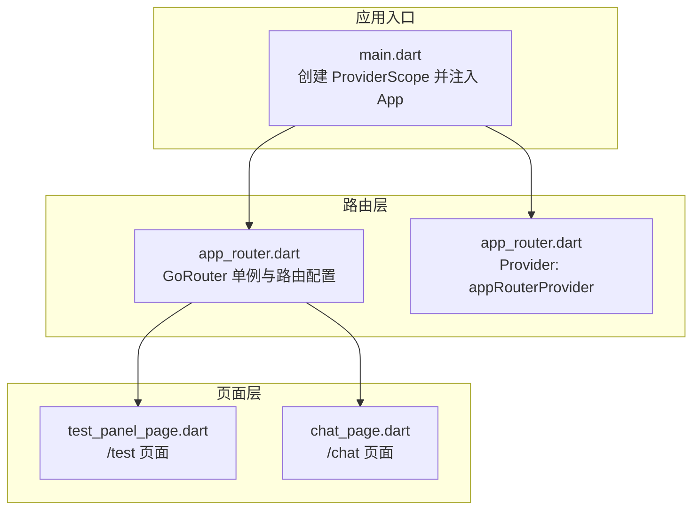
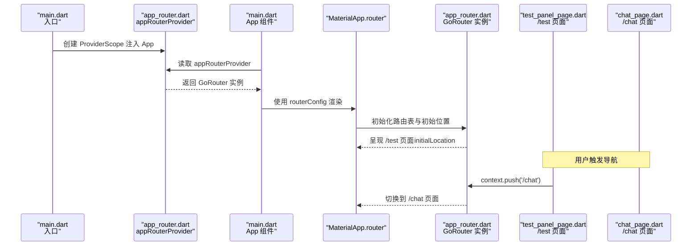
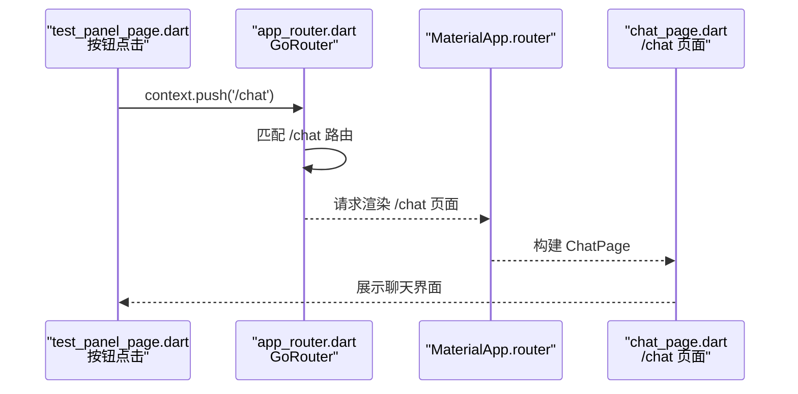
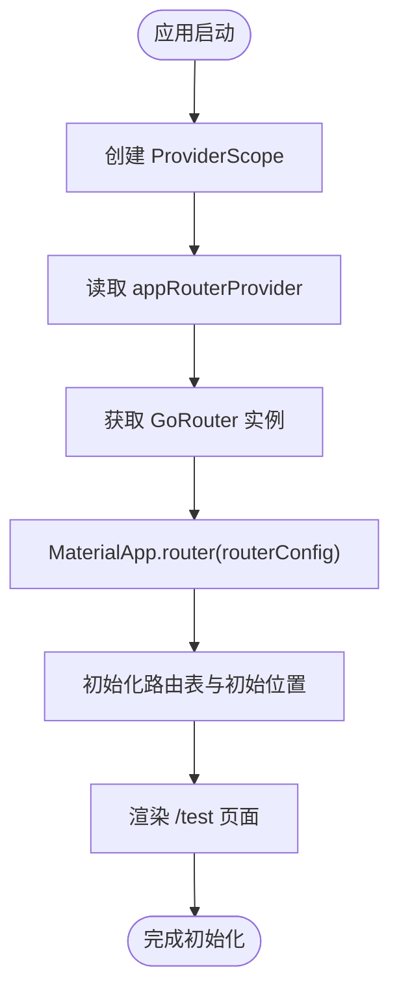
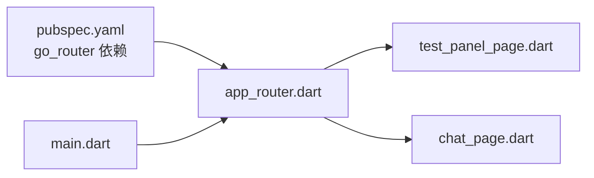

# 路由管理

<cite>
**本文引用的文件**
- [app_router.dart](file://lib/core/router/app_router.dart)
- [main.dart](file://lib/main.dart)
- [test_panel_page.dart](file://lib/features/character/presentation/pages/test_panel_page.dart)
- [chat_page.dart](file://lib/features/chat/presentation/pages/chat_page.dart)
- [pubspec.yaml](file://pubspec.yaml)
</cite>

## 目录
1. [简介](#简介)
2. [项目结构](#项目结构)
3. [核心组件](#核心组件)
4. [架构总览](#架构总览)
5. [详细组件分析](#详细组件分析)
6. [依赖分析](#依赖分析)
7. [性能考虑](#性能考虑)
8. [故障排查指南](#故障排查指南)
9. [结论](#结论)
10. [附录](#附录)

## 简介
本文件围绕基于 go_router 的声明式路由系统进行深入解析，重点说明：
- appRouter 实例的单例注册方式及其在 MaterialApp.router 中的集成；
- 路由配置结构：initialLocation 默认路径设置、GoRoute 的 path 定义与页面构建器（builder）映射机制；
- /test 与 /chat 两个核心路由的导航逻辑；
- 如何通过 routerConfig 实现深层链接（Deep Link）支持；
- 未来扩展性：路由守卫（redirect）、嵌套路由和参数传递的实现方案；
- 结合应用启动流程说明路由初始化时机与依赖关系。

## 项目结构
该工程采用按功能域分层的组织方式，路由相关的核心位于 core/router，页面位于 features 下对应的功能模块中。应用入口通过 Riverpod 提供 router 配置，MaterialApp.router 接收 routerConfig 完成声明式路由渲染。

图表来源
- [main.dart](file://lib/main.dart#L1-L33)
- [app_router.dart](file://lib/core/router/app_router.dart#L1-L18)
- [test_panel_page.dart](file://lib/features/character/presentation/pages/test_panel_page.dart#L1-L114)
- [chat_page.dart](file://lib/features/chat/presentation/pages/chat_page.dart#L1-L120)

章节来源
- [main.dart](file://lib/main.dart#L1-L33)
- [app_router.dart](file://lib/core/router/app_router.dart#L1-L18)

## 核心组件
- appRouter：全局唯一的 GoRouter 实例，负责声明式路由配置与导航控制。
- appRouterProvider：Riverpod 提供者，向 App 组件暴露 routerConfig。
- /test 与 /chat 路由：分别映射到 TestPanelPage 与 ChatPage，使用 builder 构建页面。

章节来源
- [app_router.dart](file://lib/core/router/app_router.dart#L1-L18)
- [main.dart](file://lib/main.dart#L14-L33)
- [test_panel_page.dart](file://lib/features/character/presentation/pages/test_panel_page.dart#L1-L114)
- [chat_page.dart](file://lib/features/chat/presentation/pages/chat_page.dart#L1-L120)

## 架构总览
下图展示了从应用启动到路由渲染的关键交互链路，以及 /test 与 /chat 两条核心路由的导航路径。

图表来源
- [main.dart](file://lib/main.dart#L1-L33)
- [app_router.dart](file://lib/core/router/app_router.dart#L1-L18)
- [test_panel_page.dart](file://lib/features/character/presentation/pages/test_panel_page.dart#L70-L85)
- [chat_page.dart](file://lib/features/chat/presentation/pages/chat_page.dart#L1-L120)

## 详细组件分析

### appRouter 单例与路由配置
- 单例注册：在 app_router.dart 中定义全局唯一 GoRouter 实例，避免重复创建与状态不一致。
- 初始路径：通过 initialLocation 指定应用启动时的默认路由为 /test。
- 路由表：routes 数组包含两条基础路由：
  - /test：builder 返回 TestPanelPage
  - /chat：builder 返回 ChatPage
- 集成方式：在 main.dart 中通过 ProviderScope 将 appRouterProvider 注入 App，App 在 build 中读取 router 并传给 MaterialApp.router 的 routerConfig。

章节来源
- [app_router.dart](file://lib/core/router/app_router.dart#L1-L18)
- [main.dart](file://lib/main.dart#L14-L33)

### /test 与 /chat 导航逻辑
- /test 页面（TestPanelPage）提供按钮触发导航至 /chat，调用 context.push('/chat')。
- /chat 页面（ChatPage）展示聊天界面，用户可输入消息并发送。
- 导航行为：当用户点击按钮时，context.push 触发 GoRouter 的路由切换，最终由 builder 渲染对应页面。

图表来源
- [test_panel_page.dart](file://lib/features/character/presentation/pages/test_panel_page.dart#L70-L85)
- [app_router.dart](file://lib/core/router/app_router.dart#L1-L18)
- [chat_page.dart](file://lib/features/chat/presentation/pages/chat_page.dart#L1-L120)

章节来源
- [test_panel_page.dart](file://lib/features/character/presentation/pages/test_panel_page.dart#L70-L85)
- [chat_page.dart](file://lib/features/chat/presentation/pages/chat_page.dart#L1-L120)

### 深度链接（Deep Link）支持
- 当前实现：app_router.dart 未显式配置 deepLinkRedirect、urlStrategy 或 urlChangeCallback 等用于处理外部 URL 的选项。
- 支持建议：若需支持深层链接，可在 GoRouter 中增加：
  - onUrlChanged 回调以监听 URL 变化并触发路由切换；
  - deepLinkRedirect 以在首次打开时根据 URL 决定初始路由；
  - urlStrategy 以适配不同平台的 URL 表达方式。
- 注意事项：添加深层链接支持需要在应用平台侧（Android/iOS/Web）正确配置 Intent/URL Scheme/Universal Links，确保系统能将外部链接交由 Flutter 处理。

章节来源
- [app_router.dart](file://lib/core/router/app_router.dart#L1-L18)

### 扩展性设计：路由守卫、嵌套路由与参数传递
- 路由守卫（redirect）：可通过 GoRoute 的 redirect 回调在进入路由前进行权限校验或重定向。例如，未登录用户访问 /chat 时重定向到 /test。
- 嵌套路由：可使用 GoRoute 的 children 字段定义子路由，配合 GoRouter 的嵌套导航实现更复杂的页面层级。
- 参数传递：通过 GoRoute 的 path 中的动态段（如 /user/:id）与 params 获取参数；或通过 GoRouter.push 的 extra 参数传递对象数据。
- 状态保持：在复杂场景中，可结合 Riverpod 的 Provider 管理页面状态，避免因路由切换导致的状态丢失。

章节来源
- [app_router.dart](file://lib/core/router/app_router.dart#L1-L18)

### 应用启动流程与初始化时机
- 启动顺序：
  1) main.dart 创建 ProviderScope；
  2) App 组件读取 appRouterProvider，获得 GoRouter 实例；
  3) App 将 routerConfig 传给 MaterialApp.router；
  4) MaterialApp.router 初始化路由表并根据 initialLocation 渲染 /test。
- 依赖关系：
  - main.dart 依赖 app_router.dart 提供的 routerConfig；
  - app_router.dart 依赖各页面模块（TestPanelPage、ChatPage）作为 builder 输出；
  - 依赖 go_router 包版本在 pubspec.yaml 中声明。

图表来源
- [main.dart](file://lib/main.dart#L1-L33)
- [app_router.dart](file://lib/core/router/app_router.dart#L1-L18)

章节来源
- [main.dart](file://lib/main.dart#L1-L33)
- [app_router.dart](file://lib/core/router/app_router.dart#L1-L18)
- [pubspec.yaml](file://pubspec.yaml#L42-L44)

## 依赖分析
- 外部依赖：go_router 版本在 pubspec.yaml 中声明，确保与当前 Flutter SDK 兼容。
- 内部耦合：
  - main.dart 仅依赖 app_router.dart 的 routerConfig；
  - app_router.dart 仅依赖页面模块的 builder；
  - 页面模块不直接依赖路由层，保持低耦合。

图表来源
- [pubspec.yaml](file://pubspec.yaml#L42-L44)
- [app_router.dart](file://lib/core/router/app_router.dart#L1-L18)
- [main.dart](file://lib/main.dart#L1-L33)
- [test_panel_page.dart](file://lib/features/character/presentation/pages/test_panel_page.dart#L1-L114)
- [chat_page.dart](file://lib/features/chat/presentation/pages/chat_page.dart#L1-L120)

章节来源
- [pubspec.yaml](file://pubspec.yaml#L42-L44)
- [app_router.dart](file://lib/core/router/app_router.dart#L1-L18)
- [main.dart](file://lib/main.dart#L1-L33)

## 性能考虑
- 路由切换成本：builder 模式按需渲染页面，避免一次性加载所有页面资源，有利于冷启动与内存占用控制。
- 初始路径：initialLocation 设为 /test，减少首屏空白时间，提升用户体验。
- 嵌套与参数：在复杂页面中谨慎使用嵌套路由与大量参数传递，避免过度渲染与状态同步开销。

## 故障排查指南
- 无法导航到 /chat：
  - 检查 /chat 路由是否已注册且 path 正确；
  - 确认页面构建器返回的 ChatPage 是否存在。
- 初始页面不是 /test：
  - 检查 initialLocation 是否设置为 '/test'；
  - 确认 App 组件正确读取 routerConfig 并传给 MaterialApp.router。
- 深层链接无效：
  - 确认已在 GoRouter 中配置 onUrlChanged 或 deepLinkRedirect；
  - 平台侧需正确配置 Intent/URL Scheme/Universal Links。
- 路由守卫未生效：
  - 检查 GoRoute.redirect 回调逻辑与条件判断；
  - 确保回调在路由切换前执行。

章节来源
- [app_router.dart](file://lib/core/router/app_router.dart#L1-L18)
- [main.dart](file://lib/main.dart#L14-L33)
- [test_panel_page.dart](file://lib/features/character/presentation/pages/test_panel_page.dart#L70-L85)
- [chat_page.dart](file://lib/features/chat/presentation/pages/chat_page.dart#L1-L120)

## 结论
本项目采用 go_router 的声明式路由方案，通过单例 appRouter 与 Provider 注入的方式，实现了简洁清晰的路由管理。当前已具备 /test 与 /chat 两条核心路由及基本导航能力；若需支持深层链接、路由守卫、嵌套路由与参数传递，可在现有基础上逐步扩展，同时保持页面与路由层的低耦合与高可维护性。

## 附录
- 依赖版本参考：go_router 在 pubspec.yaml 中声明为固定版本，便于版本一致性与问题定位。

章节来源
- [pubspec.yaml](file://pubspec.yaml#L42-L44)