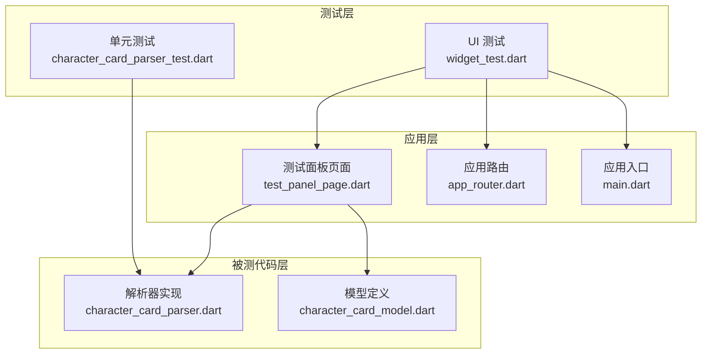
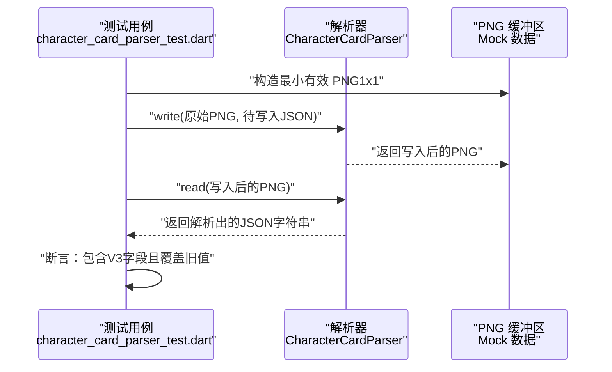
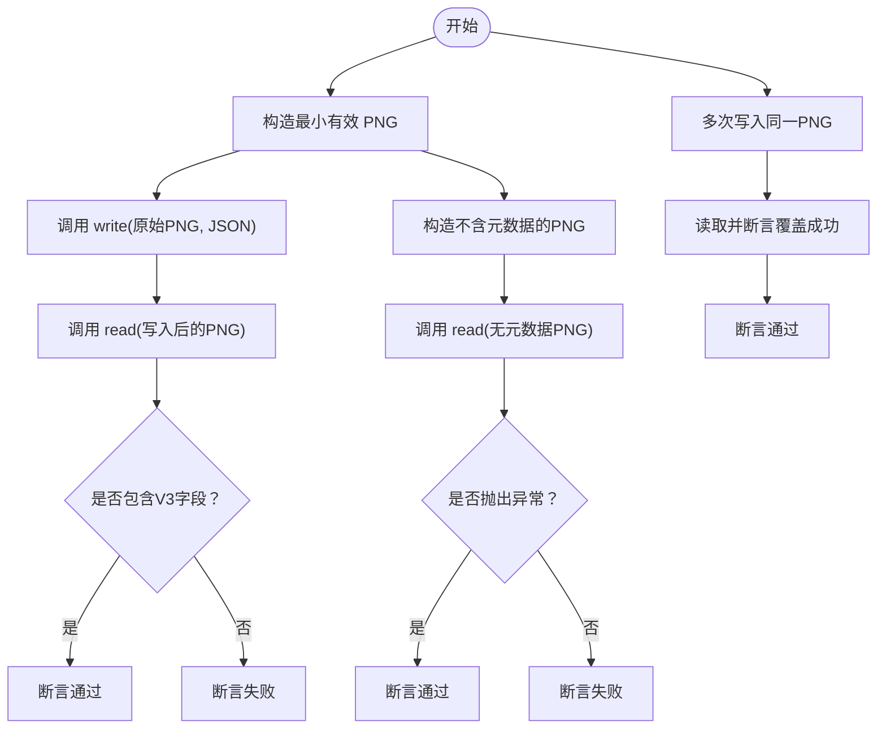
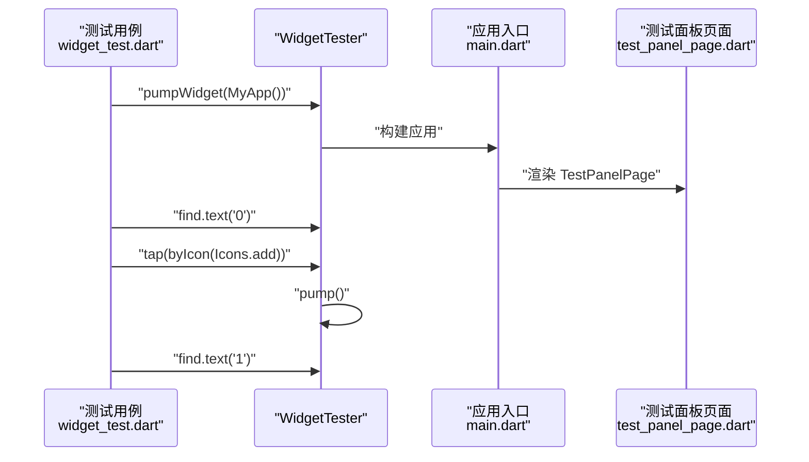
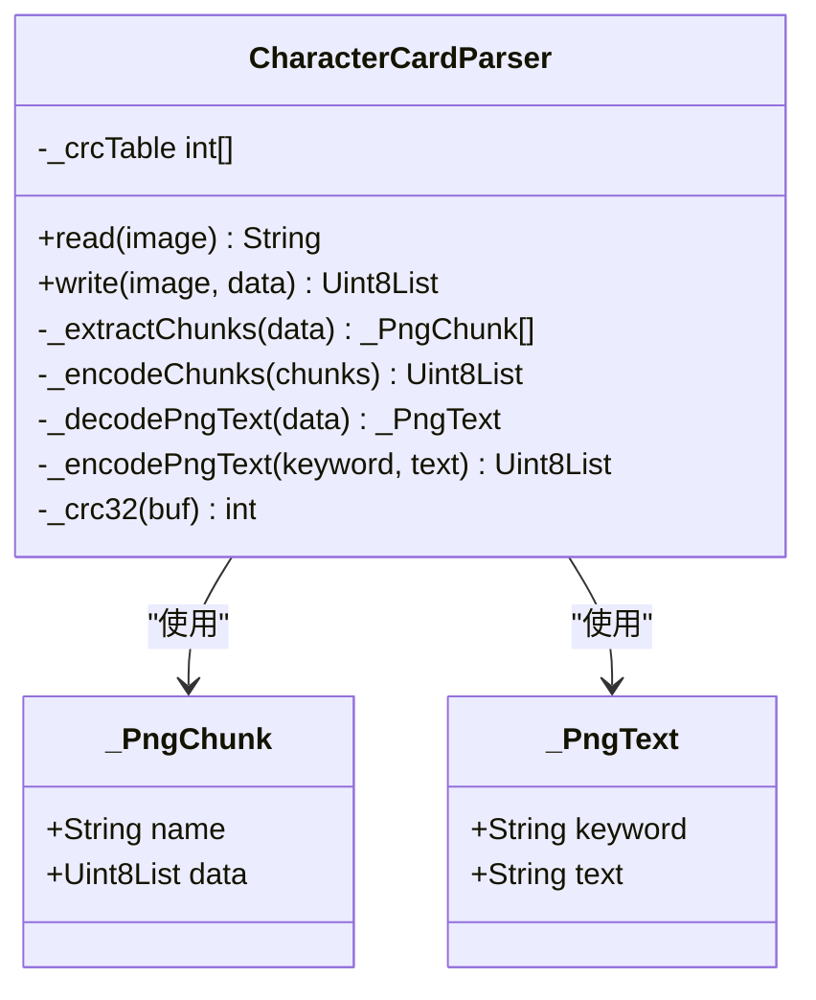
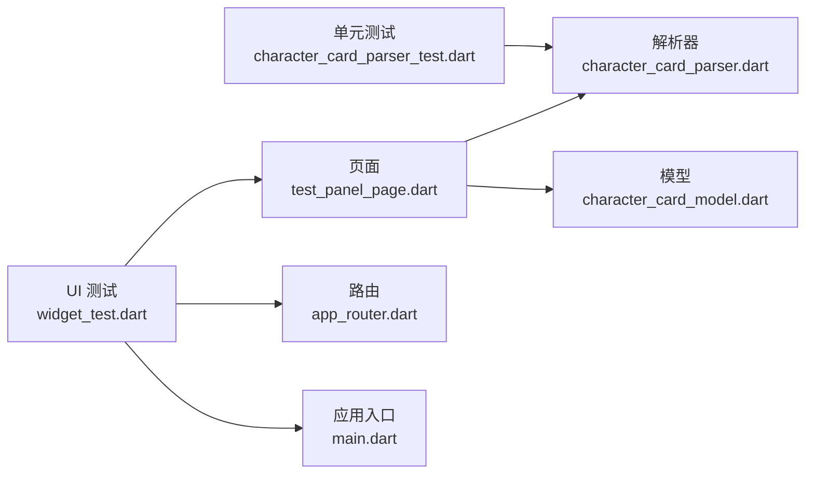

# 测试策略

<cite>
**本文引用的文件**
- [character_card_parser_test.dart](file://test/features/character/data/utils/character_card_parser_test.dart)
- [character_card_parser.dart](file://lib/features/character/data/utils/character_card_parser.dart)
- [widget_test.dart](file://test/widget_test.dart)
- [character_card_model.dart](file://lib/features/character/data/models/character_card_model.dart)
- [test_panel_page.dart](file://lib/features/character/presentation/pages/test_panel_page.dart)
- [app_router.dart](file://lib/core/router/app_router.dart)
- [main.dart](file://lib/main.dart)
- [pubspec.yaml](file://pubspec.yaml)
- [analysis_options.yaml](file://analysis_options.yaml)
</cite>

## 目录
1. [引言](#引言)
2. [项目结构](#项目结构)
3. [核心组件](#核心组件)
4. [架构总览](#架构总览)
5. [详细组件分析](#详细组件分析)
6. [依赖关系分析](#依赖关系分析)
7. [性能考量](#性能考量)
8. [故障排查指南](#故障排查指南)
9. [结论](#结论)
10. [附录](#附录)

## 引言
本指南聚焦于项目的测试规范与实践，围绕以下目标展开：
- 分析 character_card_parser_test.dart 中针对 PNG 元数据解析逻辑的单元测试用例设计，展示如何使用 Mock 数据验证解析正确性。
- 阐述 widget_test.dart 中 UI 组件的测试方法，包括如何构建测试环境、模拟用户交互及验证组件行为。
- 明确测试覆盖率目标、运行测试命令（flutter test）及持续集成建议，确保代码质量与功能稳定性。

## 项目结构
该项目采用 Flutter 应用结构，测试相关的关键位置如下：
- 单元测试：test/features/character/data/utils/character_card_parser_test.dart
- UI 测试：test/widget_test.dart
- 被测代码：lib/features/character/data/utils/character_card_parser.dart
- 模型定义：lib/features/character/data/models/character_card_model.dart
- 页面与路由：lib/features/character/presentation/pages/test_panel_page.dart、lib/core/router/app_router.dart、lib/main.dart
- 工程配置：pubspec.yaml、analysis_options.yaml

图表来源
- [character_card_parser_test.dart](file://test/features/character/data/utils/character_card_parser_test.dart#L1-L56)
- [character_card_parser.dart](file://lib/features/character/data/utils/character_card_parser.dart#L1-L206)
- [character_card_model.dart](file://lib/features/character/data/models/character_card_model.dart#L1-L63)
- [test_panel_page.dart](file://lib/features/character/presentation/pages/test_panel_page.dart#L1-L114)
- [app_router.dart](file://lib/core/router/app_router.dart#L1-L18)
- [main.dart](file://lib/main.dart#L1-L33)

章节来源
- [pubspec.yaml](file://pubspec.yaml#L1-L119)
- [analysis_options.yaml](file://analysis_options.yaml#L1-L29)

## 核心组件
- 字符卡解析器（CharacterCardParser）
  - 提供 PNG 图像缓冲区的读写能力，支持 V2（chara）与 V3（ccv3）两种元数据格式；V3 优先级更高。
  - 内部通过自定义 PNG 块解析与编码实现，包含 CRC32 校验表生成与计算。
- 字符卡模型（CharacterCardModel、CharacterCard）
  - 定义了角色卡的数据结构，涵盖 V2 与 V3 新增字段，便于在导入后进行序列化与展示。
- 测试面板页面（TestPanelPage）
  - 提供文件选择与导入流程，演示从 PNG 或 JSON 导入角色卡，并在界面中输出结果日志。
- 应用入口与路由（App、app_router）
  - 定义初始路由与页面跳转，为 UI 测试提供可导航的页面树。

章节来源
- [character_card_parser.dart](file://lib/features/character/data/utils/character_card_parser.dart#L1-L206)
- [character_card_model.dart](file://lib/features/character/data/models/character_card_model.dart#L1-L63)
- [test_panel_page.dart](file://lib/features/character/presentation/pages/test_panel_page.dart#L1-L114)
- [app_router.dart](file://lib/core/router/app_router.dart#L1-L18)
- [main.dart](file://lib/main.dart#L1-L33)

## 架构总览
下图展示了测试与被测代码之间的交互关系，以及 UI 测试如何通过 WidgetTester 构建应用并触发交互。

图表来源
- [character_card_parser_test.dart](file://test/features/character/data/utils/character_card_parser_test.dart#L1-L56)
- [character_card_parser.dart](file://lib/features/character/data/utils/character_card_parser.dart#L1-L206)

## 详细组件分析

### 单元测试：CharacterCardParser 的 PNG 元数据解析
- 测试目标
  - 验证写入与读取流程的正确性，确保 V3 规范字段被添加且优先级高于 V2。
  - 验证无元数据时抛出异常的行为。
  - 验证重复写入时覆盖旧的 chara 块。
- Mock 数据与流程
  - 使用最小有效 PNG（1x1 像素）作为基础缓冲区，避免引入外部依赖。
  - 通过写入 JSON 文本到 PNG 的 tEXt 块，再读回进行断言。
- 关键断言点
  - 读取结果应包含 V3 规范字段（如 spec、spec_version），体现解析器对 V3 的优先处理。
  - 当输入不包含任何元数据时，读取应抛出异常。
  - 多次写入同一 PNG，最终读取应反映最后一次写入的内容。

图表来源
- [character_card_parser_test.dart](file://test/features/character/data/utils/character_card_parser_test.dart#L1-L56)
- [character_card_parser.dart](file://lib/features/character/data/utils/character_card_parser.dart#L1-L206)

章节来源
- [character_card_parser_test.dart](file://test/features/character/data/utils/character_card_parser_test.dart#L1-L56)
- [character_card_parser.dart](file://lib/features/character/data/utils/character_card_parser.dart#L1-L206)

### UI 组件测试：Counter 烟雾测试
- 测试目标
  - 验证应用启动后初始状态与交互行为，确保基本 UI 可用。
- 测试步骤
  - 使用 WidgetTester 构建应用根组件。
  - 断言初始文本状态。
  - 模拟点击加号图标并触发帧刷新。
  - 断言计数器值已更新。
- 实践要点
  - 通过 pumpWidget 构建页面树。
  - 使用 find 查找子组件并进行断言。
  - 使用 tap 和 pump 模拟用户交互。

图表来源
- [widget_test.dart](file://test/widget_test.dart#L1-L31)
- [main.dart](file://lib/main.dart#L1-L33)
- [test_panel_page.dart](file://lib/features/character/presentation/pages/test_panel_page.dart#L1-L114)

章节来源
- [widget_test.dart](file://test/widget_test.dart#L1-L31)
- [main.dart](file://lib/main.dart#L1-L33)
- [test_panel_page.dart](file://lib/features/character/presentation/pages/test_panel_page.dart#L1-L114)

### 解析器类与内部结构
- 类与职责
  - CharacterCardParser：对外提供静态 read/write 接口，内部实现 PNG 块解析、编码与 CRC32 校验。
  - _PngChunk/_PngText：内部辅助类，封装 PNG 块与 tEXt 文本的结构。
- 关键算法
  - PNG 块提取：遍历缓冲区，按长度与名称解析每个块。
  - tEXt 文本解码：以第一个 0 字节为分隔，前半部分为 keyword，后半部分为 text。
  - CRC32：预生成查找表，加速校验计算。
- 错误处理
  - 无元数据或无效 tEXt 数据时抛出异常。
  - V3 写入失败时忽略，保证兼容性。

图表来源
- [character_card_parser.dart](file://lib/features/character/data/utils/character_card_parser.dart#L1-L206)

章节来源
- [character_card_parser.dart](file://lib/features/character/data/utils/character_card_parser.dart#L1-L206)

## 依赖关系分析
- 测试对被测代码的依赖
  - 单元测试直接依赖 CharacterCardParser 的 read/write 方法。
  - UI 测试依赖应用入口与路由，以便构建页面树并进行交互。
- 外部依赖
  - flutter_test SDK 提供 WidgetTester 与断言工具。
  - file_picker 用于测试面板中的文件选择。
- 代码生成与模型
  - freezed 与 json_serializable 生成模型序列化代码，便于在导入流程中进行 JSON 转换。

图表来源
- [character_card_parser_test.dart](file://test/features/character/data/utils/character_card_parser_test.dart#L1-L56)
- [character_card_parser.dart](file://lib/features/character/data/utils/character_card_parser.dart#L1-L206)
- [widget_test.dart](file://test/widget_test.dart#L1-L31)
- [main.dart](file://lib/main.dart#L1-L33)
- [app_router.dart](file://lib/core/router/app_router.dart#L1-L18)
- [test_panel_page.dart](file://lib/features/character/presentation/pages/test_panel_page.dart#L1-L114)
- [character_card_model.dart](file://lib/features/character/data/models/character_card_model.dart#L1-L63)

章节来源
- [pubspec.yaml](file://pubspec.yaml#L1-L119)

## 性能考量
- 单元测试
  - 使用最小有效 PNG 作为 Mock 数据，避免大文件带来的 IO 开销。
  - 仅执行必要的读写操作，减少断言次数，提高测试执行速度。
- UI 测试
  - 通过 pump() 控制帧刷新时机，避免不必要的重绘。
  - 将复杂交互拆分为多个小步骤，便于定位问题并降低失败概率。
- 代码层面
  - 解析器内部使用预生成的 CRC32 表，提升校验效率。
  - 在写入时尽量复用现有块结构，减少不必要的内存分配。

## 故障排查指南
- 无元数据异常
  - 现象：读取 PNG 时抛出“无 PNG 元数据”异常。
  - 排查：确认 PNG 是否包含 tEXt 块；检查关键字是否为 chara 或 ccv3。
- V3 未生效
  - 现象：读取结果未包含 V3 字段。
  - 排查：确认输入 JSON 符合 V3 规范；检查写入流程是否成功插入 ccv3 块。
- 覆盖失败
  - 现象：多次写入后读取仍为旧值。
  - 排查：确认写入时是否移除了旧的 chara/ccv3 块；检查 IEND 块索引与插入位置。
- UI 测试失败
  - 现象：找不到初始文本或点击后未更新。
  - 排查：确认构建的应用树包含目标页面；检查图标与文本标识符；确保 pump() 被调用。

章节来源
- [character_card_parser_test.dart](file://test/features/character/data/utils/character_card_parser_test.dart#L1-L56)
- [character_card_parser.dart](file://lib/features/character/data/utils/character_card_parser.dart#L1-L206)
- [widget_test.dart](file://test/widget_test.dart#L1-L31)

## 结论
本指南基于现有测试文件总结了项目的测试策略与实践要点：
- 单元测试通过构造最小有效 PNG 进行端到端验证，覆盖 V2/V3 解析优先级、异常处理与覆盖写入等关键场景。
- UI 测试以烟雾测试为基础，验证应用启动与基本交互，为更复杂的交互测试提供参考。
- 建议在 CI 中集成 flutter test 并结合覆盖率工具，逐步提升关键路径与边界条件的覆盖度，确保代码质量与功能稳定性。

## 附录

### 测试覆盖率目标与运行命令
- 运行命令
  - flutter test：执行所有测试用例。
  - flutter test --coverage：生成覆盖率报告。
- 覆盖率目标建议
  - 关键业务逻辑（如 CharacterCardParser）：行覆盖率≥80%，分支覆盖率≥60%。
  - UI 交互：至少覆盖主要交互路径与错误分支。
  - 持续集成：在 PR 中强制要求覆盖率阈值，失败则阻塞合并。

章节来源
- [pubspec.yaml](file://pubspec.yaml#L1-L119)
- [analysis_options.yaml](file://analysis_options.yaml#L1-L29)