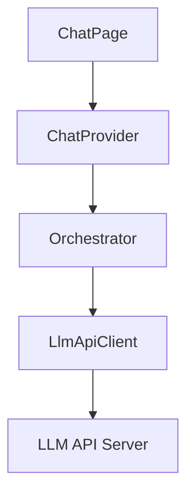
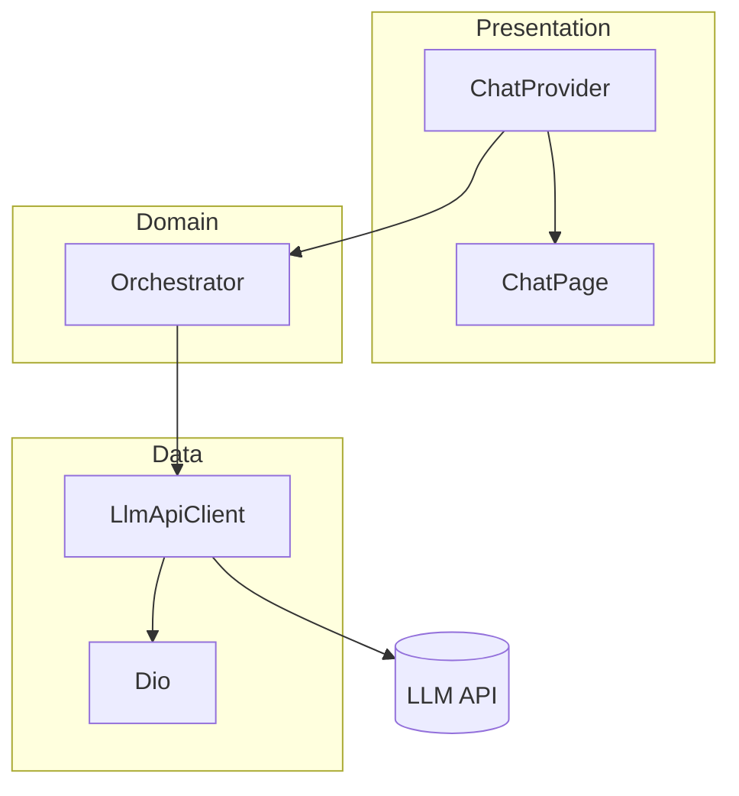
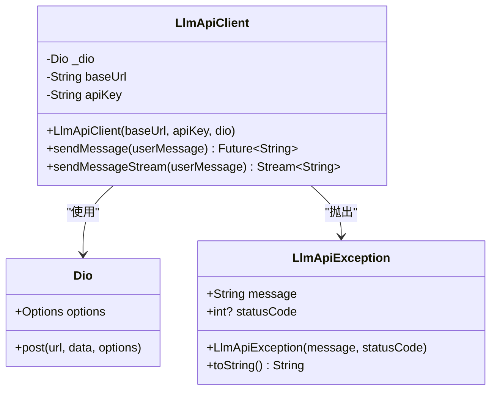
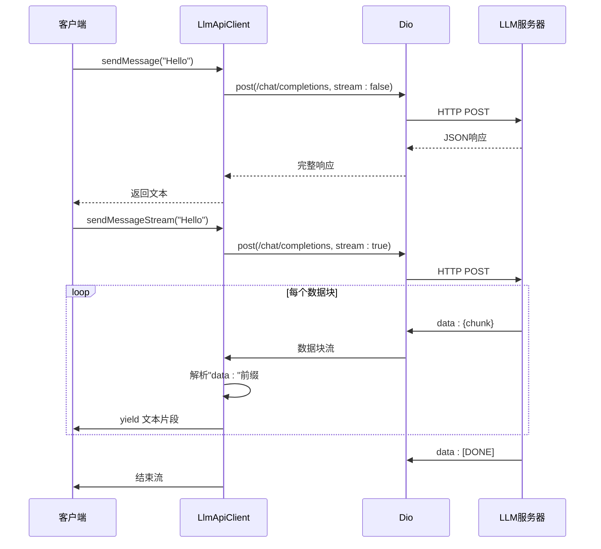
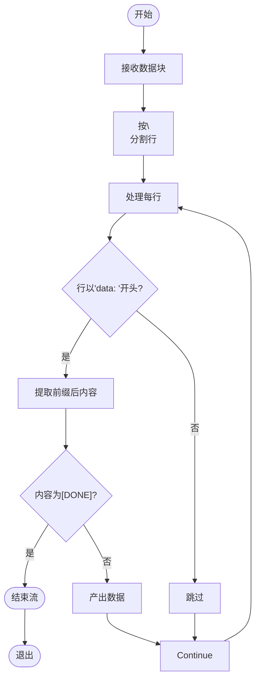
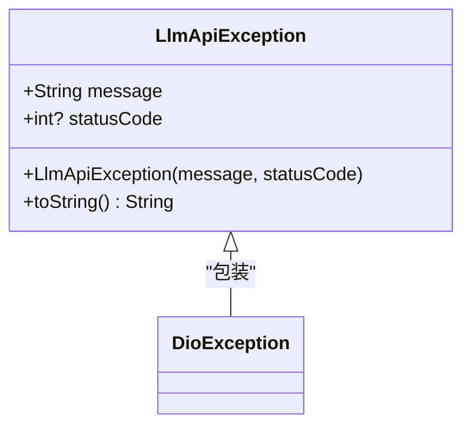
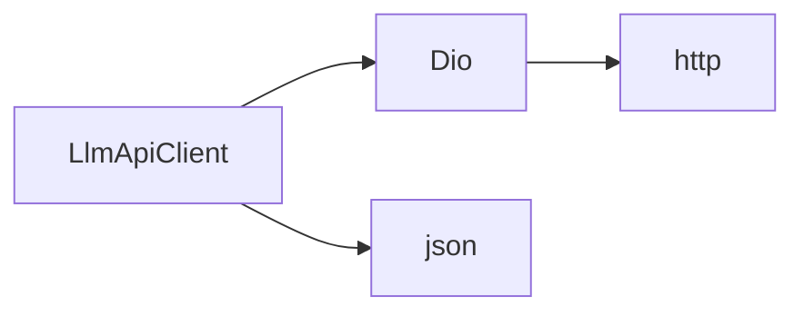

# LLM API客户端

<cite>
**本文档引用的文件**  
- [llm_api_client.dart](file://lib/features/chat/data/llm_api_client.dart)
- [chat_message.dart](file://lib/features/chat/domain/entities/chat_message.dart)
- [chat_provider.dart](file://lib/features/chat/presentation/providers/chat_provider.dart)
- [orchestrator.dart](file://lib/features/chat/domain/orchestrator/orchestrator.dart)
- [orchestrator_interface.dart](file://lib/features/chat/domain/orchestrator/orchestrator_interface.dart)
- [pubspec.yaml](file://pubspec.yaml)
</cite>

## 目录
1. [简介](#简介)
2. [项目结构](#项目结构)
3. [核心组件](#核心组件)
4. [架构概述](#架构概述)
5. [详细组件分析](#详细组件分析)
6. [依赖分析](#依赖分析)
7. [性能考虑](#性能考虑)
8. [故障排除指南](#故障排除指南)
9. [结论](#结论)

## 简介
本文档全面记录了NEuropean项目中LLM API客户端的网络通信机制。重点分析了基于Dio的HTTP客户端配置、非流式与流式消息发送方法的实现差异、SSE协议解析逻辑、自定义异常处理机制，并提出增强方案以提升可靠性与安全性。

## 项目结构
LLM API客户端位于`lib/features/chat/data/llm_api_client.dart`，是聊天功能模块的数据层核心组件。该客户端通过Dio库与远程LLM服务通信，封装了请求构造、响应解析和错误处理逻辑。

**Diagram sources**
- [chat_page.dart](file://lib/features/chat/presentation/pages/chat_page.dart#L6-L120)
- [chat_provider.dart](file://lib/features/chat/presentation/providers/chat_provider.dart#L1-L63)
- [orchestrator.dart](file://lib/features/chat/domain/orchestrator/orchestrator.dart#L1-L49)
- [llm_api_client.dart](file://lib/features/chat/data/llm_api_client.dart#L1-L115)

**Section sources**
- [llm_api_client.dart](file://lib/features/chat/data/llm_api_client.dart#L1-L115)
- [pubspec.yaml](file://pubspec.yaml#L45-L47)

## 核心组件
`LlmApiClient`类封装了与LLM服务通信的所有网络操作，包括初始化配置、非流式请求、流式SSE请求及异常处理。`LlmApiException`类提供结构化错误信息，便于上层处理。

**Section sources**
- [llm_api_client.dart](file://lib/features/chat/data/llm_api_client.dart#L3-L115)

## 架构概述
系统采用分层架构，UI层通过Riverpod状态管理与Orchestrator交互，Orchestrator协调业务逻辑并调用LlmApiClient进行网络通信。Dio作为HTTP客户端，支持同步与流式响应。

**Diagram sources**
- [llm_api_client.dart](file://lib/features/chat/data/llm_api_client.dart#L3-L115)
- [orchestrator.dart](file://lib/features/chat/domain/orchestrator/orchestrator.dart#L1-L49)
- [chat_provider.dart](file://lib/features/chat/presentation/providers/chat_provider.dart#L1-L63)

## 详细组件分析

### LlmApiClient 分析
`LlmApiClient`负责初始化Dio客户端并配置基础URL、认证头和内容类型。它提供两种消息发送方式：`sendMessage`用于非流式响应，`sendMessageStream`用于流式SSE响应。

#### 初始化配置
客户端在构造时接收`baseUrl`和`apiKey`，并配置Dio实例的默认选项，包括Bearer Token认证和JSON内容类型。

**Diagram sources**
- [llm_api_client.dart](file://lib/features/chat/data/llm_api_client.dart#L3-L115)

**Section sources**
- [llm_api_client.dart](file://lib/features/chat/data/llm_api_client.dart#L8-L18)

#### 非流式与流式方法对比
`sendMessage`发送普通POST请求，等待完整响应后解析JSON返回文本。`sendMessageStream`启用流式传输，逐块接收SSE数据，实时解析并产出文本片段。

**Diagram sources**
- [llm_api_client.dart](file://lib/features/chat/data/llm_api_client.dart#L21-L98)

**Section sources**
- [llm_api_client.dart](file://lib/features/chat/data/llm_api_client.dart#L21-L98)

#### SSE协议解析逻辑
流式方法通过`ResponseType.stream`接收字节流，按行分割后检查`data: `前缀，提取有效数据。遇到`[DONE]`信号时终止流，确保正确结束会话。

**Diagram sources**
- [llm_api_client.dart](file://lib/features/chat/data/llm_api_client.dart#L73-L90)

**Section sources**
- [llm_api_client.dart](file://lib/features/chat/data/llm_api_client.dart#L54-L98)

### LlmApiException 自定义异常
该异常类封装错误消息和HTTP状态码，提供统一的错误处理接口。捕获DioException并转换为LlmApiException，保留底层错误信息。

**Diagram sources**
- [llm_api_client.dart](file://lib/features/chat/data/llm_api_client.dart#L102-L115)

**Section sources**
- [llm_api_client.dart](file://lib/features/chat/data/llm_api_client.dart#L43-L49)

## 依赖分析
`LlmApiClient`直接依赖Dio库进行HTTP通信，通过`pubspec.yaml`声明版本。上层组件通过依赖注入使用该客户端，降低耦合度。

**Diagram sources**
- [llm_api_client.dart](file://lib/features/chat/data/llm_api_client.dart#L1-L2)
- [pubspec.yaml](file://pubspec.yaml#L45-L47)

**Section sources**
- [llm_api_client.dart](file://lib/features/chat/data/llm_api_client.dart#L1-L2)
- [pubspec.yaml](file://pubspec.yaml#L45-L47)

## 性能考虑
- 流式传输减少用户等待时间，提升交互体验
- 连接复用避免重复握手开销
- 异常捕获防止崩溃，保障稳定性
- 建议增加请求缓存机制以减少重复调用

## 故障排除指南
常见问题包括网络超时、认证失败和SSE解析错误。应检查API密钥有效性、网络连接状态及服务器响应格式。调试时可启用Dio日志拦截器。

**Section sources**
- [llm_api_client.dart](file://lib/features/chat/data/llm_api_client.dart#L43-L98)

## 结论
`LlmApiClient`实现了完整的LLM服务通信功能，支持同步与流式交互。通过合理封装Dio客户端，提供了简洁易用的API接口。建议后续增强超时控制、重试机制和API密钥安全管理。