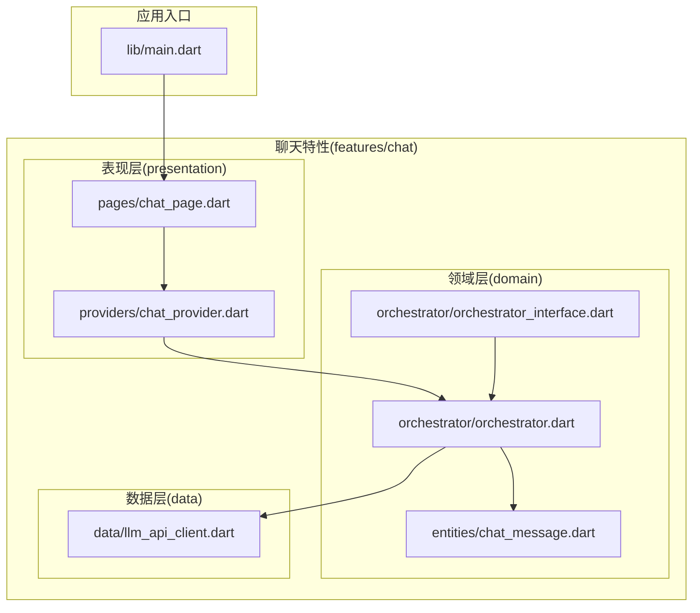
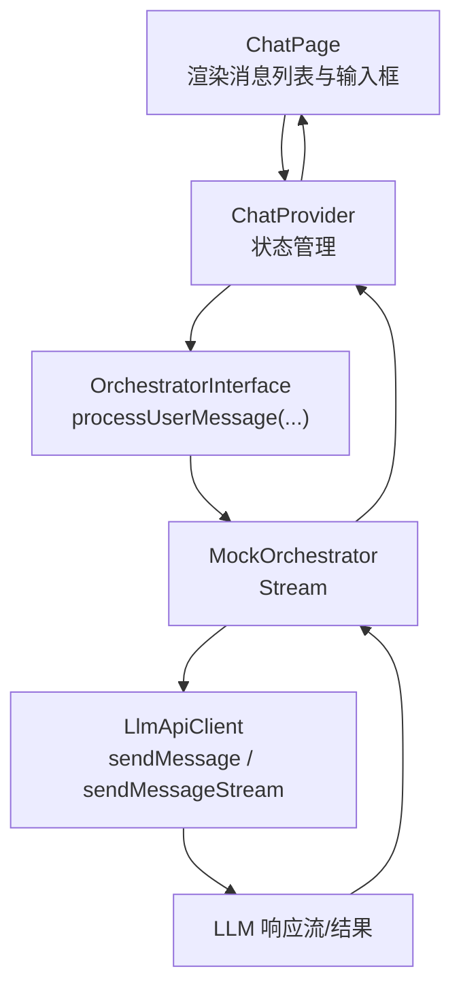
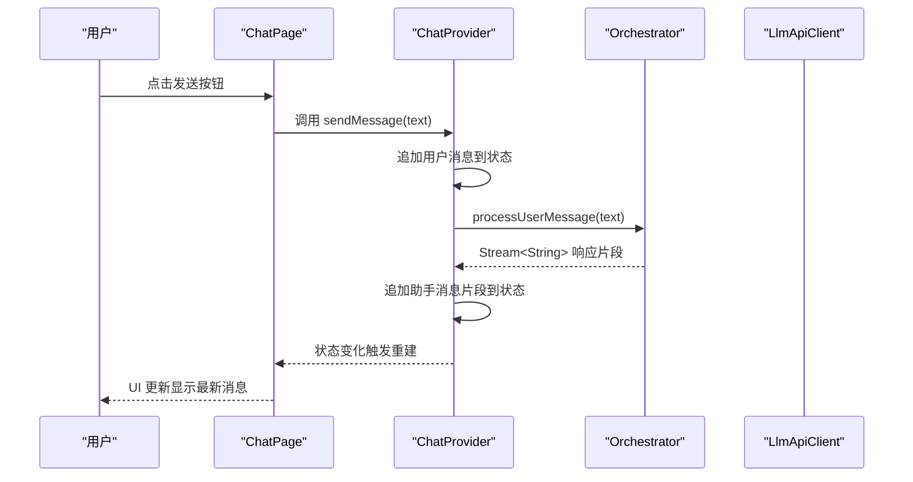
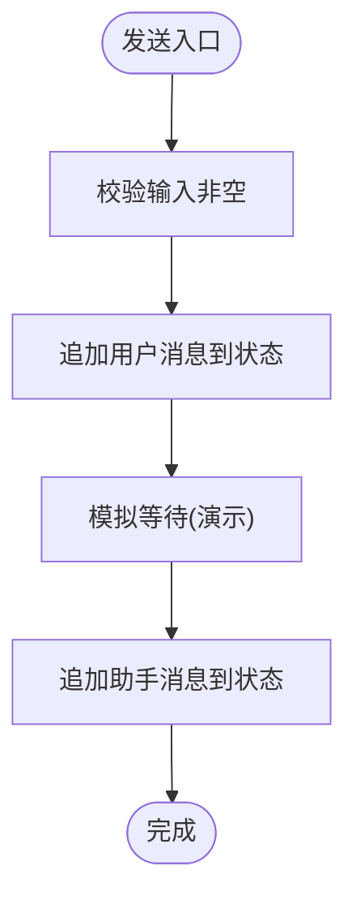
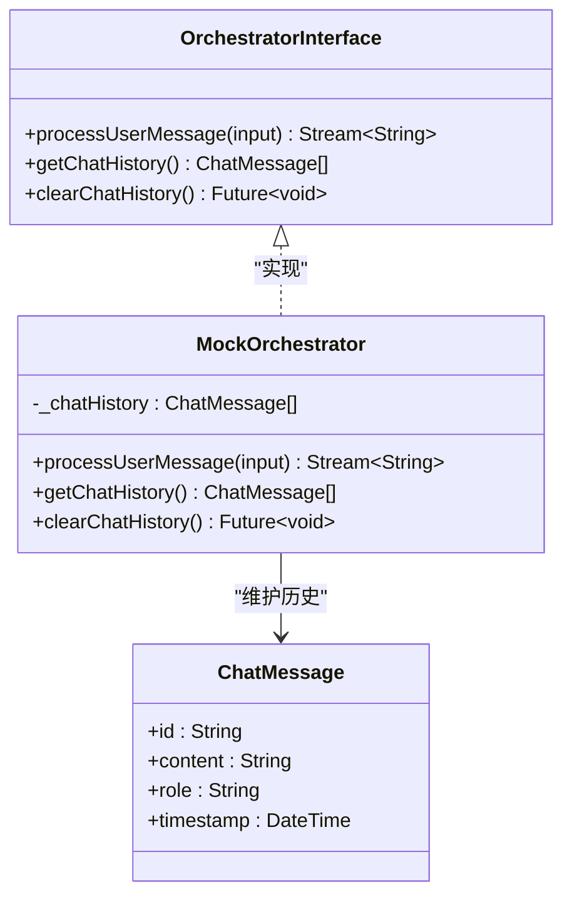
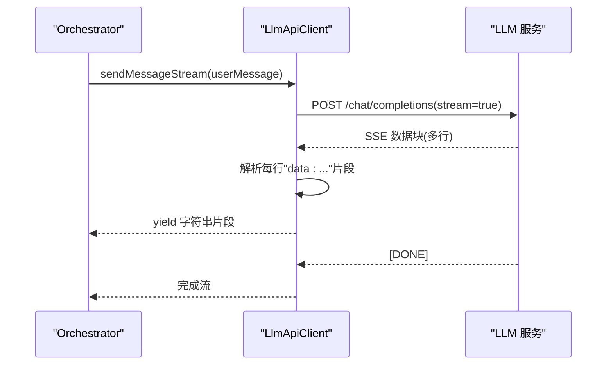
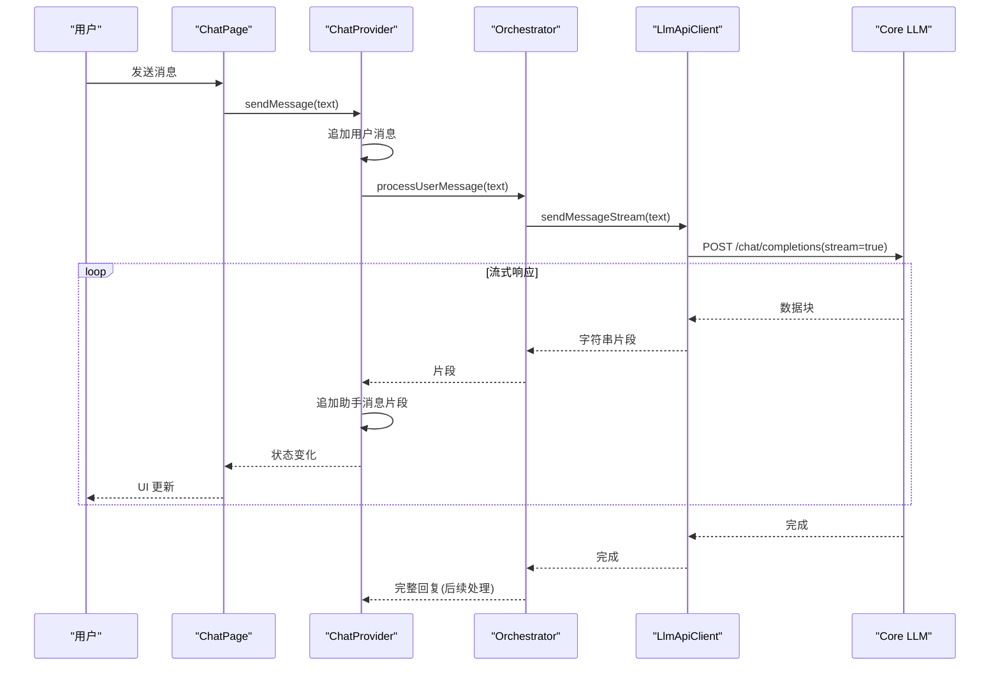
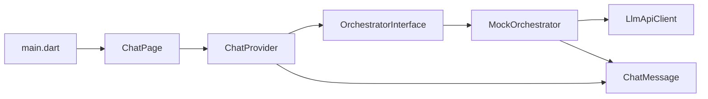

# 聊天功能模块

<cite>
**本文引用的文件**
- [lib/main.dart](file://lib/main.dart)
- [lib/features/chat/presentation/pages/chat_page.dart](file://lib/features/chat/presentation/pages/chat_page.dart)
- [lib/features/chat/presentation/providers/chat_provider.dart](file://lib/features/chat/presentation/providers/chat_provider.dart)
- [lib/features/chat/domain/entities/chat_message.dart](file://lib/features/chat/domain/entities/chat_message.dart)
- [lib/features/chat/domain/orchestrator/orchestrator_interface.dart](file://lib/features/chat/domain/orchestrator/orchestrator_interface.dart)
- [lib/features/chat/domain/orchestrator/orchestrator.dart](file://lib/features/chat/domain/orchestrator/orchestrator.dart)
- [lib/features/chat/data/llm_api_client.dart](file://lib/features/chat/data/llm_api_client.dart)
- [SDD.md](file://SDD.md)
</cite>

## 目录
1. [引言](#引言)
2. [项目结构](#项目结构)
3. [核心组件](#核心组件)
4. [架构总览](#架构总览)
5. [详细组件分析](#详细组件分析)
6. [依赖关系分析](#依赖关系分析)
7. [性能考量](#性能考量)
8. [故障排查指南](#故障排查指南)
9. [结论](#结论)
10. [附录](#附录)

## 引言
本文件系统性地文档化聊天功能模块的实现机制，围绕以下目标展开：
- 解释 chat_page.dart 如何渲染消息列表与输入框；
- 解释 chat_provider.dart 如何管理聊天状态并与 Orchestrator 交互；
- 剖析 orchestrator.dart 作为核心业务逻辑引擎，如何协调 LLM API 调用、消息流处理与状态更新；
- 说明 llm_api_client.dart 如何封装 Dio 进行流式响应处理；
- 说明 chat_message.dart 实体的设计原则；
- 结合 SDD.md 中的序列图，描述从用户消息发送到 AI 回复接收的完整数据流，以及流式更新 UI 的实现细节。

## 项目结构
聊天功能模块位于 features/chat 目录下，采用 Clean Architecture 分层组织：
- presentation：页面与状态提供者（UI 层）
- domain：实体与编排器接口/实现（业务逻辑层）
- data：LLM API 客户端（数据层）

图表来源
- [lib/main.dart](file://lib/main.dart#L1-L33)
- [lib/features/chat/presentation/pages/chat_page.dart](file://lib/features/chat/presentation/pages/chat_page.dart#L1-L120)
- [lib/features/chat/presentation/providers/chat_provider.dart](file://lib/features/chat/presentation/providers/chat_provider.dart#L1-L63)
- [lib/features/chat/domain/entities/chat_message.dart](file://lib/features/chat/domain/entities/chat_message.dart#L1-L13)
- [lib/features/chat/domain/orchestrator/orchestrator_interface.dart](file://lib/features/chat/domain/orchestrator/orchestrator_interface.dart#L1-L13)
- [lib/features/chat/domain/orchestrator/orchestrator.dart](file://lib/features/chat/domain/orchestrator/orchestrator.dart#L1-L49)
- [lib/features/chat/data/llm_api_client.dart](file://lib/features/chat/data/llm_api_client.dart#L1-L115)

章节来源
- [lib/main.dart](file://lib/main.dart#L1-L33)
- [lib/features/chat/presentation/pages/chat_page.dart](file://lib/features/chat/presentation/pages/chat_page.dart#L1-L120)
- [lib/features/chat/presentation/providers/chat_provider.dart](file://lib/features/chat/presentation/providers/chat_provider.dart#L1-L63)
- [lib/features/chat/domain/entities/chat_message.dart](file://lib/features/chat/domain/entities/chat_message.dart#L1-L13)
- [lib/features/chat/domain/orchestrator/orchestrator_interface.dart](file://lib/features/chat/domain/orchestrator/orchestrator_interface.dart#L1-L13)
- [lib/features/chat/domain/orchestrator/orchestrator.dart](file://lib/features/chat/domain/orchestrator/orchestrator.dart#L1-L49)
- [lib/features/chat/data/llm_api_client.dart](file://lib/features/chat/data/llm_api_client.dart#L1-L115)

## 核心组件
- ChatMessage 实体：定义消息的基本属性（标识、内容、角色、时间戳），用于统一表示用户、助手、系统等不同来源的消息。
- ChatPage 页面：负责渲染消息列表与输入框，监听状态提供者，触发发送消息操作。
- ChatProvider 状态提供者：管理消息列表与发送函数；当前为演示用途，直接追加模拟消息。
- Orchestrator 接口与实现：定义消息处理流式接口、聊天历史查询与清理；当前实现为模拟，后续将接入 LLM API。
- LlmApiClient：封装 Dio，支持非流式与流式两种调用方式，抛出统一异常类型。

章节来源
- [lib/features/chat/domain/entities/chat_message.dart](file://lib/features/chat/domain/entities/chat_message.dart#L1-L13)
- [lib/features/chat/presentation/pages/chat_page.dart](file://lib/features/chat/presentation/pages/chat_page.dart#L1-L120)
- [lib/features/chat/presentation/providers/chat_provider.dart](file://lib/features/chat/presentation/providers/chat_provider.dart#L1-L63)
- [lib/features/chat/domain/orchestrator/orchestrator_interface.dart](file://lib/features/chat/domain/orchestrator/orchestrator_interface.dart#L1-L13)
- [lib/features/chat/domain/orchestrator/orchestrator.dart](file://lib/features/chat/domain/orchestrator/orchestrator.dart#L1-L49)
- [lib/features/chat/data/llm_api_client.dart](file://lib/features/chat/data/llm_api_client.dart#L1-L115)

## 架构总览
聊天模块遵循 Clean Architecture 分层，UI 与业务逻辑解耦，通过 Riverpod 进行状态管理与依赖注入。

图表来源
- [lib/features/chat/presentation/pages/chat_page.dart](file://lib/features/chat/presentation/pages/chat_page.dart#L1-L120)
- [lib/features/chat/presentation/providers/chat_provider.dart](file://lib/features/chat/presentation/providers/chat_provider.dart#L1-L63)
- [lib/features/chat/domain/orchestrator/orchestrator_interface.dart](file://lib/features/chat/domain/orchestrator/orchestrator_interface.dart#L1-L13)
- [lib/features/chat/domain/orchestrator/orchestrator.dart](file://lib/features/chat/domain/orchestrator/orchestrator.dart#L1-L49)
- [lib/features/chat/data/llm_api_client.dart](file://lib/features/chat/data/llm_api_client.dart#L1-L115)

## 详细组件分析

### ChatPage：消息列表与输入框渲染
- 列表渲染：使用 ListView.builder，按消息数量构建消息气泡，区分用户与助手角色，设置不同背景与头像。
- 输入框：TextField 支持多行输入，IconButton 触发发送；发送前清空输入框，调用 Provider 的发送函数。
- 状态订阅：通过 Riverpod 的 ref.watch 订阅消息列表与发送函数 Provider，实现 UI 自动刷新。

图表来源
- [lib/features/chat/presentation/pages/chat_page.dart](file://lib/features/chat/presentation/pages/chat_page.dart#L1-L120)
- [lib/features/chat/presentation/providers/chat_provider.dart](file://lib/features/chat/presentation/providers/chat_provider.dart#L1-L63)
- [lib/features/chat/domain/orchestrator/orchestrator_interface.dart](file://lib/features/chat/domain/orchestrator/orchestrator_interface.dart#L1-L13)
- [lib/features/chat/domain/orchestrator/orchestrator.dart](file://lib/features/chat/domain/orchestrator/orchestrator.dart#L1-L49)
- [lib/features/chat/data/llm_api_client.dart](file://lib/features/chat/data/llm_api_client.dart#L1-L115)

章节来源
- [lib/features/chat/presentation/pages/chat_page.dart](file://lib/features/chat/presentation/pages/chat_page.dart#L1-L120)

### ChatProvider：状态管理与发送流程
- 消息列表 Provider：初始包含模拟消息，支持通过 notifier.state 追加新消息。
- 发送函数 Provider：接收用户输入，构造用户消息并追加到状态；随后模拟等待与生成助手消息并追加到状态。
- 当前实现为演示用途，后续可替换为真实 Orchestrator 调用。

图表来源
- [lib/features/chat/presentation/providers/chat_provider.dart](file://lib/features/chat/presentation/providers/chat_provider.dart#L1-L63)

章节来源
- [lib/features/chat/presentation/providers/chat_provider.dart](file://lib/features/chat/presentation/providers/chat_provider.dart#L1-L63)

### Orchestrator：核心业务逻辑引擎
- 接口职责：定义 processUserMessage 返回流式响应、提供聊天历史查询与清理能力。
- 当前实现：模拟用户消息加入历史，延迟后生成固定响应，再按词切分以模拟流式输出；提供只读历史与清空历史方法。
- 后续演进：根据 SDD 的编排流程，将接入 Planner、上下文检索、Prompt 组装、Token 裁剪、Core LLM 生成与 Post-Process Agent 状态更新。

图表来源
- [lib/features/chat/domain/orchestrator/orchestrator_interface.dart](file://lib/features/chat/domain/orchestrator/orchestrator_interface.dart#L1-L13)
- [lib/features/chat/domain/orchestrator/orchestrator.dart](file://lib/features/chat/domain/orchestrator/orchestrator.dart#L1-L49)
- [lib/features/chat/domain/entities/chat_message.dart](file://lib/features/chat/domain/entities/chat_message.dart#L1-L13)

章节来源
- [lib/features/chat/domain/orchestrator/orchestrator_interface.dart](file://lib/features/chat/domain/orchestrator/orchestrator_interface.dart#L1-L13)
- [lib/features/chat/domain/orchestrator/orchestrator.dart](file://lib/features/chat/domain/orchestrator/orchestrator.dart#L1-L49)
- [lib/features/chat/domain/entities/chat_message.dart](file://lib/features/chat/domain/entities/chat_message.dart#L1-L13)

### LlmApiClient：Dio 封装与流式处理
- 非流式调用：POST /chat/completions，返回完整响应内容。
- 流式调用：开启 stream=true，设置 responseType=stream，逐行解析 SSE 数据，过滤“data: ”前缀与 [DONE] 结束标记，逐块产出字符串。
- 异常处理：统一包装为 LlmApiException，携带错误信息与可选状态码。

图表来源
- [lib/features/chat/data/llm_api_client.dart](file://lib/features/chat/data/llm_api_client.dart#L1-L115)

章节来源
- [lib/features/chat/data/llm_api_client.dart](file://lib/features/chat/data/llm_api_client.dart#L1-L115)

### ChatMessage 实体：设计原则
- 不可变性：字段均为 final，保证消息对象在生命周期内稳定。
- 角色语义：role 字段用于区分 user/assistant/system，便于 UI 区分与后续 Prompt 组装。
- 时间戳：记录消息创建时间，便于排序与历史展示。
- 可扩展：未来可添加元数据、附件等字段，保持与 SDD 中 ChatLog 等实体的兼容性。

章节来源
- [lib/features/chat/domain/entities/chat_message.dart](file://lib/features/chat/domain/entities/chat_message.dart#L1-L13)

### 用户消息到 AI 回复的完整数据流（结合 SDD 序列图）
- 用户在 ChatPage 输入消息并点击发送；
- ChatPage 调用 ChatProvider 的发送函数；
- ChatProvider 追加用户消息到状态，随后调用 Orchestrator.processUserMessage；
- Orchestrator 模拟处理（后续将接入 Planner、检索、Prompt 组装、Token 裁剪）；
- Orchestrator 通过 LlmApiClient 发起 Core LLM 请求，接收流式响应；
- Orchestrator 将响应片段逐块返回给 ChatProvider；
- ChatProvider 追加助手消息片段到状态，触发 UI 重建；
- 最终完整回复生成后，Orchestrator 可调用 Post-Process Agent 更新 RPG 变量并持久化。

图表来源
- [lib/features/chat/presentation/pages/chat_page.dart](file://lib/features/chat/presentation/pages/chat_page.dart#L1-L120)
- [lib/features/chat/presentation/providers/chat_provider.dart](file://lib/features/chat/presentation/providers/chat_provider.dart#L1-L63)
- [lib/features/chat/domain/orchestrator/orchestrator_interface.dart](file://lib/features/chat/domain/orchestrator/orchestrator_interface.dart#L1-L13)
- [lib/features/chat/domain/orchestrator/orchestrator.dart](file://lib/features/chat/domain/orchestrator/orchestrator.dart#L1-L49)
- [lib/features/chat/data/llm_api_client.dart](file://lib/features/chat/data/llm_api_client.dart#L1-L115)
- [SDD.md](file://SDD.md#L140-L175)

章节来源
- [SDD.md](file://SDD.md#L140-L175)
- [lib/features/chat/presentation/pages/chat_page.dart](file://lib/features/chat/presentation/pages/chat_page.dart#L1-L120)
- [lib/features/chat/presentation/providers/chat_provider.dart](file://lib/features/chat/presentation/providers/chat_provider.dart#L1-L63)
- [lib/features/chat/domain/orchestrator/orchestrator.dart](file://lib/features/chat/domain/orchestrator/orchestrator.dart#L1-L49)
- [lib/features/chat/data/llm_api_client.dart](file://lib/features/chat/data/llm_api_client.dart#L1-L115)

## 依赖关系分析
- ChatPage 依赖 ChatProvider 提供的状态与发送函数；
- ChatProvider 依赖 Orchestrator 接口（当前由 MockOrchestrator 实现）；
- Orchestrator 依赖 LlmApiClient 进行 LLM 调用；
- ChatMessage 为跨层共享实体，被 Orchestrator 与 Provider 共同使用；
- 应用入口通过 ProviderScope 提供全局状态容器，路由由 app_router.dart 管理。

图表来源
- [lib/features/chat/presentation/pages/chat_page.dart](file://lib/features/chat/presentation/pages/chat_page.dart#L1-L120)
- [lib/features/chat/presentation/providers/chat_provider.dart](file://lib/features/chat/presentation/providers/chat_provider.dart#L1-L63)
- [lib/features/chat/domain/orchestrator/orchestrator_interface.dart](file://lib/features/chat/domain/orchestrator/orchestrator_interface.dart#L1-L13)
- [lib/features/chat/domain/orchestrator/orchestrator.dart](file://lib/features/chat/domain/orchestrator/orchestrator.dart#L1-L49)
- [lib/features/chat/data/llm_api_client.dart](file://lib/features/chat/data/llm_api_client.dart#L1-L115)
- [lib/features/chat/domain/entities/chat_message.dart](file://lib/features/chat/domain/entities/chat_message.dart#L1-L13)
- [lib/main.dart](file://lib/main.dart#L1-L33)

章节来源
- [lib/main.dart](file://lib/main.dart#L1-L33)
- [lib/features/chat/presentation/pages/chat_page.dart](file://lib/features/chat/presentation/pages/chat_page.dart#L1-L120)
- [lib/features/chat/presentation/providers/chat_provider.dart](file://lib/features/chat/presentation/providers/chat_provider.dart#L1-L63)
- [lib/features/chat/domain/orchestrator/orchestrator_interface.dart](file://lib/features/chat/domain/orchestrator/orchestrator_interface.dart#L1-L13)
- [lib/features/chat/domain/orchestrator/orchestrator.dart](file://lib/features/chat/domain/orchestrator/orchestrator.dart#L1-L49)
- [lib/features/chat/data/llm_api_client.dart](file://lib/features/chat/data/llm_api_client.dart#L1-L115)
- [lib/features/chat/domain/entities/chat_message.dart](file://lib/features/chat/domain/entities/chat_message.dart#L1-L13)

## 性能考量
- 列表渲染：使用 ListView.builder，按需构建子项，避免一次性渲染大量消息导致的卡顿。
- 状态更新：Riverpod 的细粒度状态变更可减少不必要的重建；建议在 Provider 中合并多次状态更新，降低 UI 重绘频率。
- 流式处理：在 Orchestrator 中按块处理响应，逐步追加到状态，避免一次性拼接大字符串带来的内存峰值。
- 网络请求：流式响应通过 SSE 分块传输，前端逐块渲染，提升首屏体验；注意在异常情况下及时取消流订阅。
- 模拟阶段：当前 Provider 与 Orchestrator 为演示实现，后续接入真实 LLM 时需考虑超时、重试与降级策略。

## 故障排查指南
- LLM API 异常：LlmApiClient 在捕获 DioException 或其他异常时，会抛出 LlmApiException，包含错误信息与可选状态码。可在 UI 层捕获并提示用户。
- 流式解析问题：SSE 行解析可能遇到格式不规范的情况，当前实现会跳过异常片段；若出现长时间无响应，检查服务端是否正确发送 data: 前缀与 [DONE] 结束标记。
- 状态未更新：确认 ChatProvider 是否正确追加消息到状态；检查 Riverpod Provider 的作用域与 ref.watch 的使用是否正确。
- UI 不刷新：确认状态变更后是否触发了 rebuild；对于长列表，可考虑使用 AnimatedList 或手动控制滚动位置。

章节来源
- [lib/features/chat/data/llm_api_client.dart](file://lib/features/chat/data/llm_api_client.dart#L1-L115)
- [lib/features/chat/presentation/providers/chat_provider.dart](file://lib/features/chat/presentation/providers/chat_provider.dart#L1-L63)

## 结论
聊天功能模块以 Clean Architecture 为核心，通过 Riverpod 实现 UI 与业务逻辑的解耦。当前实现处于演示阶段，后续将按 SDD 的编排流程接入 Planner、检索、Prompt 组装、Token 裁剪与 Post-Process Agent，同时完善 LLM API 的流式处理与异常恢复机制，最终实现从用户消息到 AI 回复的完整闭环与流畅的 UI 流式更新体验。

## 附录
- SDD 中关于编排器与消息流的详细流程图可参考 SDD.md 的序列图部分，该图清晰展示了从 UI 到 Orchestrator、Planner、数据层、Core LLM 与 Post-Process Agent 的交互过程与流式响应链路。

章节来源
- [SDD.md](file://SDD.md#L140-L175)