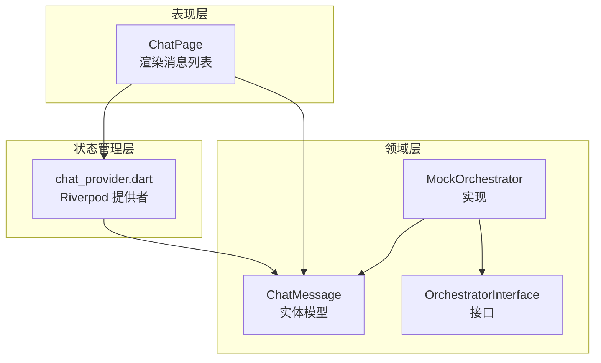
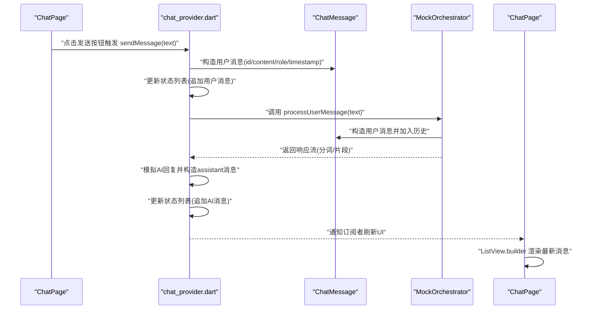
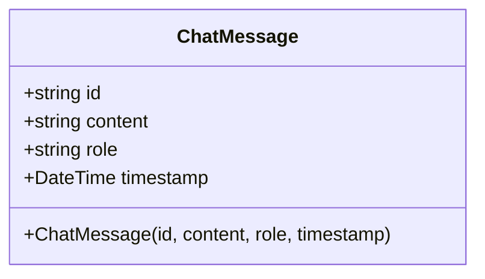
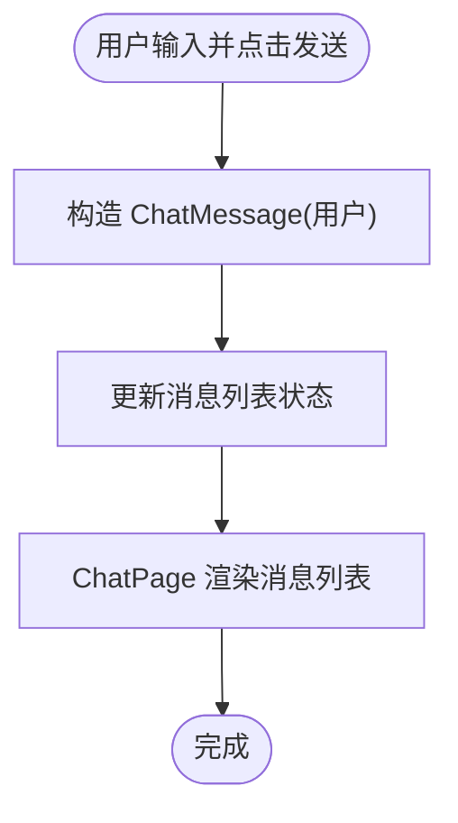
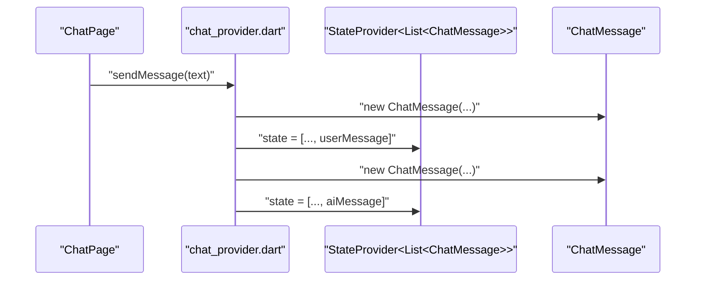
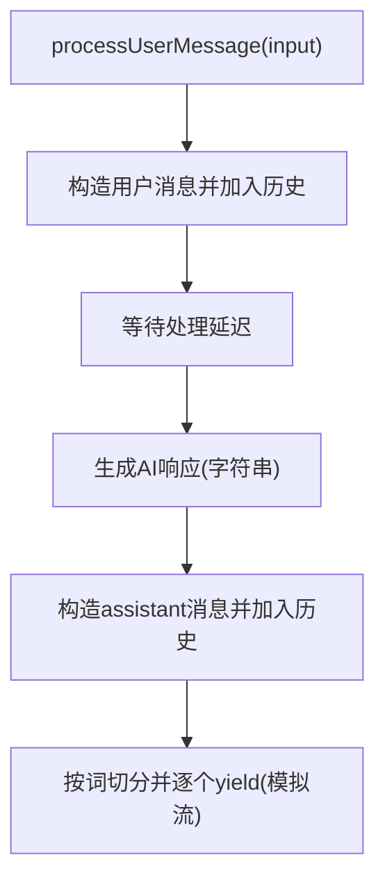
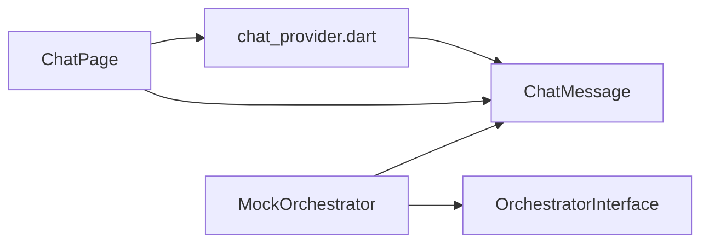

# 聊天数据模型

<cite>
**本文引用的文件**
- [chat_message.dart](file://lib/features/chat/domain/entities/chat_message.dart)
- [chat_page.dart](file://lib/features/chat/presentation/pages/chat_page.dart)
- [chat_provider.dart](file://lib/features/chat/presentation/providers/chat_provider.dart)
- [orchestrator.dart](file://lib/features/chat/domain/orchestrator/orchestrator.dart)
- [orchestrator_interface.dart](file://lib/features/chat/domain/orchestrator/orchestrator_interface.dart)
</cite>

## 目录
1. [引言](#引言)
2. [项目结构](#项目结构)
3. [核心组件](#核心组件)
4. [架构总览](#架构总览)
5. [详细组件分析](#详细组件分析)
6. [依赖关系分析](#依赖关系分析)
7. [性能考量](#性能考量)
8. [故障排查指南](#故障排查指南)
9. [结论](#结论)
10. [附录](#附录)

## 引言
本文件围绕 ChatMessage 实体模型展开，系统性地阐述其结构与语义、构造函数命名参数的设计意图、在各层之间的流转路径，以及面向未来的扩展建议（消息状态、富媒体内容、序列化/反序列化）。文档同时给出与仓库现有实现相对应的图示与来源标注，帮助读者快速定位到具体代码位置。

## 项目结构
本项目采用 Clean Architecture 分层组织，聊天功能位于 features/chat 目录下：
- domain/entities：定义领域实体（ChatMessage）
- domain/orchestrator：定义编排器接口与实现（MockOrchestrator）
- presentation/pages：UI 页面（ChatPage）
- presentation/providers：状态管理（Riverpod）

图表来源
- [chat_page.dart](file://lib/features/chat/presentation/pages/chat_page.dart#L1-L120)
- [chat_provider.dart](file://lib/features/chat/presentation/providers/chat_provider.dart#L1-L63)
- [chat_message.dart](file://lib/features/chat/domain/entities/chat_message.dart#L1-L13)
- [orchestrator_interface.dart](file://lib/features/chat/domain/orchestrator/orchestrator_interface.dart#L1-L13)
- [orchestrator.dart](file://lib/features/chat/domain/orchestrator/orchestrator.dart#L1-L49)

章节来源
- [chat_page.dart](file://lib/features/chat/presentation/pages/chat_page.dart#L1-L120)
- [chat_provider.dart](file://lib/features/chat/presentation/providers/chat_provider.dart#L1-L63)
- [chat_message.dart](file://lib/features/chat/domain/entities/chat_message.dart#L1-L13)
- [orchestrator_interface.dart](file://lib/features/chat/domain/orchestrator/orchestrator_interface.dart#L1-L13)
- [orchestrator.dart](file://lib/features/chat/domain/orchestrator/orchestrator.dart#L1-L49)

## 核心组件
本节聚焦 ChatMessage 实体模型的字段定义、类型与业务含义，并解释构造函数命名参数如何提升可读性。

- 字段与类型
  - id: 字符串。唯一标识每条消息，用于 UI 列表渲染、状态管理去重与持久化索引。
  - content: 字符串。消息正文内容，当前实现仅支持纯文本。
  - role: 字符串。消息来源角色，限定为 'user'、'assistant'、'system' 三类。
  - timestamp: 时间对象。记录消息创建时间，用于排序、显示与统计。

- 构造函数命名参数设计
  - 使用具名参数并在构造函数中要求必填，使调用方显式传递每个字段，避免顺序错误与漏传。
  - 参数名直接对应字段名，语义清晰，便于阅读与维护。
  - 与 Riverpod 状态管理结合时，可直接通过构造函数创建不可变实体，降低副作用风险。

- 业务含义
  - id：保证消息在 UI 列表中的稳定键值，利于动画与滚动定位。
  - content：承载对话内容；未来可扩展为富媒体结构（见“扩展建议”）。
  - role：决定 UI 呈现样式（头像、气泡颜色、对齐方式等）与后续处理逻辑。
  - timestamp：用于时间轴排序与显示，亦可用于消息状态（如“已送达/已读”）的时间戳。

章节来源
- [chat_message.dart](file://lib/features/chat/domain/entities/chat_message.dart#L1-L13)

## 架构总览
下面的序列图展示了从 UI 层创建用户消息，经由状态管理与编排器处理，再到最终在 ChatPage 中渲染的完整流程。

图表来源
- [chat_page.dart](file://lib/features/chat/presentation/pages/chat_page.dart#L1-L120)
- [chat_provider.dart](file://lib/features/chat/presentation/providers/chat_provider.dart#L1-L63)
- [orchestrator.dart](file://lib/features/chat/domain/orchestrator/orchestrator.dart#L1-L49)
- [chat_message.dart](file://lib/features/chat/domain/entities/chat_message.dart#L1-L13)

## 详细组件分析

### ChatMessage 类结构与关系
ChatMessage 是一个轻量级的不可变数据类，被多处模块复用：
- UI 层在渲染时读取其字段决定样式与布局
- 状态管理在更新列表时创建与传递
- 编排器在历史记录与响应生成中使用

图表来源
- [chat_message.dart](file://lib/features/chat/domain/entities/chat_message.dart#L1-L13)

章节来源
- [chat_message.dart](file://lib/features/chat/domain/entities/chat_message.dart#L1-L13)

### UI 层：ChatPage 的消息渲染
- 订阅消息列表与发送函数
- 使用 ListView.builder 按索引访问 ChatMessage
- 根据 role 决定气泡颜色、头像与对齐方式
- 输入框提交后调用 sendMessage，触发状态更新与渲染刷新

图表来源
- [chat_page.dart](file://lib/features/chat/presentation/pages/chat_page.dart#L1-L120)
- [chat_provider.dart](file://lib/features/chat/presentation/providers/chat_provider.dart#L1-L63)
- [chat_message.dart](file://lib/features/chat/domain/entities/chat_message.dart#L1-L13)

章节来源
- [chat_page.dart](file://lib/features/chat/presentation/pages/chat_page.dart#L1-L120)
- [chat_provider.dart](file://lib/features/chat/presentation/providers/chat_provider.dart#L1-L63)

### 状态管理：chat_provider 的消息创建与更新
- 使用 Riverpod 的 StateProvider 维护消息列表
- 使用 Provider 暴露 sendMessage 函数，内部构造用户消息并更新状态
- 在演示场景中，随后模拟 AI 回复并构造 assistant 消息，再次更新状态

图表来源
- [chat_provider.dart](file://lib/features/chat/presentation/providers/chat_provider.dart#L1-L63)
- [chat_message.dart](file://lib/features/chat/domain/entities/chat_message.dart#L1-L13)

章节来源
- [chat_provider.dart](file://lib/features/chat/presentation/providers/chat_provider.dart#L1-L63)

### 领域层：MockOrchestrator 的消息处理
- 接收用户输入，构造用户消息并加入历史
- 模拟处理延迟与分片输出，返回响应流
- 提供获取历史与清空历史的方法

图表来源
- [orchestrator.dart](file://lib/features/chat/domain/orchestrator/orchestrator.dart#L1-L49)
- [chat_message.dart](file://lib/features/chat/domain/entities/chat_message.dart#L1-L13)

章节来源
- [orchestrator.dart](file://lib/features/chat/domain/orchestrator/orchestrator.dart#L1-L49)

### 接口契约：OrchestratorInterface
- 定义统一的处理入口与历史管理接口，便于替换真实 LLM 实现或测试替身。

章节来源
- [orchestrator_interface.dart](file://lib/features/chat/domain/orchestrator/orchestrator_interface.dart#L1-L13)

## 依赖关系分析
- ChatMessage 作为跨层共享的实体，被 UI、状态管理与编排器共同依赖
- ChatPage 依赖 chat_provider.dart 提供的消息列表与发送函数
- MockOrchestrator 依赖 ChatMessage 并实现 OrchestratorInterface
- 依赖方向自上而下：UI -> Provider -> Domain Entities/Orchestrator

图表来源
- [chat_page.dart](file://lib/features/chat/presentation/pages/chat_page.dart#L1-L120)
- [chat_provider.dart](file://lib/features/chat/presentation/providers/chat_provider.dart#L1-L63)
- [chat_message.dart](file://lib/features/chat/domain/entities/chat_message.dart#L1-L13)
- [orchestrator_interface.dart](file://lib/features/chat/domain/orchestrator/orchestrator_interface.dart#L1-L13)
- [orchestrator.dart](file://lib/features/chat/domain/orchestrator/orchestrator.dart#L1-L49)

章节来源
- [chat_page.dart](file://lib/features/chat/presentation/pages/chat_page.dart#L1-L120)
- [chat_provider.dart](file://lib/features/chat/presentation/providers/chat_provider.dart#L1-L63)
- [chat_message.dart](file://lib/features/chat/domain/entities/chat_message.dart#L1-L13)
- [orchestrator_interface.dart](file://lib/features/chat/domain/orchestrator/orchestrator_interface.dart#L1-L13)
- [orchestrator.dart](file://lib/features/chat/domain/orchestrator/orchestrator.dart#L1-L49)

## 性能考量
- 不可变实体与不可变列表更新：使用 Riverpod 的不可变更新策略，减少不必要的重建与重绘。
- 流式响应：MockOrchestrator 通过分词逐步产出响应，有助于 UI 及时反馈与渐进展示。
- 时间戳排序：在消息较多时，建议在插入时保持有序或使用惰性排序，避免每次渲染都做全量排序。

## 故障排查指南
- 角色值异常：若 role 非 'user'/'assistant'/'system'，UI 渲染样式可能不符合预期。检查消息构造处的 role 设定。
- 列表键冲突：若 id 重复或缺失，可能导致 UI 动画异常或滚动定位问题。确保每次构造 ChatMessage 时提供唯一 id。
- 状态未刷新：确认 sendMessage 是否正确更新了 StateProvider 的状态，且 ChatPage 已订阅对应 provider。
- 编排器未返回流：MockOrchestrator 返回的是字符串流，若 UI 期望接收 ChatMessage，请在上游转换为消息实体后再更新状态。

章节来源
- [chat_page.dart](file://lib/features/chat/presentation/pages/chat_page.dart#L1-L120)
- [chat_provider.dart](file://lib/features/chat/presentation/providers/chat_provider.dart#L1-L63)
- [orchestrator.dart](file://lib/features/chat/domain/orchestrator/orchestrator.dart#L1-L49)

## 结论
ChatMessage 作为聊天系统的最小可渲染单元，结构简洁、职责单一。通过具名构造参数与不可变设计，提升了可读性与可维护性。在 Clean Architecture 下，UI、状态管理与领域层通过 ChatMessage 解耦协作，形成清晰的单向依赖链路。未来可在不破坏现有契约的前提下，平滑扩展消息状态与富媒体能力。

## 附录

### 扩展建议：消息状态
- 新增字段：status（枚举：发送中/已送达/已读）
- 时机：
  - 发送中：构造用户消息后立即入队
  - 已送达：收到服务端确认或本地持久化成功
  - 已读：用户滚动至该消息可视区域或手动标记
- UI 表现：在气泡下方显示小点/勾/时间戳，区分不同状态

章节来源
- [chat_message.dart](file://lib/features/chat/domain/entities/chat_message.dart#L1-L13)

### 扩展建议：富媒体内容
- 新增字段：attachments（数组）或 content（结构化对象），包含：
  - 文本：text
  - 图片：image(url, alt, size)
  - 视频：video(url, thumbnail, duration)
  - 文件：file(url, name, size, mime)
- 渲染策略：根据类型选择对应的 Widget（Text/Image/Video/FileTile）

章节来源
- [chat_message.dart](file://lib/features/chat/domain/entities/chat_message.dart#L1-L13)

### 扩展建议：序列化/反序列化
- JSON 序列化方案：
  - 使用标准 JSON 序列化工具（如 json_serializable 或手工映射）
  - 字段映射：id->id, content->content, role->role, timestamp->timestamp
  - 注意：timestamp 建议序列化为 ISO8601 字符串或毫秒时间戳
- 反序列化校验：
  - 校验 role 是否在允许集合内
  - 校验 id 唯一性与非空
  - 校验 timestamp 合法性
- 持久化：
  - 本地缓存：SharedPreferences 或轻量数据库（如 Hive/Drift）
  - 远程同步：与后端约定字段与格式，注意敏感信息脱敏

章节来源
- [chat_message.dart](file://lib/features/chat/domain/entities/chat_message.dart#L1-L13)