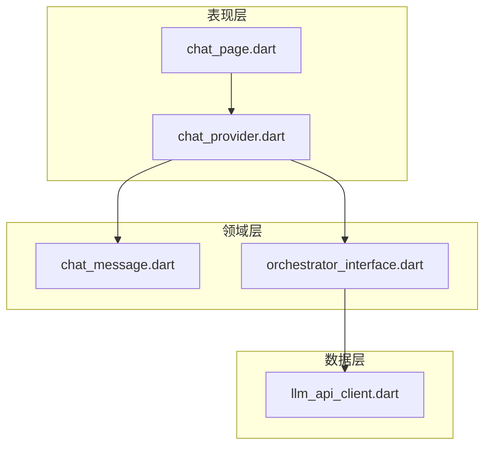
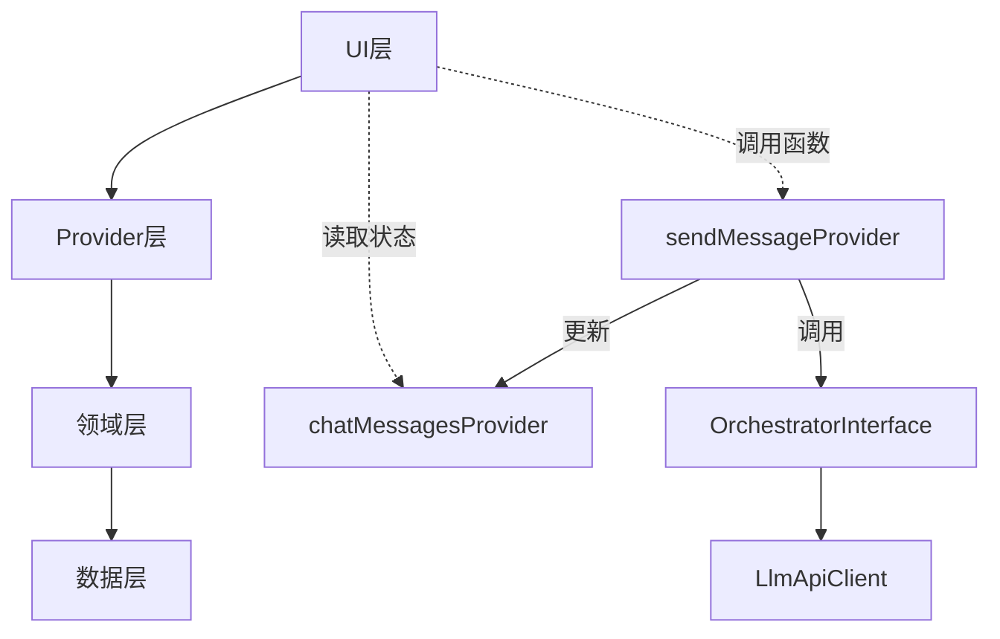
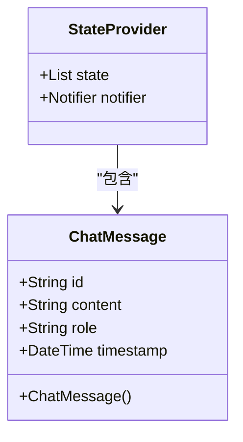
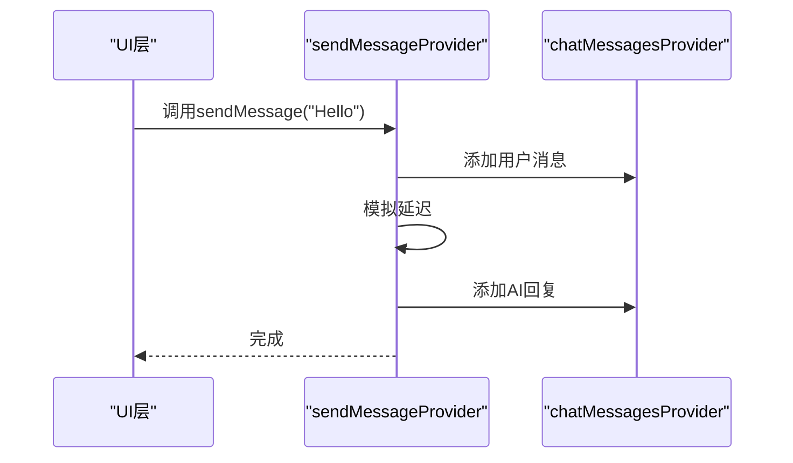
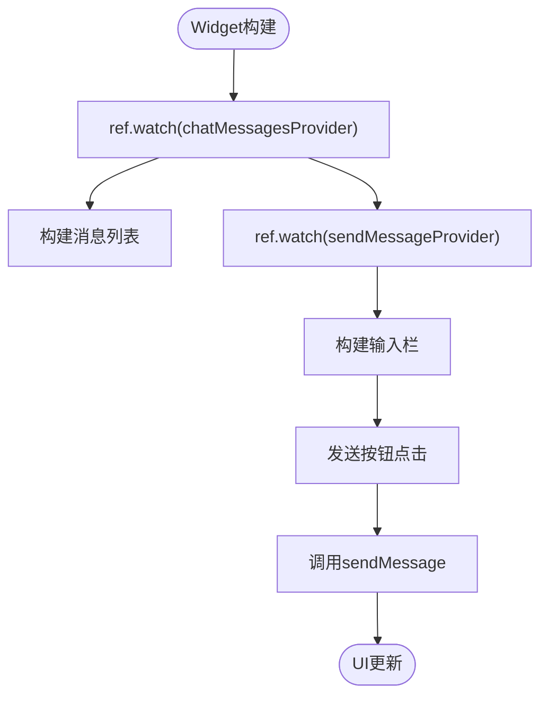
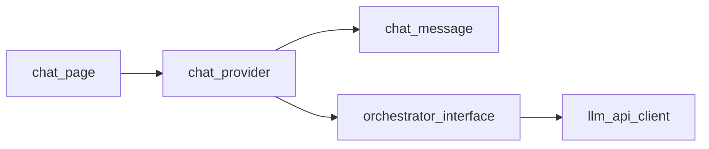

# 聊天状态管理

<cite>
**本文档引用的文件**
- [chat_provider.dart](file://lib/features/chat/presentation/providers/chat_provider.dart)
- [chat_message.dart](file://lib/features/chat/domain/entities/chat_message.dart)
- [chat_page.dart](file://lib/features/chat/presentation/pages/chat_page.dart)
- [llm_api_client.dart](file://lib/features/chat/data/llm_api_client.dart)
- [orchestrator_interface.dart](file://lib/features/chat/domain/orchestrator/orchestrator_interface.dart)
</cite>

## 目录
1. [简介](#简介)
2. [项目结构](#项目结构)
3. [核心组件](#核心组件)
4. [架构概述](#架构概述)
5. [详细组件分析](#详细组件分析)
6. [依赖分析](#依赖分析)
7. [性能考虑](#性能考虑)
8. [故障排除指南](#故障排除指南)
9. [结论](#结论)

## 简介
本文档深入解析NEuropean项目中基于Riverpod的状态管理机制，重点分析`chat_provider.dart`文件中的实现。文档将详细说明聊天消息状态如何通过Riverpod进行管理，包括状态提供者的设计、UI层的消费方式以及测试数据的用途。同时提供状态持久化、错误处理和性能优化的进阶指导。

## 项目结构
NEuropean项目采用Clean Architecture架构，将代码分为核心层、功能层和表现层。聊天功能位于`lib/features/chat/`目录下，遵循分层设计原则：

**Diagram sources**
- [chat_page.dart](file://lib/features/chat/presentation/pages/chat_page.dart#L6-L120)
- [chat_provider.dart](file://lib/features/chat/presentation/providers/chat_provider.dart#L1-L63)
- [chat_message.dart](file://lib/features/chat/domain/entities/chat_message.dart#L1-L13)

**Section sources**
- [chat_provider.dart](file://lib/features/chat/presentation/providers/chat_provider.dart#L1-L63)
- [chat_message.dart](file://lib/features/chat/domain/entities/chat_message.dart#L1-L13)

## 核心组件
文档的核心是分析`chat_provider.dart`中的Riverpod状态管理机制，包括`chatMessagesProvider`和`sendMessageProvider`两个关键提供者。这些组件协同工作，实现了聊天消息的状态管理、用户输入处理和AI回复模拟。

**Section sources**
- [chat_provider.dart](file://lib/features/chat/presentation/providers/chat_provider.dart#L28-L63)
- [chat_message.dart](file://lib/features/chat/domain/entities/chat_message.dart#L1-L13)

## 架构概述
NEuropean聊天功能的架构采用分层模式，各层职责分明：

**Diagram sources**
- [chat_provider.dart](file://lib/features/chat/presentation/providers/chat_provider.dart#L28-L63)
- [orchestrator_interface.dart](file://lib/features/chat/domain/orchestrator/orchestrator_interface.dart#L4-L13)

## 详细组件分析

### 聊天消息状态管理分析
`chatMessagesProvider`作为`StateProvider`管理不可变的聊天消息列表。它通过`ref.read().notifier.state`实现状态更新，确保状态变更的可预测性和可追踪性。

**Diagram sources**
- [chat_message.dart](file://lib/features/chat/domain/entities/chat_message.dart#L1-L13)
- [chat_provider.dart](file://lib/features/chat/presentation/providers/chat_provider.dart#L28-L30)

**Section sources**
- [chat_provider.dart](file://lib/features/chat/presentation/providers/chat_provider.dart#L28-L30)
- [chat_message.dart](file://lib/features/chat/domain/entities/chat_message.dart#L1-L13)

### 发送消息提供者分析
`sendMessageProvider`作为函数提供者，封装了用户消息添加与AI回复模拟的完整逻辑。它通过依赖注入机制，将复杂的业务逻辑从UI层解耦。

**Diagram sources**
- [chat_provider.dart](file://lib/features/chat/presentation/providers/chat_provider.dart#L33-L63)
- [chat_page.dart](file://lib/features/chat/presentation/pages/chat_page.dart#L108-L113)

**Section sources**
- [chat_provider.dart](file://lib/features/chat/presentation/providers/chat_provider.dart#L33-L63)

### UI层消费分析
在`ChatPage`中，通过`ConsumerStatefulWidget`消费Provider，实现了状态驱动的UI更新。`ref.watch()`方法订阅状态变化，确保UI与状态同步。

**Diagram sources**
- [chat_page.dart](file://lib/features/chat/presentation/pages/chat_page.dart#L24-L25)
- [chat_provider.dart](file://lib/features/chat/presentation/providers/chat_provider.dart#L33-L63)

**Section sources**
- [chat_page.dart](file://lib/features/chat/presentation/pages/chat_page.dart#L24-L120)

## 依赖分析
聊天功能的组件依赖关系清晰，遵循依赖倒置原则：

**Diagram sources**
- [chat_page.dart](file://lib/features/chat/presentation/pages/chat_page.dart#L4)
- [chat_provider.dart](file://lib/features/chat/presentation/providers/chat_provider.dart#L3)
- [orchestrator_interface.dart](file://lib/features/chat/domain/orchestrator/orchestrator_interface.dart#L2)

**Section sources**
- [chat_provider.dart](file://lib/features/chat/presentation/providers/chat_provider.dart#L1-L63)
- [chat_page.dart](file://lib/features/chat/presentation/pages/chat_page.dart#L1-L120)

## 性能考虑
当前实现中，每次消息更新都创建新的消息列表实例，虽然保证了不可变性，但在消息量大时可能影响性能。建议在消息量较大时考虑状态分片或虚拟滚动优化。

## 故障排除指南
当遇到聊天功能异常时，可按以下步骤排查：
1. 检查`chatMessagesProvider`是否正确初始化
2. 验证`sendMessageProvider`的异步逻辑是否按预期执行
3. 确认UI层正确使用`ConsumerStatefulWidget`和`ref.watch()`

**Section sources**
- [chat_provider.dart](file://lib/features/chat/presentation/providers/chat_provider.dart#L28-L63)
- [chat_page.dart](file://lib/features/chat/presentation/pages/chat_page.dart#L24-L25)

## 结论
NEuropean项目通过Riverpod实现了高效、可维护的聊天状态管理。`chatMessagesProvider`和`sendMessageProvider`的设计体现了函数式编程和依赖注入的优势。建议在实际应用中替换模拟回复为真实的LLM API调用，并添加错误处理和加载状态以提升用户体验。