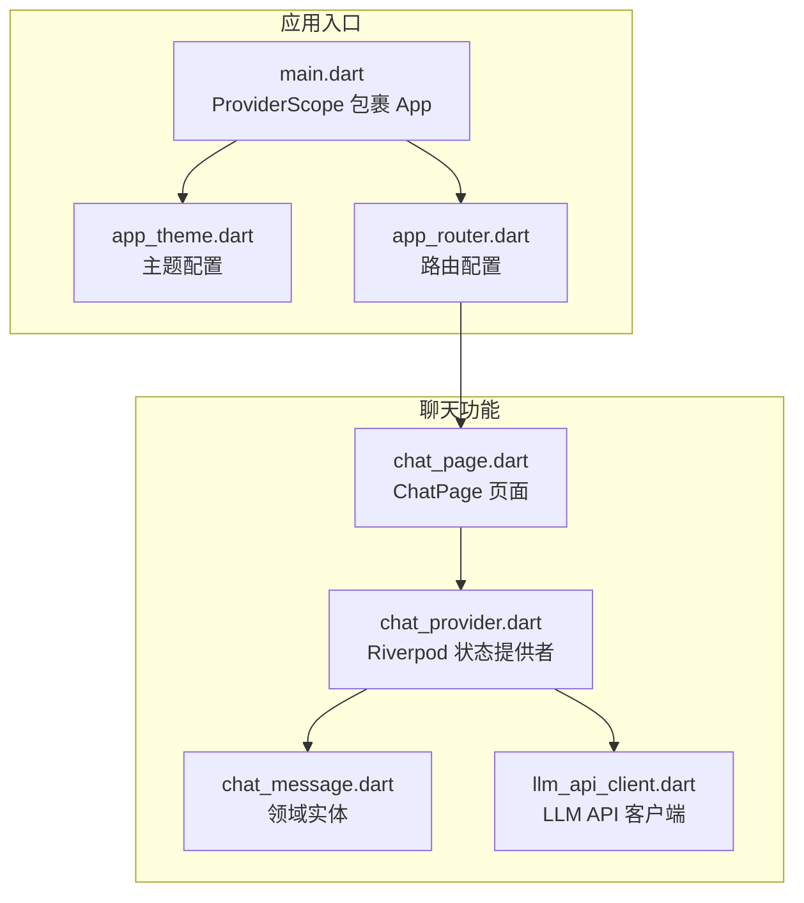
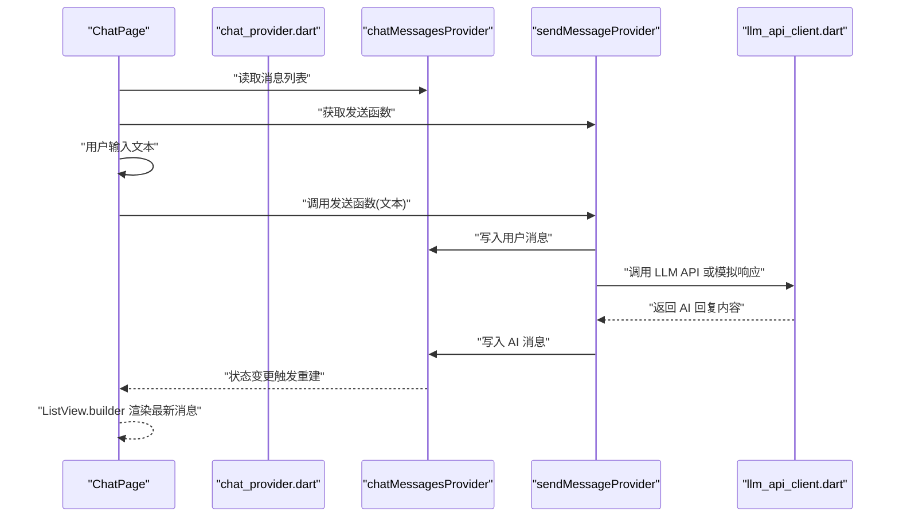
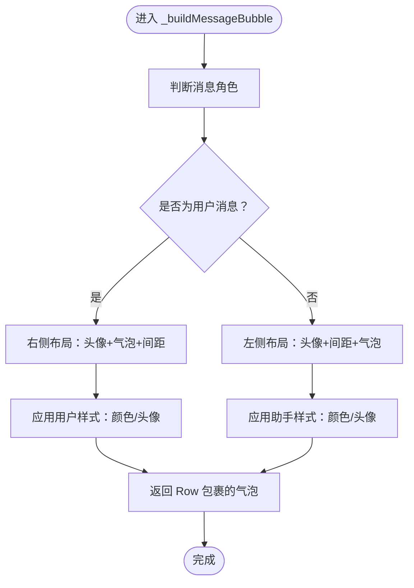
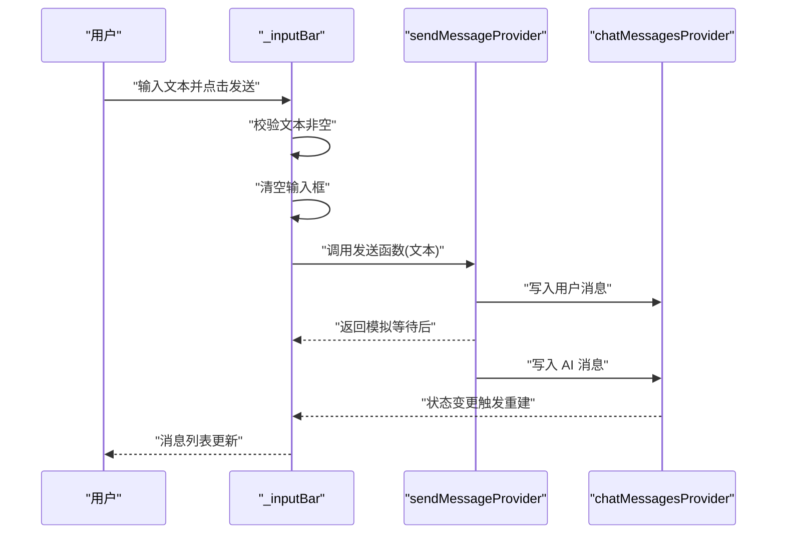
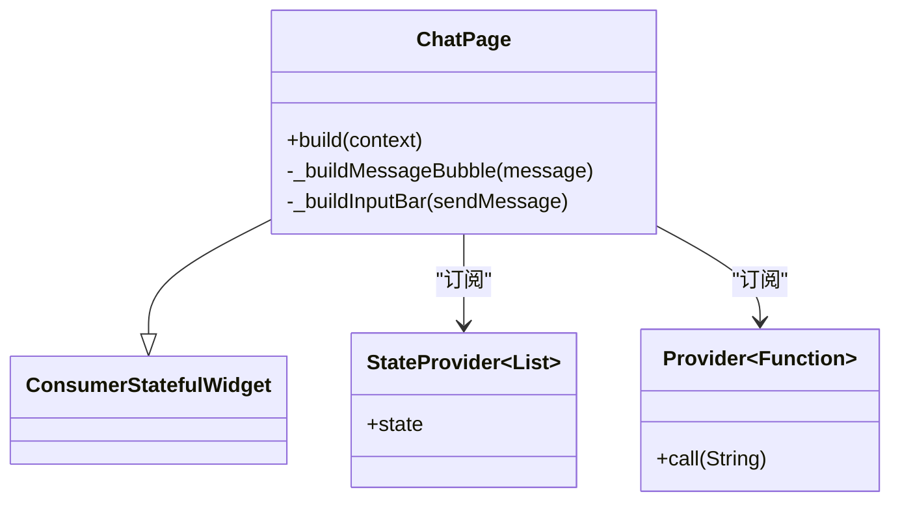
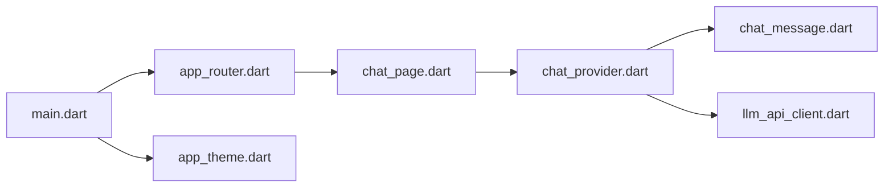

# 聊天界面设计

<cite>
**本文引用的文件**
- [chat_page.dart](file://lib/features/chat/presentation/pages/chat_page.dart)
- [chat_provider.dart](file://lib/features/chat/presentation/providers/chat_provider.dart)
- [chat_message.dart](file://lib/features/chat/domain/entities/chat_message.dart)
- [llm_api_client.dart](file://lib/features/chat/data/llm_api_client.dart)
- [main.dart](file://lib/main.dart)
- [app_theme.dart](file://lib/core/theme/app_theme.dart)
- [app_router.dart](file://lib/core/router/app_router.dart)
</cite>

## 目录
1. [引言](#引言)
2. [项目结构](#项目结构)
3. [核心组件](#核心组件)
4. [架构总览](#架构总览)
5. [详细组件分析](#详细组件分析)
6. [依赖关系分析](#依赖关系分析)
7. [性能考量](#性能考量)
8. [故障排查指南](#故障排查指南)
9. [结论](#结论)
10. [附录](#附录)

## 引言
本文件围绕 ChatPage 的 UI 组件构成与布局逻辑展开，系统性解析 Scaffold 如何组织 AppBar、消息列表与输入栏；深入分析 ListView.builder 的高效渲染机制与 _buildMessageBubble 的差异化气泡样式；梳理 _inputBar 中 TextField 与 IconButton 的交互流程（文本输入、清空与发送）。同时，结合 Riverpod 的 ConsumerStatefulWidget 展示如何监听状态变化并驱动 UI 更新；最后给出消息气泡样式定制、响应式布局适配与无障碍访问优化的实践建议。

## 项目结构
Chat 功能位于 features/chat 子模块，采用分层组织：
- domain：定义领域实体（如 ChatMessage）
- data：封装外部服务（如 LLM API 客户端）
- presentation：页面与状态提供者（ChatPage、chat_provider）

图表来源
- [main.dart](file://lib/main.dart#L1-L33)
- [app_theme.dart](file://lib/core/theme/app_theme.dart#L1-L19)
- [app_router.dart](file://lib/core/router/app_router.dart#L1-L18)
- [chat_page.dart](file://lib/features/chat/presentation/pages/chat_page.dart#L1-L120)
- [chat_provider.dart](file://lib/features/chat/presentation/providers/chat_provider.dart#L1-L63)
- [chat_message.dart](file://lib/features/chat/domain/entities/chat_message.dart#L1-L13)
- [llm_api_client.dart](file://lib/features/chat/data/llm_api_client.dart#L1-L115)

章节来源
- [main.dart](file://lib/main.dart#L1-L33)
- [app_router.dart](file://lib/core/router/app_router.dart#L1-L18)

## 核心组件
- ChatPage：聊天页面主体，负责 UI 布局与交互
- chatMessagesProvider：维护消息列表的状态
- sendMessageProvider：封装发送消息的业务逻辑（含模拟 AI 回复）
- ChatMessage：消息实体，包含 id、content、role、timestamp
- LlmApiClient：封装对外部 LLM 服务的请求与流式响应

章节来源
- [chat_page.dart](file://lib/features/chat/presentation/pages/chat_page.dart#L1-L120)
- [chat_provider.dart](file://lib/features/chat/presentation/providers/chat_provider.dart#L1-L63)
- [chat_message.dart](file://lib/features/chat/domain/entities/chat_message.dart#L1-L13)
- [llm_api_client.dart](file://lib/features/chat/data/llm_api_client.dart#L1-L115)

## 架构总览
下图展示了从页面到状态提供者再到外部 API 的数据与控制流：

图表来源
- [chat_page.dart](file://lib/features/chat/presentation/pages/chat_page.dart#L22-L119)
- [chat_provider.dart](file://lib/features/chat/presentation/providers/chat_provider.dart#L27-L63)
- [llm_api_client.dart](file://lib/features/chat/data/llm_api_client.dart#L21-L51)

## 详细组件分析

### Scaffold 结构与布局
- AppBar：标题为“NEuropean Chat”，用于标识当前页面
- 主体区域采用 Column 布局：
  - 上半部分：Expanded 包裹的 ListView.builder，用于滚动显示消息列表
  - 底部：_buildInputBar，包含 TextField 与 IconButton

该布局确保消息列表自适应高度并占据可用空间，输入栏固定在底部，便于交互。

章节来源
- [chat_page.dart](file://lib/features/chat/presentation/pages/chat_page.dart#L22-L47)

### ListView.builder 高效渲染
- 使用 padding 统一消息间距
- itemCount 来源于消息列表长度
- itemBuilder 中按索引取出消息并交由 _buildMessageBubble 渲染
- 通过 StateProvider 维护消息列表，状态变更自动触发重建

该模式具备以下优势：
- 按需渲染可见项，减少内存占用
- 列表状态变更仅影响局部 UI
- 可扩展至无限滚动或分页加载

章节来源
- [chat_page.dart](file://lib/features/chat/presentation/pages/chat_page.dart#L33-L41)
- [chat_provider.dart](file://lib/features/chat/presentation/providers/chat_provider.dart#L27-L30)

### _buildMessageBubble 气泡样式差异化
- 角色判断：根据 message.role 是否为 'user'
  - 用户消息：右对齐，气泡背景偏蓝，头像为绿色
  - 助手消息：左对齐，气泡背景偏灰，头像为蓝色
- 头像与间距：在对应一侧添加 CircleAvatar 与间距，增强可读性
- 文本颜色：根据角色设置不同深浅度的颜色
- 圆角与内边距：统一的圆角与内边距提升视觉一致性

图表来源
- [chat_page.dart](file://lib/features/chat/presentation/pages/chat_page.dart#L49-L88)

章节来源
- [chat_page.dart](file://lib/features/chat/presentation/pages/chat_page.dart#L49-L88)

### _inputBar 输入与发送交互
- TextField：
  - 使用 TextEditingController 管理输入
  - 设置多行输入与提示文本
- IconButton（发送）：
  - 点击时校验输入非空
  - 清空输入框
  - 调用 sendMessageProvider 返回的函数，传入文本
  - 发送完成后等待异步处理（模拟 AI 回复）

图表来源
- [chat_page.dart](file://lib/features/chat/presentation/pages/chat_page.dart#L90-L119)
- [chat_provider.dart](file://lib/features/chat/presentation/providers/chat_provider.dart#L32-L63)

章节来源
- [chat_page.dart](file://lib/features/chat/presentation/pages/chat_page.dart#L90-L119)
- [chat_provider.dart](file://lib/features/chat/presentation/providers/chat_provider.dart#L32-L63)

### Riverpod 状态监听与 UI 更新
- ChatPage 继承 ConsumerStatefulWidget，使用 ref.watch 订阅：
  - chatMessagesProvider：监听消息列表变化
  - sendMessageProvider：监听发送函数
- 当 sendMessageProvider 写入新消息时，chatMessagesProvider 的状态改变，触发页面重建，ListView.builder 自动渲染新增消息

图表来源
- [chat_page.dart](file://lib/features/chat/presentation/pages/chat_page.dart#L6-L11)
- [chat_provider.dart](file://lib/features/chat/presentation/providers/chat_provider.dart#L27-L30)
- [chat_provider.dart](file://lib/features/chat/presentation/providers/chat_provider.dart#L32-L33)

章节来源
- [chat_page.dart](file://lib/features/chat/presentation/pages/chat_page.dart#L22-L47)
- [chat_provider.dart](file://lib/features/chat/presentation/providers/chat_provider.dart#L27-L33)

### LLM API 集成与流式响应
- LlmApiClient 提供两种能力：
  - sendMessage：一次性返回完整回复
  - sendMessageStream：以流方式返回增量片段（SSE 模拟）
- sendMessageProvider 在发送后模拟等待并追加 AI 消息；在真实场景中可替换为调用 LLM API 并将结果注入消息列表

章节来源
- [llm_api_client.dart](file://lib/features/chat/data/llm_api_client.dart#L21-L51)
- [llm_api_client.dart](file://lib/features/chat/data/llm_api_client.dart#L53-L99)
- [chat_provider.dart](file://lib/features/chat/presentation/providers/chat_provider.dart#L48-L63)

## 依赖关系分析
- ChatPage 依赖：
  - chat_provider.dart：消息列表与发送逻辑
  - chat_message.dart：消息实体模型
- chat_provider.dart 依赖：
  - chat_message.dart：构造消息对象
  - llm_api_client.dart：调用外部 LLM 服务（可替换）
- 应用入口：
  - main.dart：ProviderScope 包裹应用，启用 Riverpod
  - app_router.dart：注册 /chat 路由
  - app_theme.dart：Material3 主题配置

图表来源
- [main.dart](file://lib/main.dart#L1-L33)
- [app_router.dart](file://lib/core/router/app_router.dart#L1-L18)
- [chat_page.dart](file://lib/features/chat/presentation/pages/chat_page.dart#L1-L120)
- [chat_provider.dart](file://lib/features/chat/presentation/providers/chat_provider.dart#L1-L63)
- [chat_message.dart](file://lib/features/chat/domain/entities/chat_message.dart#L1-L13)
- [llm_api_client.dart](file://lib/features/chat/data/llm_api_client.dart#L1-L115)
- [app_theme.dart](file://lib/core/theme/app_theme.dart#L1-L19)

章节来源
- [main.dart](file://lib/main.dart#L1-L33)
- [app_router.dart](file://lib/core/router/app_router.dart#L1-L18)
- [chat_page.dart](file://lib/features/chat/presentation/pages/chat_page.dart#L1-L120)
- [chat_provider.dart](file://lib/features/chat/presentation/providers/chat_provider.dart#L1-L63)
- [chat_message.dart](file://lib/features/chat/domain/entities/chat_message.dart#L1-L13)
- [llm_api_client.dart](file://lib/features/chat/data/llm_api_client.dart#L1-L115)
- [app_theme.dart](file://lib/core/theme/app_theme.dart#L1-L19)

## 性能考量
- 列表渲染
  - 使用 ListView.builder 按需渲染，避免一次性构建所有子项
  - 合理设置 padding 与间距，避免过度重绘
- 状态更新
  - 使用 StateProvider 管理消息列表，避免不必要的全局刷新
  - 发送流程中先写入用户消息，再写入 AI 消息，保证 UI 连贯性
- 外部调用
  - sendMessageProvider 中的模拟延迟可替换为真实 API 调用
  - 若使用流式响应，可逐步追加内容，减少一次性大文本渲染压力

[本节为通用性能建议，不直接分析具体文件]

## 故障排查指南
- 发送按钮无响应
  - 检查 _inputBar 的 onPressed 逻辑是否被覆盖或禁用
  - 确认 sendMessageProvider 是否正确注入
- 消息未显示
  - 确认 chatMessagesProvider 的状态是否更新
  - 检查 ListView.builder 的 itemCount 是否与列表长度一致
- 主题与路由问题
  - 确认 main.dart 中 ProviderScope 已包裹应用
  - 确认 app_router.dart 中 /chat 路由已注册

章节来源
- [chat_page.dart](file://lib/features/chat/presentation/pages/chat_page.dart#L90-L119)
- [chat_provider.dart](file://lib/features/chat/presentation/providers/chat_provider.dart#L27-L63)
- [main.dart](file://lib/main.dart#L1-L33)
- [app_router.dart](file://lib/core/router/app_router.dart#L1-L18)

## 结论
ChatPage 通过 Scaffold + Column 的布局清晰地组织了 AppBar、消息列表与输入栏；ListView.builder 实现了高效的动态渲染；_buildMessageBubble 基于角色差异化的样式提升了可读性；_inputBar 将输入、清空与发送流程整合在同一行，交互简洁直观。配合 Riverpod 的状态订阅，页面能够响应状态变化并自动更新 UI。未来可在样式定制、响应式适配与无障碍方面进一步优化，以满足更广泛的用户体验需求。

[本节为总结性内容，不直接分析具体文件]

## 附录

### 消息气泡样式定制建议
- 背景与圆角：统一使用 BoxDecoration，分别设置用户与助手的背景色与圆角半径
- 文本颜色：根据角色设置对比度更高的文字颜色
- 头像尺寸与间距：在 Row 中使用 SizedBox 控制头像与气泡间距
- 对齐策略：用户消息右对齐，助手消息左对齐，保持视觉一致性

章节来源
- [chat_page.dart](file://lib/features/chat/presentation/pages/chat_page.dart#L49-L88)

### 响应式布局适配建议
- 列表容器使用 Expanded 以填充可用空间
- TextField 使用 Expanded 以自适应宽度变化
- 在小屏设备上考虑键盘弹起时的布局调整（如使用 SafeArea 或 KeyboardListener）

章节来源
- [chat_page.dart](file://lib/features/chat/presentation/pages/chat_page.dart#L31-L47)
- [chat_page.dart](file://lib/features/chat/presentation/pages/chat_page.dart#L90-L119)

### 无障碍访问优化建议
- 为 TextField 添加 label 与 hint，提升可读性
- 为 IconButton 添加 tooltip 或 accessibilityLabel
- 确保颜色对比度符合 WCAG 建议，必要时提供暗色主题切换

章节来源
- [chat_page.dart](file://lib/features/chat/presentation/pages/chat_page.dart#L96-L104)
- [app_theme.dart](file://lib/core/theme/app_theme.dart#L1-L19)