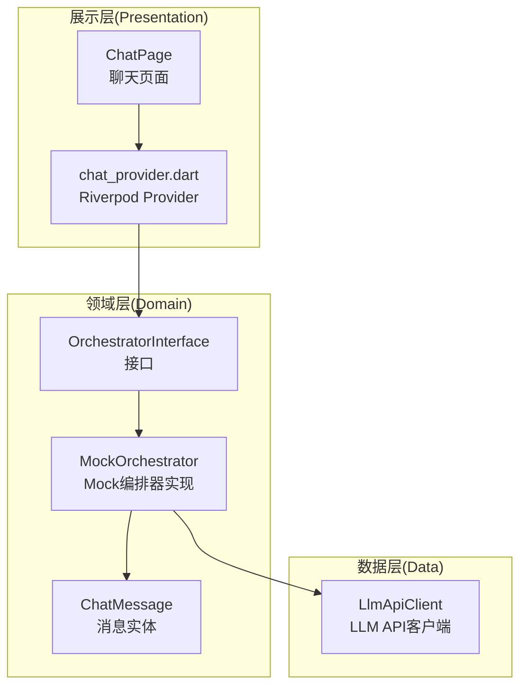
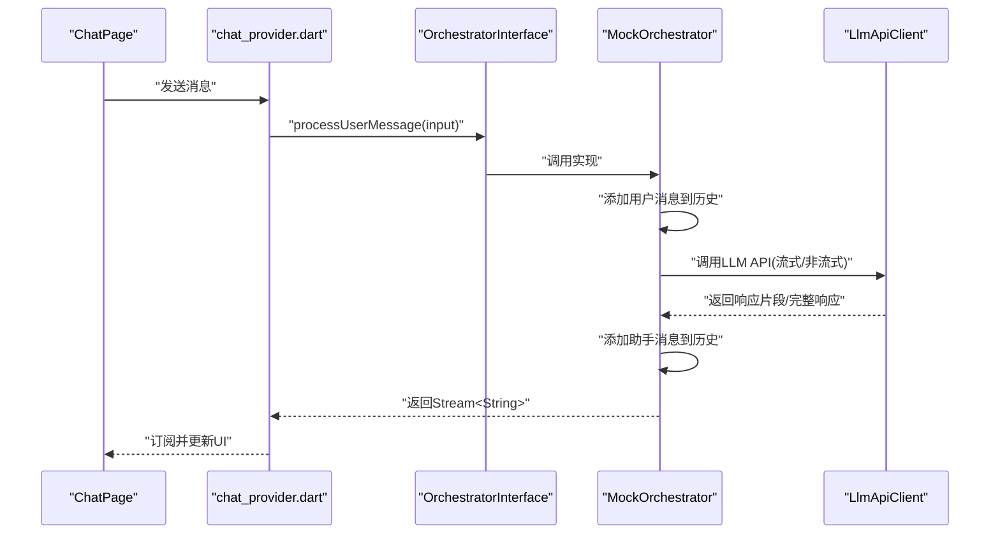
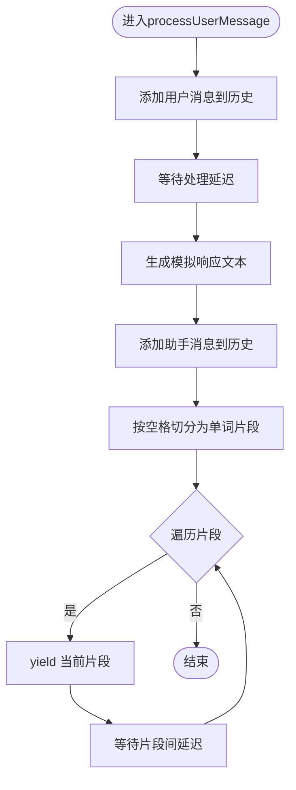
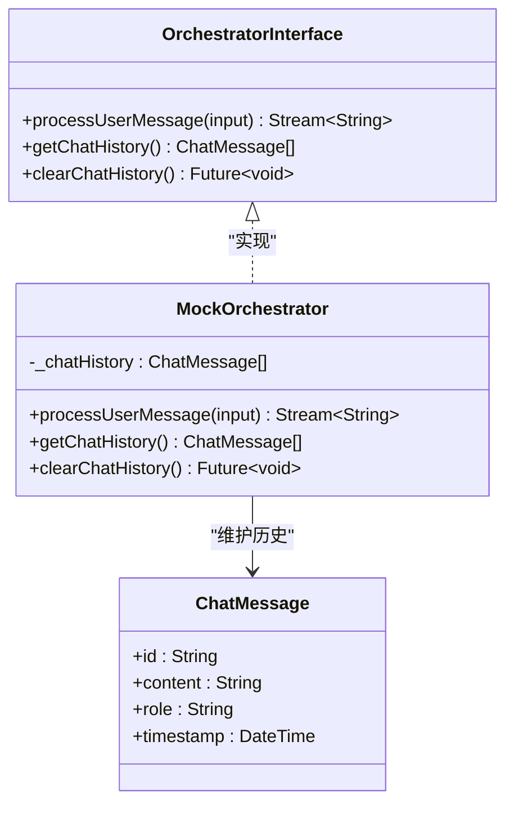
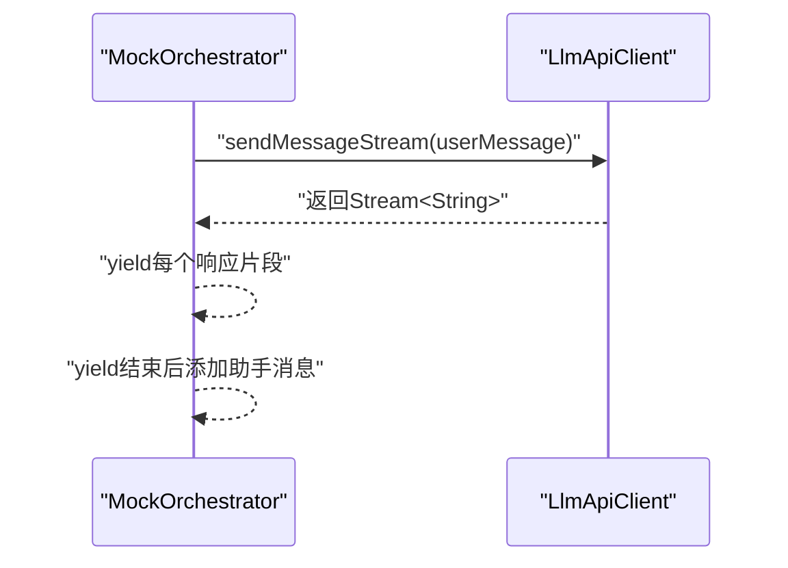
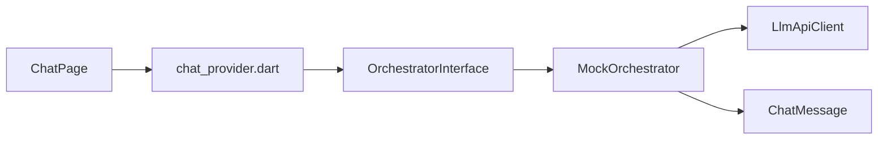

# 聊天编排器实现

<cite>
**本文引用的文件**
- [orchestrator.dart](file://lib/features/chat/domain/orchestrator/orchestrator.dart)
- [orchestrator_interface.dart](file://lib/features/chat/domain/orchestrator/orchestrator_interface.dart)
- [chat_message.dart](file://lib/features/chat/domain/entities/chat_message.dart)
- [llm_api_client.dart](file://lib/features/chat/data/llm_api_client.dart)
- [chat_page.dart](file://lib/features/chat/presentation/pages/chat_page.dart)
- [chat_provider.dart](file://lib/features/chat/presentation/providers/chat_provider.dart)
- [app_router.dart](file://lib/core/router/app_router.dart)
- [SDD.md](file://SDD.md)
</cite>

## 目录
1. [简介](#简介)
2. [项目结构](#项目结构)
3. [核心组件](#核心组件)
4. [架构总览](#架构总览)
5. [详细组件分析](#详细组件分析)
6. [依赖关系分析](#依赖关系分析)
7. [性能考量](#性能考量)
8. [故障排查指南](#故障排查指南)
9. [结论](#结论)
10. [附录](#附录)

## 简介
本文件系统性地文档化MockOrchestrator作为业务逻辑中枢的职责与实现细节，重点解释其如何协调用户输入处理、对话历史维护与AI响应生成；剖析processUserMessage方法通过async*生成器实现流式响应模拟的分块yield与时间延迟控制；说明getChatHistory与clearChatHistory接口的设计意图与不可变数据返回策略；结合orchestrator_interface.dart阐述依赖倒置原则的应用；并提供向真实LLM服务集成的迁移路径、流式传输性能调优及并发请求处理的最佳实践。

## 项目结构
本项目采用Clean Architecture分层组织，聊天模块位于features/chat，包含：
- Presentation层：页面与状态管理（Riverpod）
- Domain层：实体与编排器接口与实现
- Data层：LLM API客户端

图表来源
- [chat_page.dart](file://lib/features/chat/presentation/pages/chat_page.dart#L1-L120)
- [chat_provider.dart](file://lib/features/chat/presentation/providers/chat_provider.dart#L1-L63)
- [orchestrator_interface.dart](file://lib/features/chat/domain/orchestrator/orchestrator_interface.dart#L1-L13)
- [orchestrator.dart](file://lib/features/chat/domain/orchestrator/orchestrator.dart#L1-L49)
- [chat_message.dart](file://lib/features/chat/domain/entities/chat_message.dart#L1-L13)
- [llm_api_client.dart](file://lib/features/chat/data/llm_api_client.dart#L1-L115)

章节来源
- [app_router.dart](file://lib/core/router/app_router.dart#L1-L18)
- [SDD.md](file://SDD.md#L42-L95)

## 核心组件
- OrchestratorInterface：定义编排器契约，包括processUserMessage、getChatHistory、clearChatHistory三个方法，体现依赖倒置原则，使上层UI与业务逻辑解耦。
- MockOrchestrator：接口的具体实现，负责：
  - 用户消息入站处理与历史维护
  - 模拟LLM响应生成与流式分块输出
  - 历史查询与清空
- ChatMessage：不可变消息实体，承载id、content、role、timestamp等字段。
- LlmApiClient：封装LLM API调用，支持非流式与流式两种模式，便于后续替换为真实LLM服务。

章节来源
- [orchestrator_interface.dart](file://lib/features/chat/domain/orchestrator/orchestrator_interface.dart#L1-L13)
- [orchestrator.dart](file://lib/features/chat/domain/orchestrator/orchestrator.dart#L1-L49)
- [chat_message.dart](file://lib/features/chat/domain/entities/chat_message.dart#L1-L13)
- [llm_api_client.dart](file://lib/features/chat/data/llm_api_client.dart#L1-L115)

## 架构总览
MockOrchestrator在领域层承担“编排器”职责，向上通过接口暴露能力，向下依赖消息实体与LLM客户端。UI通过Riverpod Provider触发编排器，实现从用户输入到流式响应的完整闭环。

图表来源
- [chat_page.dart](file://lib/features/chat/presentation/pages/chat_page.dart#L1-L120)
- [chat_provider.dart](file://lib/features/chat/presentation/providers/chat_provider.dart#L1-L63)
- [orchestrator_interface.dart](file://lib/features/chat/domain/orchestrator/orchestrator_interface.dart#L1-L13)
- [orchestrator.dart](file://lib/features/chat/domain/orchestrator/orchestrator.dart#L1-L49)
- [llm_api_client.dart](file://lib/features/chat/data/llm_api_client.dart#L1-L115)

## 详细组件分析

### MockOrchestrator：流式响应模拟与历史管理
- 职责边界
  - 接收用户输入，构建ChatMessage并追加至内部历史列表
  - 模拟处理延迟与LLM响应生成
  - 将完整响应按词切分为多个片段，逐个yield，配合await实现时间间隔，模拟真实流式传输
  - 在响应完成后将助手消息追加至历史
  - 对外提供不可变的历史快照与清空能力
- 关键实现要点
  - 使用async*生成器与yield实现分块输出
  - 使用await Future.delayed控制每块之间的延迟
  - 使用List.unmodifiable保证getChatHistory返回不可变视图，防止外部修改内部状态
  - clearChatHistory清空内部列表，不影响已返回的不可变视图引用

图表来源
- [orchestrator.dart](file://lib/features/chat/domain/orchestrator/orchestrator.dart#L1-L49)

章节来源
- [orchestrator.dart](file://lib/features/chat/domain/orchestrator/orchestrator.dart#L1-L49)

### 接口设计：依赖倒置与不可变数据
- 依赖倒置原则
  - 上层UI与Provider仅依赖抽象接口OrchestratorInterface，不直接依赖具体实现MockOrchestrator
  - 便于在测试中注入Mock实现，或在生产中切换为真实编排器实现
- 不可变数据返回策略
  - getChatHistory返回List.unmodifiable，确保外部无法通过修改返回列表影响内部历史
  - clearChatHistory仅清空内部列表，不影响之前返回的不可变视图

图表来源
- [orchestrator_interface.dart](file://lib/features/chat/domain/orchestrator/orchestrator_interface.dart#L1-L13)
- [orchestrator.dart](file://lib/features/chat/domain/orchestrator/orchestrator.dart#L1-L49)
- [chat_message.dart](file://lib/features/chat/domain/entities/chat_message.dart#L1-L13)

章节来源
- [orchestrator_interface.dart](file://lib/features/chat/domain/orchestrator/orchestrator_interface.dart#L1-L13)
- [orchestrator.dart](file://lib/features/chat/domain/orchestrator/orchestrator.dart#L1-L49)

### LLM API客户端：流式与非流式调用
- 非流式调用：sendMessage返回完整响应文本，适合快速演示与简单集成
- 流式调用：sendMessageStream返回Stream<String>，适合UI实时展示
- 异常处理：统一捕获Dio异常并抛出LlmApiException，便于上层处理

图表来源
- [llm_api_client.dart](file://lib/features/chat/data/llm_api_client.dart#L1-L115)
- [orchestrator.dart](file://lib/features/chat/domain/orchestrator/orchestrator.dart#L1-L49)

章节来源
- [llm_api_client.dart](file://lib/features/chat/data/llm_api_client.dart#L1-L115)

### UI集成：Riverpod与页面交互
- ChatPage通过Riverpod读取消息列表与发送函数
- sendMessageProvider在收到用户输入后，先添加用户消息，再调用编排器生成AI回复
- 该Provider当前使用Future.delayed模拟AI响应，便于演示；可替换为调用编排器的流式输出

章节来源
- [chat_page.dart](file://lib/features/chat/presentation/pages/chat_page.dart#L1-L120)
- [chat_provider.dart](file://lib/features/chat/presentation/providers/chat_provider.dart#L1-L63)

## 依赖关系分析
- 模块耦合
  - Presentation层依赖Domain层接口，Domain层不依赖UI框架
  - Domain层依赖Data层的LLM API客户端，但通过接口隔离
- 外部依赖
  - Riverpod用于状态管理
  - Dio用于HTTP请求
  - Flutter Widgets用于UI渲染

图表来源
- [chat_page.dart](file://lib/features/chat/presentation/pages/chat_page.dart#L1-L120)
- [chat_provider.dart](file://lib/features/chat/presentation/providers/chat_provider.dart#L1-L63)
- [orchestrator_interface.dart](file://lib/features/chat/domain/orchestrator/orchestrator_interface.dart#L1-L13)
- [orchestrator.dart](file://lib/features/chat/domain/orchestrator/orchestrator.dart#L1-L49)
- [llm_api_client.dart](file://lib/features/chat/data/llm_api_client.dart#L1-L115)
- [chat_message.dart](file://lib/features/chat/domain/entities/chat_message.dart#L1-L13)

章节来源
- [SDD.md](file://SDD.md#L42-L95)

## 性能考量
- 流式传输延迟控制
  - 片段间延迟可通过await Future.delayed调整，平衡实时性与用户体验
  - 建议根据设备性能与网络状况动态调节延迟参数
- 内存与历史管理
  - 使用List.unmodifiable返回不可变视图，避免重复拷贝
  - 建议在生产环境中实现历史上限与按需裁剪策略，防止无限增长
- 并发请求处理
  - 当前Mock实现未显式处理并发；建议在真实编排器中引入队列或去重机制，避免重复请求与竞态
- 真实LLM集成
  - 使用LlmApiClient.sendMessageStream实现SSE流式传输
  - 建议在UI侧实现背压与缓冲区，避免UI过度刷新导致掉帧

[本节为通用指导，不直接分析具体文件]

## 故障排查指南
- LLM API异常
  - LlmApiClient在请求失败时抛出LlmApiException，包含错误信息与可选状态码
  - 建议在UI层捕获并提示用户，同时记录日志
- 流式输出异常
  - 若yield过程中出现异常，应确保异常被捕获并终止流，避免UI卡死
- 历史一致性
  - getChatHistory返回不可变视图，若发现历史不一致，检查上游Provider是否正确更新状态

章节来源
- [llm_api_client.dart](file://lib/features/chat/data/llm_api_client.dart#L1-L115)

## 结论
MockOrchestrator以接口驱动的方式实现了清晰的职责边界与良好的可测试性。其通过async*生成器模拟流式响应，展示了依赖倒置与不可变数据返回策略的实际应用。结合SDD中的编排器工作流设计，后续可平滑迁移到真实LLM服务，实现更复杂的Agent协作与Prompt工程能力。

[本节为总结性内容，不直接分析具体文件]

## 附录

### 向真实LLM服务集成的迁移路径
- 替换点
  - 将MockOrchestrator中的模拟响应替换为调用LlmApiClient.sendMessage或sendMessageStream
  - 在UI层订阅编排器返回的Stream<String>，实时更新消息列表
- 流式传输性能调优
  - 调整片段延迟与缓冲大小，平衡吞吐与延迟
  - 在UI侧实现节流与背压，避免频繁重建Widget
- 并发请求处理最佳实践
  - 引入请求队列与去重逻辑，避免重复请求
  - 对异常进行分类处理与重试策略，提升鲁棒性

章节来源
- [SDD.md](file://SDD.md#L100-L176)
- [llm_api_client.dart](file://lib/features/chat/data/llm_api_client.dart#L1-L115)
- [orchestrator.dart](file://lib/features/chat/domain/orchestrator/orchestrator.dart#L1-L49)