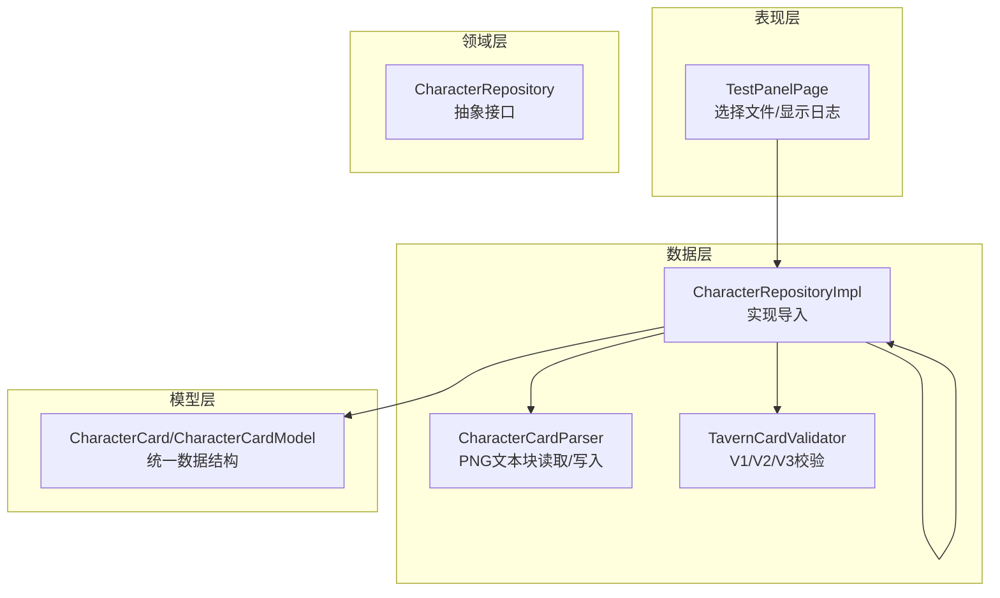
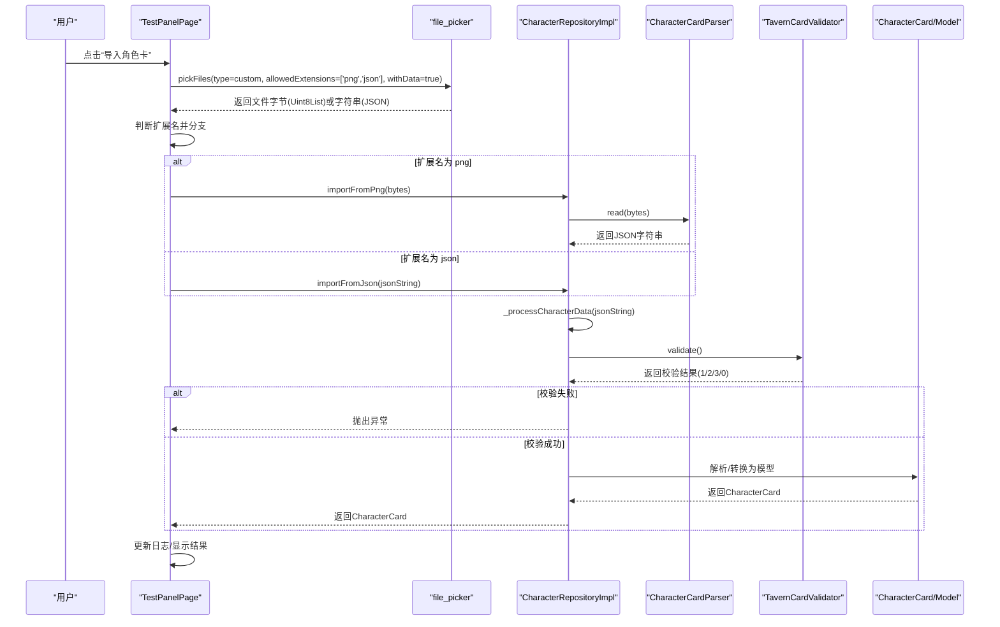
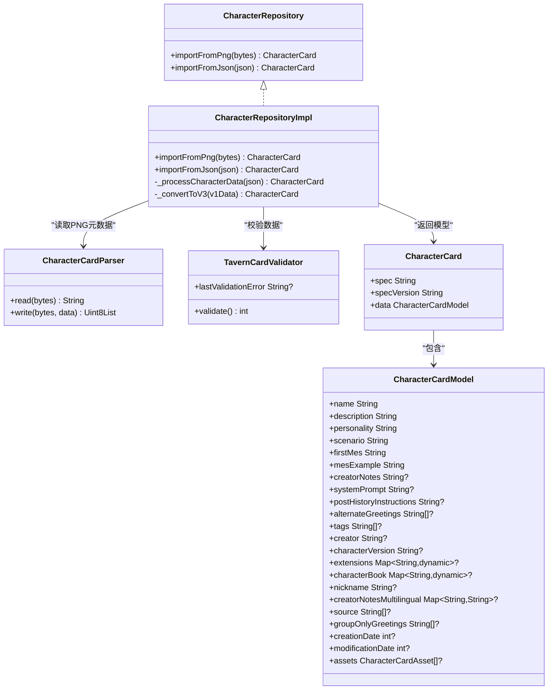
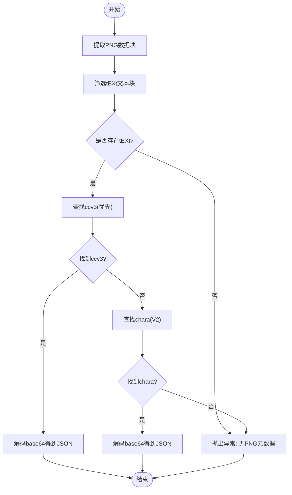
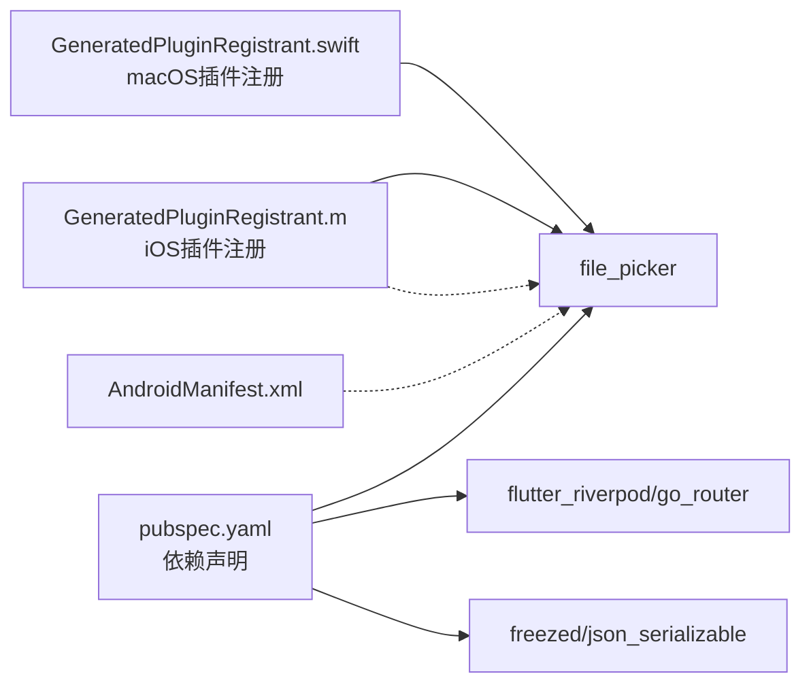

# 角色卡导入功能

<cite>
**本文引用的文件**
- [test_panel_page.dart](file://lib/features/character/presentation/pages/test_panel_page.dart)
- [character_repository.dart](file://lib/features/character/domain/repositories/character_repository.dart)
- [character_repository_impl.dart](file://lib/features/character/data/repositories/character_repository_impl.dart)
- [character_card_parser.dart](file://lib/features/character/data/utils/character_card_parser.dart)
- [tavern_card_validator.dart](file://lib/features/character/data/utils/tavern_card_validator.dart)
- [character_card_model.dart](file://lib/features/character/data/models/character_card_model.dart)
- [pubspec.yaml](file://pubspec.yaml)
- [AndroidManifest.xml](file://android/app/src/main/AndroidManifest.xml)
- [Info.plist](file://ios/Runner/Info.plist)
- [GeneratedPluginRegistrant.m](file://ios/Runner/GeneratedPluginRegistrant.m)
- [GeneratedPluginRegistrant.swift](file://macos/Flutter/GeneratedPluginRegistrant.swift)
</cite>

## 目录
1. [简介](#简介)
2. [项目结构](#项目结构)
3. [核心组件](#核心组件)
4. [架构总览](#架构总览)
5. [详细组件分析](#详细组件分析)
6. [依赖分析](#依赖分析)
7. [性能考虑](#性能考虑)
8. [故障排查指南](#故障排查指南)
9. [结论](#结论)
10. [附录](#附录)

## 简介
本文件系统性阐述角色卡导入功能的完整实现流程：从用户在测试面板页面选择文件开始，到通过文件选择器读取字节流或文本内容，并最终调用仓库实现类的导入方法完成解析与校验。文档覆盖以下关键点：
- 使用 file_picker 在 Android/iOS 平台选择 PNG 或 JSON 文件，返回 Uint8List 或字符串数据
- 在测试面板页面中通过按钮触发导入逻辑，使用 Riverpod 路由跳转与状态更新
- 通过 CharacterRepositoryImpl 的 importFromPng 与 importFromJson 完成导入
- 解析 PNG 元数据（PNG 文本块）与 JSON 内容，进行版本兼容与校验
- 跨平台文件路径处理差异、异常捕获与最佳实践建议

## 项目结构
角色卡导入功能涉及以下模块：
- 表现层：测试面板页面负责触发文件选择与结果展示
- 领域层：CharacterRepository 抽象定义导入接口
- 数据层：CharacterRepositoryImpl 实现导入逻辑；CharacterCardParser 解析 PNG 文本块；TavernCardValidator 校验数据格式
- 模型层：CharacterCard 及其子模型用于统一表示角色卡数据

图表来源
- [test_panel_page.dart](file://lib/features/character/presentation/pages/test_panel_page.dart#L1-L114)
- [character_repository.dart](file://lib/features/character/domain/repositories/character_repository.dart#L1-L10)
- [character_repository_impl.dart](file://lib/features/character/data/repositories/character_repository_impl.dart#L1-L78)
- [character_card_parser.dart](file://lib/features/character/data/utils/character_card_parser.dart#L1-L206)
- [tavern_card_validator.dart](file://lib/features/character/data/utils/tavern_card_validator.dart#L1-L171)
- [character_card_model.dart](file://lib/features/character/data/models/character_card_model.dart#L1-L63)

章节来源
- [test_panel_page.dart](file://lib/features/character/presentation/pages/test_panel_page.dart#L1-L114)
- [character_repository.dart](file://lib/features/character/domain/repositories/character_repository.dart#L1-L10)
- [character_repository_impl.dart](file://lib/features/character/data/repositories/character_repository_impl.dart#L1-L78)
- [character_card_parser.dart](file://lib/features/character/data/utils/character_card_parser.dart#L1-L206)
- [tavern_card_validator.dart](file://lib/features/character/data/utils/tavern_card_validator.dart#L1-L171)
- [character_card_model.dart](file://lib/features/character/data/models/character_card_model.dart#L1-L63)

## 核心组件
- 测试面板页面（TestPanelPage）
  - 提供“导入角色卡”按钮，点击后调用文件选择器
  - 支持扩展名限制为 png/json，并要求返回文件字节数据
  - 根据文件扩展名分派到 importFromPng 或 importFromJson
  - 将导入结果以 JSON 形式输出到日志区域
- 领域接口（CharacterRepository）
  - 定义 importFromPng 与 importFromJson 两个异步导入方法
- 仓库实现（CharacterRepositoryImpl）
  - 对 PNG：委托 CharacterCardParser 读取 PNG 文本块中的 JSON 字符串，再交由 _processCharacterData 处理
  - 对 JSON：直接交由 _processCharacterData 处理
  - _processCharacterData：解析 JSON、校验版本、必要时进行 V1 到 V3 的转换
- PNG 解析器（CharacterCardParser）
  - 从 PNG 中提取 tEXt 文本块，优先识别 ccv3（V3），否则回退到 chara（V2）
  - 支持写入（添加/替换 tEXt 块），并可选写入 ccv3
- 校验器（TavernCardValidator）
  - 优先校验 V3/V2，再回退到 V1
  - 返回校验结果（1/2/3/0），并记录最后一条错误字段
- 模型（CharacterCard/CharacterCardModel）
  - 统一表示角色卡数据，支持 V2/V3 字段

章节来源
- [test_panel_page.dart](file://lib/features/character/presentation/pages/test_panel_page.dart#L1-L114)
- [character_repository.dart](file://lib/features/character/domain/repositories/character_repository.dart#L1-L10)
- [character_repository_impl.dart](file://lib/features/character/data/repositories/character_repository_impl.dart#L1-L78)
- [character_card_parser.dart](file://lib/features/character/data/utils/character_card_parser.dart#L1-L206)
- [tavern_card_validator.dart](file://lib/features/character/data/utils/tavern_card_validator.dart#L1-L171)
- [character_card_model.dart](file://lib/features/character/data/models/character_card_model.dart#L1-L63)

## 架构总览
下图展示了从用户交互到数据入库的关键调用链路与职责边界。

图表来源
- [test_panel_page.dart](file://lib/features/character/presentation/pages/test_panel_page.dart#L1-L114)
- [character_repository_impl.dart](file://lib/features/character/data/repositories/character_repository_impl.dart#L1-L78)
- [character_card_parser.dart](file://lib/features/character/data/utils/character_card_parser.dart#L1-L206)
- [tavern_card_validator.dart](file://lib/features/character/data/utils/tavern_card_validator.dart#L1-L171)
- [character_card_model.dart](file://lib/features/character/data/models/character_card_model.dart#L1-L63)

## 详细组件分析

### 测试面板页面（TestPanelPage）
- 功能要点
  - 使用 file_picker 选择文件，限制扩展名为 png/json，并要求 withData=true 以便直接获取字节
  - 根据扩展名判断调用 importFromPng 或 importFromJson
  - 异常捕获后将错误信息写入日志
  - 成功导入后将模型序列化为 JSON 并展示
- 关键行为
  - 选择文件：pickFiles(type=custom, allowedExtensions=['png','json'], withData=true)
  - 分支处理：extension == 'png' ? importFromPng(bytes) : importFromJson(utf8.decode(bytes))
  - 日志输出：使用 JsonEncoder.withIndent 进行美化输出
- 路由集成
  - 页面内包含跳转到聊天界面的按钮，便于导入后继续使用

章节来源
- [test_panel_page.dart](file://lib/features/character/presentation/pages/test_panel_page.dart#L1-L114)

### 仓库接口与实现（CharacterRepository/CharacterRepositoryImpl）
- 接口职责
  - importFromPng：从 PNG 图像字节中提取 JSON 并解析为角色卡
  - importFromJson：从 JSON 字符串解析为角色卡
- 实现细节
  - importFromPng：调用 CharacterCardParser.read 获取 JSON 字符串，再进入 _processCharacterData
  - importFromJson：直接进入 _processCharacterData
  - _processCharacterData：
    - 解析 JSON
    - 使用 TavernCardValidator.validate 判定版本（1/2/3/0）
    - 若为 1，则转换为 V3；若为 2/3，直接解析为模型
    - 校验失败抛出异常
  - 异常包装：对导入失败场景统一抛出带上下文的异常

图表来源
- [character_repository.dart](file://lib/features/character/domain/repositories/character_repository.dart#L1-L10)
- [character_repository_impl.dart](file://lib/features/character/data/repositories/character_repository_impl.dart#L1-L78)
- [character_card_parser.dart](file://lib/features/character/data/utils/character_card_parser.dart#L1-L206)
- [tavern_card_validator.dart](file://lib/features/character/data/utils/tavern_card_validator.dart#L1-L171)
- [character_card_model.dart](file://lib/features/character/data/models/character_card_model.dart#L1-L63)

章节来源
- [character_repository.dart](file://lib/features/character/domain/repositories/character_repository.dart#L1-L10)
- [character_repository_impl.dart](file://lib/features/character/data/repositories/character_repository_impl.dart#L1-L78)

### PNG 元数据解析（CharacterCardParser）
- 读取流程
  - 提取 PNG 的所有数据块
  - 过滤出 tEXt 文本块并解码关键字与文本
  - 优先查找 ccv3（V3），否则回退到 chara（V2）
  - 若均未找到则抛出异常
- 写入流程（可选）
  - 移除旧的 tEXt 块（chara/ccv3）
  - 插入新的 chara 块（V2）
  - 可选插入 ccv3 块（V3）

图表来源
- [character_card_parser.dart](file://lib/features/character/data/utils/character_card_parser.dart#L1-L206)

章节来源
- [character_card_parser.dart](file://lib/features/character/data/utils/character_card_parser.dart#L1-L206)

### 校验与版本转换（TavernCardValidator）
- 校验顺序
  - 优先校验 V3：检查 spec 与 spec_version 范围
  - 再校验 V2：检查顶层字段与 data 结构
  - 最后校验 V1：检查基础字段集合
  - 返回值：1/2/3/0（分别对应 V1/V2/V3/无效）
- 转换策略
  - 当 validate 返回 1（V1）时，映射字段到 V3 结构并补全默认值
  - 当 validate 返回 2/3 时，直接解析为模型

章节来源
- [tavern_card_validator.dart](file://lib/features/character/data/utils/tavern_card_validator.dart#L1-L171)
- [character_repository_impl.dart](file://lib/features/character/data/repositories/character_repository_impl.dart#L1-L78)

### 模型定义（CharacterCard/CharacterCardModel）
- 统一数据结构：包含 V2/V3 字段，确保 V3 模型可承载 V2 数据
- 关键字段：名称、描述、个性、场景、首次消息、示例对话、创作者备注、系统提示、历史指令、问候语列表、标签、创作者、版本、扩展字段、角色书等
- 新增字段（V3）：昵称、多语言备注、来源、仅群组问候语、创建/修改时间、资产列表等

章节来源
- [character_card_model.dart](file://lib/features/character/data/models/character_card_model.dart#L1-L63)

## 依赖分析
- 外部依赖
  - file_picker：跨平台文件选择与字节数据获取
  - freezed/json_serializable：模型序列化/反序列化
  - go_router：路由跳转（测试面板页面）
- 平台注册
  - iOS/macOS：插件注册文件中包含 file_picker 与 path_provider_foundation
- Android/iOS 权限
  - Android Manifest：应用清单未显式声明存储权限
  - iOS Info.plist：未显式声明隐私权限键

图表来源
- [pubspec.yaml](file://pubspec.yaml#L1-L119)
- [GeneratedPluginRegistrant.m](file://ios/Runner/GeneratedPluginRegistrant.m#L1-L35)
- [GeneratedPluginRegistrant.swift](file://macos/Flutter/GeneratedPluginRegistrant.swift#L1-L16)
- [AndroidManifest.xml](file://android/app/src/main/AndroidManifest.xml#L1-L46)

章节来源
- [pubspec.yaml](file://pubspec.yaml#L1-L119)
- [GeneratedPluginRegistrant.m](file://ios/Runner/GeneratedPluginRegistrant.m#L1-L35)
- [GeneratedPluginRegistrant.swift](file://macos/Flutter/GeneratedPluginRegistrant.swift#L1-L16)
- [AndroidManifest.xml](file://android/app/src/main/AndroidManifest.xml#L1-L46)
- [Info.plist](file://ios/Runner/Info.plist#L1-L50)

## 性能考虑
- 文件读取
  - withData=true 直接获取字节，避免额外 I/O；但需注意大文件内存占用
- PNG 解析
  - 需要遍历所有 PNG 数据块，复杂度与文件大小线性相关；建议对超大文件进行体积限制
- JSON 解析与校验
  - 解析与校验均为 O(n)（n 为 JSON 键值数量），建议在后台线程执行以避免阻塞 UI
- UI 更新
  - setState 频繁调用可能造成重绘抖动，可在导入前批量准备日志文本

## 故障排查指南
- 常见问题与定位
  - “无法读取文件数据”：检查 file_picker 返回的 bytes 是否为空
  - “无 PNG 元数据”：确认 PNG 包含 tEXt 文本块，且关键字为 ccv3 或 chara
  - “校验失败”：查看 TavernCardValidator.lastValidationError，定位缺失字段
  - “导入失败（PNG/JSON）”：仓库实现会抛出带上下文的异常，查看异常消息
- 调试建议
  - 在测试面板页面增加更详细的日志输出（如文件名、大小、扩展名）
  - 对异常进行分类处理（网络/IO/解析/校验），分别给出用户提示
- 跨平台差异
  - Android：未显式声明存储权限，若选择外部存储文件可能受限
  - iOS：未显式声明隐私权限键，若需要访问特定目录需在 Info.plist 中补充相应键

章节来源
- [test_panel_page.dart](file://lib/features/character/presentation/pages/test_panel_page.dart#L1-L114)
- [character_repository_impl.dart](file://lib/features/character/data/repositories/character_repository_impl.dart#L1-L78)
- [character_card_parser.dart](file://lib/features/character/data/utils/character_card_parser.dart#L1-L206)
- [tavern_card_validator.dart](file://lib/features/character/data/utils/tavern_card_validator.dart#L1-L171)
- [AndroidManifest.xml](file://android/app/src/main/AndroidManifest.xml#L1-L46)
- [Info.plist](file://ios/Runner/Info.plist#L1-L50)

## 结论
该角色卡导入功能以清晰的分层设计实现了跨平台文件导入：表现层负责用户交互与日志展示，领域层定义抽象接口，数据层完成解析与校验，模型层统一数据结构。通过 file_picker 获取字节或字符串，结合 PNG 文本块解析与 JSON 校验，能够稳定地支持 V1/V2/V3 版本的角色卡导入。建议在生产环境中进一步完善权限声明、异常分类与 UI 体验，并对大文件导入进行体积与耗时限制。

## 附录

### 实际代码示例（路径引用）
- 用户点击导入按钮触发文件选择与导入
  - 示例路径：[test_panel_page.dart](file://lib/features/character/presentation/pages/test_panel_page.dart#L20-L58)
- 导入 PNG：从字节中读取 JSON 并解析
  - 示例路径：[character_repository_impl.dart](file://lib/features/character/data/repositories/character_repository_impl.dart#L11-L18)，[character_card_parser.dart](file://lib/features/character/data/utils/character_card_parser.dart#L1-L40)
- 导入 JSON：直接解析并校验
  - 示例路径：[character_repository_impl.dart](file://lib/features/character/data/repositories/character_repository_impl.dart#L21-L27)，[tavern_card_validator.dart](file://lib/features/character/data/utils/tavern_card_validator.dart#L1-L35)
- 模型统一结构
  - 示例路径：[character_card_model.dart](file://lib/features/character/data/models/character_card_model.dart#L1-L63)

### 跨平台文件路径处理与异常捕获最佳实践
- Android
  - 未显式声明存储权限，建议在 Manifest 中按需添加 READ_EXTERNAL_STORAGE 或使用 Scoped Storage
  - 对于选择的文件，优先使用 withData=true 直接获取字节，减少中间路径依赖
- iOS
  - 未显式声明隐私权限键，如需访问特定目录或文档，应在 Info.plist 中补充相应键
  - file_picker 在 iOS 上通常通过 UIDocumentPicker 或系统文件浏览器提供安全沙盒访问
- 异常捕获
  - 在测试面板页面中统一 try/catch 捕获导入过程中的异常，并将错误信息反馈给用户
  - 仓库实现中对解析/校验失败进行明确的异常包装，便于上层定位

章节来源
- [test_panel_page.dart](file://lib/features/character/presentation/pages/test_panel_page.dart#L1-L114)
- [character_repository_impl.dart](file://lib/features/character/data/repositories/character_repository_impl.dart#L1-L78)
- [AndroidManifest.xml](file://android/app/src/main/AndroidManifest.xml#L1-L46)
- [Info.plist](file://ios/Runner/Info.plist#L1-L50)