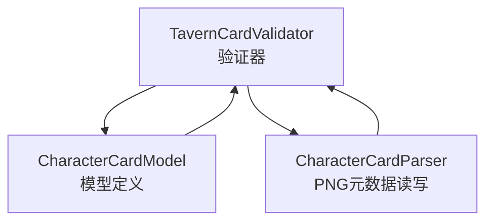
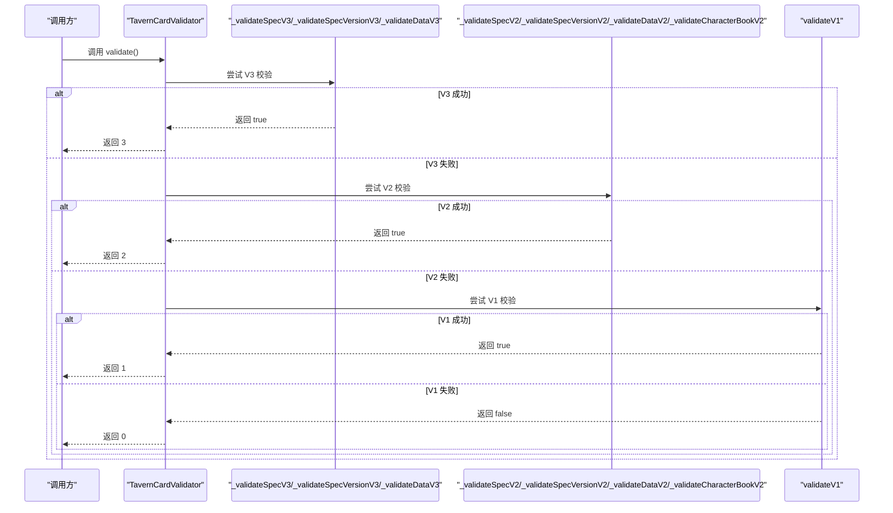
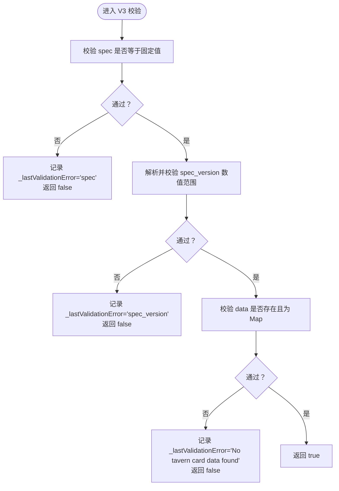
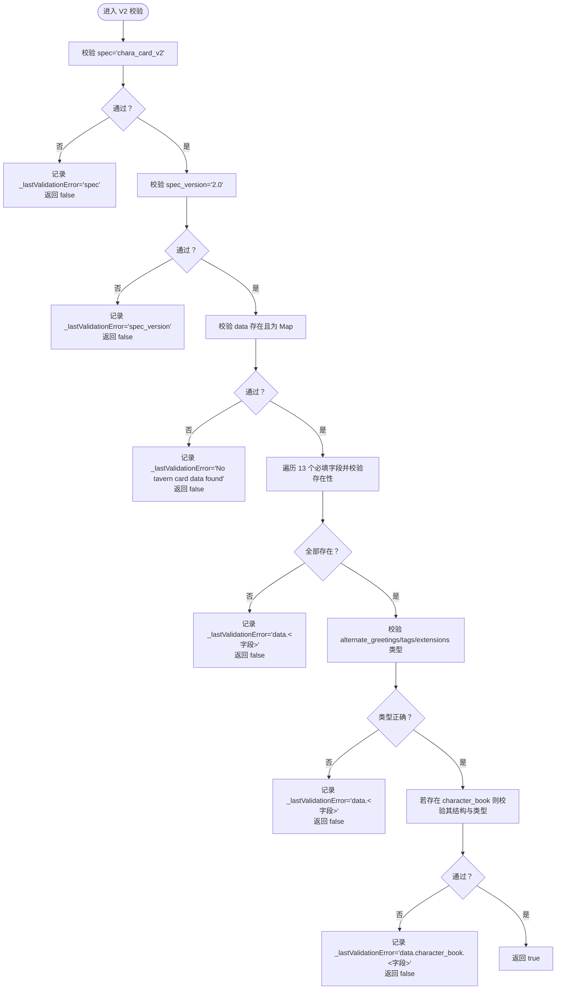
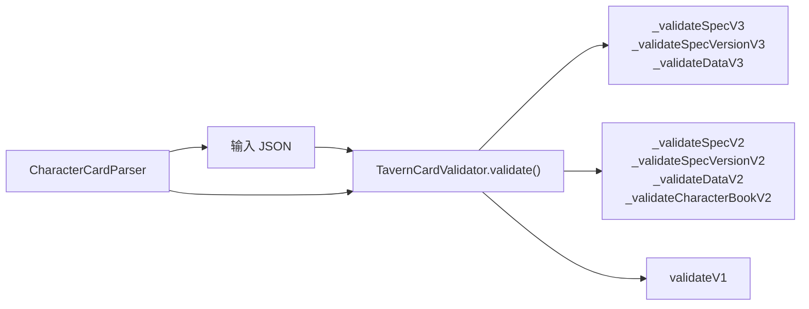

# 角色卡格式验证

<cite>
**本文引用的文件**
- [tavern_card_validator.dart](file://lib/features/character/data/utils/tavern_card_validator.dart)
- [character_card_model.dart](file://lib/features/character/data/models/character_card_model.dart)
- [character_card_parser.dart](file://lib/features/character/data/utils/character_card_parser.dart)
- [character_card_parser_test.dart](file://test/features/character/data/utils/character_card_parser_test.dart)
</cite>

## 目录
1. [简介](#简介)
2. [项目结构](#项目结构)
3. [核心组件](#核心组件)
4. [架构总览](#架构总览)
5. [详细组件分析](#详细组件分析)
6. [依赖关系分析](#依赖关系分析)
7. [性能考量](#性能考量)
8. [故障排查指南](#故障排查指南)
9. [结论](#结论)
10. [附录：版本格式与示例](#附录版本格式与示例)

## 简介
本文件面向开发者，系统化文档化 tavern_card_validator.dart 中的多版本验证逻辑，重点解释：
- validate() 方法如何按 V3→V2→V1 的优先级进行格式检测，避免误判；
- _validateSpecV3 与 _validateSpecVersionV3 对 spec 字段与版本号的严格校验规则；
- _validateDataV2 对 data 对象内 13 个必填字段的遍历检查机制；
- _lastValidationError 如何记录首个失败字段，为前端提供精准错误提示；
- 各版本格式的 JSON 样例对比，帮助理解兼容性设计。

## 项目结构
该功能位于角色卡子系统中，围绕“验证器”和“模型/解析器”协同工作：
- 验证器：负责对输入 JSON 进行多版本格式校验；
- 模型：定义 V2/V3 字段结构（用于理解字段含义与类型约束）；
- 解析器：负责从 PNG 图像中读取/写入角色卡元数据，支持 V2/CCV3 元数据块，并在写入时可附加 V3 元数据块以提升兼容性。

图表来源
- [tavern_card_validator.dart](file://lib/features/character/data/utils/tavern_card_validator.dart#L1-L171)
- [character_card_model.dart](file://lib/features/character/data/models/character_card_model.dart#L1-L63)
- [character_card_parser.dart](file://lib/features/character/data/utils/character_card_parser.dart#L1-L206)

章节来源
- [tavern_card_validator.dart](file://lib/features/character/data/utils/tavern_card_validator.dart#L1-L171)
- [character_card_model.dart](file://lib/features/character/data/models/character_card_model.dart#L1-L63)
- [character_card_parser.dart](file://lib/features/character/data/utils/character_card_parser.dart#L1-L206)

## 核心组件
- TavernCardValidator：提供 validate() 多版本检测入口，内部通过 validateV1()/validateV2()/validateV3() 分别针对 V1/V2/V3 执行严格校验；同时维护 _lastValidationError 以便前端定位首处错误。
- CharacterCardModel：定义 V2/V3 字段集合与类型约束，便于理解 data 内容要求。
- CharacterCardParser：负责 PNG 元数据读写，支持 V2/CCV3 块，写入时可自动附加 V3 元数据块，从而在读取时优先识别 V3 格式。

章节来源
- [tavern_card_validator.dart](file://lib/features/character/data/utils/tavern_card_validator.dart#L1-L171)
- [character_card_model.dart](file://lib/features/character/data/models/character_card_model.dart#L1-L63)
- [character_card_parser.dart](file://lib/features/character/data/utils/character_card_parser.dart#L1-L206)

## 架构总览
验证流程采用“优先级判定 + 严格字段校验”的策略：
- 首先尝试 V3：要求顶层包含特定 spec 与版本范围；
- 再尝试 V2：要求顶层 spec、spec_version、data 内 13 个字段齐全且类型正确；
- 最后尝试 V1：仅要求一组基础字段存在；
- 若均不满足，返回 0 表示无效。

图表来源
- [tavern_card_validator.dart](file://lib/features/character/data/utils/tavern_card_validator.dart#L17-L35)
- [tavern_card_validator.dart](file://lib/features/character/data/utils/tavern_card_validator.dart#L62-L64)
- [tavern_card_validator.dart](file://lib/features/character/data/utils/tavern_card_validator.dart#L55-L60)
- [tavern_card_validator.dart](file://lib/features/character/data/utils/tavern_card_validator.dart#L37-L53)

## 详细组件分析

### 验证器类与优先级判定
- validate()：重置 _lastValidationError，按 V3→V2→V1 顺序尝试，任一成功即返回对应版本号；全部失败返回 0。
- lastValidationError：暴露最近一次失败的字段路径，便于前端给出精准提示。

章节来源
- [tavern_card_validator.dart](file://lib/features/character/data/utils/tavern_card_validator.dart#L17-L35)
- [tavern_card_validator.dart](file://lib/features/character/data/utils/tavern_card_validator.dart#L9-L9)

### V3 校验规则
- _validateSpecV3：要求顶层字段 spec 等于固定值。
- _validateSpecVersionV3：要求 spec_version 为数值，且处于指定范围（例如不小于 3.0 且小于 4.0）。
- _validateDataV3：要求 data 存在且为 Map（V3 的 data 字段为最小必需项）。

图表来源
- [tavern_card_validator.dart](file://lib/features/character/data/utils/tavern_card_validator.dart#L144-L159)
- [tavern_card_validator.dart](file://lib/features/character/data/utils/tavern_card_validator.dart#L152-L158)
- [tavern_card_validator.dart](file://lib/features/character/data/utils/tavern_card_validator.dart#L161-L170)

章节来源
- [tavern_card_validator.dart](file://lib/features/character/data/utils/tavern_card_validator.dart#L144-L170)

### V2 校验规则
- _validateSpecV2：要求顶层字段 spec 等于固定值。
- _validateSpecVersionV2：要求 spec_version 等于固定字符串。
- _validateDataV2：要求 data 存在且为 Map；并校验 13 个必填字段均存在；最后校验部分字段类型（如 alternate_greetings、tags、extensions）为期望类型。
- _validateCharacterBookV2：当存在 character_book 时，要求其为 Map，且包含 entries、extensions 等字段，同时校验类型。

图表来源
- [tavern_card_validator.dart](file://lib/features/character/data/utils/tavern_card_validator.dart#L66-L80)
- [tavern_card_validator.dart](file://lib/features/character/data/utils/tavern_card_validator.dart#L74-L80)
- [tavern_card_validator.dart](file://lib/features/character/data/utils/tavern_card_validator.dart#L82-L117)
- [tavern_card_validator.dart](file://lib/features/character/data/utils/tavern_card_validator.dart#L119-L142)

章节来源
- [tavern_card_validator.dart](file://lib/features/character/data/utils/tavern_card_validator.dart#L55-L142)

### V1 校验规则
- validateV1：对一组基础字段执行存在性检查，若任一缺失则记录该字段名并返回 false；全部存在返回 true。

章节来源
- [tavern_card_validator.dart](file://lib/features/character/data/utils/tavern_card_validator.dart#L37-L53)

### 字段与类型约束（来自模型）
- V2 字段：name、description、personality、scenario、first_mes、mes_example、creator_notes、system_prompt、post_history_instructions、alternate_greetings、tags、creator、character_version、extensions、character_book 等。
- V3 新增字段：nickname、creator_notes_multilingual、source、group_only_greetings、creation_date、modification_date、assets 等。

章节来源
- [character_card_model.dart](file://lib/features/character/data/models/character_card_model.dart#L6-L38)

### 错误定位与前端提示
- _lastValidationError：在每次失败分支中设置为“字段名或路径”，例如 'spec'、'spec_version'、'No tavern card data found'、'data.<字段>'、'data.character_book.<字段>' 等，确保前端能直接显示具体问题字段。

章节来源
- [tavern_card_validator.dart](file://lib/features/character/data/utils/tavern_card_validator.dart#L66-L80)
- [tavern_card_validator.dart](file://lib/features/character/data/utils/tavern_card_validator.dart#L74-L80)
- [tavern_card_validator.dart](file://lib/features/character/data/utils/tavern_card_validator.dart#L82-L117)
- [tavern_card_validator.dart](file://lib/features/character/data/utils/tavern_card_validator.dart#L119-L142)
- [tavern_card_validator.dart](file://lib/features/character/data/utils/tavern_card_validator.dart#L144-L170)

## 依赖关系分析
- 验证器依赖输入 JSON 的顶层字段与 data 结构；
- V2/V3 校验依赖 data 内部字段的存在性与类型；
- 解析器负责将 JSON 序列化为 PNG 元数据块，写入时可附加 CCV3 块，使读取时优先识别 V3；
- 测试用例验证了写入/读取行为与 V3 优先策略。

图表来源
- [tavern_card_validator.dart](file://lib/features/character/data/utils/tavern_card_validator.dart#L17-L35)
- [tavern_card_validator.dart](file://lib/features/character/data/utils/tavern_card_validator.dart#L55-L142)
- [character_card_parser.dart](file://lib/features/character/data/utils/character_card_parser.dart#L42-L92)

章节来源
- [tavern_card_validator.dart](file://lib/features/character/data/utils/tavern_card_validator.dart#L17-L35)
- [character_card_parser.dart](file://lib/features/character/data/utils/character_card_parser.dart#L42-L92)

## 性能考量
- 时间复杂度：validate() 对每个版本最多线性扫描一次，整体 O(N)，N 为字段数量；V2 的 data 字段检查包含固定数量的字段遍历与类型判断，常数开销较小。
- 空间复杂度：仅使用少量局部变量与常量空间，无额外分配。
- 优化建议：
  - 若输入规模增大，可考虑缓存已解析的 JSON 或预编译正则（当前场景无需）；
  - 在前端批量校验时，可先做快速字段存在性检查，再触发更严格的类型校验。

## 故障排查指南
- 常见错误与定位：
  - spec 不匹配：检查顶层 spec 是否为 V2/V3 固定值；
  - spec_version 范围不符：确认版本号是否在 V3 的允许范围内；
  - data 缺失或非 Map：确认顶层 data 是否存在且为对象；
  - data 内字段缺失：根据 _lastValidationError 的 'data.<字段>' 提示逐一补齐；
  - 类型不正确：如 alternate_greetings 必须为数组、tags 必须为数组、extensions 必须为对象等；
  - character_book 存在但结构不完整：检查 entries、extensions 等字段是否存在且类型正确。
- 前端提示策略：
  - 使用 _lastValidationError 的字段路径直接映射到表单项，高亮并显示具体缺失或类型错误；
  - 对于 V3 版本，若出现版本范围错误，提示用户调整版本号至允许区间。

章节来源
- [tavern_card_validator.dart](file://lib/features/character/data/utils/tavern_card_validator.dart#L66-L80)
- [tavern_card_validator.dart](file://lib/features/character/data/utils/tavern_card_validator.dart#L74-L80)
- [tavern_card_validator.dart](file://lib/features/character/data/utils/tavern_card_validator.dart#L82-L117)
- [tavern_card_validator.dart](file://lib/features/character/data/utils/tavern_card_validator.dart#L119-L142)
- [tavern_card_validator.dart](file://lib/features/character/data/utils/tavern_card_validator.dart#L144-L170)

## 结论
- TavernCardValidator 通过“V3→V2→V1”的优先级判定，有效避免旧版字段与新版字段的误判；
- V3/V2 的校验规则严格限定顶层字段与 data 内字段的存在性与类型，确保数据一致性；
- _lastValidationError 记录首个失败字段，为前端提供精准提示；
- 解析器在写入时可附加 CCV3 元数据块，使读取时优先识别 V3，体现良好的向后兼容设计。

## 附录：版本格式与示例
以下为各版本的 JSON 结构要点与字段说明，便于理解兼容性设计与差异。

- V1（基础字段）
  - 顶层字段：无固定规范，仅要求一组基础字段存在；
  - 典型字段：name、description、personality、scenario、first_mes、mes_example；
  - 适用场景：早期遗留卡片，字段较少。

- V2（扩展字段）
  - 顶层字段：spec、spec_version、data；
  - data 内字段（至少包含）：name、description、personality、scenario、first_mes、mes_example、creator_notes、system_prompt、post_history_instructions、alternate_greetings、tags、creator、character_version、extensions；
  - 可选字段：character_book；
  - 适用场景：标准角色卡格式，字段丰富，支持扩展。

- V3（增强字段）
  - 顶层字段：spec、spec_version、data；
  - data 内字段（至少包含）：name、description、personality、scenario、first_mes、mes_example、creator_notes、system_prompt、post_history_instructions、alternate_greetings、tags、creator、character_version、extensions；
  - 新增字段：nickname、creator_notes_multilingual、source、group_only_greetings、creation_date、modification_date、assets；
  - 适用场景：新版本角色卡，支持多语言、资产管理与时间戳等增强能力。

- PNG 元数据与版本优先级
  - 读取时优先查找 CCV3（V3）元数据块，其次查找 chara（V2）元数据块；
  - 写入时会添加 chara（V2）元数据块，并可选择性添加 CCV3（V3）元数据块；
  - 测试用例验证了写入后读取到 V3 规范字段的行为。

章节来源
- [character_card_model.dart](file://lib/features/character/data/models/character_card_model.dart#L6-L38)
- [character_card_parser.dart](file://lib/features/character/data/utils/character_card_parser.dart#L1-L92)
- [character_card_parser_test.dart](file://test/features/character/data/utils/character_card_parser_test.dart#L25-L37)