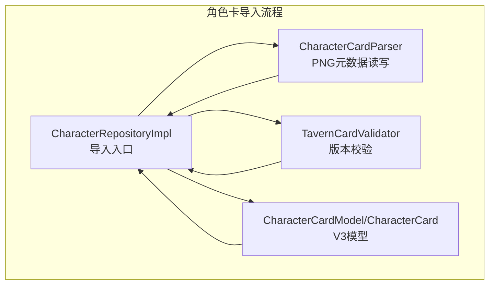
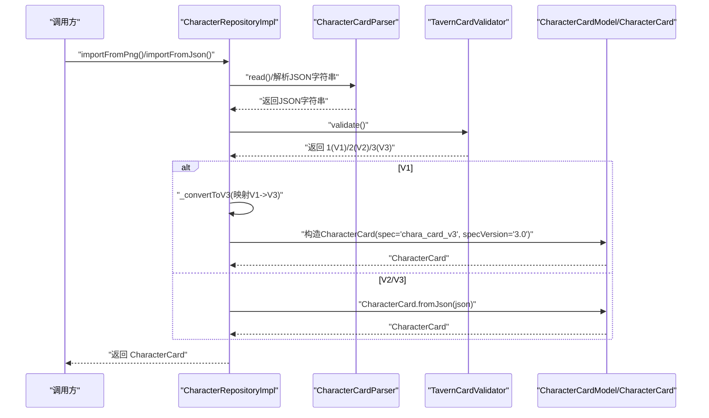
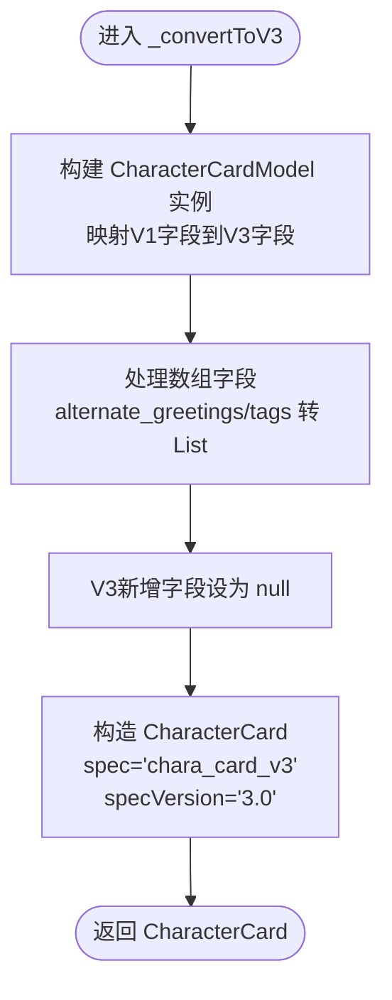
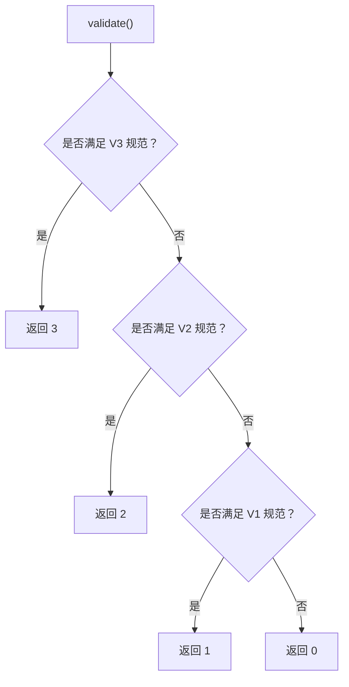
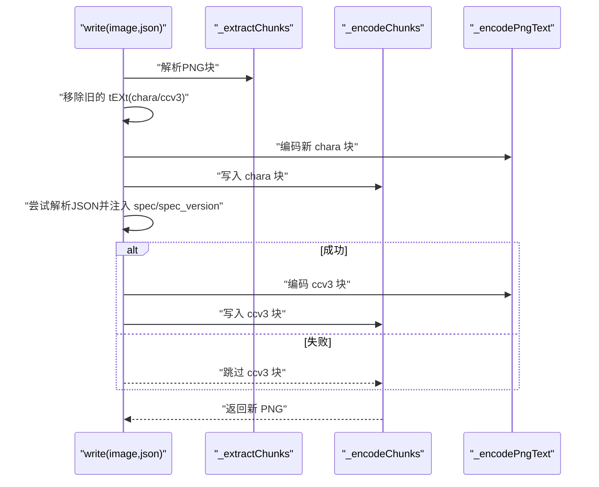
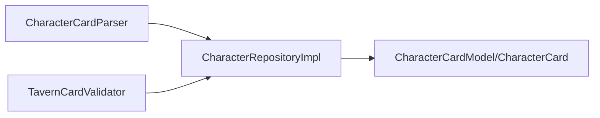

# 角色卡版本转换

<cite>
**本文引用的文件**
- [character_repository_impl.dart](file://lib/features/character/data/repositories/character_repository_impl.dart)
- [tavern_card_validator.dart](file://lib/features/character/data/utils/tavern_card_validator.dart)
- [character_card_parser.dart](file://lib/features/character/data/utils/character_card_parser.dart)
- [character_card_model.dart](file://lib/features/character/data/models/character_card_model.dart)
- [character_card_parser_test.dart](file://test/features/character/data/utils/character_card_parser_test.dart)
</cite>

## 目录
1. [简介](#简介)
2. [项目结构](#项目结构)
3. [核心组件](#核心组件)
4. [架构总览](#架构总览)
5. [详细组件分析](#详细组件分析)
6. [依赖关系分析](#依赖关系分析)
7. [性能考虑](#性能考虑)
8. [故障排查指南](#故障排查指南)
9. [结论](#结论)
10. [附录：V1到V3转换示例](#附录v1到v3转换示例)

## 简介
本文件聚焦于角色卡从 V1 到 V3 的自动升级机制，围绕以下目标展开：
- 解释当 validate() 返回 1（表示 V1）时，如何调用 _convertToV3 将扁平化的 V1 JSON 映射为 CharacterCardModel 对象，并构造符合 V3 规范的 CharacterCard 包装结构。
- 分析 V3 模型如何通过可空字段兼容 V1 缺失属性。
- 说明 spec 和 specVersion 的硬编码设置策略。
- 提供 V1 原始数据与转换后 V3 结构的对比示例，体现向后兼容的设计考量。

## 项目结构
与角色卡版本转换直接相关的关键文件如下：
- 数据解析与写入：character_card_parser.dart
- 校验器：tavern_card_validator.dart
- 领域模型：character_card_model.dart
- 仓库实现（含 V1 升级逻辑）：character_repository_impl.dart
- 测试用例：character_card_parser_test.dart

图表来源
- [character_repository_impl.dart](file://lib/features/character/data/repositories/character_repository_impl.dart#L1-L78)
- [character_card_parser.dart](file://lib/features/character/data/utils/character_card_parser.dart#L1-L206)
- [tavern_card_validator.dart](file://lib/features/character/data/utils/tavern_card_validator.dart#L1-L171)
- [character_card_model.dart](file://lib/features/character/data/models/character_card_model.dart#L1-L63)

章节来源
- [character_repository_impl.dart](file://lib/features/character/data/repositories/character_repository_impl.dart#L1-L78)
- [character_card_parser.dart](file://lib/features/character/data/utils/character_card_parser.dart#L1-L206)
- [tavern_card_validator.dart](file://lib/features/character/data/utils/tavern_card_validator.dart#L1-L171)
- [character_card_model.dart](file://lib/features/character/data/models/character_card_model.dart#L1-L63)

## 核心组件
- CharacterRepositoryImpl：负责从 PNG 或 JSON 导入角色卡；在 V1 场景下调用 _convertToV3 完成自动升级；在 V2/V3 场景下直接使用 CharacterCard.fromJson。
- TavernCardValidator：判定输入是 V1、V2 还是 V3；返回值 1 表示 V1，2/3 表示 V2/V3。
- CharacterCardParser：负责 PNG 中 tEXt 元数据块的读取与写入；写入时会为 V3 添加 spec/spec_version 字段并优先读取 V3。
- CharacterCardModel/CharacterCard：V3 模型定义，包含 V2 所有字段及新增字段，均允许为空以兼容 V1 缺失项。

章节来源
- [character_repository_impl.dart](file://lib/features/character/data/repositories/character_repository_impl.dart#L1-L78)
- [tavern_card_validator.dart](file://lib/features/character/data/utils/tavern_card_validator.dart#L1-L171)
- [character_card_parser.dart](file://lib/features/character/data/utils/character_card_parser.dart#L1-L206)
- [character_card_model.dart](file://lib/features/character/data/models/character_card_model.dart#L1-L63)

## 架构总览
下面的序列图展示了从 PNG/JSON 导入到 V3 模型的完整流程，包括 V1 自动升级路径。

图表来源
- [character_repository_impl.dart](file://lib/features/character/data/repositories/character_repository_impl.dart#L1-L78)
- [character_card_parser.dart](file://lib/features/character/data/utils/character_card_parser.dart#L1-L206)
- [tavern_card_validator.dart](file://lib/features/character/data/utils/tavern_card_validator.dart#L1-L171)
- [character_card_model.dart](file://lib/features/character/data/models/character_card_model.dart#L1-L63)

## 详细组件分析

### 组件A：V1 到 V3 自动升级（_convertToV3）
- 调用时机：当 TavernCardValidator.validate() 返回 1（V1）时，CharacterRepositoryImpl._processCharacterData 调用 _convertToV3。
- 映射策略：
  - 将 V1 的顶层字段直接映射到 CharacterCardModel 的对应字段。
  - 对于 V1 中不存在但 V3 新增的字段（如 nickname、多语言备注、分组问候、时间戳、资源列表等），保留为 null，从而实现向后兼容。
  - 对于 V1 中的数组字段（如 alternate_greetings、tags），进行类型安全的转换为 List<String>。
- 输出结构：返回一个包含 spec='chara_card_v3'、specVersion='3.0' 的 CharacterCard 对象，其 data 字段为映射后的 CharacterCardModel。

图表来源
- [character_repository_impl.dart](file://lib/features/character/data/repositories/character_repository_impl.dart#L49-L77)
- [character_card_model.dart](file://lib/features/character/data/models/character_card_model.dart#L1-L63)

章节来源
- [character_repository_impl.dart](file://lib/features/character/data/repositories/character_repository_impl.dart#L29-L77)
- [character_card_model.dart](file://lib/features/character/data/models/character_card_model.dart#L1-L63)

### 组件B：版本判定与路由（TavernCardValidator.validate）
- 判定顺序：先尝试 V3/V2，再尝试 V1；V1 是回退方案。
- 返回值语义：
  - 1：V1
  - 2：V2
  - 3：V3
  - 0：无效
- 在 V1 场景下，_processCharacterData 调用 _convertToV3 完成升级；在 V2/V3 场景下，直接使用 CharacterCard.fromJson。

图表来源
- [tavern_card_validator.dart](file://lib/features/character/data/utils/tavern_card_validator.dart#L1-L171)

章节来源
- [tavern_card_validator.dart](file://lib/features/character/data/utils/tavern_card_validator.dart#L1-L171)
- [character_repository_impl.dart](file://lib/features/character/data/repositories/character_repository_impl.dart#L29-L47)

### 组件C：PNG 元数据读写与 V3 写入策略（CharacterCardParser）
- 读取优先级：优先读取 ccv3（V3）块；若不存在则回退到 chara（V2/V1）块。
- 写入策略：
  - 删除旧的 chara/ccv3 文本块。
  - 写入新的 chara 块（V2）。
  - 尝试解析 JSON 并添加 spec/spec_version 字段，生成 ccv3 块（V3），插入到 IEND 前。
  - 若解析失败或非 JSON，则仅写入 chara 块。
- 测试验证：测试覆盖了写入后读取行为，确保读取优先级与 V3 字段注入正确。

图表来源
- [character_card_parser.dart](file://lib/features/character/data/utils/character_card_parser.dart#L43-L92)

章节来源
- [character_card_parser.dart](file://lib/features/character/data/utils/character_card_parser.dart#L1-L206)
- [character_card_parser_test.dart](file://test/features/character/data/utils/character_card_parser_test.dart#L1-L56)

### 组件D：V3 模型对 V1 的兼容性设计
- 字段兼容：
  - V3 模型为所有新增字段声明为可空（如 nickname、多语言备注、分组问候、时间戳、资源列表等），因此 V1 缺失字段在反序列化时不会报错。
  - V2 的 data 字段在 V3 模型中同样可容纳 V1 的扁平字段，因为 V3 是 V2 的超集。
- 版本标识：
  - 在 V1 升级路径中，显式将 CharacterCard.spec 设置为 'chara_card_v3'，spec_version 设置为 '3.0'，确保消费端能识别为 V3 结构。

章节来源
- [character_card_model.dart](file://lib/features/character/data/models/character_card_model.dart#L1-L63)
- [character_repository_impl.dart](file://lib/features/character/data/repositories/character_repository_impl.dart#L49-L77)

## 依赖关系分析
- CharacterRepositoryImpl 依赖：
  - CharacterCardParser：用于从 PNG 读取/写入元数据。
  - TavernCardValidator：用于判断版本并决定是否执行 V1 升级。
  - CharacterCardModel/CharacterCard：用于构造最终的 V3 结构。
- 设计要点：
  - 低耦合：各组件职责清晰，通过接口（字符串 JSON）交互。
  - 向后兼容：V3 模型字段可空，避免 V1 缺失字段导致解析失败。
  - 可扩展：新增字段只需保持可空，无需修改 V1 升级逻辑。

图表来源
- [character_repository_impl.dart](file://lib/features/character/data/repositories/character_repository_impl.dart#L1-L78)
- [character_card_parser.dart](file://lib/features/character/data/utils/character_card_parser.dart#L1-L206)
- [tavern_card_validator.dart](file://lib/features/character/data/utils/tavern_card_validator.dart#L1-L171)
- [character_card_model.dart](file://lib/features/character/data/models/character_card_model.dart#L1-L63)

章节来源
- [character_repository_impl.dart](file://lib/features/character/data/repositories/character_repository_impl.dart#L1-L78)
- [character_card_parser.dart](file://lib/features/character/data/utils/character_card_parser.dart#L1-L206)
- [tavern_card_validator.dart](file://lib/features/character/data/utils/tavern_card_validator.dart#L1-L171)
- [character_card_model.dart](file://lib/features/character/data/models/character_card_model.dart#L1-L63)

## 性能考虑
- 解析与映射成本：V1 升级仅涉及一次 JSON 解析和一次对象映射，开销较小。
- PNG 元数据操作：写入时会遍历并重写 tEXt 块，但只在写入场景发生，且块数量有限。
- 可空字段的序列化：V3 模型的可空字段在序列化时会被忽略或输出为 null，不会引入额外的内存压力。
- 建议：
  - 对于批量导入，建议合并多次写入操作，减少重复解析与块重写。
  - 在 UI 层对可空字段进行条件渲染，避免不必要的空值处理。

## 故障排查指南
- 导入失败（无效数据）：
  - 现象：validate() 返回 0，抛出异常并提示最后一条错误字段。
  - 排查：检查 JSON 是否包含必需字段（V1/V2/V3 的要求不同），或 spec/spec_version 是否匹配。
- PNG 无元数据：
  - 现象：读取时抛出“无 PNG 元数据”异常。
  - 排查：确认 PNG 是否包含 tEXt 块，或是否被其他工具破坏。
- V1 升级后字段为空：
  - 现象：nickname、多语言备注等字段为 null。
  - 说明：这是预期行为，V1 缺失字段在 V3 中以 null 表示，不影响运行。
- 写入未包含 V3 字段：
  - 现象：读取时未发现 ccv3 块或 spec/spec_version。
  - 排查：确认输入 JSON 能被成功解析；若解析失败，将仅写入 chara 块。

章节来源
- [tavern_card_validator.dart](file://lib/features/character/data/utils/tavern_card_validator.dart#L1-L171)
- [character_repository_impl.dart](file://lib/features/character/data/repositories/character_repository_impl.dart#L1-L78)
- [character_card_parser.dart](file://lib/features/character/data/utils/character_card_parser.dart#L1-L206)
- [character_card_parser_test.dart](file://test/features/character/data/utils/character_card_parser_test.dart#L1-L56)

## 结论
该系统通过“版本判定 + 自动升级”的方式实现了 V1 到 V3 的无缝过渡：
- 使用可空字段的 V3 模型天然兼容 V1 缺失属性。
- 在 V1 场景下，_convertToV3 将扁平化数据映射为 CharacterCardModel，并以硬编码的 spec/spec_version 包装为 V3 结构。
- 写入策略确保 V3 字段的注入与读取优先级，保证跨版本兼容与一致性。
- 整体设计简洁、可维护性强，便于未来继续演进。

## 附录：V1到V3转换示例
- 输入（V1 扁平 JSON）：包含 name/description/personality/scenario/first_mes/mes_example 等顶层字段。
- 映射规则（_convertToV3）：
  - 顶层字段一一映射到 CharacterCardModel。
  - 数组字段（如 alternate_greetings/tags）转为 List<String>。
  - V3 新增字段（如 nickname/多语言备注/分组问候/时间戳/资源列表）保持 null。
- 输出（V3 结构）：
  - CharacterCard.spec 固定为 'chara_card_v3'
  - CharacterCard.spec_version 固定为 '3.0'
  - data 为映射后的 CharacterCardModel

章节来源
- [character_repository_impl.dart](file://lib/features/character/data/repositories/character_repository_impl.dart#L49-L77)
- [character_card_model.dart](file://lib/features/character/data/models/character_card_model.dart#L1-L63)
- [character_card_parser_test.dart](file://test/features/character/data/utils/character_card_parser_test.dart#L1-L56)