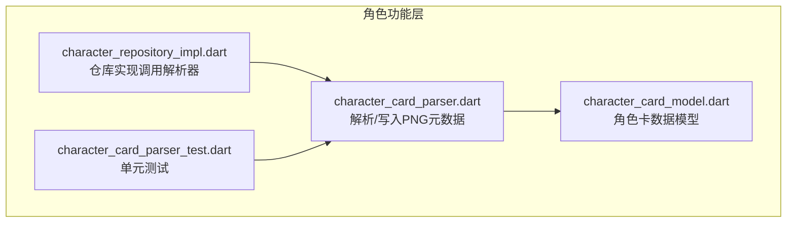
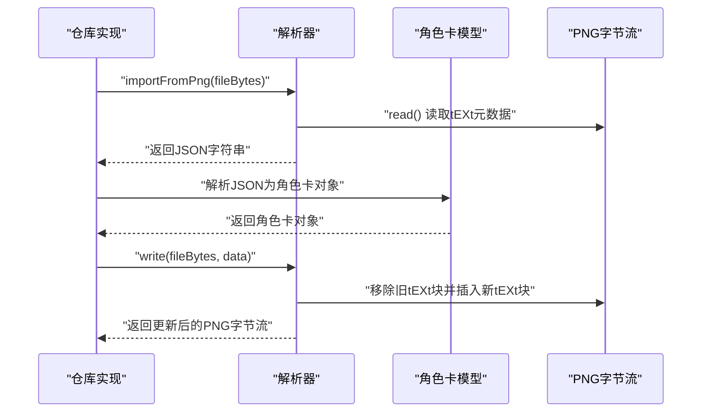
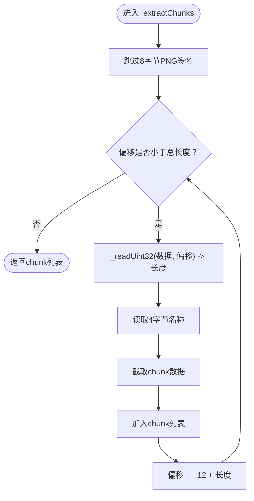
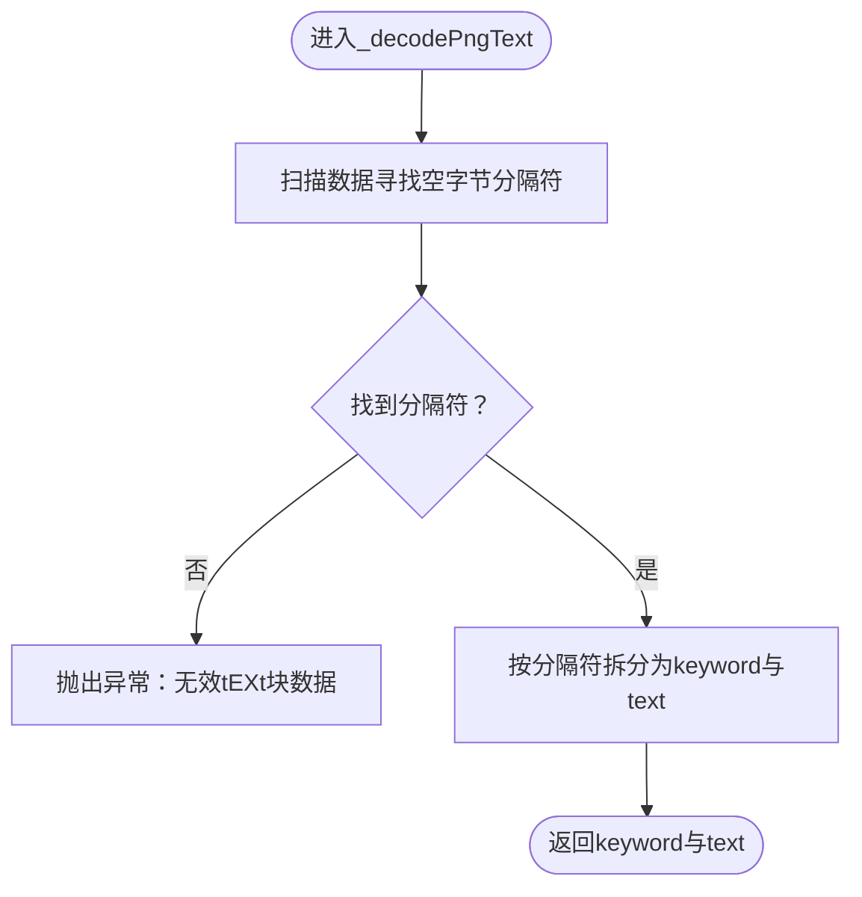
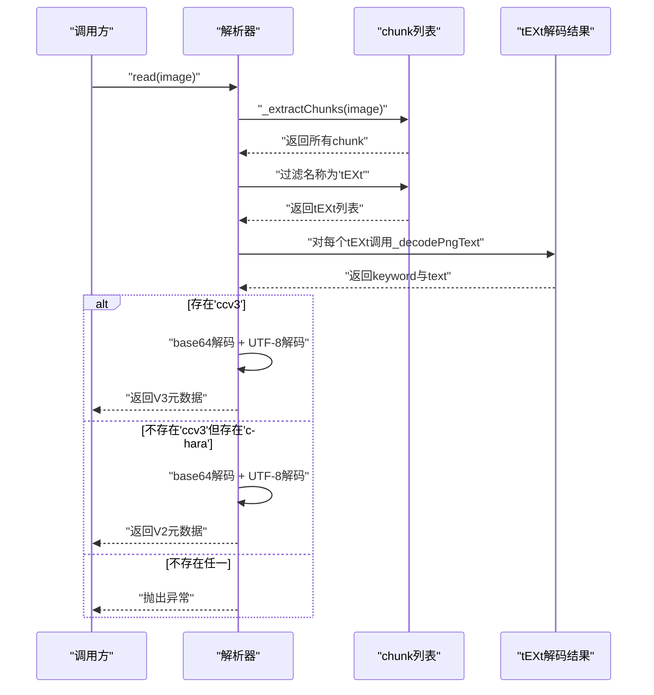
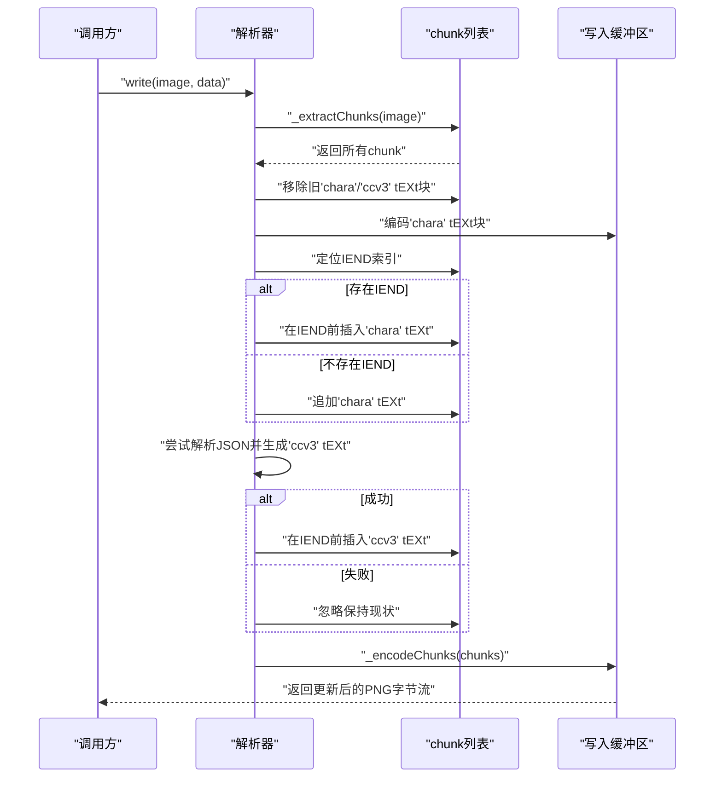
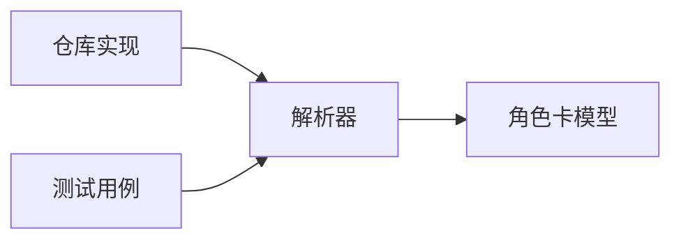

# 角色卡解析机制

<cite>
**本文引用的文件列表**
- [character_card_parser.dart](file://lib/features/character/data/utils/character_card_parser.dart)
- [character_card_parser_test.dart](file://test/features/character/data/utils/character_card_parser_test.dart)
- [character_card_model.dart](file://lib/features/character/data/models/character_card_model.dart)
- [character_repository_impl.dart](file://lib/features/character/data/repositories/character_repository_impl.dart)
</cite>

## 目录
1. [简介](#简介)
2. [项目结构](#项目结构)
3. [核心组件](#核心组件)
4. [架构总览](#架构总览)
5. [详细组件分析](#详细组件分析)
6. [依赖关系分析](#依赖关系分析)
7. [性能考量](#性能考量)
8. [故障排查指南](#故障排查指南)
9. [结论](#结论)
10. [附录](#附录)

## 简介
本文件深入解析角色卡解析器在PNG图像中嵌入与读取元数据的算法流程，重点覆盖以下方面：
- 如何通过_readUint32解析PNG块长度字段，使用_extractChunks遍历所有chunk并识别tEXt类型块
- _decodePngText如何依据空字节分隔keyword与text内容，并优先查找'ccv3'后降级查找'chara'
- 字节流处理的调试技巧
- _write方法如何移除旧元数据并插入新的tEXt块，同时维护IEND块位置与CRC32校验
- 提供二进制数据示例帮助理解

## 项目结构
角色卡解析器位于特征模块的工具层，负责将角色卡JSON数据编码为PNG的tEXt块，或从PNG中解码出角色卡JSON。其上层由仓库实现调用，用于导入角色卡。

图表来源
- [character_card_parser.dart](file://lib/features/character/data/utils/character_card_parser.dart#L1-L206)
- [character_card_model.dart](file://lib/features/character/data/models/character_card_model.dart#L1-L63)
- [character_repository_impl.dart](file://lib/features/character/data/repositories/character_repository_impl.dart#L1-L78)
- [character_card_parser_test.dart](file://test/features/character/data/utils/character_card_parser_test.dart#L1-L56)

章节来源
- [character_card_parser.dart](file://lib/features/character/data/utils/character_card_parser.dart#L1-L206)
- [character_repository_impl.dart](file://lib/features/character/data/repositories/character_repository_impl.dart#L1-L78)
- [character_card_model.dart](file://lib/features/character/data/models/character_card_model.dart#L1-L63)
- [character_card_parser_test.dart](file://test/features/character/data/utils/character_card_parser_test.dart#L1-L56)

## 核心组件
- 解析器类：CharacterCardParser
  - 负责读取与写入PNG中的tEXt元数据，支持V2（chara）与V3（ccv3），V3优先
- 内部结构体：
  - _PngChunk：封装单个PNG块的名称与数据
  - _PngText：封装tEXt块中的keyword与text
- 关键方法：
  - read：从PNG字节流中提取元数据
  - write：向PNG字节流写入元数据
  - _extractChunks/_encodeChunks：解析/编码PNG块序列
  - _readUint32：按网络字节序读取32位整数
  - _decodePngText/_encodePngText：tEXt块的解码/编码
  - _crc32：计算CRC32校验值

章节来源
- [character_card_parser.dart](file://lib/features/character/data/utils/character_card_parser.dart#L1-L206)

## 架构总览
下图展示从仓库到解析器再到模型的整体流程，以及PNG元数据的读写路径。

图表来源
- [character_repository_impl.dart](file://lib/features/character/data/repositories/character_repository_impl.dart#L1-L78)
- [character_card_parser.dart](file://lib/features/character/data/utils/character_card_parser.dart#L1-L206)
- [character_card_model.dart](file://lib/features/character/data/models/character_card_model.dart#L1-L63)

## 详细组件分析

### PNG块解析与遍历（_extractChunks）
- 跳过8字节PNG签名后，循环读取每个chunk：
  - 使用_readUint32从偏移处读取长度字段
  - 从偏移+4到偏移+8读取4字节chunk名称
  - 截取偏移+8到偏移+8+length作为chunk数据
  - 偏移前进12+length（长度4+名称4+CRC4）
- 返回所有chunk列表，供后续筛选与处理

图表来源
- [character_card_parser.dart](file://lib/features/character/data/utils/character_card_parser.dart#L94-L109)

章节来源
- [character_card_parser.dart](file://lib/features/character/data/utils/character_card_parser.dart#L94-L109)

### 32位无符号整数读取（_readUint32）
- 使用ByteData子视图按网络字节序读取4字节，返回整型数值
- 用于解析chunk长度字段

章节来源
- [character_card_parser.dart](file://lib/features/character/data/utils/character_card_parser.dart#L133-L135)

### tEXt块解码（_decodePngText）
- 在chunk数据中寻找第一个空字节（0）作为分隔符
- 分隔前半部分为keyword，后半部分为text
- 返回_keyword与_text组成的结构体
- 若未找到分隔符则抛出异常

图表来源
- [character_card_parser.dart](file://lib/features/character/data/utils/character_card_parser.dart#L137-L154)

章节来源
- [character_card_parser.dart](file://lib/features/character/data/utils/character_card_parser.dart#L137-L154)

### 元数据读取主流程（read）
- 通过_extractChunks提取所有chunk
- 过滤出名称为'tEXt'的chunk
- 对每个tEXt块调用_decodePngText解码为keyword与text
- 优先查找keyword为'ccv3'（不区分大小写），若存在则base64解码并UTF-8解码后返回
- 若不存在'ccv3'，则查找'chara'（不区分大小写），同样base64+UTF-8解码后返回
- 若均未找到，则抛出“无PNG元数据”异常

图表来源
- [character_card_parser.dart](file://lib/features/character/data/utils/character_card_parser.dart#L1-L40)

章节来源
- [character_card_parser.dart](file://lib/features/character/data/utils/character_card_parser.dart#L1-L40)

### 元数据写入主流程（write）
- 通过_extractChunks提取所有chunk
- 移除旧的tEXt块，条件为名称为'tEXt'且keyword为'chara'或'ccv3'
- 在IEND块之前插入新的'chara' tEXt块（若存在IEND则插入其前；否则追加）
- 尝试解析输入数据为JSON，若成功则生成V3规范字段（spec、spec_version），再生成'ccv3' tEXt块并插入IEND之前（或末尾）
- 最终通过_encodeChunks将chunk列表重新编码为PNG字节流，期间为每个chunk计算CRC32

图表来源
- [character_card_parser.dart](file://lib/features/character/data/utils/character_card_parser.dart#L42-L92)

章节来源
- [character_card_parser.dart](file://lib/features/character/data/utils/character_card_parser.dart#L42-L92)

### CRC32校验与chunk编码（_encodeChunks/_crc32）
- 编码时为每个chunk计算CRC32，规则如下：
  - CRC表预生成，基于标准多项式
  - 计算过程对chunk名称与数据逐字节迭代
  - 最终异或掩码得到最终CRC值
- _encodeChunks在输出时：
  - 写入PNG签名
  - 每个chunk写入长度、名称、数据与CRC
  - 维护IEND块位置不变，确保PNG结构正确

章节来源
- [character_card_parser.dart](file://lib/features/character/data/utils/character_card_parser.dart#L111-L131)
- [character_card_parser.dart](file://lib/features/character/data/utils/character_card_parser.dart#L166-L191)

### 数据模型与版本兼容
- 角色卡模型支持V2与V3字段，V3为超集，可兼容V2数据
- 仓库实现会验证并转换数据，解析器写入时会自动为V3添加规范字段

章节来源
- [character_card_model.dart](file://lib/features/character/data/models/character_card_model.dart#L1-L63)
- [character_repository_impl.dart](file://lib/features/character/data/repositories/character_repository_impl.dart#L1-L78)

## 依赖关系分析
- 仓库实现依赖解析器进行PNG元数据的读取与写入
- 解析器内部依赖dart:typed_data与dart:convert进行字节操作与编码
- 测试用例验证了写入后读回的V3格式、覆盖行为与异常场景

图表来源
- [character_repository_impl.dart](file://lib/features/character/data/repositories/character_repository_impl.dart#L1-L78)
- [character_card_parser.dart](file://lib/features/character/data/utils/character_card_parser.dart#L1-L206)
- [character_card_model.dart](file://lib/features/character/data/models/character_card_model.dart#L1-L63)
- [character_card_parser_test.dart](file://test/features/character/data/utils/character_card_parser_test.dart#L1-L56)

章节来源
- [character_repository_impl.dart](file://lib/features/character/data/repositories/character_repository_impl.dart#L1-L78)
- [character_card_parser.dart](file://lib/features/character/data/utils/character_card_parser.dart#L1-L206)
- [character_card_model.dart](file://lib/features/character/data/models/character_card_model.dart#L1-L63)
- [character_card_parser_test.dart](file://test/features/character/data/utils/character_card_parser_test.dart#L1-L56)

## 性能考量
- 时间复杂度
  - _extractChunks：O(n)，n为PNG字节数
  - read：O(n + m)，m为tEXt块数量，主要消耗在遍历与base64解码
  - write：O(n + m)，包含移除旧块、插入新块与CRC计算
- 空间复杂度
  - 主要为chunk列表与中间缓冲，与输入大小线性相关
- 优化建议
  - 对大文件可考虑分块处理与缓存常用常量（如CRC表）
  - 在写入时尽量减少不必要的复制，复用缓冲区

## 故障排查指南
- 读取失败（无PNG元数据）
  - 现象：抛出“无PNG元数据”异常
  - 可能原因：PNG中不存在tEXt块或数据格式不合法
  - 排查步骤：确认PNG是否包含tEXt块；检查keyword与text分隔符是否存在
- tEXt块格式错误
  - 现象：解码阶段抛出“无效tEXt块数据”
  - 可能原因：缺少空字节分隔符
  - 排查步骤：检查chunk数据中是否包含空字节；确认keyword与text编码顺序
- CRC校验失败
  - 现象：PNG无法被正确解析
  - 可能原因：CRC计算错误或chunk顺序不当
  - 排查步骤：核对CRC表生成逻辑与计算流程；确保IEND位置正确
- 写入后读取不一致
  - 现象：读取到的JSON字段与预期不符
  - 可能原因：V3规范字段未正确注入或被覆盖
  - 排查步骤：确认写入流程中是否生成ccv3块；检查IEND插入位置

章节来源
- [character_card_parser.dart](file://lib/features/character/data/utils/character_card_parser.dart#L1-L40)
- [character_card_parser.dart](file://lib/features/character/data/utils/character_card_parser.dart#L137-L154)
- [character_card_parser.dart](file://lib/features/character/data/utils/character_card_parser.dart#L166-L191)

## 结论
该解析器通过直接操作PNG字节流，实现了对tEXt元数据的可靠读写。其设计遵循PNG规范，严格维护chunk边界与CRC校验，并在版本层面优先支持V3（ccv3）。通过对_readUint32、_extractChunks、_decodePngText与_write流程的深入理解，可以有效进行调试与扩展。

## 附录

### 二进制数据示例（概念性说明）
- PNG签名：8字节固定值
- IHDR：长度、名称、数据、CRC
- IDAT：长度、名称、数据、CRC
- IEND：长度、名称、数据、CRC
- tEXt：长度、名称、keyword + 空字节 + text、CRC

说明：
- 以上为概念性描述，便于理解chunk布局与插入位置
- 实际应用中请参考测试用例中的最小PNG结构与解析器的编码/解码逻辑

章节来源
- [character_card_parser_test.dart](file://test/features/character/data/utils/character_card_parser_test.dart#L1-L56)
- [character_card_parser.dart](file://lib/features/character/data/utils/character_card_parser.dart#L94-L131)