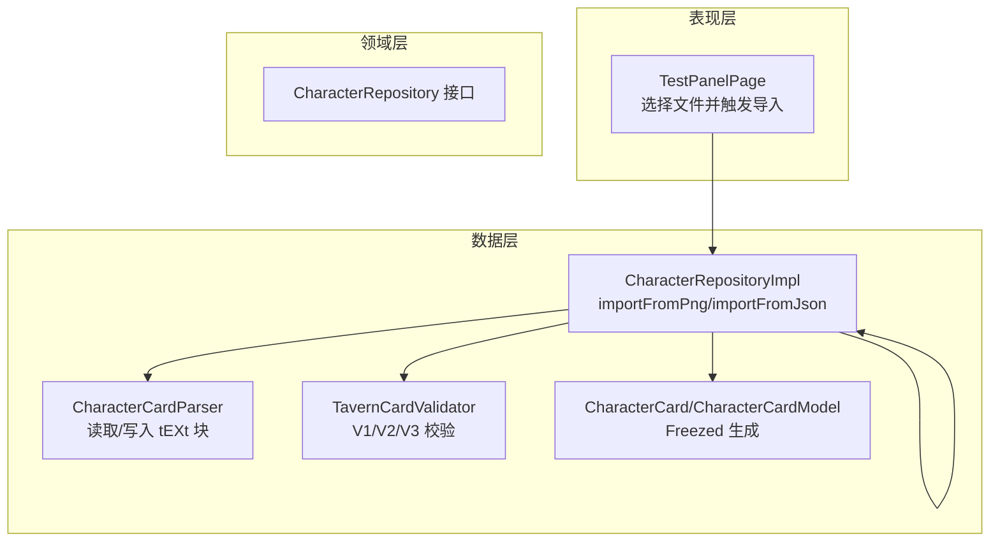
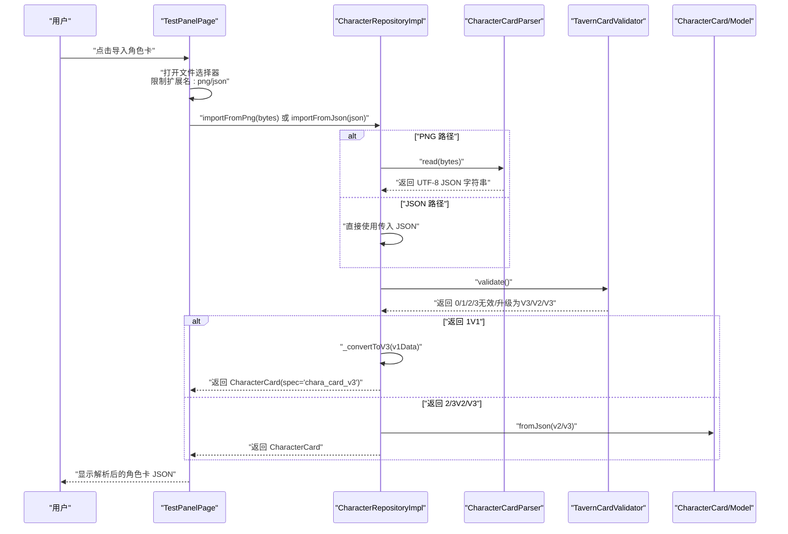
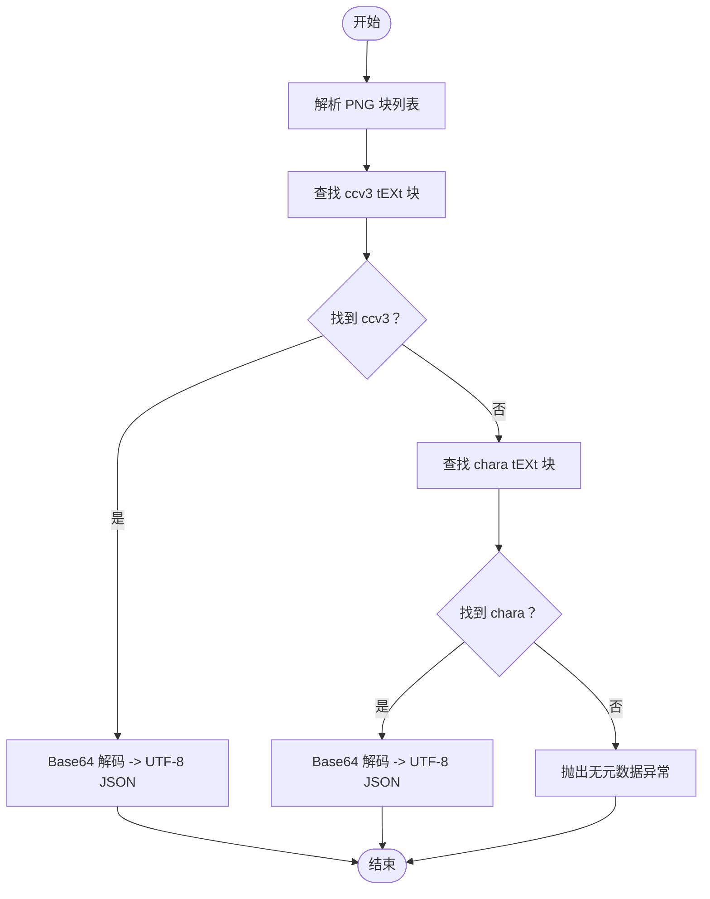
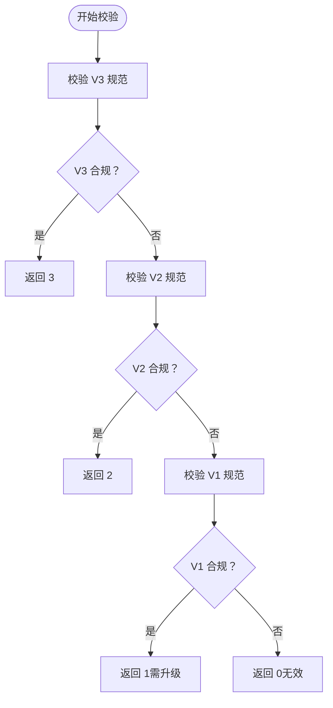
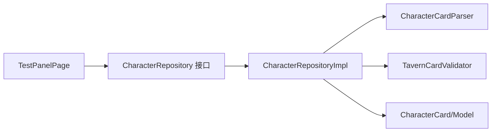

# 角色管理模块

<cite>
**本文引用的文件**
- [test_panel_page.dart](file://lib/features/character/presentation/pages/test_panel_page.dart)
- [character_repository.dart](file://lib/features/character/domain/repositories/character_repository.dart)
- [character_repository_impl.dart](file://lib/features/character/data/repositories/character_repository_impl.dart)
- [character_card_parser.dart](file://lib/features/character/data/utils/character_card_parser.dart)
- [tavern_card_validator.dart](file://lib/features/character/data/utils/tavern_card_validator.dart)
- [character_card_model.dart](file://lib/features/character/data/models/character_card_model.dart)
- [app_router.dart](file://lib/core/router/app_router.dart)
- [main.dart](file://lib/main.dart)
- [character_card_parser_test.dart](file://test/features/character/data/utils/character_card_parser_test.dart)
</cite>

## 目录
1. [简介](#简介)
2. [项目结构](#项目结构)
3. [核心组件](#核心组件)
4. [架构总览](#架构总览)
5. [详细组件分析](#详细组件分析)
6. [依赖关系分析](#依赖关系分析)
7. [性能考量](#性能考量)
8. [故障排查指南](#故障排查指南)
9. [结论](#结论)
10. [附录](#附录)

## 简介
本文件系统性阐述角色管理模块的完整工作流：从用户在测试面板中选择文件（PNG 或 JSON），到通过 CharacterRepository 接口完成角色卡的导入与解析。重点覆盖以下链路：
- 测试面板入口页面如何调用 CharacterRepository 接口；
- CharacterRepositoryImpl 如何协调文件读取、格式判断与解析流程；
- CharacterCardParser 如何从 PNG 的 tEXt 块提取 Base64 编码的元数据并解码；
- TavernCardValidator 如何验证 V1/V2/V3 格式并实现从 V1 到 V3 的自动升级；
- 提供关键方法调用链的示例路径，帮助开发者快速定位实现细节。

## 项目结构
角色管理模块位于 features/character 下，采用“领域层-数据层-表现层”的分层组织方式：
- 表现层：测试面板页面负责用户交互与日志输出；
- 领域层：定义 CharacterRepository 接口；
- 数据层：实现接口，封装 PNG 元数据解析与 JSON 校验逻辑；
- 工具层：提供 PNG tEXt 解析与角色卡格式校验；
- 模型层：使用 Freezed 生成角色卡数据模型。

图表来源
- [test_panel_page.dart](file://lib/features/character/presentation/pages/test_panel_page.dart#L1-L114)
- [character_repository.dart](file://lib/features/character/domain/repositories/character_repository.dart#L1-L10)
- [character_repository_impl.dart](file://lib/features/character/data/repositories/character_repository_impl.dart#L1-L78)
- [character_card_parser.dart](file://lib/features/character/data/utils/character_card_parser.dart#L1-L206)
- [tavern_card_validator.dart](file://lib/features/character/data/utils/tavern_card_validator.dart#L1-L171)
- [character_card_model.dart](file://lib/features/character/data/models/character_card_model.dart#L1-L63)

章节来源
- [test_panel_page.dart](file://lib/features/character/presentation/pages/test_panel_page.dart#L1-L114)
- [character_repository.dart](file://lib/features/character/domain/repositories/character_repository.dart#L1-L10)
- [character_repository_impl.dart](file://lib/features/character/data/repositories/character_repository_impl.dart#L1-L78)
- [character_card_parser.dart](file://lib/features/character/data/utils/character_card_parser.dart#L1-L206)
- [tavern_card_validator.dart](file://lib/features/character/data/utils/tavern_card_validator.dart#L1-L171)
- [character_card_model.dart](file://lib/features/character/data/models/character_card_model.dart#L1-L63)
- [app_router.dart](file://lib/core/router/app_router.dart#L1-L18)
- [main.dart](file://lib/main.dart#L1-L33)

## 核心组件
- 测试面板页面：负责文件选择、调用仓库接口、展示导入结果与错误日志。
- CharacterRepository 接口：定义从 PNG/JSON 导入角色卡的方法契约。
- CharacterRepositoryImpl：实现接口，串联 PNG 元数据读取、JSON 校验与模型转换；支持 V1 自动升级至 V3。
- CharacterCardParser：从 PNG 的 tEXt 块提取 Base64 编码的元数据并解码；支持写入新元数据。
- TavernCardValidator：对 V1/V2/V3 格式进行严格校验，并返回版本判定与错误信息。
- CharacterCard/CharacterCardModel：基于 Freezed 的数据模型，兼容 V2/V3 字段。

章节来源
- [test_panel_page.dart](file://lib/features/character/presentation/pages/test_panel_page.dart#L1-L114)
- [character_repository.dart](file://lib/features/character/domain/repositories/character_repository.dart#L1-L10)
- [character_repository_impl.dart](file://lib/features/character/data/repositories/character_repository_impl.dart#L1-L78)
- [character_card_parser.dart](file://lib/features/character/data/utils/character_card_parser.dart#L1-L206)
- [tavern_card_validator.dart](file://lib/features/character/data/utils/tavern_card_validator.dart#L1-L171)
- [character_card_model.dart](file://lib/features/character/data/models/character_card_model.dart#L1-L63)

## 架构总览
下图展示了从用户选择文件到成功导入角色卡的端到端流程，包括关键调用链与数据流转。

图表来源
- [test_panel_page.dart](file://lib/features/character/presentation/pages/test_panel_page.dart#L1-L114)
- [character_repository_impl.dart](file://lib/features/character/data/repositories/character_repository_impl.dart#L1-L78)
- [character_card_parser.dart](file://lib/features/character/data/utils/character_card_parser.dart#L1-L206)
- [tavern_card_validator.dart](file://lib/features/character/data/utils/tavern_card_validator.dart#L1-L171)
- [character_card_model.dart](file://lib/features/character/data/models/character_card_model.dart#L1-L63)

## 详细组件分析

### 测试面板入口页面（TestPanelPage）
- 功能职责
  - 打开文件选择器，限制扩展名为 png/json；
  - 读取文件字节与扩展名；
  - 根据扩展名调用 CharacterRepository 的不同导入方法；
  - 展示导入结果或错误日志。
- 关键行为
  - 当扩展名为 png 时，调用 importFromPng；
  - 当扩展名为 json 时，调用 importFromJson 并解码字节为字符串；
  - 使用 JsonEncoder.withIndent 将角色卡对象转为可读 JSON 文本用于日志输出。

章节来源
- [test_panel_page.dart](file://lib/features/character/presentation/pages/test_panel_page.dart#L1-L114)

### CharacterRepository 接口
- 定义两个抽象方法：
  - importFromPng：从 PNG 图像字节流导入角色卡；
  - importFromJson：从 JSON 字符串导入角色卡。
- 该接口作为领域层契约，隔离上层调用与具体实现。

章节来源
- [character_repository.dart](file://lib/features/character/domain/repositories/character_repository.dart#L1-L10)

### CharacterRepositoryImpl 实现
- importFromPng
  - 调用 CharacterCardParser.read 从 PNG 中提取 Base64 编码的元数据并解码为 UTF-8 JSON；
  - 统一进入 _processCharacterData 进行后续处理。
- importFromJson
  - 直接进入 _processCharacterData 处理 JSON。
- _processCharacterData
  - 使用 TavernCardValidator 对 JSON 进行格式校验；
  - 若返回 0（无效），抛出异常并包含最后一条错误信息；
  - 若返回 1（V1），执行 _convertToV3 映射为 V3 结构；
  - 若返回 2/3（V2/V3），直接使用 CharacterCard.fromJson 解析为模型对象。
- _convertToV3
  - 将 V1 字段映射到 V3 结构，设置 spec 与 spec_version，并保留空字段以满足 V3 模型要求。

章节来源
- [character_repository_impl.dart](file://lib/features/character/data/repositories/character_repository_impl.dart#L1-L78)

### CharacterCardParser：PNG tEXt 元数据读取与写入
- 读取流程
  - 解析 PNG 块列表，筛选 tEXt 块；
  - 优先查找关键字为 ccv3 的 tEXt 块（V3）；
  - 若未找到，则回退查找 chara（V2）；
  - 对 Base64 文本进行解码并返回 UTF-8 JSON。
- 写入流程
  - 移除旧的 chara/ccv3 tEXt 块；
  - 插入新的 chara tEXt 块（写入位置在 IEND 前）；
  - 尝试添加 ccv3 tEXt 块（基于原始 JSON 修改 spec/spec_version）；
  - 重新组装 PNG 字节流并返回。
- 辅助实现
  - _extractChunks/_encodeChunks：解析/编码 PNG 块；
  - _decodePngText/_encodePngText：处理 tEXt 关键字与文本；
  - CRC32 校验：保证 PNG 块完整性。

图表来源
- [character_card_parser.dart](file://lib/features/character/data/utils/character_card_parser.dart#L1-L206)

章节来源
- [character_card_parser.dart](file://lib/features/character/data/utils/character_card_parser.dart#L1-L206)

### TavernCardValidator：V1/V2/V3 校验与升级
- 校验顺序
  - 优先校验 V3：要求存在 spec='chara_card_v3' 且 spec_version 在 3.0~4.0 区间；
  - 再校验 V2：要求存在 spec='chara_card_v2'、spec_version='2.0'，以及 data 中的完整字段集；
  - 最后校验 V1：要求顶层具备一组基础字段集合；
  - 返回值：1/2/3 表示对应版本，0 表示无效。
- 错误追踪
  - 记录最后一条导致失败的字段路径，便于定位问题。
- 升级策略
  - 当返回 1（V1）时，由 RepositoryImpl 执行 _convertToV3 映射，统一输出 V3 规范的角色卡。

图表来源
- [tavern_card_validator.dart](file://lib/features/character/data/utils/tavern_card_validator.dart#L1-L171)

章节来源
- [tavern_card_validator.dart](file://lib/features/character/data/utils/tavern_card_validator.dart#L1-L171)

### 数据模型：CharacterCard 与 CharacterCardModel
- CharacterCard
  - 包含 spec/spec_version/data 三要素；
  - data 类型为 CharacterCardModel。
- CharacterCardModel
  - 兼容 V2 字段（如 first_mes、mes_example、alternate_greetings 等）；
  - 新增 V3 字段（如 nickname、creator_notes_multilingual、assets 等）；
  - 使用 Freezed 自动生成序列化/反序列化代码。
- 设计要点
  - V3 模型为超集，可承载 V2 数据；
  - V1 数据经 Validator 判定后由 RepositoryImpl 转换为 V3 结构。

章节来源
- [character_card_model.dart](file://lib/features/character/data/models/character_card_model.dart#L1-L63)

### 路由与入口
- 应用通过 go_router 注册 /test 与 /chat 页面；
- /test 页面即为角色卡导入的测试入口；
- main.dart 中通过 ProviderScope 初始化全局状态与路由。

章节来源
- [app_router.dart](file://lib/core/router/app_router.dart#L1-L18)
- [main.dart](file://lib/main.dart#L1-L33)

## 依赖关系分析
- 组件耦合
  - TestPanelPage 仅依赖 CharacterRepository 接口，不直接依赖具体实现；
  - CharacterRepositoryImpl 依赖 Parser 与 Validator，同时持有模型类型；
  - Parser 与 Validator 为纯函数式工具类，彼此独立。
- 外部依赖
  - file_picker 用于文件选择；
  - freezed 生成模型序列化代码；
  - go_router 用于页面导航。
- 可能的循环依赖
  - 未发现循环依赖：接口-实现-工具-模型之间为单向依赖。

图表来源
- [test_panel_page.dart](file://lib/features/character/presentation/pages/test_panel_page.dart#L1-L114)
- [character_repository.dart](file://lib/features/character/domain/repositories/character_repository.dart#L1-L10)
- [character_repository_impl.dart](file://lib/features/character/data/repositories/character_repository_impl.dart#L1-L78)
- [character_card_parser.dart](file://lib/features/character/data/utils/character_card_parser.dart#L1-L206)
- [tavern_card_validator.dart](file://lib/features/character/data/utils/tavern_card_validator.dart#L1-L171)
- [character_card_model.dart](file://lib/features/character/data/models/character_card_model.dart#L1-L63)

章节来源
- [test_panel_page.dart](file://lib/features/character/presentation/pages/test_panel_page.dart#L1-L114)
- [character_repository_impl.dart](file://lib/features/character/data/repositories/character_repository_impl.dart#L1-L78)

## 性能考量
- PNG 元数据读取
  - 仅扫描 tEXt 块，时间复杂度近似 O(n)，n 为 PNG 块数量；
  - Base64 解码与 UTF-8 解码为线性操作，整体开销较小。
- JSON 校验
  - 校验过程为字段存在性检查与类型检查，时间复杂度 O(k)，k 为所需字段数；
  - V3/V2/V1 三阶段校验，通常较快返回结果。
- 模型转换
  - V1 到 V3 的映射为字段拷贝与默认值填充，开销极低；
  - Freezed 的序列化/反序列化为编译期生成，运行时性能稳定。
- I/O 与 UI
  - 文件读取与 UI 更新在异步任务中执行，避免阻塞主线程；
  - 日志输出使用可选中文本容器，便于调试。

## 故障排查指南
- 常见错误与定位
  - “无 PNG 元数据”：确认 PNG 是否包含 ccv3/chara tEXt 块；参考测试用例验证写入与读取流程；
  - “JSON 无效”：检查 TavernCardValidator 返回的 lastValidationError 字段，定位缺失字段或类型不符；
  - “导入失败异常”：CharacterRepositoryImpl 在解析失败时会抛出异常，查看异常消息中的具体原因。
- 测试参考
  - 测试用例验证了写入/读取往返、覆盖写入、无元数据抛错等场景，可作为回归测试依据。

章节来源
- [character_card_parser_test.dart](file://test/features/character/data/utils/character_card_parser_test.dart#L1-L56)
- [character_repository_impl.dart](file://lib/features/character/data/repositories/character_repository_impl.dart#L1-L78)
- [tavern_card_validator.dart](file://lib/features/character/data/utils/tavern_card_validator.dart#L1-L171)

## 结论
角色管理模块通过清晰的分层设计与严格的格式校验，实现了从 PNG/JSON 到统一角色卡模型的可靠导入流程。关键链路如下：
- 用户选择文件 → TestPanelPage 调用 CharacterRepository；
- RepositoryImpl 统一进入 _processCharacterData；
- 若为 PNG，先由 Parser 从 tEXt 块提取 JSON；
- 使用 Validator 判定版本并决定是否升级；
- 最终以 CharacterCard/Model 形式返回给 UI 展示。

该设计具备良好的可维护性与扩展性，便于未来引入更多格式或增强校验规则。

## 附录
- 关键方法调用链示例路径（不含代码内容，仅路径）
  - 测试面板入口：[test_panel_page.dart](file://lib/features/character/presentation/pages/test_panel_page.dart#L20-L58)
  - 导入 PNG：[character_repository_impl.dart](file://lib/features/character/data/repositories/character_repository_impl.dart#L11-L18)
  - 导入 JSON：[character_repository_impl.dart](file://lib/features/character/data/repositories/character_repository_impl.dart#L21-L27)
  - 解析 PNG 元数据：[character_card_parser.dart](file://lib/features/character/data/utils/character_card_parser.dart#L7-L40)
  - 校验角色卡：[tavern_card_validator.dart](file://lib/features/character/data/utils/tavern_card_validator.dart#L11-L35)
  - V1 升级至 V3：[character_repository_impl.dart](file://lib/features/character/data/repositories/character_repository_impl.dart#L49-L77)
  - 模型解析：[character_card_model.dart](file://lib/features/character/data/models/character_card_model.dart#L36-L62)
  - 路由与入口：[app_router.dart](file://lib/core/router/app_router.dart#L6-L17), [main.dart](file://lib/main.dart#L1-L33)