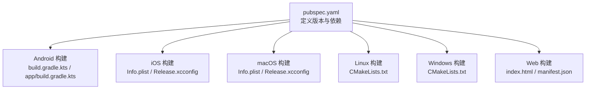
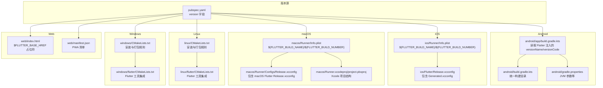
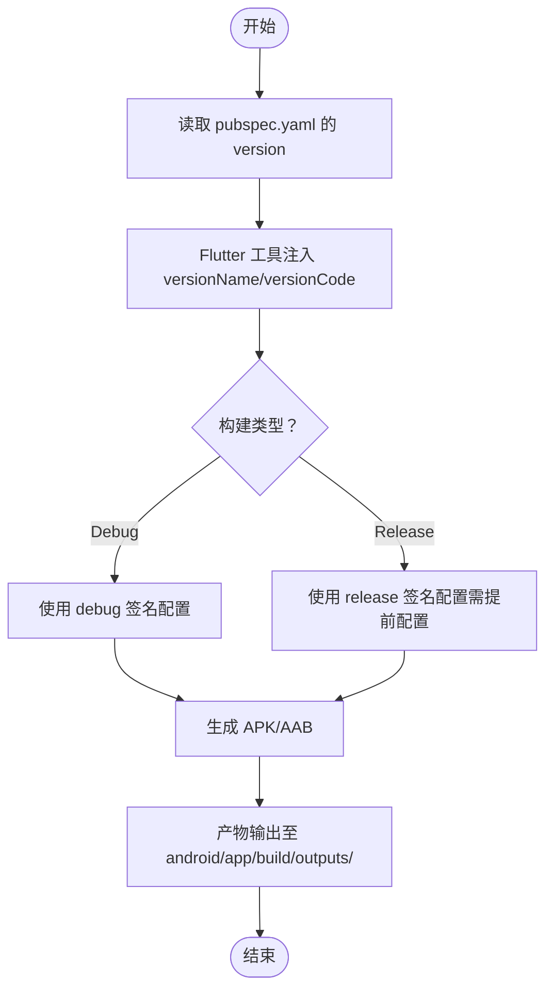
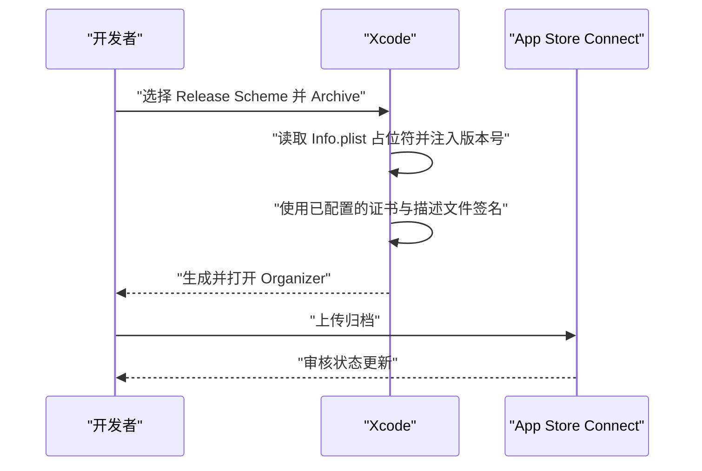
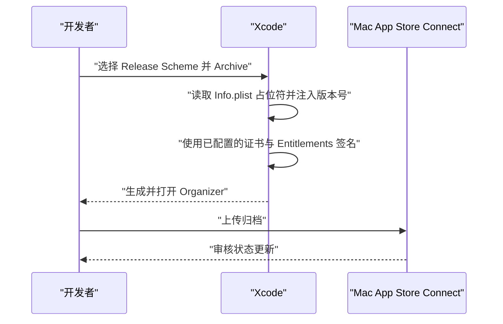
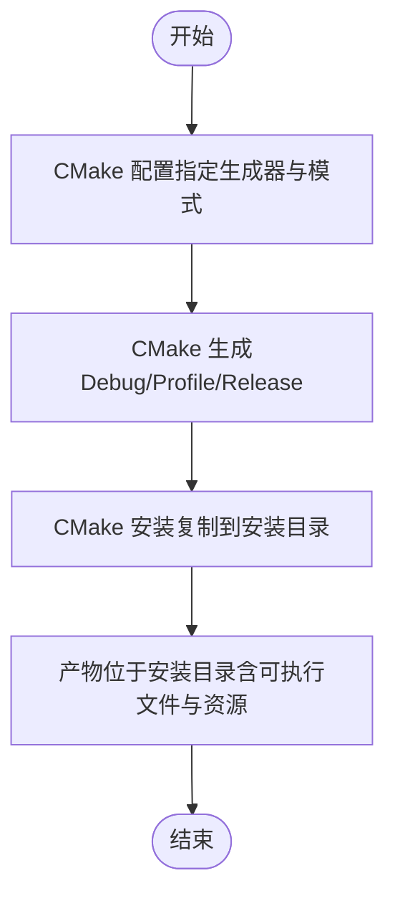
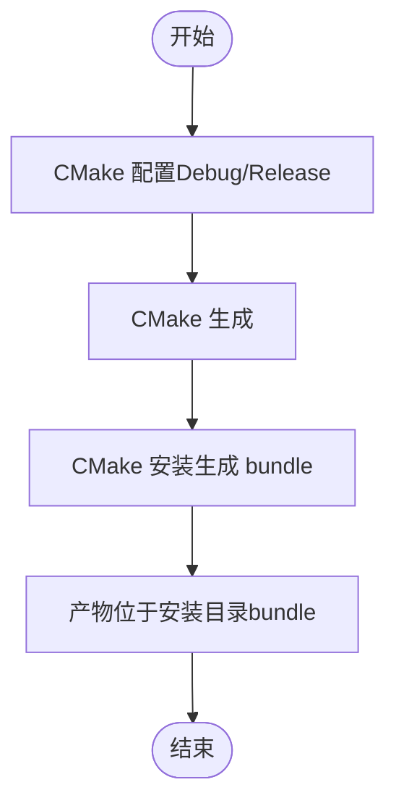
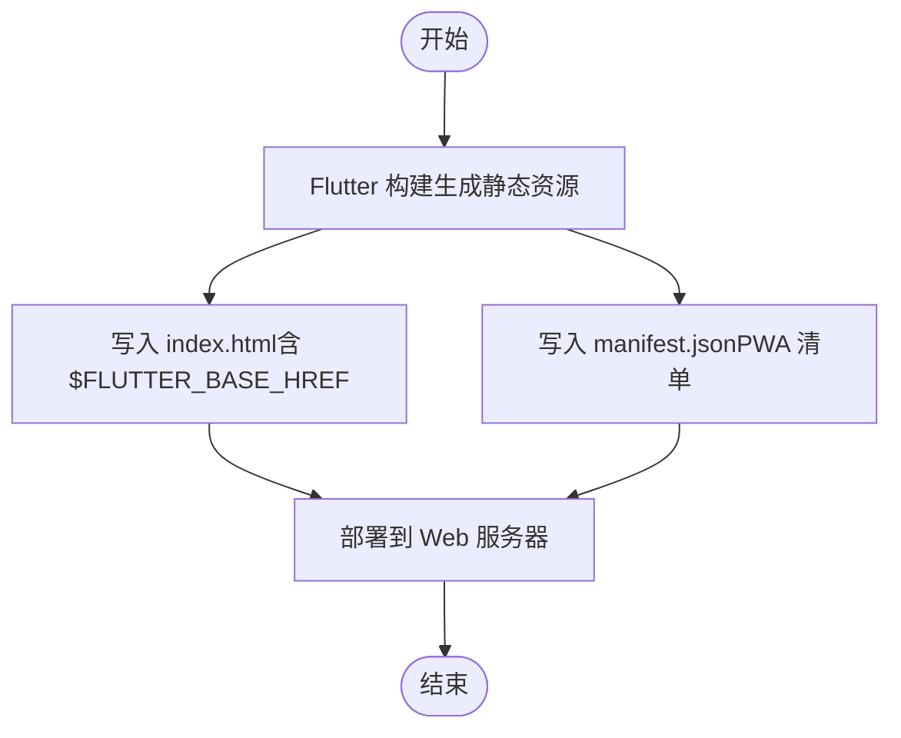
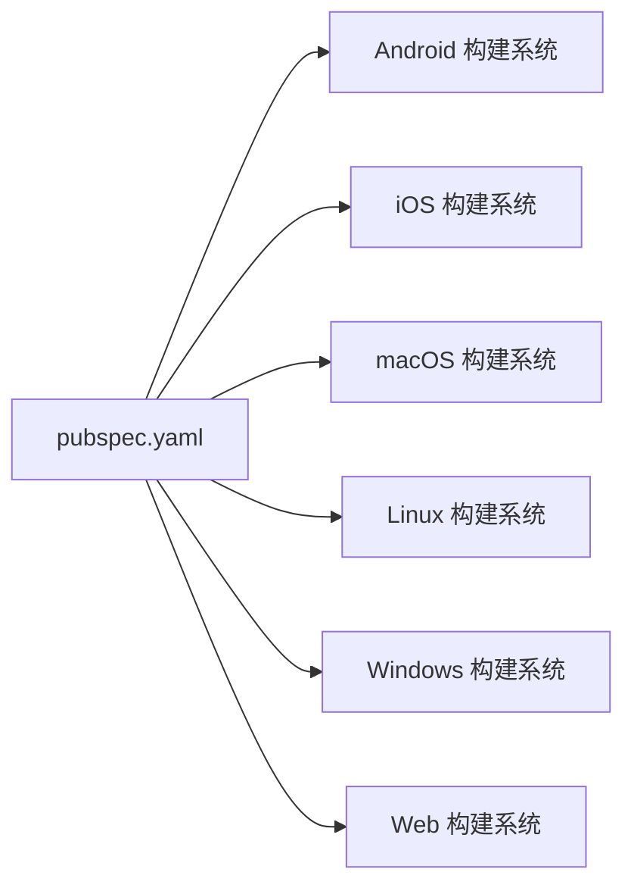

# 部署与发布

<cite>
**本文引用的文件列表**
- [pubspec.yaml](file://pubspec.yaml)
- [android/build.gradle.kts](file://android/build.gradle.kts)
- [android/app/build.gradle.kts](file://android/app/build.gradle.kts)
- [android/gradle.properties](file://android/gradle.properties)
- [android/settings.gradle.kts](file://android/settings.gradle.kts)
- [ios/Runner/Info.plist](file://ios/Runner/Info.plist)
- [ios/Flutter/Release.xcconfig](file://ios/Flutter/Release.xcconfig)
- [macos/Runner/Info.plist](file://macos/Runner/Info.plist)
- [macos/Runner.xcodeproj/project.pbxproj](file://macos/Runner.xcodeproj/project.pbxproj)
- [macos/Runner/Configs/Release.xcconfig](file://macos/Runner/Configs/Release.xcconfig)
- [linux/CMakeLists.txt](file://linux/CMakeLists.txt)
- [linux/flutter/CMakeLists.txt](file://linux/flutter/CMakeLists.txt)
- [windows/CMakeLists.txt](file://windows/CMakeLists.txt)
- [windows/flutter/CMakeLists.txt](file://windows/flutter/CMakeLists.txt)
- [web/index.html](file://web/index.html)
- [web/manifest.json](file://web/manifest.json)
</cite>

## 目录
1. [简介](#简介)
2. [项目结构](#项目结构)
3. [核心组件](#核心组件)
4. [架构总览](#架构总览)
5. [详细组件分析](#详细组件分析)
6. [依赖关系分析](#依赖关系分析)
7. [性能考虑](#性能考虑)
8. [故障排查指南](#故障排查指南)
9. [结论](#结论)
10. [附录](#附录)

## 简介
本指南面向需要将 Flutter 应用部署到多平台（Android、iOS、Windows、macOS、Linux、Web）的开发者，提供从版本号配置、签名与证书管理，到各平台构建命令与产物位置的完整操作说明。同时解释 pubspec.yaml 中 version 字段对各平台版本号的影响，帮助您顺利完成打包与发布。

## 项目结构
该仓库采用标准 Flutter 多平台工程布局：
- 平台特定目录：android、ios、linux、macos、windows、web
- 根目录配置：pubspec.yaml 定义版本与依赖；根级 CMakeLists.txt（如存在）用于 Windows/Linux 构建（本仓库未包含根级 Windows/Linux CMakeLists.txt）
- 平台配置要点：
  - Android：Gradle KTS 构建脚本与签名配置
  - iOS：Info.plist 版本占位符与 Xcode 配置
  - macOS：Info.plist 版本占位符与 Xcode 配置
  - Linux：CMakeLists.txt 控制安装与打包
  - Windows：CMakeLists.txt 控制安装与打包
  - Web：index.html 与 manifest.json 提供 PWA 元数据

图表来源
- [pubspec.yaml](file://pubspec.yaml#L1-L20)
- [android/app/build.gradle.kts](file://android/app/build.gradle.kts#L1-L45)
- [ios/Runner/Info.plist](file://ios/Runner/Info.plist#L1-L50)
- [macos/Runner/Info.plist](file://macos/Runner/Info.plist#L1-L33)
- [linux/CMakeLists.txt](file://linux/CMakeLists.txt#L1-L129)
- [windows/CMakeLists.txt](file://windows/CMakeLists.txt#L1-L109)
- [web/index.html](file://web/index.html#L1-L39)
- [web/manifest.json](file://web/manifest.json#L1-L36)

章节来源
- [pubspec.yaml](file://pubspec.yaml#L1-L20)
- [android/app/build.gradle.kts](file://android/app/build.gradle.kts#L1-L45)
- [ios/Runner/Info.plist](file://ios/Runner/Info.plist#L1-L50)
- [macos/Runner/Info.plist](file://macos/Runner/Info.plist#L1-L33)
- [linux/CMakeLists.txt](file://linux/CMakeLists.txt#L1-L129)
- [windows/CMakeLists.txt](file://windows/CMakeLists.txt#L1-L109)
- [web/index.html](file://web/index.html#L1-L39)
- [web/manifest.json](file://web/manifest.json#L1-L36)

## 核心组件
- 版本与构建元信息
  - pubspec.yaml 的 version 字段决定各平台版本号映射：
    - Android：versionName 与 versionCode 来自 Flutter 工具注入
    - iOS：CFBundleShortVersionString 与 CFBundleVersion 来自 Flutter 工具注入
    - Windows：major/minor/patch 与 build suffix 来自 Flutter 工具注入
  - 可通过命令行参数覆盖构建名称与编号，以影响上述映射
- Android 构建
  - Gradle KTS 脚本集中于 android/ 与 android/app/
  - 默认 release 签名使用 debug 签名配置（开发用途）
- iOS/macOS 构建
  - Info.plist 使用 $(FLUTTER_BUILD_NAME) 与 $(FLUTTER_BUILD_NUMBER) 占位符
  - Xcode 配置通过 xcconfig 文件组织
- Linux/Windows 构建
  - CMakeLists.txt 控制安装与打包路径，生成可运行程序与资源
- Web 构建
  - index.html 与 manifest.json 提供 PWA 元数据与图标

章节来源
- [pubspec.yaml](file://pubspec.yaml#L1-L20)
- [android/app/build.gradle.kts](file://android/app/build.gradle.kts#L1-L45)
- [ios/Runner/Info.plist](file://ios/Runner/Info.plist#L1-L50)
- [macos/Runner/Info.plist](file://macos/Runner/Info.plist#L1-L33)
- [linux/CMakeLists.txt](file://linux/CMakeLists.txt#L1-L129)
- [windows/CMakeLists.txt](file://windows/CMakeLists.txt#L1-L109)
- [web/index.html](file://web/index.html#L1-L39)
- [web/manifest.json](file://web/manifest.json#L1-L36)

## 架构总览
下图展示跨平台构建的关键交互：pubspec.yaml 决定版本号，各平台通过各自的构建系统（Gradle/Kotlin、Xcode、CMake）读取这些值并生成最终产物。

图表来源
- [pubspec.yaml](file://pubspec.yaml#L1-L20)
- [android/app/build.gradle.kts](file://android/app/build.gradle.kts#L1-L45)
- [android/build.gradle.kts](file://android/build.gradle.kts#L1-L25)
- [android/gradle.properties](file://android/gradle.properties#L1-L3)
- [ios/Runner/Info.plist](file://ios/Runner/Info.plist#L1-L50)
- [ios/Flutter/Release.xcconfig](file://ios/Flutter/Release.xcconfig#L1-L2)
- [macos/Runner/Info.plist](file://macos/Runner/Info.plist#L1-L33)
- [macos/Runner/Configs/Release.xcconfig](file://macos/Runner/Configs/Release.xcconfig#L1-L3)
- [macos/Runner.xcodeproj/project.pbxproj](file://macos/Runner.xcodeproj/project.pbxproj#L1-L200)
- [linux/CMakeLists.txt](file://linux/CMakeLists.txt#L1-L129)
- [linux/flutter/CMakeLists.txt](file://linux/flutter/CMakeLists.txt#L1-L89)
- [windows/CMakeLists.txt](file://windows/CMakeLists.txt#L1-L109)
- [windows/flutter/CMakeLists.txt](file://windows/flutter/CMakeLists.txt#L1-L110)
- [web/index.html](file://web/index.html#L1-L39)
- [web/manifest.json](file://web/manifest.json#L1-L36)

## 详细组件分析

### Android：生成 APK/AAB 与签名配置
- 版本与构建号映射
  - pubspec.yaml 的 version 将被 Flutter 工具转换为 Android 的 versionName 与 versionCode，具体行为由 Gradle 脚本读取 Flutter 注入的值
- 签名配置
  - 当前 release 构建使用 debug 签名配置，仅用于开发调试
  - 正式发布前需配置正式签名（见“故障排查指南”）
- 构建命令与产物
  - 生成 APK：在 android/ 目录执行构建命令（使用 Flutter 工具链）
  - 生成 AAB：在 android/ 目录执行构建命令（使用 Flutter 工具链）
  - 产物输出位置：通常位于 android/app/build/outputs/ 下（具体以实际构建产物为准）

图表来源
- [pubspec.yaml](file://pubspec.yaml#L1-L20)
- [android/app/build.gradle.kts](file://android/app/build.gradle.kts#L1-L45)

章节来源
- [pubspec.yaml](file://pubspec.yaml#L1-L20)
- [android/app/build.gradle.kts](file://android/app/build.gradle.kts#L1-L45)
- [android/build.gradle.kts](file://android/build.gradle.kts#L1-L25)
- [android/gradle.properties](file://android/gradle.properties#L1-L3)
- [android/settings.gradle.kts](file://android/settings.gradle.kts#L1-L27)

### iOS：Info.plist 配置与证书管理
- 版本号映射
  - Info.plist 使用 $(FLUTTER_BUILD_NAME) 与 $(FLUTTER_BUILD_NUMBER) 占位符，对应 pubspec.yaml 的 version
- 证书与描述文件
  - 发布前需在 Xcode 中配置正确的 Team、Signing Certificate 与 Provisioning Profile
- 归档与发布流程
  - 在 Xcode 中选择合适的 Scheme 与目标设备，执行 Archive
  - 打开 Organizer，验证并上传到 App Store Connect

图表来源
- [ios/Runner/Info.plist](file://ios/Runner/Info.plist#L1-L50)
- [ios/Flutter/Release.xcconfig](file://ios/Flutter/Release.xcconfig#L1-L2)

章节来源
- [pubspec.yaml](file://pubspec.yaml#L1-L20)
- [ios/Runner/Info.plist](file://ios/Runner/Info.plist#L1-L50)
- [ios/Flutter/Release.xcconfig](file://ios/Flutter/Release.xcconfig#L1-L2)

### macOS：Info.plist 配置与证书管理
- 版本号映射
  - Info.plist 使用 $(FLUTTER_BUILD_NAME) 与 $(FLUTTER_BUILD_NUMBER) 占位符，对应 pubspec.yaml 的 version
- 证书与权限
  - 发布前需在 Xcode 中配置正确的 Team、Signing Certificate 与 Entitlements
- 归档与发布流程
  - 在 Xcode 中选择 Release，执行 Archive，随后上传到 Mac App Store Connect

图表来源
- [macos/Runner/Info.plist](file://macos/Runner/Info.plist#L1-L33)
- [macos/Runner/Configs/Release.xcconfig](file://macos/Runner/Configs/Release.xcconfig#L1-L3)
- [macos/Runner.xcodeproj/project.pbxproj](file://macos/Runner.xcodeproj/project.pbxproj#L1-L200)

章节来源
- [pubspec.yaml](file://pubspec.yaml#L1-L20)
- [macos/Runner/Info.plist](file://macos/Runner/Info.plist#L1-L33)
- [macos/Runner/Configs/Release.xcconfig](file://macos/Runner/Configs/Release.xcconfig#L1-L3)
- [macos/Runner.xcodeproj/project.pbxproj](file://macos/Runner.xcodeproj/project.pbxproj#L1-L200)

### Windows：构建命令与输出位置
- 构建命令
  - 使用 CMake 与 Visual Studio 生成器进行构建（建议使用 VS 2022）
  - 常用命令：配置、生成、安装
- 输出位置
  - 安装目录默认位于构建目录下的支持文件夹（随 CMake 规则设置），可直接运行或打包为安装包

图表来源
- [windows/CMakeLists.txt](file://windows/CMakeLists.txt#L1-L109)
- [windows/flutter/CMakeLists.txt](file://windows/flutter/CMakeLists.txt#L1-L110)

章节来源
- [windows/CMakeLists.txt](file://windows/CMakeLists.txt#L1-L109)
- [windows/flutter/CMakeLists.txt](file://windows/flutter/CMakeLists.txt#L1-L110)

### Linux：构建命令与输出位置
- 构建命令
  - 使用 CMake 进行配置、生成与安装
- 输出位置
  - 安装目录默认位于构建目录下的 bundle 子目录，包含可执行文件与资源

图表来源
- [linux/CMakeLists.txt](file://linux/CMakeLists.txt#L1-L129)
- [linux/flutter/CMakeLists.txt](file://linux/flutter/CMakeLists.txt#L1-L89)

章节来源
- [linux/CMakeLists.txt](file://linux/CMakeLists.txt#L1-L129)
- [linux/flutter/CMakeLists.txt](file://linux/flutter/CMakeLists.txt#L1-L89)

### Web：构建命令与清单配置
- 构建命令
  - 使用 Flutter 工具进行构建，生成静态资源与入口页面
- 清单与图标
  - index.html 使用 $FLUTTER_BASE_HREF 占位符，manifest.json 提供 PWA 清单与图标

图表来源
- [web/index.html](file://web/index.html#L1-L39)
- [web/manifest.json](file://web/manifest.json#L1-L36)

章节来源
- [web/index.html](file://web/index.html#L1-L39)
- [web/manifest.json](file://web/manifest.json#L1-L36)

## 依赖关系分析
- 版本依赖
  - pubspec.yaml 的 version 是所有平台版本号的统一来源
  - 各平台通过各自构建系统读取 Flutter 工具注入的版本信息
- 构建系统耦合
  - Android：Gradle KTS 脚本与 Flutter 插件耦合
  - iOS/macOS：Xcode 项目与 xcconfig 文件耦合
  - Linux/Windows：CMakeLists.txt 与 Flutter 工具后端耦合
  - Web：index.html 与 manifest.json 作为静态资源依赖

图表来源
- [pubspec.yaml](file://pubspec.yaml#L1-L20)
- [android/app/build.gradle.kts](file://android/app/build.gradle.kts#L1-L45)
- [ios/Runner/Info.plist](file://ios/Runner/Info.plist#L1-L50)
- [macos/Runner/Info.plist](file://macos/Runner/Info.plist#L1-L33)
- [linux/CMakeLists.txt](file://linux/CMakeLists.txt#L1-L129)
- [windows/CMakeLists.txt](file://windows/CMakeLists.txt#L1-L109)
- [web/index.html](file://web/index.html#L1-L39)
- [web/manifest.json](file://web/manifest.json#L1-L36)

章节来源
- [pubspec.yaml](file://pubspec.yaml#L1-L20)
- [android/app/build.gradle.kts](file://android/app/build.gradle.kts#L1-L45)
- [ios/Runner/Info.plist](file://ios/Runner/Info.plist#L1-L50)
- [macos/Runner/Info.plist](file://macos/Runner/Info.plist#L1-L33)
- [linux/CMakeLists.txt](file://linux/CMakeLists.txt#L1-L129)
- [windows/CMakeLists.txt](file://windows/CMakeLists.txt#L1-L109)
- [web/index.html](file://web/index.html#L1-L39)
- [web/manifest.json](file://web/manifest.json#L1-L36)

## 性能考虑
- Android
  - 合理设置 JVM 参数（已在 gradle.properties 中配置），避免内存不足导致构建失败
  - 使用增量构建与缓存策略，减少重复编译时间
- iOS/macOS
  - 使用 Release 配置进行构建，启用优化选项
  - 避免不必要的资源与插件，减小包体
- Linux/Windows
  - 使用 Release/Profile 模式进行构建，减少调试符号与日志
  - 合理配置安装目录与资源打包策略
- Web
  - 启用压缩与缓存策略，优化静态资源加载

[本节为通用建议，不直接分析具体文件]

## 故障排查指南
- Android 签名问题
  - 现状：release 构建使用 debug 签名配置
  - 解决方案：配置正式签名（密钥库、别名、密码），并在 Gradle 中启用相应签名配置
  - 参考文件：android/app/build.gradle.kts（release 签名配置处）、android/gradle.properties（JVM 参数）
- iOS/macOS 证书与描述文件
  - 现状：Info.plist 使用 $(FLUTTER_BUILD_NAME)/$(FLUTTER_BUILD_NUMBER)，Xcode 需要正确配置 Team、证书与描述文件
  - 解决方案：在 Xcode 中选择正确的 Team、Signing Certificate 与 Provisioning Profile；确认 Info.plist 占位符生效
  - 参考文件：ios/Runner/Info.plist、ios/Flutter/Release.xcconfig；macos/Runner/Info.plist、macos/Runner/Configs/Release.xcconfig
- Web 清单与图标
  - 现状：index.html 使用 $FLUTTER_BASE_HREF 占位符，manifest.json 提供 PWA 清单
  - 解决方案：确保部署时正确替换 $FLUTTER_BASE_HREF；检查图标路径与尺寸是否齐全
  - 参考文件：web/index.html、web/manifest.json
- Linux/Windows 安装目录
  - 现状：安装目录由 CMake 规则控制
  - 解决方案：根据需要调整安装前缀与资源复制策略
  - 参考文件：linux/CMakeLists.txt、windows/CMakeLists.txt

章节来源
- [android/app/build.gradle.kts](file://android/app/build.gradle.kts#L1-L45)
- [android/gradle.properties](file://android/gradle.properties#L1-L3)
- [ios/Runner/Info.plist](file://ios/Runner/Info.plist#L1-L50)
- [ios/Flutter/Release.xcconfig](file://ios/Flutter/Release.xcconfig#L1-L2)
- [macos/Runner/Info.plist](file://macos/Runner/Info.plist#L1-L33)
- [macos/Runner/Configs/Release.xcconfig](file://macos/Runner/Configs/Release.xcconfig#L1-L3)
- [web/index.html](file://web/index.html#L1-L39)
- [web/manifest.json](file://web/manifest.json#L1-L36)
- [linux/CMakeLists.txt](file://linux/CMakeLists.txt#L1-L129)
- [windows/CMakeLists.txt](file://windows/CMakeLists.txt#L1-L109)

## 结论
通过统一在 pubspec.yaml 中维护版本号，并结合各平台构建系统的配置，可以实现一致且可控的多平台发布流程。Android 需补充正式签名；iOS/macOS 需完善证书与描述文件；Linux/Windows 需按 CMake 规则完成安装与打包；Web 需确保清单与图标完整。遵循本文档的操作步骤与排错建议，可显著提升发布效率与成功率。

[本节为总结性内容，不直接分析具体文件]

## 附录
- 版本号映射参考
  - Android：versionName 与 versionCode 由 Flutter 工具注入
  - iOS：CFBundleShortVersionString 与 CFBundleVersion 由 Flutter 工具注入
  - Windows：major/minor/patch 与 build suffix 由 Flutter 工具注入
- 构建命令示例（以 Flutter 工具为主）
  - Android：在 android/ 目录执行构建命令（生成 APK/AAB）
  - iOS：在 Xcode 中执行 Archive（或使用 xcodebuild）
  - macOS：在 Xcode 中执行 Archive（或使用 xcodebuild）
  - Windows：在 Windows 目录使用 CMake 生成与安装
  - Linux：在 Linux 目录使用 CMake 生成与安装
  - Web：使用 Flutter 工具构建并部署静态资源

章节来源
- [pubspec.yaml](file://pubspec.yaml#L1-L20)
- [android/app/build.gradle.kts](file://android/app/build.gradle.kts#L1-L45)
- [ios/Runner/Info.plist](file://ios/Runner/Info.plist#L1-L50)
- [macos/Runner/Info.plist](file://macos/Runner/Info.plist#L1-L33)
- [linux/CMakeLists.txt](file://linux/CMakeLists.txt#L1-L129)
- [windows/CMakeLists.txt](file://windows/CMakeLists.txt#L1-L109)
- [web/index.html](file://web/index.html#L1-L39)
- [web/manifest.json](file://web/manifest.json#L1-L36)