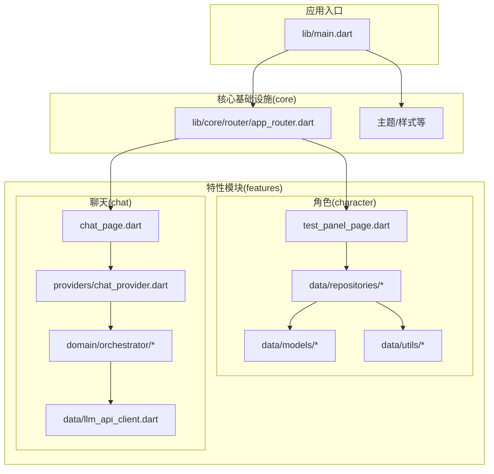
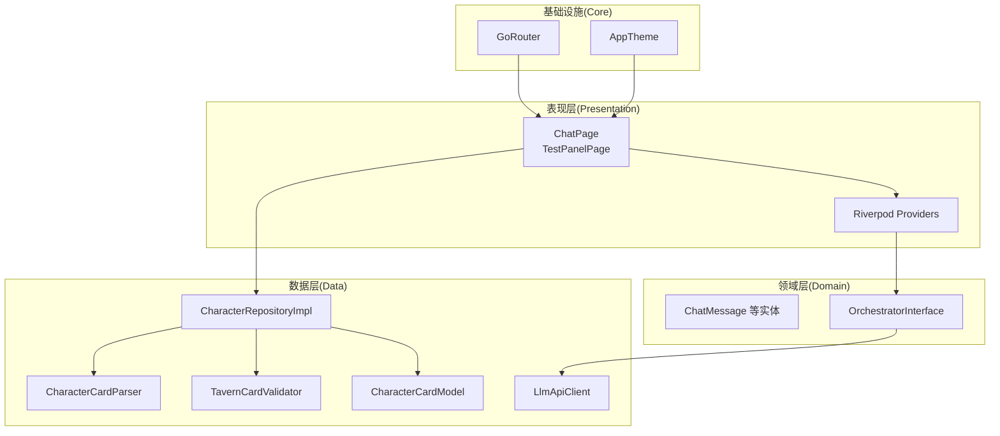
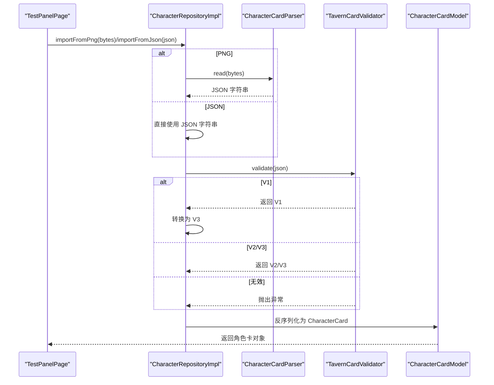
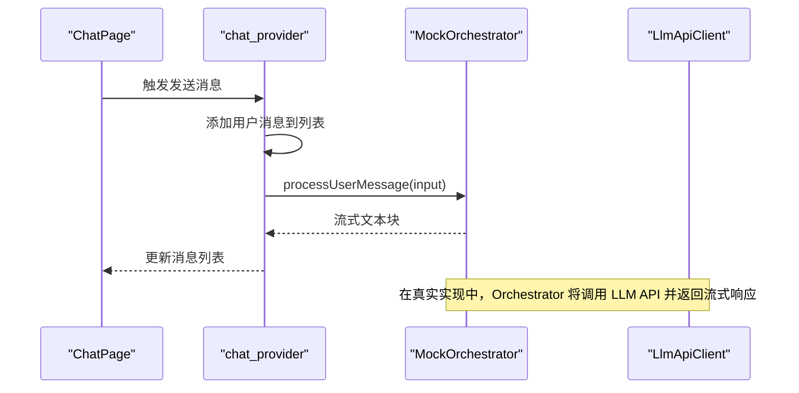
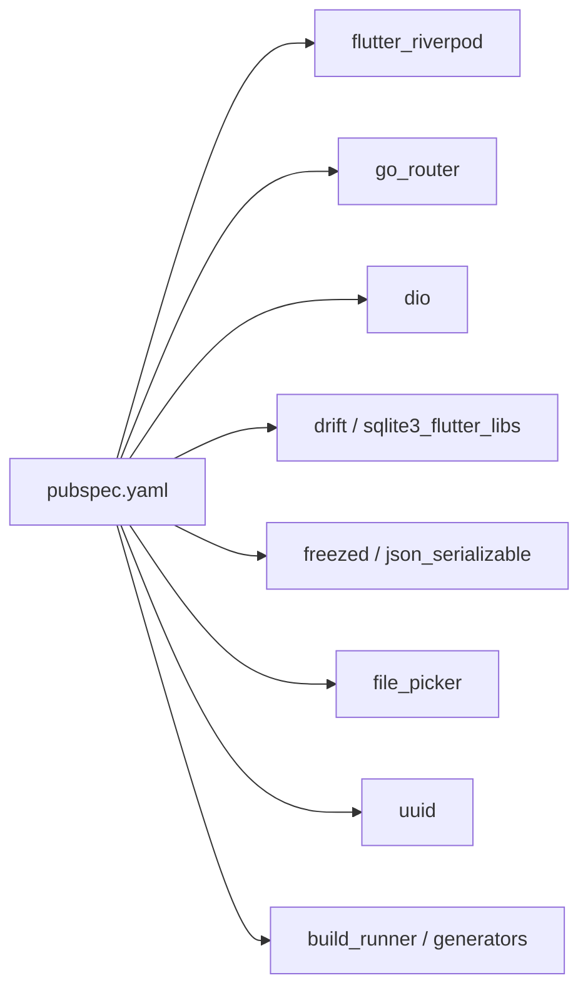

# 项目概述

<cite>
**本文引用的文件**
- [README.md](file://README.md)
- [SDD.md](file://SDD.md)
- [pubspec.yaml](file://pubspec.yaml)
- [lib/main.dart](file://lib/main.dart)
- [lib/core/router/app_router.dart](file://lib/core/router/app_router.dart)
- [lib/features/character/presentation/pages/test_panel_page.dart](file://lib/features/character/presentation/pages/test_panel_page.dart)
- [lib/features/character/data/repositories/character_repository_impl.dart](file://lib/features/character/data/repositories/character_repository_impl.dart)
- [lib/features/character/data/utils/character_card_parser.dart](file://lib/features/character/data/utils/character_card_parser.dart)
- [lib/features/character/data/utils/tavern_card_validator.dart](file://lib/features/character/data/utils/tavern_card_validator.dart)
- [lib/features/character/data/models/character_card_model.dart](file://lib/features/character/data/models/character_card_model.dart)
- [lib/features/chat/presentation/pages/chat_page.dart](file://lib/features/chat/presentation/pages/chat_page.dart)
- [lib/features/chat/presentation/providers/chat_provider.dart](file://lib/features/chat/presentation/providers/chat_provider.dart)
- [lib/features/chat/domain/orchestrator/orchestrator.dart](file://lib/features/chat/domain/orchestrator/orchestrator_interface.dart)
- [lib/features/chat/data/llm_api_client.dart](file://lib/features/chat/data/llm_api_client.dart)
</cite>

## 目录
1. [引言](#引言)
2. [项目结构](#项目结构)
3. [核心组件](#核心组件)
4. [架构总览](#架构总览)
5. [详细组件分析](#详细组件分析)
6. [依赖关系分析](#依赖关系分析)
7. [性能考虑](#性能考虑)
8. [故障排查指南](#故障排查指南)
9. [结论](#结论)
10. [附录](#附录)

## 引言
neuropean 是一个基于 Flutter 的跨平台 AI 角色扮演聊天应用，面向希望获得现代化聊天体验的用户。项目通过 Clean Architecture 分层架构、Riverpod 状态管理与 go_router 路由控制，构建可扩展、可测试且易于演进的应用体系。其核心价值在于：
- 提供现代化的聊天界面与自然语言对话能力；
- 支持从 PNG 图片或 JSON 文件导入 SillyTavern 角色卡，实现角色驱动的沉浸式对话；
- 以分阶段实施规划推进，当前已完成角色卡导入与聊天交互的基础闭环，后续将持续完善 Prompt 引擎、流式输出、状态持久化与 Webview 交互等能力。

## 项目结构
项目采用 Clean Architecture 分层与特性模块化组织，核心目录如下：
- core：核心基础设施（路由、主题、配置等）
- features：业务功能模块（chat、character 等）
- lib/main.dart：应用入口，集成 Riverpod ProviderScope 与 go_router
- test：单元测试与特性测试

图表来源
- [lib/main.dart](file://lib/main.dart#L1-L33)
- [lib/core/router/app_router.dart](file://lib/core/router/app_router.dart#L1-L18)
- [lib/features/character/presentation/pages/test_panel_page.dart](file://lib/features/character/presentation/pages/test_panel_page.dart#L1-L114)
- [lib/features/character/data/repositories/character_repository_impl.dart](file://lib/features/character/data/repositories/character_repository_impl.dart#L1-L78)
- [lib/features/character/data/utils/character_card_parser.dart](file://lib/features/character/data/utils/character_card_parser.dart#L1-L206)
- [lib/features/character/data/utils/tavern_card_validator.dart](file://lib/features/character/data/utils/tavern_card_validator.dart#L1-L171)
- [lib/features/character/data/models/character_card_model.dart](file://lib/features/character/data/models/character_card_model.dart#L1-L63)
- [lib/features/chat/presentation/pages/chat_page.dart](file://lib/features/chat/presentation/pages/chat_page.dart#L1-L120)
- [lib/features/chat/presentation/providers/chat_provider.dart](file://lib/features/chat/presentation/providers/chat_provider.dart#L1-L63)
- [lib/features/chat/domain/orchestrator/orchestrator.dart](file://lib/features/chat/domain/orchestrator/orchestrator.dart#L1-L49)
- [lib/features/chat/data/llm_api_client.dart](file://lib/features/chat/data/llm_api_client.dart#L1-L115)

章节来源
- [lib/main.dart](file://lib/main.dart#L1-L33)
- [lib/core/router/app_router.dart](file://lib/core/router/app_router.dart#L1-L18)

## 核心组件
- 应用入口与路由
  - 入口文件通过 ProviderScope 包裹应用，使用 go_router 管理路由；初始路由包含测试面板与聊天页。
- 角色卡导入与解析
  - 支持从 PNG 图片或 JSON 导入 SillyTavern 角色卡，内部完成格式校验、版本兼容与转换。
- 聊天交互与状态管理
  - 使用 Riverpod 管理聊天消息列表与发送函数；聊天页提供基础 UI 与输入交互。
- LLM API 客户端
  - 基于 Dio 封装，支持同步与流式响应，便于接入 OpenAI 风格接口。
- Orchestrator（编排器）
  - 当前为 Mock 实现，演示消息处理与流式输出；后续将接入 Planner、Prompt 构造与持久化。

章节来源
- [lib/main.dart](file://lib/main.dart#L1-L33)
- [lib/core/router/app_router.dart](file://lib/core/router/app_router.dart#L1-L18)
- [lib/features/character/presentation/pages/test_panel_page.dart](file://lib/features/character/presentation/pages/test_panel_page.dart#L1-L114)
- [lib/features/character/data/repositories/character_repository_impl.dart](file://lib/features/character/data/repositories/character_repository_impl.dart#L1-L78)
- [lib/features/character/data/utils/character_card_parser.dart](file://lib/features/character/data/utils/character_card_parser.dart#L1-L206)
- [lib/features/character/data/utils/tavern_card_validator.dart](file://lib/features/character/data/utils/tavern_card_validator.dart#L1-L171)
- [lib/features/character/data/models/character_card_model.dart](file://lib/features/character/data/models/character_card_model.dart#L1-L63)
- [lib/features/chat/presentation/pages/chat_page.dart](file://lib/features/chat/presentation/pages/chat_page.dart#L1-L120)
- [lib/features/chat/presentation/providers/chat_provider.dart](file://lib/features/chat/presentation/providers/chat_provider.dart#L1-L63)
- [lib/features/chat/data/llm_api_client.dart](file://lib/features/chat/data/llm_api_client.dart#L1-L115)
- [lib/features/chat/domain/orchestrator/orchestrator.dart](file://lib/features/chat/domain/orchestrator/orchestrator.dart#L1-L49)

## 架构总览
项目采用 Clean Architecture 分层与 Riverpod 状态管理，结合 go_router 路由控制，形成清晰的关注点分离与可测试性。

图表来源
- [lib/features/chat/presentation/pages/chat_page.dart](file://lib/features/chat/presentation/pages/chat_page.dart#L1-L120)
- [lib/features/character/presentation/pages/test_panel_page.dart](file://lib/features/character/presentation/pages/test_panel_page.dart#L1-L114)
- [lib/features/chat/presentation/providers/chat_provider.dart](file://lib/features/chat/presentation/providers/chat_provider.dart#L1-L63)
- [lib/features/chat/domain/orchestrator/orchestrator_interface.dart](file://lib/features/chat/domain/orchestrator/orchestrator_interface.dart)
- [lib/features/character/data/repositories/character_repository_impl.dart](file://lib/features/character/data/repositories/character_repository_impl.dart#L1-L78)
- [lib/features/character/data/utils/character_card_parser.dart](file://lib/features/character/data/utils/character_card_parser.dart#L1-L206)
- [lib/features/character/data/utils/tavern_card_validator.dart](file://lib/features/character/data/utils/tavern_card_validator.dart#L1-L171)
- [lib/features/character/data/models/character_card_model.dart](file://lib/features/character/data/models/character_card_model.dart#L1-L63)
- [lib/features/chat/data/llm_api_client.dart](file://lib/features/chat/data/llm_api_client.dart#L1-L115)
- [lib/core/router/app_router.dart](file://lib/core/router/app_router.dart#L1-L18)
- [lib/main.dart](file://lib/main.dart#L1-L33)

## 详细组件分析

### 角色卡导入与兼容性（SillyTavern）
- 导入方式
  - PNG：通过 PNG tEXt 块读取/写入 SillyTavern 角色卡元数据，支持 V2（chara）与 V3（ccv3）优先级。
  - JSON：直接解析 JSON 内容，兼容 V1/V2/V3。
- 校验与转换
  - 使用 TavernCardValidator 判断版本并返回校验结果；对于 V1 数据进行映射到 V3 结构。
- 数据模型
  - CharacterCardModel 采用 freezed 生成不可变模型，覆盖 SillyTavern V2/V3 字段集。

图表来源
- [lib/features/character/presentation/pages/test_panel_page.dart](file://lib/features/character/presentation/pages/test_panel_page.dart#L1-L114)
- [lib/features/character/data/repositories/character_repository_impl.dart](file://lib/features/character/data/repositories/character_repository_impl.dart#L1-L78)
- [lib/features/character/data/utils/character_card_parser.dart](file://lib/features/character/data/utils/character_card_parser.dart#L1-L206)
- [lib/features/character/data/utils/tavern_card_validator.dart](file://lib/features/character/data/utils/tavern_card_validator.dart#L1-L171)
- [lib/features/character/data/models/character_card_model.dart](file://lib/features/character/data/models/character_card_model.dart#L1-L63)

章节来源
- [lib/features/character/presentation/pages/test_panel_page.dart](file://lib/features/character/presentation/pages/test_panel_page.dart#L1-L114)
- [lib/features/character/data/repositories/character_repository_impl.dart](file://lib/features/character/data/repositories/character_repository_impl.dart#L1-L78)
- [lib/features/character/data/utils/character_card_parser.dart](file://lib/features/character/data/utils/character_card_parser.dart#L1-L206)
- [lib/features/character/data/utils/tavern_card_validator.dart](file://lib/features/character/data/utils/tavern_card_validator.dart#L1-L171)
- [lib/features/character/data/models/character_card_model.dart](file://lib/features/character/data/models/character_card_model.dart#L1-L63)

### 聊天交互与状态管理（Riverpod）
- 页面与 Provider
  - ChatPage 通过 Riverpod 读取消息列表与发送函数；提供基础消息气泡与输入条。
  - chat_provider.dart 提供消息列表与发送逻辑（当前为模拟实现）。
- 编排器（Orchestrator）
  - 当前为 MockOrchestrator，演示消息处理与流式输出；后续将接入 Planner、Prompt 构造与 LLM API。
- LLM API 客户端
  - LlmApiClient 基于 Dio，支持同步与流式响应，便于接入 OpenAI 风格接口。

图表来源
- [lib/features/chat/presentation/pages/chat_page.dart](file://lib/features/chat/presentation/pages/chat_page.dart#L1-L120)
- [lib/features/chat/presentation/providers/chat_provider.dart](file://lib/features/chat/presentation/providers/chat_provider.dart#L1-L63)
- [lib/features/chat/domain/orchestrator/orchestrator.dart](file://lib/features/chat/domain/orchestrator/orchestrator.dart#L1-L49)
- [lib/features/chat/data/llm_api_client.dart](file://lib/features/chat/data/llm_api_client.dart#L1-L115)

章节来源
- [lib/features/chat/presentation/pages/chat_page.dart](file://lib/features/chat/presentation/pages/chat_page.dart#L1-L120)
- [lib/features/chat/presentation/providers/chat_provider.dart](file://lib/features/chat/presentation/providers/chat_provider.dart#L1-L63)
- [lib/features/chat/domain/orchestrator/orchestrator.dart](file://lib/features/chat/domain/orchestrator/orchestrator.dart#L1-L49)
- [lib/features/chat/data/llm_api_client.dart](file://lib/features/chat/data/llm_api_client.dart#L1-L115)

### 路由与应用启动
- 应用通过 ProviderScope 包裹，使用 go_router 管理路由；初始路由包含测试面板与聊天页。
- 路由配置简洁明确，便于扩展更多页面与导航策略。

章节来源
- [lib/main.dart](file://lib/main.dart#L1-L33)
- [lib/core/router/app_router.dart](file://lib/core/router/app_router.dart#L1-L18)

## 依赖关系分析
- 技术栈与依赖
  - 状态管理：flutter_riverpod、riverpod_annotation
  - 路由：go_router
  - 网络：dio
  - 数据库：drift、sqlite3_flutter_libs、path_provider、path
  - 序列化：freezed_annotation、json_annotation、uuid
  - 文件选择：file_picker
- 依赖生成与代码生成
  - build_runner、riverpod_generator、drift_dev、freezed、json_serializable

图表来源
- [pubspec.yaml](file://pubspec.yaml#L1-L119)

章节来源
- [pubspec.yaml](file://pubspec.yaml#L1-L119)

## 性能考虑
- UI 渲染
  - 聊天页使用 ListView.builder，适合长列表场景；建议在实际实现中结合 Riverpod 的自动刷新策略，避免不必要的重建。
- 状态管理
  - Riverpod 的 ProviderScope 与 autoDispose/family 修饰符有助于管理会话状态与临时数据，减少内存占用。
- 网络与流式输出
  - LLM API 客户端支持流式响应，建议在 UI 中按块增量渲染，避免一次性渲染大量文本导致卡顿。
- 数据库与缓存
  - 建议在后续阶段引入 Drift ORM 与 SQLite，配合分页与索引优化聊天记录查询性能。
- 资源与图片
  - 角色头像与资产建议使用懒加载与缓存策略，避免首屏阻塞。

## 故障排查指南
- 角色卡导入失败
  - 检查 PNG 是否包含 tEXt 块（chara/ccv3），或 JSON 是否符合 SillyTavern 规范；查看 TavernCardValidator 的错误信息。
  - 若为 V1 数据，确认转换逻辑是否正确映射到 V3 字段。
- 聊天无响应
  - 确认 MockOrchestrator 是否被替换为真实实现；检查 LlmApiClient 的 baseUrl 与 apiKey 配置。
- 路由跳转异常
  - 检查 go_router 的路由表与初始路径；确认 ProviderScope 是否正确包裹应用。
- 文件选择与权限
  - 确认平台权限与文件扩展名过滤设置；在测试面板中观察日志输出。

章节来源
- [lib/features/character/data/utils/tavern_card_validator.dart](file://lib/features/character/data/utils/tavern_card_validator.dart#L1-L171)
- [lib/features/character/data/repositories/character_repository_impl.dart](file://lib/features/character/data/repositories/character_repository_impl.dart#L1-L78)
- [lib/features/chat/data/llm_api_client.dart](file://lib/features/chat/data/llm_api_client.dart#L1-L115)
- [lib/main.dart](file://lib/main.dart#L1-L33)
- [lib/core/router/app_router.dart](file://lib/core/router/app_router.dart#L1-L18)
- [lib/features/character/presentation/pages/test_panel_page.dart](file://lib/features/character/presentation/pages/test_panel_page.dart#L1-L114)

## 结论
neuropean 以 Clean Architecture 为基础，结合 Riverpod 与 go_router，构建了可扩展的跨平台聊天应用骨架。当前已完成角色卡导入（PNG/JSON）、聊天界面与基本状态管理，并通过 MockOrchestrator 展示了聊天闭环的初步形态。依据 SDD 的分阶段规划，下一阶段将重点完善 Prompt 引擎、流式输出、状态持久化与 Webview 交互，逐步实现 SillyTavern 角色卡的完整兼容与高质量对话体验。

## 附录
- 开发阶段与里程碑
  - 基础设施搭建（Phase 1）
  - MVP 核心功能（Phase 2：角色管理、Prompt 引擎、Orchestrator 联调、持久化、Webview）
  - 交互完善与优化（Phase 3：状态提取、Webview 通信、Token 裁剪、UI 美化）
  - 测试与发布（Phase 4：单元测试、性能测试、打包发布）

章节来源
- [SDD.md](file://SDD.md#L1-L234)