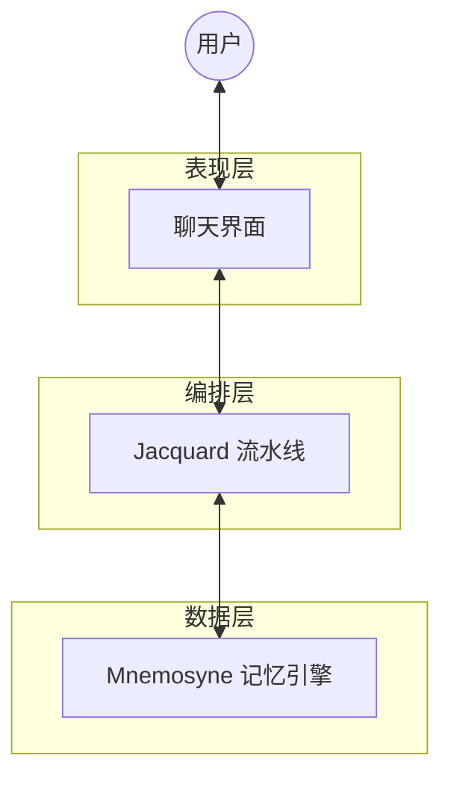

# Clotho 系统架构全景索引 (System Architecture Panorama)

**版本**: 1.0.0
**日期**: 2025-12-23
**状态**: Draft
**作者**: 资深系统架构师 (Architect Mode)

---

## 目录

1.  [第一章：宏观愿景与设计哲学](#第一章宏观愿景与设计哲学-vision--philosophy)
2.  [第二章：系统核心架构与编排层 (Jacquard)](#第二章系统核心架构与编排层-jacquard-layer)
3.  [第三章：数据中枢与记忆引擎 (Mnemosyne)](#第三章数据中枢与记忆引擎-mnemosyne-layer)
4.  [第四章：表现层与交互体系 (Presentation)](#第四章表现层与交互体系-presentation-layer)
5.  [第五章：跨平台基础设施 (Infrastructure)](#第五章跨平台基础设施-infrastructure-layer)
6.  [第六章：遗留生态迁移与扩展 (Migration)](#第六章遗留生态迁移与扩展-migration--ecosystem)

---

## 第一章：宏观愿景与设计哲学 (Vision & Philosophy)

### 1.1 模块摘要
本模块确立了 Clotho 项目的立项根本与指导思想。针对现有 AI RPG 客户端（如 SillyTavern）在逻辑处理、上下文管理及性能上的痛点，提出了“混合代理 (Hybrid Agency)”的解决方案，旨在构建一个**高性能、确定性与沉浸感并存**的次世代客户端。

### 1.2 核心要素

#### 1.2.1 核心价值主张
*   **性能重塑**：摒弃 Web 技术栈，采用 **Flutter/Dart** 原生技术栈，解决长文本渲染卡顿与内存泄漏问题。
*   **时空一致性**：引入 **“多重宇宙树 (Turn-based Tree)”** 模型，确保在回溯 (Undo)、重绘 (Reroll) 与分支 (Branching) 操作中，世界状态与剧情发展严丝合缝。
*   **逻辑解耦**：彻底切断 UI 层与逻辑层的直接耦合，实现“逻辑升级不破坏界面，界面重构不影响逻辑”。

#### 1.2.2 设计哲学：凯撒原则 (The Caesar Principle)
遵循 **"Render unto Caesar the things that are Caesar's, and unto God the things that are God's"**：
*   **凯撒的归凯撒 (Code's Domain)**：逻辑判断、数值计算、状态管理、流程控制。这些必须由确定性的代码 (Jacquard/Mnemosyne) 严密掌控，**绝不外包给 LLM**。
*   **上帝的归上帝 (LLM's Domain)**：语义理解、情感演绎、剧情生成、文本润色。这是 LLM 的神性所在。

#### 1.2.3 宏观架构分层
系统划分为三个物理隔离但逻辑紧密的层次：
1.  **表现层 (Presentation)**: 负责用户交互与界面渲染 (Flutter UI, Webview)。
2.  **编排层 (Jacquard)**: 系统的“大脑”，负责流程控制与 Prompt 组装。
3.  **数据层 (Data & Infra)**: 负责数据的存储、检索与快照生成 (Mnemosyne)。

### 1.3 文档溯源
*   **顶层蓝图**: [`doc/architecture/01_vision_and_philosophy.md`](doc/architecture/01_vision_and_philosophy.md)
*   **历史归档**: [`doc/architecture/legacy_archive/project_core_blueprint.md`](doc/architecture/legacy_archive/project_core_blueprint.md)

---

## 第二章：系统核心架构与编排层 (Jacquard Layer)

### 2.1 模块摘要
Jacquard 是系统的“大脑”与“总线”，采用插件化流水线模式。它不直接存储数据，而是作为调度器，协调各个 Shuttle (逻辑单元) 完成 Prompt 组装、LLM 调用及结果解析。本层核心任务是实现**确定性的流程编排**。

### 2.2 核心要素

#### 2.2.1 流水线架构 (Pipeline Architecture)
Jacquard 不包含硬编码业务逻辑，而是按顺序执行注册的插件：
*   **Planner**: 分析意图，决定工具调用。
*   **Skein Builder**: 向 Mnemosyne 请求快照，构建结构化 Prompt 容器。
*   **Assembler**: 将 Skein 渲染为最终字符串。
*   **Invoker**: 调用 LLM API。
*   **Parser**: 解析 LLM 输出。
*   **Updater**: 提交状态变更。

#### 2.2.2 Skein (绞纱) - 结构化容器
Skein 是流水线中的核心数据对象，作为 **异构容器**，它取代了传统的字符串拼接，模块化地管理 System Prompt, Lore, User Input 等内容，支持动态裁剪与重组。

#### 2.2.3 Filament 协议 v2 (Filament Protocol)
为确保 LLM 输出的可解析性，定义了简化版 XML 协议。
*   **核心标签**: `<thought>` (思维链), `<reply>` (回复), `<state_update>` (状态变更)。
*   **v2 升级 (JSON Array)**: 为了提高 Token 效率与解析鲁棒性，`<state_update>` 内部采用 **JSON 列表包裹三元组** 的形式，替代重复的 XML 标签。
    *   格式: `[OpCode, Path, Value]`
    *   示例: `["SET", "character.mood", "happy"]`, `["ADD", "gold", 50]`

#### 2.2.4 脚本插件沙箱
支持用户使用 JavaScript/Lua 编写自定义逻辑，运行在受限沙箱 (QuickJS/LuaJIT) 中，确保系统安全。

### 2.3 文档溯源
*   **编排架构**: [`doc/architecture/02_jacquard_orchestration.md`](doc/architecture/02_jacquard_orchestration.md)
*   **历史归档**: [`doc/architecture/legacy_archive/system_architecture.md`](doc/architecture/legacy_archive/system_architecture.md)

---

## 第三章：数据中枢与记忆引擎 (Mnemosyne Layer)

### 3.1 模块摘要
Mnemosyne 是系统的“海马体”，负责管理多维度的上下文链。它超越了静态存储，进化为**动态快照生成引擎**，能够根据时间指针 (Time Pointer) 瞬间投影出任意时刻的世界状态 (Punchcards)。同时，它融合了 MVU (MagVarUpdate) 的数据设计，增强了状态的描述能力。

### 3.2 核心要素

#### 3.2.1 多维上下文链 (Multi-dimensional Context Chains)
*   **History Chain**: 线性投影的对话记录。
*   **State Chain**: 采用 **关键帧 (Keyframe) + 增量 (Delta)** 存储策略，支持无损回溯。
*   **RAG Chain**: 基于向量检索的动态知识注入。

#### 3.2.2 Value with Description (VWD) 数据模型
引入 MVU 的核心特性，支持“带描述的值”，使状态不仅对程序可读，对 LLM 也具备语义自解释性。
*   **结构**: `[Value, Description]`
*   **示例**: `"health": [80, "当前生命值，0为死亡"]`
*   **渲染**: System Prompt 中包含描述，UI 展示时仅提取值。

#### 3.2.3 状态管理与 Schema
*   **$meta 约束**: 引入 `$meta` 字段定义状态树的扩展性 (Extensible) 与必填项 (Required)。
*   **Snapshotting**: `getPunchcards(pointer)` 接口负责聚合上述所有数据，生成不可变快照供 Jacquard 使用。

### 3.3 文档溯源
*   **数据引擎**: [`doc/architecture/03_mnemosyne_data_engine.md`](doc/architecture/03_mnemosyne_data_engine.md)
*   **历史归档**: [`doc/architecture/legacy_archive/mvu_integration_design.md`](doc/architecture/legacy_archive/mvu_integration_design.md)

---

## 第四章：表现层与交互体系 (Presentation Layer)

### 4.1 模块摘要
表现层负责将底层数据流转化为可视化的像素。遵循 **"Hybrid SDUI (混合服务端驱动 UI)"** 架构，既保证了 Flutter 原生渲染的高性能，又通过 Webview 兼容了海量的第三方动态内容。布局上采用 **"Stage & Control"** 哲学，适配多端形态。

### 4.2 核心要素

#### 4.2.1 布局哲学：Stage & Control
*   **Stage (舞台)**: 核心对话区，沉浸式体验，减少干扰。
*   **Control (控制台)**: 参数配置与辅助信息，按需呼出。
*   **响应式三栏设计**:
    *   Desktop (>1200dp): 导航-舞台-监视器 (3栏全开)。
    *   Tablet: 双栏或抽屉。
    *   Mobile: 单栏流式。

#### 4.2.2 Hybrid SDUI 引擎
解决原生高性能与动态扩展性的矛盾：
*   **原生轨道 (Native Track)**: 使用 **RFW (Remote Flutter Widgets)** 渲染官方/高性能组件。
*   **Web 轨道 (Web Track)**: 使用 **WebView** 渲染复杂的 HTML/JS 第三方内容 (如复杂的动态状态栏)。
*   **路由调度**: 根据内容 ID 自动决策渲染轨道。

#### 4.2.3 交互隔离与 InputDraft
UI 层**严禁**直接修改业务数据。所有的交互 (如点击状态栏按钮) 只能生成 **Input Draft (输入草稿)** 或标准指令，经由 `InputDraftController` 发送给编排层。

### 4.3 文档溯源
*   **表现层设计**: [`doc/architecture/04_presentation_layer.md`](doc/architecture/04_presentation_layer.md)
*   **历史归档**: [`doc/architecture/legacy_archive/ui_layout_design.md`](doc/architecture/legacy_archive/ui_layout_design.md), [`doc/architecture/legacy_archive/ui_subsystem_design.md`](doc/architecture/legacy_archive/ui_subsystem_design.md)

---

## 第五章：跨平台基础设施 (Infrastructure Layer)

### 5.1 模块摘要
为了在 Android 和 Windows 端提供一致且高效的体验，本层设计了严格的**跨平台抽象层**。通过**依赖倒置 (DIP)** 原则，将 UI 代码与具体平台实现解耦。

### 5.2 核心要素

#### 5.2.1 依赖倒置与 Repository 模式
*   **Domain Layer**: 定义纯 Dart 抽象接口 (如 `INativeFileSystem`)。
*   **Data Layer**: 根据平台动态注入实现 (如 `AndroidFileSystem`, `WindowsFileSystem`)。
*   UI 层只依赖接口，不感知平台差异。

#### 5.2.2 差异化通信策略
*   **Android**: 使用 **MethodChannel** (Kotlin Coroutines) 处理权限、文件。
*   **Windows**: 采用混合策略。
    *   低频 OS 交互 -> MethodChannel (C++)。
    *   **高频/大数据 (LLM 推理)** -> **Dart FFI** (C++ DLL)，利用共享内存优化性能。

#### 5.2.3 容错与生命周期
*   **异常转化**: Native 异常 -> 错误码 -> Dart Failure 对象，严禁 Crash 导致 UI 崩溃。
*   **生命周期统一**: 将 Android `ActivityLifecycle` 和 Windows `WindowProc` 统一抽象为 `AppLifecycleState` 流。

### 5.3 文档溯源
*   **基础设施设计**: [`doc/architecture/05_infrastructure_layer.md`](doc/architecture/05_infrastructure_layer.md)
*   **历史归档**: [`doc/architecture/legacy_archive/cross_platform_abstraction_layer.md`](doc/architecture/legacy_archive/cross_platform_abstraction_layer.md)

---

## 第六章：遗留生态迁移与扩展 (Migration & Ecosystem)

### 6.1 模块摘要
本模块关注如何将 SillyTavern 庞大的生态资产 (特别是 `ST-Prompt-Template` EJS 脚本) 迁移到 Clotho 架构中。由于架构理念的根本差异 (代码执行 vs 结构化数据)，采取 **"交互式迁移向导"** 策略，而非全自动转译。

### 6.2 核心要素

#### 6.2.1 遗留系统分析
ST 扩展严重依赖 JS `eval` 和全局变量污染，数据流向混乱。
*   变量管理：分层存储 (Global/Local)。
*   逻辑注入：正则表达式、EJS 模板渲染。

#### 6.2.2 迁移策略：扫描-建议-交互 (Scan-Suggest-Interact)
*   **扫描**: 识别 EJS 代码中的模式 (变量定义、状态展示、条件逻辑)。
*   **建议**: 将其映射为 Clotho 组件。
    *   `getvar/setvar` -> Mnemosyne State Schema。
    *   HTML 状态栏 -> UI Extension / RFW。
    *   逻辑判断 -> Jacquard Triggers / Events。
*   **交互**: 提供 UI 向导，由用户确认转换方案。

#### 6.2.3 集成路线
*   **Phase 1**: 核心逻辑移植 (Dart 版变量管理)。
*   **Phase 2**: 注入服务实现 (PromptInjectionService)。
*   **Phase 3**: 编排层集成 (Wiring into Orchestrator)。

### 6.3 文档溯源
*   **迁移战略**: [`doc/architecture/06_migration_strategy.md`](doc/architecture/06_migration_strategy.md)
*   **历史归档**: [`doc/architecture/legacy_archive/st_prompt_template_migration_design.md`](doc/architecture/legacy_archive/st_prompt_template_migration_design.md)
