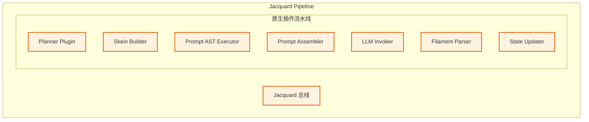

# 第二章：系统核心架构与编排层 (Jacquard Layer)

**版本**: 1.0.0
**日期**: 2025-12-23
**状态**: 正式归档
**作者**: 资深系统架构师 (Architect Mode)
**源文档**: `system_architecture.md`, `mvu_integration_design.md`

---

## 1. 编排层概览 (Jacquard Overview)

**Jacquard** 是逻辑层的核心，它被重新设计为一个 **Pipeline Runner**。它不包含具体的业务逻辑，而是负责按顺序执行注册的插件。它是系统的“大脑”，通过确定性的编排来驾驭概率性的 LLM 生成。

### 1.1 核心职责
1.  **流程调度**: 协调 Prompt 组装、API 调用、结果解析等步骤。
2.  **Skein 构建**: 维护上下文容器，支持动态裁剪。
3.  **协议解析**: 实时解析 Filament 协议流，分发事件。

### 1.2 架构拓扑


---

## 2. 插件化流水线 (Pipeline Mechanics)

Jacquard 维护一个插件列表，每个插件实现特定的接口。这种设计允许系统灵活扩展，甚至支持用户自定义逻辑。

### 2.1 核心插件定义

1.  **Skein Builder Plugin**:
    *   职责: 向数据层 (Mnemosyne) 请求快照 (`Punchcards`)。
    *   产出: 初始化的 `Skein` 对象。
    
2.  **Prompt AST Executor**:
    *   职责: 处理条件逻辑（如 `<if health < 50>`）。
    *   产出: 经过逻辑裁剪的 Skein。

3.  **LLM Invoker Plugin**:
    *   职责: 调用 LLM API，获取流式响应。
    *   输入: 最终渲染的 Prompt 字符串。

4.  **Filament Parser Plugin**:
    *   职责: 实时解析 LLM 的 Filament 输出。
    *   动作: 提取 `<reply>` 推送给 UI，提取 `<state_update>` 准备后续处理。

5.  **State Updater Plugin**:
    *   职责: 收集所有状态变更指令。
    *   动作: 调用 Mnemosyne 更新状态，并持久化历史。

### 2.2 脚本插件沙箱 (Script Sandbox)
为了支持用户自定义扩展，Jacquard 提供了沙箱化的脚本插件运行器。
*   **引擎**: QuickJS (JavaScript) / LuaJIT (Lua)。
*   **隔离**: 禁止访问文件系统、网络，只能通过受限 API 操作 `Skein`。

---

## 3. Skein (绞纱) - 结构化 Prompt 容器

**Skein** 是 Jacquard 流水线处理的核心数据对象。它是一个 **异构容器 (Heterogeneous Container)**，模块化地管理 System Prompt, Lore, User Input 等内容。

### 3.1 为什么需要 Skein?
传统的字符串拼接方式（String Concatenation）在处理复杂上下文时难以维护且容易出错。Skein 允许我们以“块 (Block)”为单位管理 Prompt，支持动态排序、裁剪和优先级控制。

### 3.2 结构示例
*   `SystemBlock`: 全局指令。
*   `WorldInfoBlock`: 触发的世界书条目。
*   `HistoryBlock`: 对话历史窗口。
*   `AuthorNoteBlock`: 强插入的指导信息。

---

## 4. Filament 协议 v2 (Filament Protocol)

为了确保 LLM 输出的可解析性与鲁棒性，我们定义了 **Filament** 协议。这是一个 XML 的严格子集，并在 v2 版本中引入了 JSON 优化。

### 4.1 核心语法规则
1.  **无自闭合标签**: 必须显式闭合 (`<tag>...</tag>`)。
2.  **严格白名单**: 解析器仅识别预定义标签，其他 `<` 符号视为文本。
3.  **容错性**: 支持自动闭合 (Auto-closing)。

### 4.2 v2 协议升级：JSON 状态更新
为了简化 LLM 的生成负担并提高解析效率，状态变更从繁琐的 XML 标签组改为 **JSON 列表包裹三元组**。

**旧版 (v1 XML):**
```xml
<state_update>
    <set key="hp" value="90"></set>
    <add key="gold" value="10"></add>
</state_update>
```

**新版 (v2 JSON):**
*   **格式**: `[OpCode, Path, Value]`
*   **优势**: Token 更少，解析更快，类型更安全。

```xml
<state_update>
[
  ["SET", "character.mood", "happy"],
  ["ADD", "character.gold", 50],
  ["PUSH", "inventory", {"name": "Sword", "atk": 10}]
]
</state_update>
```

### 4.3 标准标签集
*   **`<thought>`**: 思维链分析区域 (不展示给用户或折叠展示)。
*   **`<analysis>`**: (可选) 显式的变量分析块，用于提升逻辑准确性。
*   **`<state_update>`**: 包含上述 JSON 数组的状态变更区。
*   **`<reply>`**: 最终展示给用户的对话内容。

### 4.4 交互示例
```xml
<analysis>
  - character.health: N (未受伤)
  - character.gold: Y (获得奖励)
</analysis>
<state_update>
[
  ["ADD", "character.gold", 100]
]
</state_update>
<reply>
这是给你的奖励，勇士。
</reply>
```
