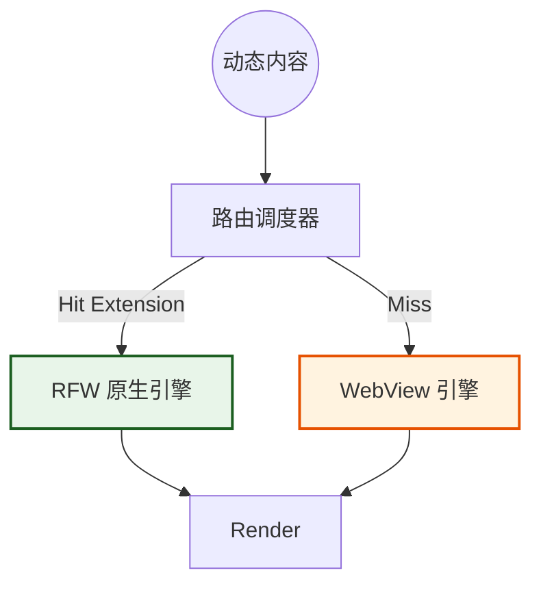

# 第四章：表现层与交互体系 (Presentation Layer)

**版本**: 1.0.0
**日期**: 2025-12-23
**状态**: Draft
**作者**: 资深系统架构师 (Architect Mode)
**源文档**: `ui_layout_design.md`, `ui_subsystem_design.md`

---

## 1. 表现层概览 (Presentation Overview)

表现层负责将底层数据流转化为可视化的像素。我们采用 **"Hybrid SDUI (混合服务端驱动 UI)"** 架构，旨在解决高性能原生体验与海量第三方内容兼容性之间的矛盾。

### 1.1 核心设计理念
1.  **Stage & Control**: 布局哲学，区分沉浸区与控制区。
2.  **Hybrid Rendering**: 原生 RFW 与 Webview 双轨并行。
3.  **Unidirectional Control**: 单向受控，UI 不直接修改数据，通过 Intent 通信。

---

## 2. 布局哲学与响应式设计

### 2.1 Stage & Control (舞台与控制台)
*   **Stage (舞台)**: 核心对话区域，应最大化展示空间，减少视觉干扰。
*   **Control (控制台)**: 参数配置与辅助信息（如 Lorebook, Status），应在需要时触手可及。

### 2.2 响应式三栏架构 (Responsive 3-Pane)
基于 `AdaptiveScaffold`，系统根据屏幕宽度自动适配：

| 模式 | 宽度 (dp) | 布局策略 |
| :--- | :--- | :--- |
| **Desktop** | > 1200 | **三栏全开**: Nav (左) - Stage (中) - Inspector (右) |
| **Tablet** | 600 - 1200 | **双栏/抽屉**: Nav 收起为 Rail，Inspector 默认隐藏 |
| **Mobile** | <= 600 | **单栏流式**: 仅显示 Stage，其他功能通过 Drawer/Sheet 呼出 |

---

## 3. Hybrid SDUI 引擎 (混合驱动 UI)

为了兼顾官方高性能组件与社区多样化内容，我们设计了双轨渲染引擎。

### 3.1 渲染路由机制
当系统需要渲染动态内容（如角色状态栏）时，**路由调度器** 按以下优先级执行：

1.  **Extension Check**: 查询 UI 扩展包注册表。
2.  **Native Track (优先)**: 若存在匹配的 `.rfw` (Remote Flutter Widgets) 包，加载并注入数据，执行原生渲染。
3.  **Web Track (兜底)**: 若无匹配包，降级使用 WebView 渲染 HTML/JS，确保兼容性。

### 3.2 架构拓扑

---

## 4. 关键组件体系

### 4.1 MessageStatusSlot (消息状态槽)
*   **定位**: 嵌入在 `ChatMessageItem` 底部的动态容器。
*   **生命周期**: 随消息创建而初始化。
*   **职责**: 作为“防火墙”隔离外部内容，管理渲染器的尺寸约束与异常处理。

### 4.2 InputDraftController (输入草稿控制器)
UI 子系统与用户输入之间的**唯一写通道**。
*   **安全约束**: 状态栏严禁直接发送消息。
*   **工作流**: 
    1.  用户点击状态栏的“攻击”按钮。
    2.  UI 捕捉意图，生成 Draft ("尝试攻击哥布林")。
    3.  填入输入框，供用户二次编辑。

---

## 5. 交互法则

### 5.1 单向数据流
*   **UI 是消费者**: 监听 Jacquard 的 Filament 流，渲染 `<reply>` 和 `<thought>`。
*   **UI 是触发者**: 将点击事件转化为 Intent，但不直接操作 `World State`。

### 5.2 状态同步
UI 不维护权威状态。当 `Mnemosyne` 更新状态后，通过 Stream 广播新快照，UI 接收后触发 `build` 重绘。这种机制确保了在回溯历史时，UI 状态能自动且正确地回滚。
