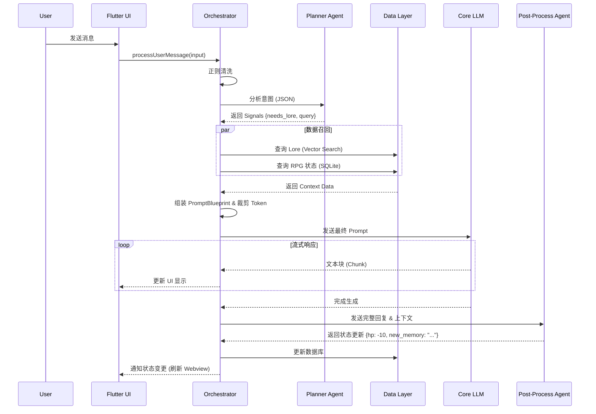

---

## 5. 分阶段实施规划 (Implementation Roadmap)

### Phase 1: 基础设施搭建 (Infrastructure) - 预计 1-2 周
*   **目标**: 建立稳固的工程基础，跑通 Hello World。
*   **任务**:
    1.  初始化 Flutter 项目，配置 Clean Architecture 目录结构。
    2.  集成 `riverpod`, `go_router`, `dio`, `drift` 等核心库。
    3.  实现基础的 `ChatPage` UI (Mock 数据)。
    5.  实现简单的 LLM API Client (支持 OpenAI 格式)。

### Phase 2: MVP 核心功能开发 (Core Features) - 预计 3-4 周
*   **目标**: 实现完整的聊天闭环，支持角色卡导入。
*   **任务**:
    1.  **角色管理**: 实现 ST V2 角色卡导入与解析，存入 SQLite。
    2.  **Prompt 引擎**: 实现 `PromptBlueprint` 和基础组装逻辑 (System + History)。
    3.  **Orchestrator 联调**:
        *   接入 Planner (简化版，仅做关键词提取)。
        *   接入 Core LLM (流式输出对接 UI)。
    4.  **持久化**: 实现聊天记录的保存与加载。
    5.  **Webview**: 集成 `webview_flutter`，加载静态 HTML 状态栏。

### Phase 3: 交互完善与优化 (Refinement) - 预计 2-3 周
*   **目标**: 提升用户体验，完善动态交互。
*   **任务**:
    1.  **Post-Process Agent**: 实现状态提取逻辑，更新 RPG 变量。
    2.  **Webview 通信**: 打通 Dart -> JS 桥接，实现状态栏实时更新。
    3.  **Token 裁剪**: 实现基于 Token 计数的滑动窗口算法。
    4.  **UI 美化**: 优化气泡样式，支持 Markdown/LaTeX 渲染，增加动画。

### Phase 4: 测试与发布 (Release)
*   **任务**:
    1.  编写 Unit Test (针对 Orchestrator 逻辑)。
    2.  进行 Android 真机性能测试 (长对话流畅度)。
    3.  打包发布 APK 和 Windows EXE。

---


采用分层架构以确保关注点分离，便于测试和维护。

*   **Presentation Layer (UI)**: Flutter Widgets, Riverpod Providers (ViewModels). 负责渲染和用户交互。
*   **Domain Layer (Business Logic)**: Entities, UseCases, Repository Interfaces. 纯 Dart 代码，不依赖 Flutter UI 库。Jacquard 核心逻辑位于此层。
*   **Data Layer (Infrastructure)**: Repository Implementations, Data Sources (API, DB). 负责具体的数据读写和网络请求。

### 2.2 状态管理: Riverpod (v2)

*   **理由**:
    *   **编译时安全**: 相比 Provider，Riverpod 提供了更好的类型安全和错误处理。
    *   **依赖注入**: 天然支持依赖注入，方便 Mock 测试 Orchestrator 逻辑。
    *   **生命周期管理**: `.autoDispose` 和 `.family` 修饰符非常适合管理聊天会话和临时状态。
    *   **无 Context 限制**: 可以在 Domain 层或 Service 层轻松读取状态，无需 BuildContext。

### 2.3 核心技术栈

| 类别 | 推荐库/技术 | 说明 |
| :--- | :--- | :--- |
| **语言** | Dart (Flutter) | 全平台统一代码库 |
| **网络请求** | `dio` | 强大的 HTTP 客户端，支持拦截器（用于 API Key 注入、日志） |
| **路由管理** | `go_router` | 声明式路由，支持 Deep Link 和路由守卫 |
| **本地数据库** | `sqlite3` + `drift` (或 `sqflite`) | 关系型数据存储 (RPG 变量, 历史记录)。Drift 提供类型安全的 ORM。 |
| **向量数据库** | `sqlite_vec` (via FFI) 或 `fast_local_vector` | 移动端本地向量搜索。MVP 可先用简单的余弦相似度算法实现。 |
| **Webview** | `webview_flutter` | 官方插件，用于加载 ST 动态组件 |
| **JSON 解析** | `json_serializable` / `freezed` | 自动化生成不可变数据模型 |
| **LLM 交互** | `langchain_dart` (可选) 或 自研 Client | 建议自研轻量级 Client 以适配 OpenAI 格式接口，避免 LangChain 过重。 |

### 2.4 工程目录结构

```text
lib/
├── core/                   # 核心基础设施
│   ├── config/             # 环境配置
│   ├── error/              # 错误处理 (Failures, Exceptions)
│   ├── network/            # Dio 封装
│   ├── theme/              # App 主题定义
│   └── utils/              # 通用工具类
├── features/               # 业务功能模块
│   ├── chat/               # 聊天核心模块
│   │   ├── data/           # Data Sources, Repositories Impl
│   │   ├── domain/         # Entities, UseCases (Orchestrator 核心在此)
│   │   │   ├── orchestrator/
│   │   │   │   ├── agents/ # Planner, Executor, Persister
│   │   │   │   └── prompt/ # PromptAST, Blueprint
│   │   │   └── repositories/
│   │   └── presentation/   # Pages, Widgets, Providers
│   ├── character/          # 角色管理模块
│   └── settings/           # 设置模块
├── shared/                 # 共享组件和模型
│   ├── widgets/            # 通用 UI 组件
│   └── domain/             # 共享实体
└── main.dart
```

---

## 3. 详细功能设计 (Feature Specification)

### 3.1 核心模块拆解

#### 3.1.1 聊天页面 (ChatPage)
*   **功能**: 核心交互界面。
*   **组件**:
    *   `ChatListView`: 使用 `ListView.builder` 实现的高性能消息列表，支持双向滚动和懒加载。
    *   `InputBar`: 输入框，支持多行文本、快捷指令菜单。
    *   `WebviewDrawer`: 侧边栏抽屉，内嵌 `WebViewWidget`，用于显示角色状态面板 (HP/MP 等)。
*   **逻辑**: 监听 `ChatViewModel` 状态，当有新消息流式传输时，自动滚动到底部。

#### 3.1.2 编排器 (Orchestrator)
*   **定位**: 纯 Dart 类，不依赖 UI。
*   **职责**: 协调 Agent 工作流，管理 Prompt 组装。
*   **核心方法**: `Stream<String> processUserMessage(String input)`
*   **工作流**:
    1.  **Input Pre-Clean**: 正则清洗用户输入。
    2.  **Planner Step**: 调用 Planner Agent (LLM) 分析意图，输出 JSON 信号 (如 `{"needs_lore": true, "query": "..."}`).
    3.  **Context Assembly**: 根据 Planner 信号，并行调用 Executor 工具 (VectorDB, SQLite) 获取数据。
    4.  **Prompt Construction**: 将 System, Persona, Retrieved Lore, History 填入 `PromptBlueprint` 槽位。
    5.  **Token Pruning**: 检查 Token 上限，按优先级裁剪 History 或 Lore。
    6.  **Generation**: 调用 Core LLM 生成回复 (Stream)。
    7.  **Post-Process**: 完整回复生成后，调用 Post-Process Agent 提取状态变更，更新 DB。

#### 3.1.3 PromptAST (Prompt Abstract Syntax Tree)
*   **概念**: 将 Prompt 定义为结构化对象，而非字符串。
*   **结构**:
    ```dart
    class PromptBlueprint {
      final SystemSection system;
      final PersonaSection persona;
      final WorldRulesSection rules;
      final List<LoreEntry> activeLore;
      final List<Message> history;
      final String userInput;
      // ... methods to render to String
    }
    ```

### 3.2 关键业务流程图 (Mermaid)



---

## 4. 数据层设计 (Data Layer Design)

### 4.1 核心实体 (Entities)

#### 4.1.1 Character (角色)
*   `id`: UUID
*   `name`: String
*   `description`: String (Persona)
*   `first_message`: String
*   `avatar_path`: String (本地图片路径)
*   `metadata`: JSON (SillyTavern 兼容字段)

#### 4.1.2 ChatLog (聊天记录)
*   `id`: AutoIncrement Int
*   `character_id`: UUID (Foreign Key)
*   `role`: Enum (user, assistant, system)
*   `content`: String
*   `timestamp`: DateTime
*   `is_hidden`: Boolean (用于逻辑隐藏但保留在历史中)

#### 4.1.3 RPG_Variable (RPG 变量)
*   `key`: String (e.g., "hp", "affinity")
*   `value`: String (可以是数值或 JSON)
*   `character_id`: UUID

### 4.2 数据库 Schema (Drift 定义示例)

```dart
class Characters extends Table {
  TextColumn get id => text()();
  TextColumn get name => text()();
  TextColumn get description => text()(); // Persona
  // ...
  @override
  Set<Column> get primaryKey => {id};
}

class ChatLogs extends Table {
  IntColumn get id => integer().autoIncrement()();
  TextColumn get characterId => text().references(Characters, #id)();
  TextColumn get role => text()(); // 'user' | 'assistant'
  TextColumn get content => text()();
  DateTimeColumn get createdAt => dateTime().withDefault(currentDateAndTime)();
}
```

### 4.3 向量存储接口 (Vector Store Interface)

```dart
abstract class VectorStore {
  Future<void> addDocument(String collectionId, String content, Map<String, dynamic> metadata);
  Future<List<Document>> search(String collectionId, String query, {int limit = 5});
}
```
*   **MVP 实现**: 基于内存的简单列表 + 余弦相似度计算 (无需引入重型向量库)。
*   **后期实现**: 集成 `sqlite_vec` 或 `objectbox`。