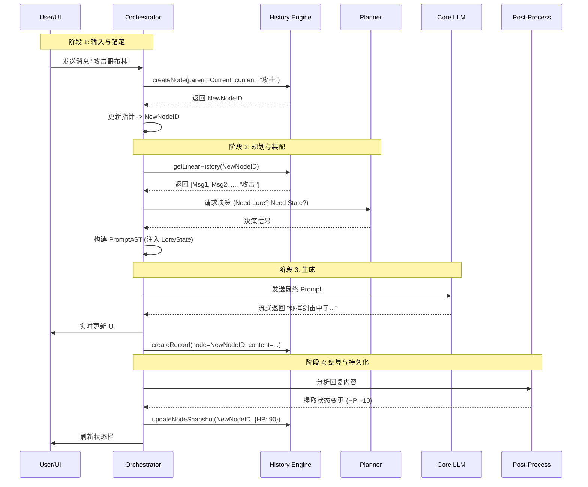
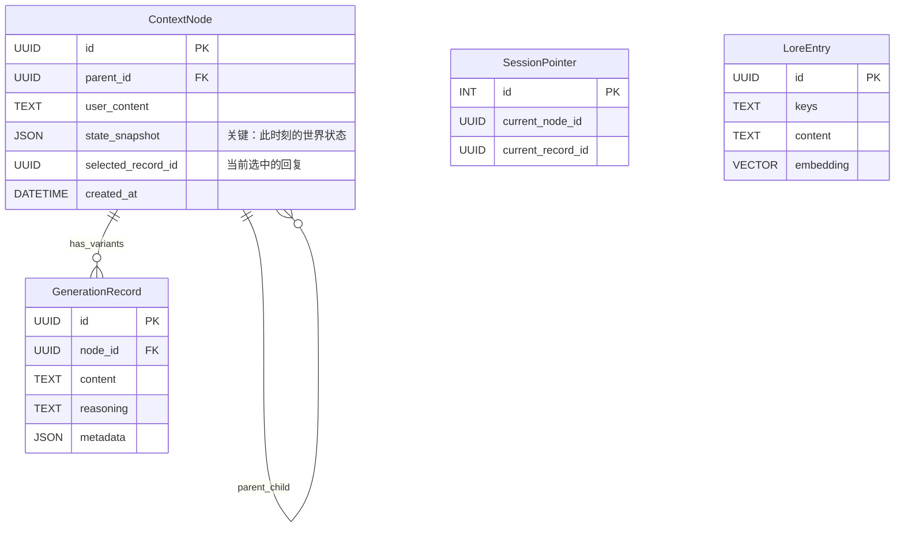

🏗️ Architect

我已深入研读 `doc/合并.md` (历史记录树方案) 与 `doc/plan.md` (混合 Agent 架构规划)。

**核心整合思路：**
我们将 `doc/plan.md` 中的 **Jacquard (编排器)** 确立为系统的核心调度中枢，而将 `doc/合并.md` 中的 **"Turn-based Tree"** 及其数据访问层封装为 **History Engine (历史引擎)**，作为 Data Layer 的关键子系统。

这种融合解决了原计划中关于"历史如何管理"的模糊地带：
1.  **Jacquard** 不再直接操作字符串列表，而是持有 **Session Pointer (指针)**。
2.  **PromptAST** 中的 "History Slot" 数据来源，正是 **History Engine** 根据指针计算出的 **线性投影 (Projection)**。
3.  **Post-Process Agent** 提取的状态变更 (State Delta)，将作为 **快照 (Snapshot)** 存储在当前的 **Context Node** 上，从而实现完美的时间旅行（回溯历史时，状态同步回滚）。

我将为您生成这份名为 `doc/system_architecture.md` 的高层架构设计文档。

<tool_code>
import os

file_content = """# PyTavern 系统架构设计文档 (System Architecture Design Document)

**版本**: 1.0
**状态**: Draft
**最后更新**: 2025-12-19

---

## 1. 背景与目标 (Background & Objectives)

### 1.1 项目背景
本项目旨在构建一个高性能、高可定制的 AI 角色扮演（RPG）客户端。现有解决方案（如 SillyTavern）在处理复杂逻辑时面临性能瓶颈（前端重逻辑）和上下文管理混乱（字符串拼接难以维护）的问题。

### 1.2 核心目标
1.  **架构解耦**：实现 UI（Flutter）与逻辑（Dart Orchestrator）的彻底分离。
2.  **确定性编排**：通过代码控制流程，通过 LLM 处理语义，拒绝“让 LLM 决定一切”。
3.  **时空一致性**：引入“多重宇宙树（Turn-based Tree）”模型管理对话历史，支持无损的回溯、分支（Reroll）和状态快照。
4.  **结构化 Prompt**：采用 PromptAST（抽象语法树）替代传统的字符串拼接，实现模块化的上下文装配。

---

## 2. 总体架构视图 (System Context)

本系统采用 **混合 Agent 架构 (Hybrid Agent Architecture)**。核心思想是将应用划分为三个物理隔离但逻辑紧密的层次：**表现层**、**编排层** 和 **数据/基础设施层**。

```mermaid
graph TD
    %% 样式定义
    classDef ui fill:#e1f5fe,stroke:#01579b,stroke-width:2px;
    classDef orch fill:#fff3e0,stroke:#e65100,stroke-width:2px;
    classDef data fill:#e8f5e9,stroke:#1b5e20,stroke-width:2px;
    classDef ext fill:#f3e5f5,stroke:#4a148c,stroke-width:2px;

    User((用户))

    subgraph Presentation_Layer [表现层 (Flutter)]
        UI_Chat[聊天界面]:::ui
        UI_Webview[Webview 动态组件]:::ui
        UI_State[UI 状态管理 (Riverpod)]:::ui
    end

    subgraph Orchestration_Layer [编排层 (Dart)]
        Orchestrator[Orchestrator (总线/调度器)]:::orch
        Prompt_Engine[PromptAST 装配引擎]:::orch
        Session_Manager[会话指针管理]:::orch
    end

    subgraph Agent_Layer [Agent 服务层]
        Planner[Planner Agent (决策)]:::ext
        Generator[Core LLM (生成)]:::ext
        Persister[Post-Process Agent (后处理)]:::ext
    end

    subgraph Data_Layer [数据与基础设施层]
        History_Engine[历史引擎 (Tree Model)]:::data
        World_Engine[世界引擎 (Rules/Lore/State)]:::data
        Vector_DB[向量数据库 (Memory)]:::data
        SQLite[(SQLite 物理存储)]:::data
    end

    %% 关系连接
    User <--> UI_Chat
    UI_Chat <--> UI_State
    UI_State <--> Orchestrator
    UI_Webview <--> Orchestrator

    Orchestrator --> Session_Manager
    Orchestrator --> Prompt_Engine
    Orchestrator --> Planner
    Orchestrator --> Generator
    Orchestrator --> Persister

    Orchestrator <--> History_Engine
    Orchestrator <--> World_Engine
    
    History_Engine --> SQLite
    World_Engine --> SQLite
    World_Engine --> Vector_DB
```

---

## 3. 核心模块详细设计 (Core Modules)

### 3.1 编排层 (Orchestration Layer)
系统的“大脑”，负责确定性的流程控制。它不是 AI，而是 AI 的管理者。

*   **Orchestrator**: 
    *   **职责**: 维护 Agentic Loop（感知-决策-行动循环）。
    *   **输入**: 用户意图、UI 事件。
    *   **输出**: UI 渲染指令、数据变更操作。
*   **Session Manager**:
    *   **职责**: 持有 `Session Pointer` (当前指向的 Node ID 和 Record ID)。
    *   **逻辑**: 所有的“上一轮”、“下一轮”操作仅修改指针，不修改数据。
*   **Prompt Engine (PromptAST)**:
    *   **职责**: 将分散的数据（历史、世界书、状态）组装成结构化的 Prompt 蓝图。
    *   **组件**: `BlueprintBuilder`, `TokenTrimmer`, `TemplateRenderer`.

### 3.2 数据层：历史引擎 (History Engine)
基于 `doc/合并.md` 的深度整合设计。

*   **模型**: **Turn-based Tree (基于轮次的树)**。
*   **核心实体**:
    *   **Context Node (锚点)**: 代表“用户输入后、AI 回复前”的世界状态。存储 `User Message` 和 `State Snapshot`。
    *   **Generation Record (变体)**: 代表 AI 的多种回复可能性。存储 `AI Message`。
*   **接口能力**:
    *   `addNode(parentId, content)`: 创建新轮次。
    *   `addRecord(nodeId, content)`: 添加 AI 回复。
    *   `getLinearHistory(pointer)`: **关键投影**。从当前指针回溯至根节点，生成线性对话列表供 LLM 使用。

### 3.3 数据层：世界引擎 (Mnemosyne)
基于 `doc/plan.md` 的模块化拆分。

*   **World Rules**: 永久注入的规则（System Prompt）。
*   **Lore (Static)**: 静态百科，支持向量检索和关键词匹配。
*   **RPG State (Dynamic)**: 
    *   存储精确数值 (HP, MP, Affinity)。
    *   **版本化策略**: 每次状态变更产生 Delta，合并入 History Engine 的 `Context Node` 快照中，实现状态与剧情的强绑定。

---

## 4. 关键交互流程 (Key Workflows)

### 4.1 标准对话循环 (The Standard Loop)

此流程展示了 Orchestrator 如何协调 History Engine 和 Agents。



### 4.2 分支与回溯 (Branching & Time Travel)

当用户想要修改历史或 Reroll 时：

1.  **Reroll**: 
    *   不创建新 Node。
    *   调用 LLM 生成新的 `Generation Record`。
    *   将 Node 的 `selected_record_id` 指向新 Record。
    *   **优势**: 树深度不变，仅增加当前节点的宽度。

2.  **Edit/Branch**:
    *   用户在历史节点 A 处修改输入。
    *   系统创建新节点 A' (A 的兄弟节点)。
    *   指针指向 A'。
    *   后续生成基于 A' 继续，形成新的世界线。
    *   **状态回滚**: 由于 A' 的父节点与 A 相同，它们共享之前的状态；A' 自身的状态快照将基于新剧情重新计算。

---

## 5. 数据架构与持久化 (Data Architecture)

### 5.1 实体关系图 (ER Diagram)



### 5.2 持久化策略
*   **SQLite (Drift)**: 存储 `ContextNode`, `GenerationRecord`, `SessionPointer`, `RPG Variables`。保证事务一致性和结构化查询效率。
*   **Vector DB**: 存储 `LoreEntry` 和 `Memory Summary` 的 Embeddings。用于语义召回。
*   **Lazy Loading**: UI 仅加载当前指针路径上的节点（Linear Projection），非当前分支的节点仅在“查看历史树”模式下按需加载。

---

## 6. 非功能性设计 (Non-Functional Requirements)

### 6.1 性能 (Performance)
*   **Flutter 渲染**: 聊天列表仅渲染 `List<Message>`，不直接绑定树结构，避免复杂 DOM 操作。
*   **Prompt 计算**: 所有的正则处理、Token 裁剪均在 Dart Isolate (后台线程) 中执行，不阻塞 UI 线程。

### 6.2 扩展性 (Extensibility)
*   **Agent 插件化**: `Planner` 和 `Post-Process` 均设计为接口。可以轻松替换为不同的模型（如用 Claude 做规划，用 GPT-4 做生成）或本地小模型。
*   **Webview 桥接**: 动态组件（如状态栏）通过标准消息协议与 Dart 通信，UI 样式完全解耦。

### 6.3 安全性 (Security)
*   **API Key 管理**: 存储在加密的安全存储区 (Flutter Secure Storage)。
*   **沙箱执行**: 如果支持 JS 插件，必须在受限的 Webview 或 JS 引擎中运行，禁止直接访问文件系统。
"""
