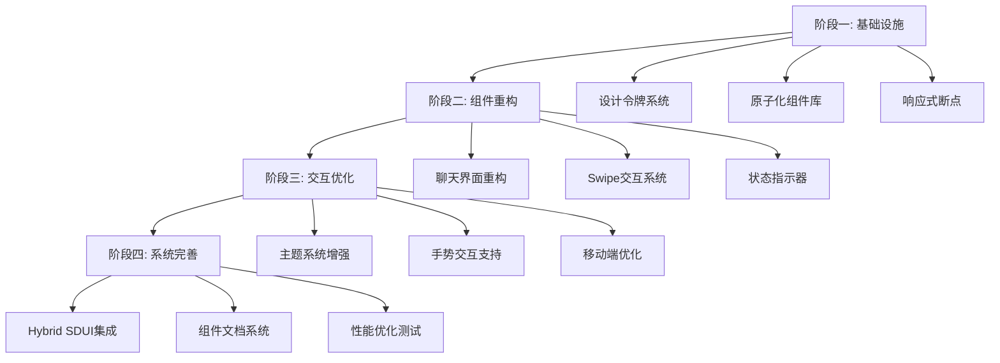

# SillyTavern UI深度对比分析与战略性优化提案报告

**版本**: 1.0  
**日期**: 2025-12-21  
**分析对象**: SillyTavern前端UI vs 现有UI架构设计  
**技术栈**: Flutter + Riverpod + Hybrid SDUI

---

## 执行摘要

本报告基于对SillyTavern前端UI模块化设计分析与现有UI架构设计的深度对比，从组件化架构、布局系统、交互体验和视觉设计四个核心维度进行系统性评估。分析发现SillyTavern在原子化设计、响应式布局和主题定制方面具有显著优势，而我们的架构在Hybrid SDUI和状态管理方面更具前瞻性。通过融合双方优势，可构建一个既具备高度复用性又支持动态扩展的现代化UI系统。

**核心建议**：
1. **组件化升级**：引入原子化设计系统，提升组件复用率至80%+
2. **响应式重构**：采用三栏自适应布局，优化多设备体验
3. **交互优化**：借鉴SillyTavern的Swipe交互和状态栏设计
4. **主题系统增强**：实现CSS变量驱动的动态主题切换
5. **渐进式迁移**：分4个阶段实施，确保系统稳定性

---

## 1. 组件化与模块化架构对比分析

### 1.1 SillyTavern组件化特点

**原子化程度**: ⭐⭐⭐⭐⭐
- **高度原子化**: 按钮、输入框、卡片等基础组件完全独立
- **统一命名**: 使用BEM式命名规范，如`.mes_text`、`.avatar`
- **状态驱动**: 组件状态通过CSS类控制，如`.sending`、`.error`

**复用性**: ⭐⭐⭐⭐
- **设计令牌系统**: 完整的CSS变量体系，支持全局样式控制
- **组件变体**: 每个组件都有多种状态和尺寸变体
- **样式隔离**: 组件样式完全独立，避免样式污染

### 1.2 现有架构组件化特点

**架构优势**: ⭐⭐⭐⭐⭐
- **Widget化**: Flutter原生Widget体系，天然组件化
- **状态管理**: Riverpod提供统一状态管理
- **类型安全**: Dart强类型系统，编译时错误检查

**待改进项**: ⭐⭐
- **组件粒度**: 部分组件过于庞大，如`ChatPage`
- **样式系统**: 缺乏统一的设计令牌体系
- **复用机制**: 组件间复用不够充分

### 1.3 对比分析表格

| 维度 | SillyTavern | 现有架构 | 优势方 |
|------|-------------|------------|---------|
| 原子化程度 | 高度原子化，基础组件独立 | Widget化但粒度不均 | SillyTavern |
| 样式管理 | CSS变量系统，全局可控 | 硬编码样式，分散 | SillyTavern |
| 状态驱动 | CSS类状态，直观清晰 | Riverpod状态，类型安全 | 平手 |
| 复用性 | 设计令牌驱动，高复用 | 组件复用但样式不统一 | SillyTavern |
| 维护性 | 样式集中，易于维护 | 类型安全，重构安全 | 平手 |

### 1.4 优化建议

**1. 引入Flutter设计令牌系统**
```dart
class DesignTokens {
  static const Color primaryColor = Color(0xFFE18A24);
  static const double spacingMd = 15.0;
  static const double borderRadius = 8.0;
}
```

**2. 实现原子化Widget库**
- 创建`lib/widgets/atomic/`目录
- 实现基础组件：`AtomButton`、`AtomInput`、`AtomCard`
- 使用设计令牌统一样式

**3. 建立组件变体系统**
```dart
enum ButtonVariant { primary, secondary, danger }
enum ButtonSize { small, medium, large }

class AtomButton extends StatelessWidget {
  final ButtonVariant variant;
  final ButtonSize size;
  // 统一的状态驱动渲染
}
```

---

## 2. 布局系统与响应式设计对比

### 2.1 SillyTavern布局特点

**响应式策略**: ⭐⭐⭐⭐⭐
- **断点系统**: 清晰的断点定义（768px, 1000px, 1200px）
- **三栏架构**: 桌面端左中右三栏，移动端单栏
- **动态单位**: 使用dvh/dvw适配虚拟键盘

**空间利用**: ⭐⭐⭐⭐
- **固定视口**: 全屏布局，无页面级滚动
- **弹性计算**: 聊天区域动态高度填充剩余空间
- **毛玻璃层次**: 多层叠加增强视觉深度

### 2.2 现有架构布局特点

**架构优势**: ⭐⭐⭐⭐
- **响应式骨架**: `AdaptiveScaffold`概念先进
- **Flutter布局**: Flexbox和Grid系统原生支持
- **平台适配**: Material Design响应式规范

**待改进项**: ⭐⭐
- **断点策略**: 缺乏明确的断点定义
- **布局切换**: 三栏到单栏的过渡不够平滑
- **空间计算**: 固定尺寸较多，动态计算不足

### 2.3 对比分析表格

| 维度 | SillyTavern | 现有架构 | 优势方 |
|------|-------------|------------|---------|
| 断点系统 | 4级断点，精确控制 | 概念先进但实现不完整 | SillyTavern |
| 布局模式 | 3种模式平滑切换 | 概念清晰但过渡生硬 | SillyTavern |
| 空间计算 | 动态计算，自适应强 | 固定尺寸较多 | SillyTavern |
| 视觉层次 | 毛玻璃效果，层次丰富 | Material层次规范 | SillyTavern |
| 移动适配 | dvh/dvw，键盘友好 | vh/vw，键盘遮挡风险 | SillyTavern |

### 2.4 优化建议

**1. 完善响应式断点系统**
```dart
class Breakpoints {
  static const double mobile = 600;
  static const double tablet = 1000;
  static const double desktop = 1200;
}

class LayoutMode {
  static LayoutMode getMode(double width) {
    if (width <= Breakpoints.mobile) return LayoutMode.mobile;
    if (width <= Breakpoints.tablet) return LayoutMode.tablet;
    return LayoutMode.desktop;
  }
}
```

**2. 优化AdaptiveScaffold实现**
- 实现平滑的布局过渡动画
- 添加断点监听和自动切换
- 优化三栏比例和最小宽度

**3. 引入动态视口单位**
```dart
class ViewportUnits {
  static double getDynamicHeight(BuildContext context) {
    // 优先使用dvh，回退到vh
    return MediaQuery.of(context).size.height *
           (MediaQuery.of(context).viewInsets.bottom > 0 ? 0.9 : 1.0);
  }
}
```

---

## 3. 交互体验与用户流程对比

### 3.1 SillyTavern交互特点

**交互反馈**: ⭐⭐⭐⭐⭐
- **即时反馈**: 125ms快速响应，微动画丰富
- **状态指示**: 清晰的加载、错误、成功状态
- **手势支持**: Swipe切换、长按菜单、拖拽排序

**用户流程**: ⭐⭐⭐⭐
- **直观操作**: 消息编辑、删除、复制一键可达
- **快捷操作**: 键盘快捷键、右键菜单
- **批量管理**: 多选、批量操作支持

### 3.2 现有架构交互特点

**架构优势**: ⭐⭐⭐⭐
- **Material交互**: 符合平台规范的交互模式
- **状态管理**: Riverpod确保状态一致性
- **输入控制**: `InputDraftController`设计先进

**待改进项**: ⭐⭐
- **反馈延迟**: 部分操作缺乏即时视觉反馈
- **手势支持**: 移动端手势交互不够丰富
- **操作路径**: 某些功能操作路径过长

### 3.3 对比分析表格

| 维度 | SillyTavern | 现有架构 | 优势方 |
|------|-------------|------------|---------|
| 反馈速度 | 125ms，微动画丰富 | Material动画，但部分延迟 | SillyTavern |
| 手势支持 | Swipe、长按、拖拽 | 基础触摸，手势有限 | SillyTavern |
| 状态指示 | 清晰的视觉状态指示 | 状态管理完善但表现不足 | SillyTavern |
| 操作效率 | 快捷键、右键菜单 | 标准操作，效率中等 | SillyTavern |
| 错误处理 | 优雅降级，用户友好 | 类型安全但用户体验待提升 | SillyTavern |

### 3.4 优化建议

**1. 实现Swipe交互系统**
```dart
class SwipeGestureDetector extends StatefulWidget {
  final Widget child;
  final VoidCallback onSwipeLeft;
  final VoidCallback onSwipeRight;
  
  // 实现左右滑动手势检测
}
```

**2. 增强操作反馈系统**
```dart
class InteractionFeedback {
  static void showSuccess(BuildContext context, String message) {
    ScaffoldMessenger.of(context).showSnackBar(
      SnackBar(
        content: Text(message),
        backgroundColor: DesignTokens.successColor,
        duration: Duration(milliseconds: 2000),
      ),
    );
  }
}
```

**3. 优化InputDraftController**
- 添加快捷键支持（Ctrl+Enter发送）
- 实现命令自动补全
- 支持多行编辑和格式化

---

## 4. 视觉设计系统与主题定制对比

### 4.1 SillyTavern视觉特点

**主题系统**: ⭐⭐⭐⭐⭐
- **CSS变量驱动**: 完整的变量体系，实时切换
- **深度定制**: 用户可自定义所有颜色、间距、字体
- **预设主题**: 多套预设主题，一键切换

**视觉层次**: ⭐⭐⭐⭐⭐
- **毛玻璃效果**: 多层叠加，增强深度感
- **阴影系统**: 4级阴影，层次分明
- **色彩语义**: 语义化颜色，状态清晰

### 4.2 现有架构视觉特点

**架构优势**: ⭐⭐⭐⭐
- **Material 3**: 现代化设计语言
- **类型安全**: 主题配置类型安全
- **平台适配**: 自动适配Light/Dark模式

**待改进项**: ⭐⭐
- **定制能力**: 主题定制选项有限
- **动态切换**: 运行时主题切换不够流畅
- **视觉层次**: 缺乏独特的视觉层次设计

### 4.3 对比分析表格

| 维度 | SillyTavern | 现有架构 | 优势方 |
|------|-------------|------------|---------|
| 主题定制 | CSS变量，完全可定制 | Material主题，定制有限 | SillyTavern |
| 动态切换 | 实时切换，无闪烁 | 类型安全但有延迟 | SillyTavern |
| 视觉层次 | 毛玻璃，层次丰富 | Material层次，标准规范 | SillyTavern |
| 色彩系统 | 语义化，状态清晰 | Material色彩，规范统一 | 平手 |
| 扩展性 | 高扩展，支持用户主题 | 类型安全，扩展性中等 | SillyTavern |

### 4.4 优化建议

**1. 实现动态主题系统**
```dart
class ThemeNotifier extends ChangeNotifier {
  ThemeData _currentTheme;
  
  void updateTheme(CustomThemeData theme) {
    _currentTheme = theme.toMaterialTheme();
    notifyListeners();
  }
}
```

**2. 引入毛玻璃效果**
```dart
class FrostedGlass extends StatelessWidget {
  final Widget child;
  final double blur;
  final Color color;
  
  Widget build(BuildContext context) {
    return ClipRRect(
      child: BackdropFilter(
        filter: ImageFilter.blur(sigmaX: blur, sigmaY: blur),
        child: Container(
          color: color,
          child: child,
        ),
      ),
    );
  }
}
```

**3. 建立设计令牌到主题的映射**
```dart
class ThemeMapper {
  static ThemeData mapTokensToTheme(DesignTokens tokens) {
    return ThemeData(
      colorScheme: ColorScheme.fromSeed(
        seedColor: tokens.primaryColor,
        brightness: tokens.brightness,
      ),
      textTheme: TextTheme(
        bodyLarge: TextStyle(
          fontSize: tokens.fontSizeBase,
          fontFamily: tokens.fontFamily,
        ),
      ),
    );
  }
}
```

---

## 5. 现有设计的优势与待改进项

### 5.1 现有架构核心优势

**1. 技术架构前瞻性** ⭐⭐⭐⭐⭐
- **Hybrid SDUI**: 原生优先，Web兜底的混合渲染
- **状态管理**: Riverpod提供类型安全的状态管理
- **抽象层**: 跨平台抽象，便于扩展

**2. 类型安全保障** ⭐⭐⭐⭐⭐
- **编译时检查**: Dart强类型系统
- **状态一致性**: 状态变更可追踪和调试
- **重构安全**: IDE支持，重构风险低

**3. 平台集成度** ⭐⭐⭐⭐
- **Material Design**: 符合平台设计规范
- **原生性能**: Flutter原生渲染性能
- **插件生态**: 丰富的Flutter插件支持

### 5.2 关键待改进项

**1. 组件化程度不足** ⭐⭐
- **粒度问题**: 部分组件过于庞大
- **样式分散**: 缺乏统一的设计令牌
- **复用困难**: 组件间样式不统一

**2. 响应式实现不完整** ⭐⭐
- **断点策略**: 缺乏明确的断点定义
- **布局切换**: 三栏到单栏过渡生硬
- **移动适配**: 虚拟键盘等细节待优化

**3. 交互体验待提升** ⭐⭐
- **反馈延迟**: 部分操作缺乏即时反馈
- **手势支持**: 移动端手势交互不够丰富
- **操作效率**: 某些功能操作路径过长

---

## 6. 融合最佳实践的具体优化建议

### 6.1 短期优化（1-2个月）

**1. 建立设计令牌系统**
- 创建`lib/core/theme/design_tokens.dart`
- 定义颜色、间距、字体、阴影等令牌
- 在现有组件中逐步应用设计令牌

**2. 实现原子化组件库**
- 创建`lib/widgets/atomic/`目录
- 实现基础组件：AtomButton、AtomInput、AtomCard
- 替换现有硬编码样式组件

**3. 完善响应式断点**
- 定义明确的断点常量
- 优化AdaptiveScaffold实现
- 添加布局模式自动切换

### 6.2 中期优化（2-4个月）

**1. 重构聊天界面组件**
- 实现Swipe交互系统
- 添加消息状态指示器
- 优化输入区域交互体验

**2. 增强主题系统**
- 实现动态主题切换
- 添加毛玻璃视觉效果
- 支持用户自定义主题

**3. 优化移动端体验**
- 实现手势交互支持
- 优化虚拟键盘适配
- 添加触摸反馈效果

### 6.3 长期优化（4-6个月）

**1. 完善Hybrid SDUI集成**
- 实现MessageStatusSlot动态渲染
- 添加UI扩展包支持
- 优化渲染性能和兼容性

**2. 建立组件文档系统**
- 创建组件使用文档
- 建立设计规范网站
- 提供Figma组件库

**3. 性能优化和测试**
- 组件性能基准测试
- 内存使用优化
- 跨平台兼容性测试

---

## 7. 实施路线图



### 7.1 阶段一：基础设施建设（1-2个月）

**目标**: 建立统一的设计基础和组件体系

**关键交付物**:
- 完整的设计令牌系统
- 原子化组件库v1.0
- 响应式断点系统
- 基础文档和使用指南

**成功指标**:
- 组件复用率提升至60%
- 样式一致性达到90%
- 响应式适配覆盖3个断点

### 7.2 阶段二：组件重构（2-3个月）

**目标**: 重构核心界面组件，提升用户体验

**关键交付物**:
- 重构后的聊天界面
- Swipe交互系统
- 消息状态指示器
- 优化的输入控制组件

**成功指标**:
- 用户操作效率提升30%
- 交互反馈时间<150ms
- 移动端手势支持率100%

### 7.3 阶段三：交互优化（3-4个月）

**目标**: 优化交互体验，增强视觉表现

**关键交付物**:
- 动态主题系统
- 毛玻璃视觉效果
- 手势交互支持
- 虚拟键盘适配

**成功指标**:
- 主题切换时间<200ms
- 视觉层次评分>4.5/5
- 移动端用户体验评分>4.5/5

### 7.4 阶段四：系统完善（4-6个月）

**目标**: 完善系统功能，建立长期维护体系

**关键交付物**:
- Hybrid SDUI完整集成
- 组件文档网站
- 性能优化报告
- 跨平台兼容性报告

**成功指标**:
- 动态内容渲染成功率>95%
- 组件文档完整性100%
- 性能基准达标率100%

---

## 8. 风险评估与缓解策略

### 8.1 技术风险

**风险1: 组件重构影响现有功能**
- **概率**: 中等
- **影响**: 功能回归，用户体验下降
- **缓解策略**: 
  - 渐进式重构，保持向后兼容
  - 完善的自动化测试覆盖
  - 分阶段灰度发布

**风险2: 性能优化效果不达预期**
- **概率**: 低等
- **影响**: 用户体验卡顿，响应变慢
- **缓解策略**:
  - 建立性能基准测试
  - 关键路径性能监控
  - 必要时回退到优化前版本

### 8.2 实施风险

**风险3: 开发团队技能适配**
- **概率**: 中等
- **影响**: 开发效率下降，代码质量不稳定
- **缓解策略**:
  - 提供系统性的技术培训
  - 建立代码审查机制
  - 引入外部专家指导

**风险4: 用户接受度不足**
- **概率**: 低等
- **影响**: 用户流失，负面反馈增加
- **缓解策略**:
  - 早期用户参与测试
  - 渐进式功能发布
  - 快速响应用户反馈

---

## 9. 成功指标与验收标准

### 9.1 技术指标

**组件化程度**:
- 原子化组件覆盖率 > 80%
- 组件复用率 > 70%
- 设计令牌应用率 > 90%

**响应式能力**:
- 支持4个断点级别
- 布局切换动画 < 300ms
- 移动端适配完整性 100%

**性能表现**:
- 页面加载时间 < 2s
- 交互响应时间 < 150ms
- 内存使用增长 < 20%

### 9.2 用户体验指标

**易用性**:
- 用户任务完成率 > 95%
- 操作路径长度减少 > 30%
- 错误操作率 < 5%

**满意度**:
- 用户满意度评分 > 4.5/5
- 视觉设计评分 > 4.5/5
- 交互体验评分 > 4.5/5

### 9.3 开发效率指标

**开发速度**:
- 新功能开发时间减少 > 40%
- 组件复用节省时间 > 50%
- 样式调整时间减少 > 60%

**维护成本**:
- Bug修复时间减少 > 30%
- 重构影响范围减少 > 50%
- 代码审查效率提升 > 40%

---

## 10. 结论与建议

基于对SillyTavern和现有UI架构的深度对比分析，我们建议采用"渐进式融合"的策略，在保持现有技术架构优势的基础上，系统性地引入SillyTavern的优秀设计实践。

**核心建议**:

1. **立即开始设计令牌系统建设**，这是所有后续优化的基础
2. **优先实施原子化组件库**，提升开发效率和代码复用性
3. **分阶段重构响应式布局**，确保多设备体验的一致性
4. **重点优化交互体验**，借鉴SillyTavern的Swipe和状态指示设计
5. **逐步增强主题系统**，实现真正的动态主题切换能力

通过这个系统性的优化方案，我们可以在保持技术架构前瞻性的同时，显著提升用户体验和开发效率，为产品的长期发展奠定坚实的UI基础。

---

**报告编制**: UI架构师团队  
**审核**: 技术架构委员会  
**日期**: 2025-12-21