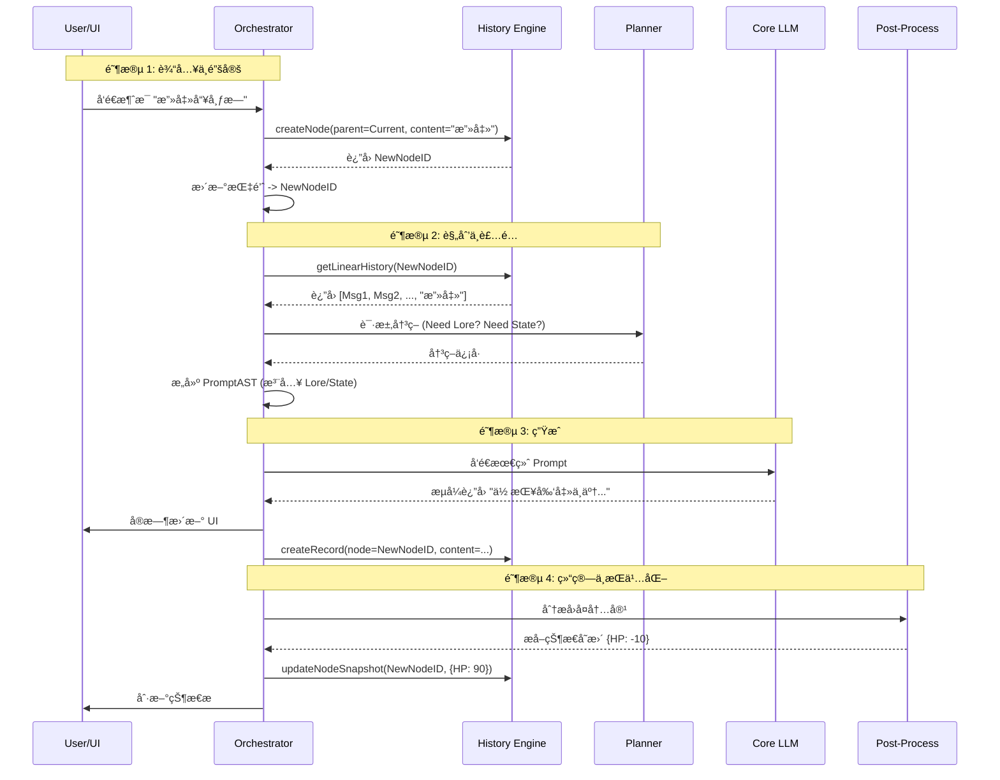
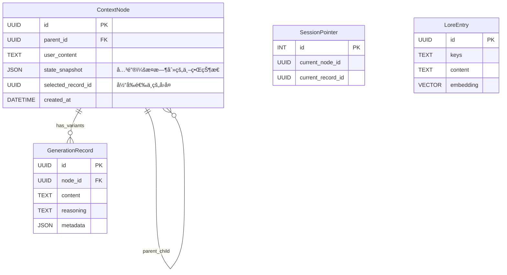

ğŸ—ï¸ Architect

我已深入研读 `doc/åˆå¹¶.md` (å†å²è®°å½•æ ‘方案) ä¸ `doc/plan.md` (æ··åˆ Agent æ¶æ„规划)。

**核心整åˆæ€è·¯ï¼š**
我们将 `doc/plan.md` 中的 **Jacquard (ç¼–æ’器)** 确立为系统的核心调度中æ¢ï¼Œè€Œå°† `doc/åˆå¹¶.md` 中的 **"Turn-based Tree"** åŠå…¶æ•°æ®è®¿é—®å±‚å°è£…为 **History Engine (å†å²å¼•æ“)**，作为 Data Layer 的关键å­ç³»ç»Ÿã€‚

è¿™ç§èåˆè§£å†³äº†åŸè®¡åˆ’中关äº"å†å²å¦‚何管ç†"的模糊地带：
1.  **Jacquard** ä¸å†ç›´æ¥æ“作字符串列表，而是æŒæœ‰ **Session Pointer (指针)**。
2.  **PromptAST** 中的 "History Slot" æ•°æ®æ¥æºï¼Œæ­£æ˜¯ **History Engine** æ ¹æ®æŒ‡é’ˆè®¡ç®—出的 **线性投影 (Projection)**。
3.  **Post-Process Agent** æå–的状æ€å˜æ›´ (State Delta)，将作为 **å¿«ç…§ (Snapshot)** 存储在当å‰çš„ **Context Node** 上，ä»è€Œå®ç°å®Œç¾çš„时间旅行（å›æº¯å†å²æ—¶ï¼ŒçŠ¶æ€åŒæ­¥å›æ»šï¼‰ã€‚

我将为您生æˆè¿™ä»½å为 `doc/system_architecture.md` 的高层æ¶æ„设计文档。

<tool_code>
import os

file_content = """# PyTavern 系统æ¶æ„设计文档 (System Architecture Design Document)

**版本**: 1.0
**状æ€**: Draft
**最åæ›´æ–°**: 2025-12-19

---

## 1. 背景ä¸ç›®æ ‡ (Background & Objectives)

### 1.1 项目背景
本项目旨在æ„建一个高性能ã€é«˜å¯å®šåˆ¶çš„ AI 角色扮演（RPG）客户端。ç°æœ‰è§£å†³æ–¹æ¡ˆï¼ˆå¦‚ SillyTavern）在处ç†å¤æ‚逻辑时é¢ä¸´æ€§èƒ½ç“¶é¢ˆï¼ˆå‰ç«¯é‡é€»è¾‘）和上下文管ç†æ··ä¹±ï¼ˆå­—符串拼æ¥éš¾ä»¥ç»´æŠ¤ï¼‰çš„问题。

### 1.2 核心目标
1.  **æ¶æ„解耦**：å®ç° UI（Flutter）ä¸é€»è¾‘（Dart Orchestrator）的彻底分离。
2.  **确定性编æ’**：通过代ç æ§åˆ¶æµç¨‹ï¼Œé€šè¿‡ LLM 处ç†è¯­ä¹‰ï¼Œæ‹’ç»â€œè®© LLM 决定一切â€ã€‚
3.  **时空一致性**：引入“多é‡å®‡å®™æ ‘（Turn-based Tree）â€æ¨¡å‹ç®¡ç†å¯¹è¯å†å²ï¼Œæ”¯æŒæ— æŸçš„å›æº¯ã€åˆ†æ”¯ï¼ˆReroll）和状æ€å¿«ç…§ã€‚
4.  **结æ„化 Prompt**：采用 PromptAST（抽象语法树）替代传统的字符串拼æ¥ï¼Œå®ç°æ¨¡å—化的上下文装é…。

---

## 2. 总体æ¶æ„视图 (System Context)

本系统采用 **æ··åˆ Agent æ¶æ„ (Hybrid Agent Architecture)**。核心æ€æƒ³æ˜¯å°†åº”用划分为三个物ç†éš”离但逻辑紧密的层次：**表ç°å±‚**ã€**ç¼–æ’层** å’Œ **æ•°æ®/基础设施层**。

```mermaid
graph TD
    %% æ ·å¼å®šä¹‰
    classDef ui fill:#e1f5fe,stroke:#01579b,stroke-width:2px;
    classDef orch fill:#fff3e0,stroke:#e65100,stroke-width:2px;
    classDef data fill:#e8f5e9,stroke:#1b5e20,stroke-width:2px;
    classDef ext fill:#f3e5f5,stroke:#4a148c,stroke-width:2px;

    User((用户))

    subgraph Presentation_Layer [表ç°å±‚ (Flutter)]
        UI_Chat[èŠå¤©ç•Œé¢]:::ui
        UI_Webview[Webview 动æ€ç»„件]:::ui
        UI_State[UI 状æ€ç®¡ç† (Riverpod)]:::ui
    end

    subgraph Orchestration_Layer [ç¼–æ’层 (Dart)]
        Orchestrator[Orchestrator (总线/调度器)]:::orch
        Prompt_Engine[PromptAST 装é…引æ“]:::orch
        Session_Manager[会è¯æŒ‡é’ˆç®¡ç†]:::orch
    end

    subgraph Agent_Layer [Agent æœåŠ¡å±‚]
        Planner[Planner Agent (决策)]:::ext
        Generator[Core LLM (生æˆ)]:::ext
        Persister[Post-Process Agent (å处ç†)]:::ext
    end

    subgraph Data_Layer [æ•°æ®ä¸åŸºç¡€è®¾æ–½å±‚]
        History_Engine[å†å²å¼•æ“ (Tree Model)]:::data
        World_Engine[ä¸–ç•Œå¼•æ“ (Rules/Lore/State)]:::data
        Vector_DB[å‘é‡æ•°æ®åº“ (Memory)]:::data
        SQLite[(SQLite 物ç†å­˜å‚¨)]:::data
    end

    %% 关系è¿æ¥
    User <--> UI_Chat
    UI_Chat <--> UI_State
    UI_State <--> Orchestrator
    UI_Webview <--> Orchestrator

    Orchestrator --> Session_Manager
    Orchestrator --> Prompt_Engine
    Orchestrator --> Planner
    Orchestrator --> Generator
    Orchestrator --> Persister

    Orchestrator <--> History_Engine
    Orchestrator <--> World_Engine
    
    History_Engine --> SQLite
    World_Engine --> SQLite
    World_Engine --> Vector_DB
```

---

## 3. 核心模å—详细设计 (Core Modules)

### 3.1 ç¼–æ’层 (Orchestration Layer)
系统的“大脑â€ï¼Œè´Ÿè´£ç¡®å®šæ€§çš„æµç¨‹æ§åˆ¶ã€‚它ä¸æ˜¯ AI，而是 AI 的管ç†è€…。

*   **Orchestrator**: 
    *   **èŒè´£**: 维护 Agentic Loop（感知-决策-行动循ç¯ï¼‰ã€‚
    *   **输入**: 用户æ„图ã€UI 事件。
    *   **输出**: UI 渲染指令ã€æ•°æ®å˜æ›´æ“作。
*   **Session Manager**:
    *   **èŒè´£**: æŒæœ‰ `Session Pointer` (当å‰æŒ‡å‘çš„ Node ID å’Œ Record ID)。
    *   **逻辑**: 所有的“上一轮â€ã€â€œä¸‹ä¸€è½®â€æ“作仅修改指针，ä¸ä¿®æ”¹æ•°æ®ã€‚
*   **Prompt Engine (PromptAST)**:
    *   **èŒè´£**: 将分散的数æ®ï¼ˆå†å²ã€ä¸–界书ã€çŠ¶æ€ï¼‰ç»„装æˆç»“æ„化的 Prompt è“图。
    *   **组件**: `BlueprintBuilder`, `TokenTrimmer`, `TemplateRenderer`.

### 3.2 æ•°æ®å±‚：å†å²å¼•æ“ (History Engine)
åŸºäº `doc/åˆå¹¶.md` 的深度整åˆè®¾è®¡ã€‚

*   **模å‹**: **Turn-based Tree (基äºè½®æ¬¡çš„æ ‘)**。
*   **核心å®ä½“**:
    *   **Context Node (锚点)**: 代表“用户输入åã€AI å›å¤å‰â€çš„世界状æ€ã€‚存储 `User Message` å’Œ `State Snapshot`。
    *   **Generation Record (å˜ä½“)**: 代表 AI 的多ç§å›å¤å¯èƒ½æ€§ã€‚存储 `AI Message`。
*   **æ¥å£èƒ½åŠ›**:
    *   `addNode(parentId, content)`: 创建新轮次。
    *   `addRecord(nodeId, content)`: 添加 AI å›å¤ã€‚
    *   `getLinearHistory(pointer)`: **关键投影**。ä»å½“å‰æŒ‡é’ˆå›æº¯è‡³æ ¹èŠ‚点，生æˆçº¿æ€§å¯¹è¯åˆ—表供 LLM 使用。

### 3.3 æ•°æ®å±‚ï¼šä¸–ç•Œå¼•æ“ (Mnemosyne)
åŸºäº `doc/plan.md` 的模å—化拆分。

*   **World Rules**: 永久注入的规则（System Prompt）。
*   **Lore (Static)**: é™æ€ç™¾ç§‘，支æŒå‘é‡æ£€ç´¢å’Œå…³é”®è¯åŒ¹é…。
*   **RPG State (Dynamic)**: 
    *   存储精确数值 (HP, MP, Affinity)。
    *   **版本化策略**: æ¯æ¬¡çŠ¶æ€å˜æ›´äº§ç”Ÿ Delta，åˆå¹¶å…¥ History Engine çš„ `Context Node` 快照中，å®ç°çŠ¶æ€ä¸å‰§æƒ…的强绑定。

---

## 4. 关键交互æµç¨‹ (Key Workflows)

### 4.1 标准对è¯å¾ªç¯ (The Standard Loop)

æ­¤æµç¨‹å±•ç¤ºäº† Orchestrator 如何åè°ƒ History Engine å’Œ Agents。



### 4.2 分支ä¸å›æº¯ (Branching & Time Travel)

当用户想è¦ä¿®æ”¹å†å²æˆ– Reroll 时：

1.  **Reroll**: 
    *   ä¸åˆ›å»ºæ–° Node。
    *   调用 LLM 生æˆæ–°çš„ `Generation Record`。
    *   å°† Node çš„ `selected_record_id` 指å‘æ–° Record。
    *   **优势**: 树深度ä¸å˜ï¼Œä»…å¢åŠ å½“å‰èŠ‚点的宽度。

2.  **Edit/Branch**:
    *   用户在å†å²èŠ‚点 A 处修改输入。
    *   系统创建新节点 A' (A 的兄弟节点)。
    *   æŒ‡é’ˆæŒ‡å‘ A'。
    *   å续生æˆåŸºäº A' 继续，形æˆæ–°çš„世界线。
    *   **状æ€å›æ»š**: ç”±äº A' çš„çˆ¶èŠ‚ç‚¹ä¸ A 相åŒï¼Œå®ƒä»¬å…±äº«ä¹‹å‰çš„状æ€ï¼›A' 自身的状æ€å¿«ç…§å°†åŸºäºæ–°å‰§æƒ…é‡æ–°è®¡ç®—。

---

## 5. æ•°æ®æ¶æ„ä¸æŒä¹…化 (Data Architecture)

### 5.1 å®ä½“关系图 (ER Diagram)



### 5.2 æŒä¹…化策略
*   **SQLite (Drift)**: 存储 `ContextNode`, `GenerationRecord`, `SessionPointer`, `RPG Variables`。ä¿è¯äº‹åŠ¡ä¸€è‡´æ€§å’Œç»“æ„化查询效ç‡ã€‚
*   **Vector DB**: 存储 `LoreEntry` å’Œ `Memory Summary` çš„ Embeddings。用äºè¯­ä¹‰å¬å›ã€‚
*   **Lazy Loading**: UI 仅加载当å‰æŒ‡é’ˆè·¯å¾„上的节点（Linear Projection），é当å‰åˆ†æ”¯çš„节点仅在“查看å†å²æ ‘â€æ¨¡å¼ä¸‹æŒ‰éœ€åŠ è½½ã€‚

---

## 6. é功能性设计 (Non-Functional Requirements)

### 6.1 性能 (Performance)
*   **Flutter 渲染**: èŠå¤©åˆ—表仅渲染 `List<Message>`，ä¸ç›´æ¥ç»‘定树结æ„，é¿å…å¤æ‚ DOM æ“作。
*   **Prompt 计算**: 所有的正则处ç†ã€Token è£å‰ªå‡åœ¨ Dart Isolate (åå°çº¿ç¨‹) 中执行，ä¸é˜»å¡ UI 线程。

### 6.2 扩展性 (Extensibility)
*   **Agent æ’件化**: `Planner` å’Œ `Post-Process` å‡è®¾è®¡ä¸ºæ¥å£ã€‚å¯ä»¥è½»æ¾æ›¿æ¢ä¸ºä¸åŒçš„模å‹ï¼ˆå¦‚用 Claude åšè§„划，用 GPT-4 åšç”Ÿæˆï¼‰æˆ–本地å°æ¨¡å‹ã€‚
*   **Webview æ¡¥æ¥**: 动æ€ç»„件（如状æ€æ ï¼‰é€šè¿‡æ ‡å‡†æ¶ˆæ¯åè®®ä¸ Dart 通信，UI æ ·å¼å®Œå…¨è§£è€¦ã€‚

### 6.3 安全性 (Security)
*   **API Key 管ç†**: 存储在加密的安全存储区 (Flutter Secure Storage)。
*   **沙箱执行**: 如æœæ”¯æŒ JS æ’件，必须在å—é™çš„ Webview 或 JS 引æ“中è¿è¡Œï¼Œç¦æ­¢ç›´æ¥è®¿é—®æ–‡ä»¶ç³»ç»Ÿã€‚
"""
