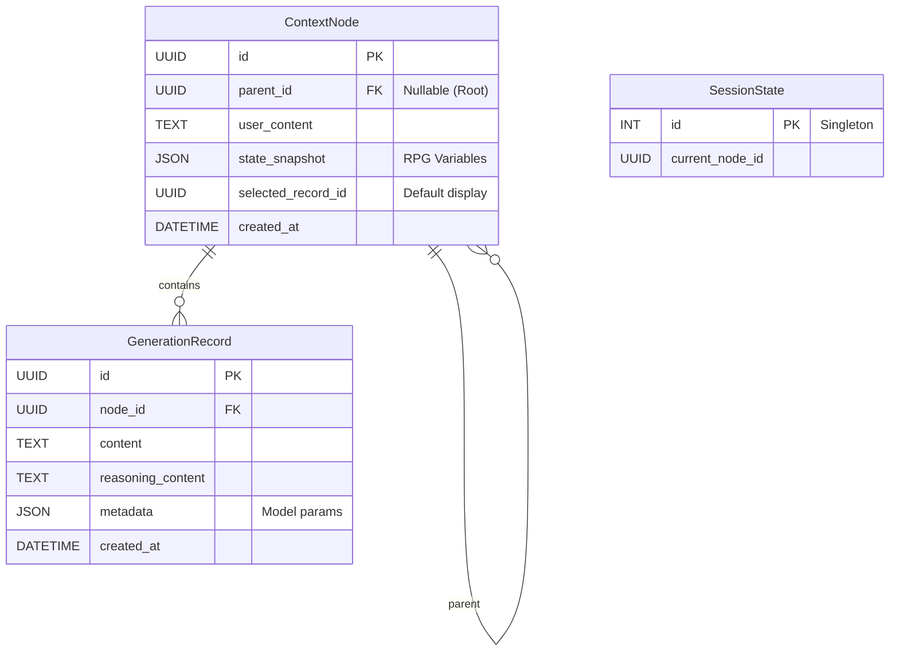

🏗️ Architect

我将为您整合这三份文档，设计一份名为 `doc/历史记录落地方案.md` 的完整设计文档。这份文档将融合「类 Git 的多重宇宙树」逻辑模型与「存档序列化」的工程存储模型，并结合 `SDD.md` 中的技术栈进行落地规划。

主要设计思路如下：
1.  **逻辑模型**：采用 **"Turn-based Tree" (基于轮次的树)** 结构，而非简单的消息树。将“用户输入”视为节点的锚点（Context Node），将“AI 生成”视为该节点下的多种可能性（Generation Records）。
2.  **存储模型**：利用关系型数据库（SQLite/Drift）持久化这种树状结构，严格区分“已确认的历史”和“候选的生成”。
3.  **交互模型**：通过“指针（Pointer）”和“投影（Projection）”机制，将复杂的树状结构转化为 LLM 所需的线性上下文。

## 1. 引言

本设计文档旨在整合「多重宇宙对话树（类 Git）」的逻辑模型与「存档序列化」的工程存储模型，结合本项目基于 Flutter + Drift (SQLite) 的技术架构，提供一套完整、可行且高鲁棒性的历史记录落地方案。

本方案的核心目标是：**在支持复杂的非线性对话（Reroll、分支、回溯）的同时，保持底层数据结构的清晰与稳定，避免因功能堆砌导致的数据腐化。**

---

## 2. 核心设计理念

### 2.1 稳定性与可能性的分离 (Stability vs. Possibility)
我们将对话过程拆解为两种性质截然不同的数据实体：
*   **上下文节点 (Context Node)**：代表**“确定性”**。包含用户的输入、系统指令以及被用户确认接受的世界状态。一旦创建，原则上不可变（修改即分叉）。
*   **生成记录 (Generation Record)**：代表**“可能性”**。包含 AI 在同一上下文下的多次生成结果（Reroll）。它们依附于上下文节点，是易变的候选集合。

### 2.2 树状存储，线性表现 (Tree Storage, Linear Presentation)
*   **存储态**：数据库中存储的是一棵包含所有分支、所有 Reroll 历史的**树**。
*   **表现态**：用户界面和 LLM 上下文看到的是从根节点到当前指针的一条**线性链**。
*   **投影 (Projection)**：系统负责实时计算“从树到链”的投影，LLM 对树状结构无感知。

### 2.3 引用而非复制 (Reference over Duplication)
为了高效存储，新的节点仅存储增量信息（当前轮次的对话），通过 `parent_id` 指针链接历史。完整的上下文通过回溯引用链构建，而非在每个节点存储全量副本。

---

## 3. 实体模型设计 (Entity Model)

本章节定义系统中的核心数据实体及其关系，这些实体将直接映射到数据库表结构。

### 3.1 上下文节点 (Context Node)
**定义**：一个标准的“对话轮次”的容器，代表了**“在 AI 发言之前，世界的确切状态”**。

*   **核心职责**：
    *   锚定对话树的结构（Parent-Child 关系）。
    *   承载用户的输入（User Message）。
    *   记录该时刻的系统快照（World State / Variables）。
    *   管理该轮次下的所有 AI 回复候选（Generation Records）。

*   **属性设计**：
    *   `UUID id`: 全局唯一标识。
    *   `UUID parent_id`: 父节点 ID（根节点为空）。
    *   `String user_content`: 用户的输入内容（或系统事件/旁白）。
    *   `Map<String, dynamic> state_snapshot`: 关键 RPG 变量的快照（可选，用于回滚状态）。
    *   `UUID selected_record_id`: 当前被用户选中/认可的那一条生成记录 ID（默认指向最新一条）。
    *   `DateTime created_at`: 创建时间。

### 3.2 生成记录 (Generation Record)
**定义**：在特定 Context Node 下，AI 的一次具体生成结果。

*   **核心职责**：
    *   承载 AI 的回复内容（Assistant Message）。
    *   记录生成时的元数据（耗时、模型参数）。
    *   支持 Reroll 机制（一个 Node 对应多个 Record）。

*   **属性设计**：
    *   `UUID id`: 全局唯一标识。
    *   `UUID node_id`: 所属的 Context Node ID（外键）。
    *   `String content`: AI 生成的文本内容。
    *   `String reasoning_content`: 思维链内容（如有）。
    *   `Map<String, dynamic> metadata`: 生成参数（Temperature, Model Name 等）。
    *   `DateTime created_at`: 生成时间。

### 3.3 会话指针 (Session Pointer / Active Session)
**定义**：用户的“当前位置”指示器，类似于 Git 的 `HEAD`。

*   **核心职责**：
    *   记录用户当前正在浏览或交互的节点。
    *   UI 渲染引擎根据指针位置，从数据库拉取数据并构建视图。

*   **属性设计**：
    *   `UUID current_node_id`: 当前激活的 Context Node。
    *   `UUID current_record_id`: (可选) 显式覆盖 Node 中默认选中的 Record。

---

## 4. 关键业务流程 (Workflows)

### 4.1 正常对话流程 (Standard Turn)
1.  **用户发送消息**：
    *   系统创建一个新的 `Context Node (B)`。
    *   `B.parent_id` = 当前指针指向的节点 `(A)`。
    *   `B.user_content` = 用户输入。
    *   更新指针：`HEAD` -> `B`。
2.  **构建 Prompt**：
    *   系统从 `B` 开始回溯：`B -> A -> Root`。
    *   提取路径上的 `User Content` 和 `Selected Generation Record`。
    *   反转列表，生成线性历史发送给 LLM。
3.  **AI 生成回复**：
    *   LLM 流式输出。
    *   系统创建 `Generation Record (R1)`，归属于 `B`。
    *   `B.selected_record_id` 更新为 `R1`。
    *   UI 显示 `R1` 的内容。

### 4.2 重新生成 (Reroll)
*   **场景**：用户对 `Context Node (B)` 下的 `Record (R1)` 不满意。
*   **操作**：
    *   保持 `HEAD` 指向 `B` 不变。
    *   再次调用 LLM（使用相同的 Context，可能改变随机种子）。
    *   创建新的 `Generation Record (R2)`，归属于 `B`。
    *   更新 `B.selected_record_id` = `R2`。
*   **结果**：节点 `B` 下现在有两个记录 `[R1, R2]`，UI 展示 `R2`，但用户可以随时切换回 `R1`。

### 4.3 分支与修改 (Branching & Editing)
*   **场景**：用户想修改 3 轮之前的对话（节点 `X`）。
*   **操作**：
    1.  定位到节点 `X` 的父节点 `P`。
    2.  创建一个新的 `Context Node (X')`（兄弟节点）。
        *   `X'.parent_id` = `P`。
        *   `X'.user_content` = 修改后的用户输入。
    3.  将指针 `HEAD` 移动到 `X'`。
    4.  触发 LLM 生成，产生 `Record (R_new)`。
*   **结果**：树在节点 `P` 处产生分叉。旧的 `X` 分支依然保留，新的 `X'` 分支成为当前激活分支。

### 4.4 继续生成 (Continue)
*   **场景**：用户确认了 `Node (B)` 的回复 `R2`，并继续对话。
*   **操作**：
    *   创建新节点 `C`，`C.parent_id` = `B`。
    *   此时，`B` 的状态被“锁定”（逻辑上），成为历史的一部分。
    *   `C` 继承了 `B` 及其选择的 `R2` 作为前置历史。

---

## 5. 数据持久化方案 (Persistence Scheme)

结合 `SDD.md` 中的 Drift (SQLite) 技术栈，具体的表结构设计如下：

### 5.1 数据库表结构 (Schema)

### 5.2 读写优化策略
1.  **懒加载 (Lazy Loading)**：UI 列表渲染时，不需要一次性拉取整棵树。只需根据 `HEAD` 指针，使用 SQL 的 `Recursive CTE` (Common Table Expressions) 或应用层 `while` 循环回溯查询当前链条上的节点（通常 < 100 个）。
2.  **状态快照 (State Snapshots)**：为了避免每次都要从 Root 重放计算 RPG 变量（HP, MP 等），建议在每个 `Context Node` 存储当前状态的**全量快照**或**关键差异**。鉴于文本 RPG 状态数据量通常很小（JSON < 10KB），全量快照是空间换时间的最佳选择，能实现瞬时的“时间旅行”。

---

## 6. 总结与工程指引

本方案通过引入 **Context Node (锚点)** 和 **Generation Record (变体)** 的双层结构，完美解决了以下工程难题：

1.  **Reroll 爆炸问题**：Reroll 不再增加树的深度，只增加节点的宽度（Record 列表），保持了主干的清晰。
2.  **历史一致性**：通过 `parent_id` 链条，任何时刻的上下文都是确定且唯一的，不存在“薛定谔的历史”。
3.  **无缝回溯**：只需改变 `HEAD` 指针 ID，即可瞬间切换整个世界线，无需复杂的数据回滚操作（依赖状态快照）。

**开发建议**：
*   在 `Domain` 层实现 `HistoryRepository`，封装所有的树操作（AddNode, AddRecord, SwitchBranch）。
*   `Orchestrator` 仅与线性列表交互，通过 `HistoryRepository.getLinearHistory(headId)` 获取数据。
*   UI 层通过 `Riverpod` 监听 `current_node_id` 的变化，自动触发视图刷新。